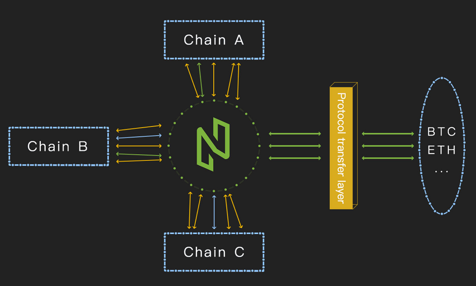

Chapter 1 Overall design (by google translate)

[TOC]

## 1、Business background

Blockchain is the operating system for decentralized applications. It needs cross-chain technology to connect the operating systems that run one by one, in order to form an ecological development, that is, the blockchain Internet.

Adhering to the idea of making the blockchain simpler and making NULS one of the most important blockchain infrastructures, the NULS core team decided to develop a more open, inclusive and new modular underlying architecture with a core purpose around the concession area. The blockchain is simpler to make a series of attempts.
One: rich NULS modules
The new architecture allows NULS modules to run independently, combining a basic blockchain operation framework through a standard base module interface. The NULS module does not limit any developers, supports all programming languages that can provide http services, and strives to get the most out of every blockchain technician without setting any threshold. On this basis, more possibilities are extended.

Second: building a technical community for NULS
NULS is a pure blockchain project that combines the idea of blockchain to create an open, free and evolutionary blockchain community. Therefore, the vitality of NULS depends on the degree of development of the community, especially the degree of construction of the technical community. Therefore, NULS takes advantage of the new architecture design, simultaneously attaches great importance to and develops the technology community, allowing the technical community and the core development team to “distribute” from the beginning; to attract all regions of the world with open technology and ideal forward-looking. Added in the development of blockchain.

Based on the above, the NULS core team initiated the design of the new version of the architecture, and hoped that the partners in the community actively participated in the construction of NULS, contributing to the development of the blockchain industry, and contributing a bright future.

## 2、Design goals

- Define cross-chain standards to enable communication between different blockchains.
- Upgrade the NULS main network function to achieve asset flow between different blockchains.
- Using the microservices architecture, each module is a service run by a separate process and does not limit the development language.

Description:

- Why do you want to cross the chain?
  The blockchain has been introduced by many media as the next generation of the Internet. This argument is very reasonable, but the distance is still very far away, there is a long way to go, and the blockchain has to become a real Internet, and there is also a Passing the pass is the passing of value. At present, there are two solutions: 1. A blockchain completes all applications and user value transfer. 2. A general value transfer protocol between blockchains. The first option seems simple, but it is very limited and difficult to implement. NULS believes that Option 2 is a better solution in the current environment, so in this direction, cross-chain agreements and related supporting facilities are the first step in this direction.
- From modular to microservices
  Nuls is a modular underlying infrastructure. The blockchain programs currently running are based on the Java language. Modularization only implements the modularization of the coding layer. Our goal is a more flexible, operational state module. The underlying facilities. It should be able to support anyone who wants to make a technical contribution, so you should not set the language threshold. It should be easier to extend, modify, and replace. Each of its modules should be simple, static, and should not be blocked by the blockchain. The complexity of the overall program impact. So we proposed the micro-service architecture idea, the module is more independent, the module business is more simple, the module supports multi-language development, the module is easier to expand, the module supports distributed deployment, and the module is easier to plug and unplug...

## 3、Ecological architecture

Description:

​	Upgrade the NULS main network and add functions to the main network to connect with all the links. Implement inter-chain communication in an open manner

​	Based on the blockchain implemented by the NULS module warehouse (blockchain in the ecosystem), a cross-chain module can be added by means of module selection, so that the bottom layer can communicate with NULS.

​	For the Ethereum and Bitcoin, the public chain that is not affected by NULS needs to implement the conversion of the protocol through a special mechanism, and adapt the public chain protocol and the NULS cross-chain protocol to achieve the purpose of unified protocol communication.

​	All blockchains only communicate with the NULS main network. The verification of the transaction is performed by the NULS main network, and each parallel chain trusts the verification result of the NULS main network.

​	The assets in each blockchain can be circulated to any chain in the NULS ecosystem to accept the transfer of the external chain assets. It is also possible to achieve business interoperability based on any mutual agreement between any two chains at a small cost.

## 4、System design

###  4.1 Architecture diagram

 

* NULS main network uses POC consensus mechanism, combined with Byzantine fault tolerance mechanism to realize the confirmation and packaging of cross-chain transactions, to achieve decentralization and performance and security.
* Each node on the NULS main network connects multiple nodes in multiple blockchains. Because the protocol is a uniformly defined NULS cross-chain protocol, it is possible to connect multiple nodes on different blockchains simultaneously.
* The NULS main network provides a chain management mechanism to manage all peer blockchains registered on the NULS main network. The contents of the registration include chain information, asset information, cross-chain margin, etc.
* When an asset of another chain is received on a blockchain, the corresponding asset needs to be generated in the chain. Tokens on different blockchains are stored in other chains in the form of assets.
* The details of a blockchain transferred to other chain assets will be stored in the NULS main network. When the asset is transferred out of this blockchain, it will be verified, and illegal assets will not be allowed to be generated from the blockchain. Malicious blockchains are handled through community mechanisms such as suspending cross-chains, suspending cross-chains, forfeiting margins, etc.
* NULS main network will provide Api manual, any developer can develop their own wallet, browser, light wallet and other tools according to the manual.
* Provides protocol extensions in the NULS main network, which can be used to develop DAPP and optimize cross-chain protocols.

### 4.2 The operation of the new version of the modular program

* NULS main network is structured in a modular way
* Each module is a microservice that can run independently
* Microservices communicate directly via api
* Module does not limit development language
* Provide microkernel module responsible for module management, configuration management and version management functions
* NULS modules will be added to the NULS module repository for direct use by applications such as "chain factories"
* Each module supports extensions at the same time as it is used, ie if the modules in the module repository can only meet some of the business requirements, the module can be extended to avoid the workload of redevelopment

### 4.3 Bottom support for the chain factory

In the future NULS ecosystem, there will be a NULS main network and several application chains. Currently, there are two basic application chains to be built in the planning, smart contract chain and chain factory application chain. The chain factory is an application, and it is also a blockchain. Users can issue their own chains in the chain. The nodes in the chain factory can choose their own nodes to run several chains to realize the sharing of hardware devices.

The chain factory is built on the NULS module, so when designing the NULS module, consider supporting multiple chains at the same time.

##  5、Core process

### 5.1 Cross-chain transaction processing flow

1. The address a in the friend chain A initiates the transaction tx_a, and transfers the aCoin to the b address of the B chain.

- The format of the b address is the address in the nuls format starting with ChainId_B. When the asset is transferred to the address, the address is not allowed to initiate a transaction on the A chain, ie the address of the other chain cannot initiate a transaction in the chain.
- Generate a transaction tx_a_trans under the NULS cross-chain protocol based on the cross-chain protocol, and sign the cross-chain transaction with a private key of a.

2. tx_a is packed in the A chain, and after the n block is confirmed, the NULS main network is sent by the cross-chain module (independent of the basic module except the A-chain function).

3. The cross-chain module broadcasts the transaction to the connected NULS main network node (broadcast mode: first broadcast hash, wait for the other party to obtain a complete transaction)

4. After receiving the transaction (tx_a_trans), the NULS main network node (transaction management module) first performs basic verification (format, required fields, signature, chain balance, etc.), and then asks whether the connected A-chain node has A tx_a_hash transaction is confirmed n blocks, and after conversion to NULS main network format transaction, the transaction summary is tx_a_trans_hash.

5. The result of the NULS main network node summary inquiry, if more than 51% of the nodes confirm the transaction, the node approves the transaction.

- The normal node asks for any node, the consensus node queries all nodes, and the ordinary node forwards the transaction if any 3 nodes confirm it, otherwise it discards. If the consensus node gets more than 51% node confirmation, it will sign tx_a_trans_hash and broadcast the hash and signature data to the network.

6. The NULS main network consensus node summarizes the cross-chain transaction signatures in the chain. When the signer of a transaction exceeds 80% of the total number of consensus nodes, the transaction is considered to be packaged into the block.

- This function is provided by the "Transaction Management" module. When 80% signature collection is completed, the transaction is pushed to the consensus module for packaging.

7. The consensus module of the NULS main network consensus node, when packing, verifies the number of signatures and the balance of the assets of the roll-out chain. If the requirements are met, the transaction is packaged into the block.

8. Block confirmation logic: When verifying the cross-chain transaction included in the block, verify the number of signatures and the balance of the assets of the transfer chain, and confirm the transaction if it meets the requirements.

9. When the block where the transaction is located is confirmed, the "transaction management module" pushes the transaction (tx_a_trans) to the target chain node.

10. After receiving the transaction, the cross-chain module of the target chain queries the connected NULS main network node whether the transaction exists and has been confirmed. If more than 51% of the nodes confirm the transaction, the node recognizes the transaction.

11. After the node recognizes the transaction, the cross-chain module converts tx_a_trans into a B-chain asset transaction and broadcasts

12. If the node is the blocker of the last 20 blocks of the B chain (pow needs to be adapted), then sign the transaction before broadcasting.

13. The other node counts the signature of the transaction. When the signer reaches 80% of the latest 20 block, the transaction can be packaged (the packager also confirms the transaction), and the packaged transaction contains all signatures.

14. After the block is confirmed, the b address generates the corresponding a asset and can be used.

15. Complete

### 5.2 Block processing flow

1. the "transaction management" module to verify the transaction, will be placed in the memory pool, waiting for packaging

2. When the "consensus module" is packaged, the "transaction management" module is called to obtain the transaction interface to be packaged to obtain a transaction that can be packaged.

- "Transaction Management" module verifies coindata and business conflicts for local transactions
- The "Transaction Management" module verifies the number of signatures and the balance of the corresponding assets of the chain for cross-chain transactions

3. "Consensus Module" generates coinbase transactions and punish transactions

4. generate block headers and package blocks

5. the broadcast block head

6. Add the block to the verification queue of the "block management" module.

7. The verification thread takes the block out and verifies it.

8. After verification, confirm each transaction in turn

9. storage transactions and block headers

10. completed

### 5.3 This chain transaction processing flow

1. Assembling business data into the transaction

2. Obtain the account balance from the "book" module, calculate the handling fee and change the value, and fill the data to the coindata.

3. Sign the transaction

4. Transfer the local transaction to the "book" module for storage.

5. broadcast transactions

6. Submit the transaction to the "Transaction Management" module for verification.

7. verify the transaction, put into the memory pool

8. The consensus module obtains the list of transactions to be packaged (the "transaction management" module re-verifies the transaction)

9. After the "block management" module passes the verification, the processor interface of the transaction is invoked to process the transaction business.

10. Stored in the "Block Management" module together with the block header

## 6、Brief description of the modules

| module name          | description                                                  |
| -------------------- | ------------------------------------------------------------ |
| kernel               | Kernel module, responsible for module management, service management, configuration management functions, is the core of the system |
| account              | Account module, responsible for storing and maintaining local account information |
| block                | Block management: used to maintain blockchain data, receive block, fork processing, verification block, storage block header |
| chain                | Chain Management: Friend chain information for managing all access cross-chain protocols |
| consensus            | Consensus module: used to run POC consensus mechanism        |
| ledger               | Ledger module:Record local account transaction information summary, record all account balance models |
| transaction          | Transaction management module: collection, verification, submission of consensus packaging, transaction processing, transaction storage, query |
| network              | Network module: connection management, node management, message reception and transmission |
| smart-contract       | Smart Contract Module: Provides all the features of a smart contract engine |
| community-governance | Community Governance Module: Implementation of Governance Program on Chain |
| event-bus            | Event Bus: Publish and Subscribe Events                      |
|                      |                                                              |

