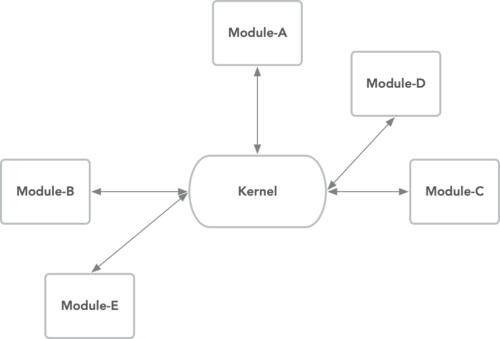
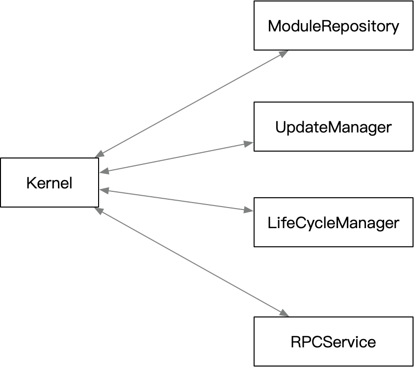

# Kernel Module Design

[TOC]

## Overview

### 1.1 Kernel Module

#### 1.1.1 Why have "Kernel Module"

NULS 2.0 is designed as a multi-process component framework. A manager is required to start all subcomponents as initiators.
At the same time, as a bridge for sub-component communication, it cooperates with the life cycle and dependency management between components, interface discovery and so on.

#### 1.1.2 "Kernel Module" What can do

- Launch subcomponents, lifecycle inspection and maintenance
- Discovery between components
- Component Dependency Management and Status Change Notification
- Heartbeat management
- Provide an overall interface definition specification
- Provide automatic update function for submodules

The core module implements all the commands defined in the interface specification. Scan all submodules, pass startup parameters, execute submodules.
Provides a foundational bridge for collaboration between sub-modules.
The core module implements an automatic update function to provide an online upgrade service for official modules that meet the specifications.

#### 1.1.3 Kernel Module Position

Will be the manager of all? components. Responsible for starting, stopping, etc. of subcomponents.
It is also responsible for detecting the presence of a new version of the component and providing an upgrade service.

### 1.2 Architecture diagram

Kernel is used as a center for mutual discovery of submodules. At the same time, the CMD proxy function is provided, the CMD is forwarded to the sub-module that implements the CMD, and the execution result is returned to the caller.

> Note: RPC calls between submodules do not go through the kernel, and can directly access each other to perform CMD requests to obtain results.



## Feature Design

### 2.1 Functional Architecture Diagram

According to their responsibilities, they are divided into four categories: ModuleRepository, UpdateManagement, DependencyManagement, and RPCServices.

The module repository identifies the sub-modules that conform to the standard on the local disk.
The update management will pull all sub-module version information of the remote repository, compare it with the existing sub-modules in the module repository, and find out that there is an update to the module.
State Lifecycle Management is responsible for launching submodules. Stores the status and configuration information of the submodule. Proactive notification when the submodule's dependencies change.
The RPC service is the communication interface between modules, and all RPC functions of the manager are exported here.



### 2.2 Kernel Module Work

The kernel module is responsible for booting the submodules under all module folders. Provides information exchange between modules and relies on status change notifications.

### 2.3 Module Responsibility

The kernel module mainly implements the interface of the management specification described in the interface.

#### 2.3.1 Configuration Parameter Management

Each module stores configuration information independently, and the core module caches a configuration information table of all current submodules.

The sub-module information is modified by the core module, and the core module notifies the sub-module that the local cache is modified after the execution is successful.

When the submodule actively modifies the custom configuration information, it will actively issue a status request to update the cache in the core manager.

#### 2.3.2 Dependency Management

After the submodule is started, it passes its own list of dependent modules via the version command. ?
When the core module requests a submodule through the status command, the parameter available indicates whether the dependency of the submodule is satisfied.
When ? available is true, the submodule should initiate its own business processing.
When receive available is false, the submodule should stop business processing. Wait for the available flag to be true again.

#### 2.3.3 Update Management

[*] To be continue

#### 2.3.4 Submodule Startup Parameter

When the submodule process is started, some necessary parameters are passed to the submodule through the command line parameters.

| properties       | description                                                                                               |
| ---------------- | :-------------------------------------------------------------------------------------------------------- |
| --kernel-addr    | The IP address and port where the core module works. Ignore the IP address to represent the local network |
| --data-folder    | The data store root directory can be restored                                                             |
| --profile-folder | User data store root directory                                                                            |

> **data-folder & profile-folder Details**
> --data-folder Stores can be recovered from the chain after being deleted. The main storage chain data.
> --profile-folder Stores unrecoverable user data, such as the user's address private key.
> When the submodule uses the data and profile directories, it needs to create a subdirectory and store its own data in a subdirectory.

### 2.4 RPC Command

#### version

- Interface Description

After the submodule is started, it actively requests the kernel module to report its version information, available CMD table, dependent module, and RPC working port.

- Request Example

```json
{
"cmd":"version",
"params": [{
    "version":"1.0",
    "author": "",
    "url":"",
    "rpcList":[
        {
            "method": "nuls_accounts",
            "version": 1
        },
        {
            "method": "nuls_nodes",
            "version": 1
        }
    ],
    "dependsModule":["network","asset"],
    "port":10000
}]
}
```

- Request Parameter Description

| index | parameter | required | type  | description            |
| :---: | :-------: | :------: | :---: | :--------------------- |
| 0     | version   | true     | map   | submodule information |

version

| properties    | required | type          | description                    |
| :------------ | -------- | :------------ | :----------------------------- |
| version       | true     | String        | submodule version              |
| rpcList       | true     | array[{}]     | submodule command list         |
| dependsModule | true     | array[String] | List of dependent module names |
| port          | true     | short         | submodule rpc port             |

- Return Example

Success

```json
{
"code":0,
"version": 1.2,
}
```

- Return Field Description

执行失败返回 code 非0。

#### status

- Interface Description

Query the current running status of the submodule.

- Request Example

```json
{
    "cmd": "status",
    "params": []
}
```

- Request Parameter Description

None

- Return Example

```json
{
    "code": 0,
    "version": 1.0,
    "result": {
        "Module_A": {
            "status" : "",
            "rpcList":[],
            "dependsModule":[],
            "addr":"192.168.1.8",
            "port": 8100
        },
        "Module_B": {
            "status" : "",
            "rpcList":[],
            "dependsModule":[],
            "addr":"192.168.2.56",
            "port": 8200
        }
    }
}
```

- Return Field Description

Returns a map with the module name key . The map contains information about each module.

| parameter     | type          | description                                                         |
| ------------- | ------------- | ------------------------------------------------------------------- |
| status        | String        | The current status of the module: unknown, ready, working,shutdown. |
| rpcList       | array[String] | Service table provided by this module                               |
| dependsModule | array[String] | List of dependent module names                                      |
| addr          | ip            | Submodule RPC working IP                                            |
| port          | short         | Submodule RPC working Port                                          |

#### shutdown

- Interface Description

Close the kernel with all running submodules.

- Request Example

```json
{
    "method":"shutdown",
    "params":[]
}
```

- Request Parameter Description

None

- Return Example

```json
{
"code":0,
"version": 1.2,
}
```

- Return Field Description

The request returns 0 successfully, otherwise it returns a failure error code.

#### restart

- Interface Description

Restart the kernel and all running submodules.

- Request Example

```json
{
    "method":"restart",
    "params":[]
}
```

- Request Parameter Description

None

- Return Example

```json
{
"code":0,
"version": 1.2,
}
```

- Return Field Description

The request returns 0 successfully, otherwise it returns a failure error code.

#### terminate

- Interface Description

Immediately exit the kernel with all running submodules. All outstanding operations will be discarded.

- Request Example

```json
{
    "method":"terminate",
    "params":[]
}
```

- Request Parameter Description

None

- Return Example

```json
{
"code":0,
"version": 1.2,
}
```

- Return Field Description

The request returns 0 successfully, otherwise it returns a failure error code.

#### proxy

- Interface Description

Through the kernel agent, request the method that is being exposed by the running module.

- Request Example

```json
{
    "method":"proxy",
    "version":"1.1",
    "params":[
        "nuls_accounts",
        {
            "name":"wangkun",
            "nickname":"uncle",
            "features":"handsome"
        }
    ]
}
```

- Request Parameter Description

| index | parameter    | required | type   | description               |
| ----- | ------------ | -------- | ------ | :-----------------------: |
| 0     | targetMethod | true     | String | Target Command            |
| 1     | methodParams | true     | map    | Target Command Parameters |

> The parameters of the methodParams field are used by the kernel as the actual params parameter of the final request.

- Return Field Description

The result returned is determined by the target method. If the target method does not exist, the corresponding error code is returned.

#### conf_get

- Interface Description

Get the configuration that the kernel is currently in effect. When params is empty, all the valid configurations are returned. Otherwise, only the specified configuration information that exists is returned.

- Request Example

```json
{
    "method":"conf_get",
    "params":["Key1","Key2"]
}
```

- Request Parameter Description

- None. Query all the configurable information of the kernel.
- str. Query the specified configuration information. Ignored for configurations that do not exist.

- Return Example

```json
{
"code":0,
"version": 1.2,
"result":{
    "Key1": "value1",
    "Key2": "value2"
    }
}
```

- Return Field Description

Configuration item key-value pair. Refer to the custom parameter list for specific meaning.

#### conf_set

- Interface Description

Modify the kernel configuration parameters.

- Request Example

```json
{
    "method":"conf_set",
    "version":"1.1",
    "params":[{
        "Key1": "newValue",
        "Key2": "newValue",
    }]
}
```

- Request Parameter Description

| index | parameter | required | type | description             |
| ----- | --------- | -------- | ---- | :---------------------: |
| 0     | configure | true     | map  | new configuration value |

> configure: new configuration value.

- Return Example

```json
{
"code":0,
"version": 1.2
}
```

- Return Field Description

The modification returns 0 successfully, otherwise it returns an error code.

#### mod_status

- Interface Description

Query the status information of the specified module.

- Request Example

```json
{
    "method":"mod_status",
    "version":"1.1",
    "params":[ "Module_A","Module_B" ]
}
```

- Request Parameter Description

- None. Query status information of all submodules
- String. Query status information of the specified module name

- Return Example

```json
{
    "code": 0,
    "version": 1.0,
    "result": {
        "Module_A": {
            "status" : "",
            "rpcList":[],
            "dependsModule":[],
            "addr":"192.168.1.8",
            "port": 8100
        },
        "Module_B": {
            "status" : "",
            "rpcList":[],
            "dependsModule":[],
            "addr":"192.168.2.56",
            "port": 8200
        }
    }
}
```

- Return Field Description

Returns a map with the module name key . The map contains information about each module.

| parameter     | type          | description                                                         |
| ------------- | ------------- | ------------------------------------------------------------------- |
| status        | String        | The current status of the module: unknown, ready, working,shutdown. |
| rpcList       | array[String] | Service table provided by this module                               |
| dependsModule | array[String] | List of dependent module names                                      |
| addr          | ip            | Submodule RPC working IP                                            |
| port          | short         | Submodule RPC working Port                                          |

#### mod_conf_get

- Interface Description

Query the configuration information provided by the module.

- Request Example

```json
{
    "method":"mod_conf_get",
    "version":"1.1",
    "params":["mod_name","key1","key2"]
}
```

- Request Parameter Description

| index | parameter  | required | type   | description           |
| ----- | ---------- | -------- | ------ | :-------------------: |
| 0     | moduleName | true     | String | Module identification |
| 1     | key        | false    | String | Configuration Key     |

> After the module ID, 0 or N configuration keys can be optionally declared.
> Only the module ID is passed, and the configuration information of all specified modules is queried.
> If key is specified, only the current configuration of the specified Key is queried. Ignored if Key does not exist.

- Return Example

```json
{
"code":0,
"version": 1.2,
"result":{
    "Key1":"value",
    "Key2":"value",
    }
}
```

- Return Field Description

> Returns the specified module configuration information for the query. Refer to the module manual for the meaning of the specific key.

#### mod_conf_set

- Interface Description

Set the specified module configuration information.

- Request Example

```json
{
    "method":"mod_conf_set",
    "version":"1.1",
    "params":[
        "ModuleName",
        {
            "name":"wangkun",
            "nickname":"uncle",
            "features":"handsome"
        }
    ]
}
```

- Request Parameter Description

| index | parameter  | required | type   | description                     |
| ----- | ---------- | -------- | ------ | :-----------------------------: |
| 0     | moduleName | true     | String | Module identification           |
| 1     | configure  | true     | map    | Set information key-value pairs |

> Configure is the key to be updated with the corresponding new value.

- Return Example

```json
{
"code":0,
"version": 1.2,
}
```

- Return Field Description

> The execution returns 0 successfully, otherwise it returns a failure error code.

#### mod_update

- Interface Description

Check the module update information.

- Request Example

```json
{
    "method":"mod_update",
    "version":"1.1",
    "params":["Module-A","Module-B"]
}
```

- Request Parameter Description

> If params is empty, check the update information of all submodules.
> Params is the module identification list, and the module update information specified in the parameters is checked.

- Return Example

```json
{
"code":0,
"version": 1.2,
"result":{
    "Module-A": {
        "currentVersion": "",
        "latestVersion": "",
        "list": {
            "1.3.1" : {
                "releaseDate": "",
                "url": "",
            },
            "1.3.0" : "",
        }
    },
    "Module-B": {

    }
    }
}
```

- Return Field Description

> Returns a map with the module identifier as the key. Value is the version information of the specified module

| parameter      | type   | description                                                                           |
| -------------- | ------ | ------------------------------------------------------------------------------------- |
| currentVersion | String | current version                                                                       |
| latestVersion  | String | latest version                                                                        |
| list           | map    | Update information: key is the version number, Value is the Module update information |

Module update information

| parameter   | type   | description  |
| ----------- | ------ | ------------ |
| releaseDate | String | release date |
| url         | String | download url |

#### mod_upgrade

- Interface Description

Update the module to the latest version.

- Request Example

```json
{
    "method":"mod_upgrade",
    "version":"1.1",
    "params":["Module-A","Module-B"]
}
```

- Request Parameter Description

> The params is empty and all updateable modules are updated to the latest version.
> Params is the module ID, then only the specified module is updated to the latest version.

- Return Example

```json
{
"code":0,
"version": 1.2,
}
```

- Return Field Description

> The execution returns 0 successfully, otherwise it returns a failure error code.

#### mod_restart

- Interface Description

Restart a specific module.

- Request Example

```json
{
    "method":"mod_restart",
    "version":"1.1",
    "params":["Module-A","Module-B"]
}
```

- Request Parameter Description

> params

| index | parameter  | required | type   | description                                                   |
| ----- | ---------- | -------- | ------ | :-----------------------------------------------------------: |
| 0     | moduleName | true     | String | Module identification, at least one module identifier exists. |

- Return Example

```json
{
"code":0,
"version": 1.2,
}
```

- Return Field Description

> The execution returns 0 successfully, otherwise it returns a failure error code.
