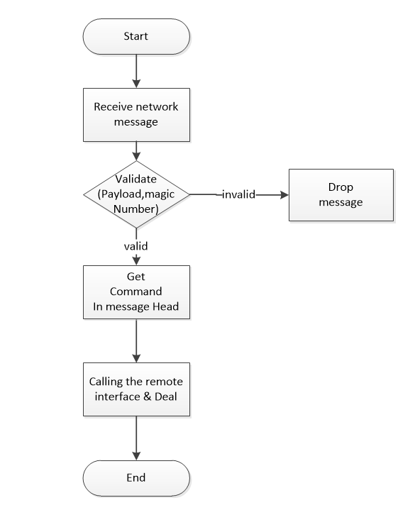
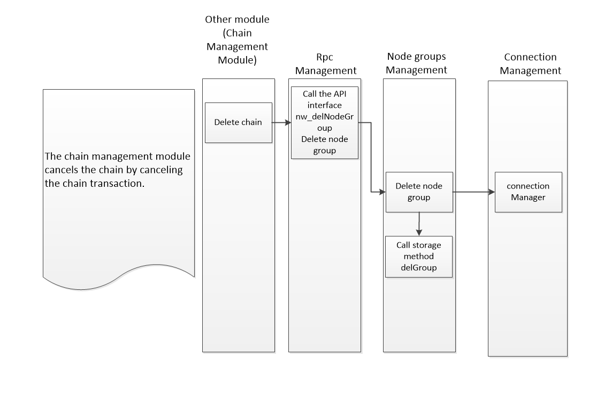
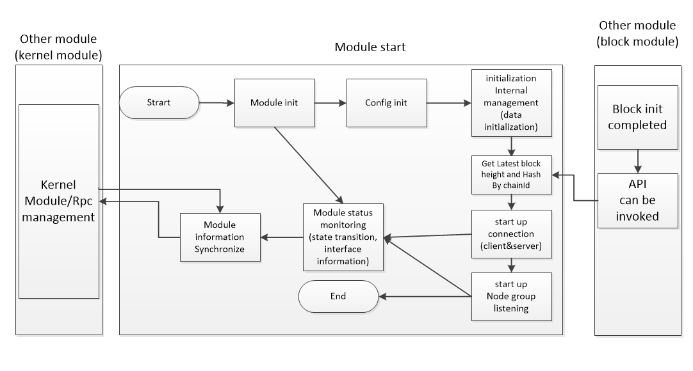

# Network module design document

[TOC]

## 1、General description

### 1.1 Module overview

#### 1.1.1 Why  have a Network Module

The network module guarantees the communication between the decentralized nodes and 
provides the lowest level of network communication and node discovery services for one of the NULS basic modules. The network foundation of the blockchain is Peer to Peer, or P2P. All participants in the P2P network can be either a server or a client. Features of P2P networks: decentralization, scalability, robustness, cost-effectiveness, privacy protection, and load balancing.

#### 1.1.2 What to do with Network Module

The network module is the basic module of the entire system, which is used to manage the connection between nodes, nodes and connections, and the transmission and reception of data. Network modules do not involve complex business logic.

* The received network message is pushed in the corresponding processing module according to the instruction service mapping relationship in the kernel module.
* The open interface is used to push the message encapsulation of other modules to the specified peer node and broadcast to the specified network group.


#### 1.1.3  The positioning of "Network Module" in the system

* The network module is the underlying application module. Any module that needs network communication must send and receive messages through the network module.
* Network modules rely on kernelmodules for service interface governance。
* The network module builds different networks by network id (magic parameter).
* When the nodes of the network module in the satellite chain are configured for cross-chain networking, a chain management module is required to provide cross-chain configuration information.
* The nodes of the network module in the sub-chain need to provide cross-chain configuration information when the cross-chain network is built.

### 1.2 Architecture diagram


## 2、function design

### 2.1 Functional architecture diagram

​    The network module has  functions in the business: node management, node group management, p2p  network connection management, and message transmission and management.

​    The  internal infrastructure functions include: state management of the  module (including startup and shutdown management), and management of  external interfaces.   Thread task management, data storage management, etc.  。


- Peer Nodes Management 

  Manage all connectable, connected node information, status, and provide node operation interfaces

  - Node discovery
  - Node storage

- Node Groups Management

  Manage different network nodes, divide nodes into different collections, and manage each collection separately. The magic parameters of the nodes connected in each set are the same and are different from the magic parameters of other sets.

   Each NodeGroup is  initialized according to the information registered in the chain or the  network information configured by itself (magic parameters, number of  nodes, etc.) .Every time a NodeGroup is initialized, the network service listens for more than one MagicNumber.  

- Connection Management

  - Initialize the connection
    - Satellite chain node: random connection
    - Cross-chain nodes: fixed algorithm connections, the goal is to spread and cross-link nodes across the chain
  - Connection Management: Heartbeat Maintenance
  - Disconnect

- Message Management

  - Message receiver

  Receiving the message sent by the network node, making a simple judgment on the message 
  (judging command), and sending the message to the module service of interest
  according to the message cmd field.

  [^ps]: RPC API Service interface information (url) is periodically obtained and cached from the kernel module.

  - Message receiver

    - NodeGroup broadcast message
    - Send a message to a node

​                  

- Module Management

  - Start, turn off logic processing
  - Maintenance and management of the status of its own module: management module operation status, internal function status, etc.


- RPC Api Management

  - Register your own interface into the kernel module

  - Synchronize module information and status to the kernel module 

  - Get the list of RPC services to the local module

  - Open external interface call

- Thread task management

  - heartbeat thread

  - Node discovery/elimination mechanism thread

  - Interface information synchronization thread


### 2.2 Module service

#### 2.2.1 Network message recieve

* Function Description：

    Receiving the message sent by the (external) network node, making a simple judgment on
    the message (determining the magic parameter), and sending the message to the module service of interest according to the command field contained in the message header.

* Process description

  

* Message verification ：

​        payload validate ：First 4 bytes of  sha256(sha256(payload))

​        magicNumbe ：Determine if the nodegroups collection contains the magicNumber

* External module network message receiving interface constraint

   - method : ***  //Same as the CMD instruction in the message header, constraining 12 bytes

     Interface description: The network module transparently forwards the message to the external module.

   - params

```
    0：chainId  
    1：nodeId  
    2：messageBody
    ......
```


```

```

  * Dependent service

    Parsing the command parameter in the message header, relying on the remote service interface data provided by the kernel module when calling the remote interface processing.

  #### 2.2.2 Network messaging

Forwards messages encapsulated by other or own modules, including broadcast messages and designated nodes to send messages.

##### 2.2.2.1、Broadcast network message

Function Description：

  Forwarding messages encapsulated by other or its own modules, and providing  interfaces for forwarding calls to external modules have the following two cases:

  a> Broadcast a message to a NodeGroup (specify a network).

  b> Broadcast messages to the NodeGroup (specify a network) and exclude certain nodes.

- Process description


  

- Interface definition

  - Interface Description

  ​        method : nw_broadcast

  ​       Other modules can broadcast messages through this interface

  - Request example

    ```
    {
        "method":"nw_broadcast",
        "minVersion":1.1,
        "params":[
            1234，
            "10.13.25.36:5003,20.30.25.65:8009",
            "03847ABDFF303847ABDFF303847ABDFF303847ABDFF303847ABDFF303847ABDFF3",
            "getBlock"
           
        ]}
    ```

  - Request parameter description

    | index | parameter    | required | type   |          description           |
    | ----- | ------------ | -------- | ------ | :----------------------------: |
    | 0     | chainId      | true     | int    |            chainId             |
    | 1     | excludeNodes | true     | String | Exclude nodes, comma separated |
    | 2     | message      | true     | String |  Object hexadecimal character  |
    | 3     | command      | true     | String |    message command,12 byte     |

  - Return example

    Failed

    ```
    {
       "version": 1.2,
        "code":1,
        "msg" :"xxxxxxxxxxxxxxxxxx",
        "result":{}
    }
    ```

    Success

    ```
    {
     "version": 1.2,
        "code":0,
        "result":{
           
        }
    }
    ```

- Dependent service

​           nothing

##### 2.2.2.2、The specified node sends a network message

Function Description：

Forwarding messages encapsulated by other or its own modules, you can specify that
certain nodes (which can be 1 node) send messages.

- Process description

  

- Interface definition

  - Interface Description

    External modules can broadcast messages through this interface

    method : nw_sendPeersMsg

  - Request example

    ```
    {
        "method":"nw_sendPeersMsg",
        "minVersion":1.1,
        "params":[
            1234，
            "10.13.25.36:5003,20.30.25.65:8009",
            "03847ABDFF303847ABDFF303847ABDFF303847ABDFF303847ABDFF303847ABDFF3",
            "getBlock"
        ]}
    ```

  - Request parameter description

    | index | parameter | required | type   |         description          |
    | ----- | --------- | -------- | ------ | :--------------------------: |
    | 0     | chainId   | true     | int    |           chainId            |
    | 1     | nodes     | true     | String |    Send node, comma split    |
    | 2     | message   | true     | String | Object hexadecimal character |
    | 3     | command   | true     | String |   message command,12 byte    |

  - Return example

    Failed

    ```
    {
       "version": 1.2,
        "code":1,
        "msg" :"xxxxxxxxxxxxxxxxxx",
        "result":{}
    }
    ```

    Success

    ```
    {
     "version": 1.2,
        "code":0,
        "result":{
           
        }
    }
    ```

  - Return field description

    | parameter | type | description |
    | --------- | ---- | ----------- |
    |           |      |             |

- Dependent service

​        nothing

#### 2.2.3 Create a node group

In addition to  its own satellite network, the satellite chain also has n cross-chain  networks. In addition to its own network, there is also a cross-chain  network.

   Node groups are used to manage different network information. The network module isolates and maintains different networks through node groups.

   Node  group type: 1> own network 2> cross-chain network (satellite  chain cross-chain network & friend chain cross-chain network)

   The network module is a call to receive an external module to create a node group. The basic network configuration information of the cross-chain is mainly obtained through two ways:

   1> The own configuration file is loaded to create its own network group.

   2> Cross-chain network:

   As  a satellite chain node, after the registration is registered by the  chain management module, the system generates a transaction verification  confirmation and then calls to generate a cross-chain network group.

   As  a friend chain node, when started by the cross-chain protocol module,  the cross-chain protocol module obtains cross-chain configuration  information from the module configuration, and notifies the network  module,The network module triggers a cross-chain connection.  

* Process description

   The actual creation of a NodeGroup also has two kinds of logic:

  1> Generate your own network group (or data load call) by loading the configuration file.

  2> Call by external module: Create a network group as confirmed by registering cross-chain transactions.  

##### 2.2.3.1  Create a node group with its own network

- Function Description：

  ​     The own network corresponds to its own chainId, and a magic parameter, through the configuration initialization to create a node group.

- Process description

  Create a node group by loading the configuration file

- Interface definition

​      Created internally, no external interface。

- Dependent service

​        none

#####  2.2.3.2 Create a cross-chain node group

- Function Description：

  The cross-chain node group on the satellite chain is triggered by the cross-chain registration of the friend chain in the satellite chain. The friend chain obtains cross-chain configuration information, and the cross-chain status of the own network group is updated by the cross-chain protocol.

- Process description

 1> The satellite chain is triggered by the chain management module to trigger the creation of a cross-link node group.

 2> The friend chain updates the cross-chain status of its own network group through the cross-chain protocol module.  


* interface definition

  - Interface Description

    Receive a call to an external module to create a node group

    method : nw_createNodeGroup

  - Request example

    ```
    {
        "method":"nw_createNodeGroup",
        "minVersion":1.1,
        "params":[
            1234,
            232342,
            10,
            100,
            20，
            "10.20.30.10:8002,48.25.32.12:8003,52.23.25.32:9003",
            0
        ]}
    ```

  - Request parameter description

    | index | parameter         | required | type   |                 description                 |
    | ----- | ----------------- | -------- | ------ | :-----------------------------------------: |
    | 0     | chainId           | true     | int    |                   chainId                   |
    | 1     | magicNumber       | true     | long   |                 magicNumber                 |
    | 2     | maxOut            | true     | int    |         Maximum active connections          |
    | 3     | maxIn             | true     | int    |    Maximum number of passive connections    |
    | 4     | minAvailableCount | true     | int    | Minimum number of links in the friend chain |
    | 5     | seedIps           | true     | String |    Seed section group comma segmentation    |
    | 6     | isMoonNode        | true     | int    |   Whether satellite chain node, default 0   |

  - Return example

    Failed

    ```
    {
       "version": 1.2,
        "code":1,
        "msg" :"xxxxxxxxxxxxxxxxxx",
        "result":{}
    }
    ```

    Success

    ```
    {
     "version": 1.2,
        "code":0,
        "result":{
           
        }
    }
    ```

  - Return field description

    | parameter | type | description |
    | --------- | ---- | ----------- |
    |           |      |             |

 * Dependent service

Relies on remote service interface data provided by the kernel module.

##### 2.2.3.3  Friend chain activates cross-chain connection

- Function Description：

  The cross-chain node group on the satellite chain is triggered by the cross-chain registration of the friend chain in the satellite chain. The friend chain obtains cross-chain configuration information, and the cross-chain status of the own network group is updated by the cross-chain protocol.

- Process description

  The friend chain updates the cross-chain status of its own network group through the cross-chain protocol module.

- Interface definition

  - Interface Description

    Receive calls from cross-chain modules, activate friend chain cross-chain

    method : nw_activeCross

  - Request example

    ```
    {
        "method":"nw_activeCross",
        "minVersion":1.1,
        "params":[
            1234,
            10,
            100,
            "10.20.30.10:8002,48.25.32.12:8003,52.23.25.32:9003"
        ]}
    ```

  - Request parameter description

    | index | parameter | required | type   |              description              |
    | ----- | --------- | -------- | ------ | :-----------------------------------: |
    | 0     | chainId   | true     | int    |         Chain identification          |
    | 1     | maxOut    | true     | int    |      Maximum active connections       |
    | 2     | maxIn     | true     | int    | Maximum number of passive connections |
    | 3     | seedIps   | true     | String |     Seed node, comma segmentation     |

  - Return example

    Failed

    ```
    {
       "version": 1.2,
        "code":1,
        "msg" :"xxxxxxxxxxxxxxxxxx",
        "result":{}
    }
    ```

    Success

    ```
    {
     "version": 1.2,
        "code":0,
        "result":{
           
        }
    }
    ```

  - Return field description

    | parameter | type | description |
    | --------- | ---- | ----------- |
    |           |      |             |

- Dependent service

​      Relies on remote service interface data provided by the kernel module.

#### 2.2.4 delete node group

- Function Description:

   Receive a call from an external module and unregister the cross-chain node group.

   As a satellite chain node, the chain management module performs  deregistration, and the system generates a transaction verification  confirmation and then calls it.  

- Process description

   

-  Interface definition

  - Interface Description

    Receive calls from external modules, delete node groups

    method : nw_delNodeGroup

  - Request example

    ```
    {
        "method":"nw_delNodeGroup",
        "minVersion":1.1,
        "params":[
            1234
        ]}
    ```

  - Request parameter description

    | index | parameter | required | type | description |
    | ----- | --------- | -------- | ---- | :---------: |
    | 0     | chainId   | true     | int  |   chainId   |

  - Return example

    Failed

    ```
    {
       "version": 1.2,
        "code":1,
        "msg" :"xxxxxxxxxxxxxxxxxx",
        "result":{}
    }
    ```

    Success

    ```
    {
     "version": 1.2,
        "code":0,
        "result":{
           
        }
    }
    ```

  - Return field description

    | parameter | type | description |
    | --------- | ---- | ----------- |
    |           |      |             |

 

- Dependent service

  Relies on remote service interface data provided by the kernel module.


#### 2.2.5 Cross-chain seed node provision

- Function Description：

  The seed node is a node used to provide peer connection information when the network is initialized. When the chain management module performs chain registration, it needs to 
  obtain the seed node information on the satellite chain for initializing
  the connection.

- Process description

   no

- Interface definition

  - Interface Description

    Obtain satellite chain seed node

    method : nw_getSeeds

  - Request example

    ```
    {
        "method":"nw_getSeeds",
        "minVersion":1.1,
        "params":[
            1234
        ]}
    ```

  - Request parameter description

    | index | parameter | required | type | description |
    | ----- | --------- | -------- | ---- | :---------: |
    | 0     | chainId   | true     | int  |   chainId   |

  - Return example

    Failed

    ```
    {
       "version": 1.2,
        "code":1,
        "msg" :"xxxxxxxxxxxxxxxxxx",
        "result":{}
    }
    ```

    Success

    ```
    {
     "version": 1.2,
        "code":0,
        "result":{
          seedsIps:"101.132.33.140:8003,116.62.135.185:8003,47.90.243.131:8003" 
        }
    }
    ```

  - Return field description

    | parameter | type | description |
    | --------- | ---- | ----------- |
    | seedsIps  |      |             |


- Dependent service

  Relies on remote service interface data provided by the kernel module.


#### 2.2.6 Add a connection node

- Function Description：

  Add a peer connection information to a network under the cmd command.

- Process description

  The added node triggers the network connection process。

- Interface definition

  - Interface Description

    Add network peer node

    method : nw_addNodes

  - Request example

    ```
    {
        "method":"nw_addNodes",
        "minVersion":1.1,
        "params":[
            1234，
            1，
           "10.20.23.02:5006,53.26.65.58:8003"
        ]}
    ```

  - Request parameter description

    | index | parameter | required | type   |  description   |
    | ----- | --------- | -------- | ------ | :------------: |
    | 0     | chainId   | true     | int    |    chainId     |
    | 1     | isCross   | true     | int    | 0 false 1 true |
    | 2     | nodes     | true     | String |     nodes      |

  - Return example

    Failed

    ```
    {
       "version": 1.2,
        "code":1,
        "msg" :"xxxxxxxxxxxxxxxxxx",
        "result":{}
    }
    ```

    Success

    ```
    {
     "version": 1.2,
        "code":0,
        "result":{
           
        }
    }
    ```

  - Return field description

    | parameter |
    | --------- |
    |           |


- Dependent service

   none


#### 2.2.7 Delete connection node

- Function Description：

  Under the cmd command, the peer connection information is deleted for a network.

- Process description

  Deleting a node triggers the disconnection of the network node。

- Interface definition

  - Interface Description

    Delete network peer nodes

    method : nw_delNodes

  - Request example

    ```
    {
        "method":"nw_addNodes",
        "minVersion":1.1,
        "params":[
            1234，
           "10.20.23.02:5006,53.26.65.58:8003"
        ]}
    ```

  - Request parameter description

    | index | parameter | required | type   | description |
    | ----- | --------- | -------- | ------ | :---------: |
    | 0     | chainId   | true     | int    |   chainId   |
    | 1     | nodes     | true     | String | peer nodes  |

  - Return example

    Failed

    ```
    {
       "version": 1.2,
        "code":1,
        "msg" :"xxxxxxxxxxxxxxxxxx",
        "result":{}
    }
    ```

    Success

    ```
    {
     "version": 1.2,
        "code":0,
        "result":{
           
        }
    }
    ```

  - Return field description

    | parameter |
    | --------- |
    |           |


- Dependent service

   none

####  2.2.8 Reconnect to the specified network

- Function Description：

  Network reconnection of the specified nodeGroup under the cmd command

- Process description

   After receiving the command, disconnect all the peers under the specified nodeGroup and reconnect to the network.

​       Refresh the peer connection under nodegroup and restart the network connection.

​       If  the peer connection is owned by multiple network services, you only  need to cancel the association. If only the service is used by itself,  you can disconnect.  

- Interface definition

  - Interface Description

    Obtain satellite chain seed node

    method : nw_reconnect

  - Request example

    ```
    {
        "method":"nw_reconnect",
        "minVersion":1.1,
        "params":[
            1234
        ]}
    ```

  - Request parameter description

    | index | parameter | required | type | description |
    | ----- | --------- | -------- | ---- | :---------: |
    | 0     | chainId   | true     | int  |   链标识    |

  - Return example

    Failed

    ```
    {
       "version": 1.2,
        "code":1,
        "msg" :"xxxxxxxxxxxxxxxxxx",
        "result":{}
    }
    ```

    Success

    ```
    {
     "version": 1.2,
        "code":0,
        "result":{
           
        }
    }
    ```

  - Return field description

    | parameter | type | description |
    | --------- | ---- | ----------- |
    |           |      |             |

- Dependent service
none

#### 2.2.9 Get the list of nodeGroup

- Function Description：

  Get a list of all networks managed by the node。

- Process description

     none

- Interface definition

  - Interface Description

    Get node group information

    method : nw_getGroups

  - Request example

    ```
    {
        "method":"nw_getGroups",
        "minVersion":1.1,
        "params":[
            1,
            10
        ]}
    ```

  - Request parameter description

    | index | parameter | required | type |        description         |
    | ----- | --------- | -------- | ---- | :------------------------: |
    | 0     | startPage | true     | int  |       page of starts       |
    | 1     | pageSize  | true     | int  | Number of records per page |

  - Return example

    Failed

    ```
    {
       "version": 1.2,
        "code":1,
        "msg" :"xxxxxxxxxxxxxxxxxx",
        "result":{}
    }
    ```

    Success

    ```
    {
     "version": 1.2,
        "code":0,
        "result":{
            list:[{
                chainId：1212, 
                magicNumber：324234, 
                totalCount：2323,  
                inCount：22,    
                outCount：33,   
                isActive：1， 
                isCrossChain:1  
                },{}
                ]
        }
    }
    ```

  - Return field description

    | parameter    | type | description                                           |
    | ------------ | ---- | ----------------------------------------------------- |
    | chainId      | int  | chainId                                               |
    | magicNumber  | int  | magicNumber                                           |
    | totalCount   | int  | Total number of connections                           |
    | inCount      | int  | Passive connection number                             |
    | outCount     | int  | ctive connections                                     |
    | isActive     | int  | 0 is not activated, 1 is activated                    |
    | isCrossChain | int  | 0 is not a cross-chain network, 1 cross-chain network |


- Dependent service

   none

#### 2.2.10 Get the connection under the nodeGroup

- Function Description：

  Get information about all nodes under the specified network id

- Process description

  none

- Interface definition

  - Interface Description

  ​      Get node information

  ​        method : nw_getNodes

  - Request example

    ```
    {
        "method":"nw_reconnect",
        "minVersion":1.1,
        "params":[
            1598,
            0,
            1,
            50
        ]
    }
    
    ```

  - Request parameter description

  | index | parameter | required | type |             description              |
  | ----- | --------- | -------- | ---- | :----------------------------------: |
  | 0     | chainId   | true     | int  |               chainId                |
  | 1     | state     | true     | int  | 0 all connected, 1 working connected |
  | 2     | startPage | true     | int  |            page of starts            |
  | 3     | pageSize  | true     | int  |      Number of records per page      |

  - Return example

  Failed

  ```
  {
     "version": 1.2,
      "code":1,
      "msg" :"xxxxxxxxxxxxxxxxxx",
      "result":{}
  }
  
  
  
  ```

  Success

  ```
   {
   "version": 1.2,
      "code":0,
      "result":{
         list:[{
                  chainId：122,
                  nodeId:"20.20.30.10:9902"
                  magicNumber：134124,
                  version：2,
                  blockHeight：6000,   //区块高度
                  blockHash："0020ba3f3f637ef53d025d3a8972462c00e84d9
                       ea1a960f207778150ffb9f2c173ff",  //区块Hash值
                  ip："200.25.36.41",
                  port：54, 
                  state："已连接",
                  isOut："1", 
                  time："6449878789", 
  	     },{}
  	     ]
      }
  }
  
  ```

  - Return field description

  | parameter   | type   | description                               |
  | ----------- | ------ | ----------------------------------------- |
  | chainId     | int    | chainId                                   |
  | nodeId      | String | nodeId                                    |
  | magicNumber | int    | magicNumber                               |
  | version     | int    | protocol version                          |
  | blockHeight | long   | latest block height                       |
  | blockHash   | String | latest block hash                         |
  | ip          | String | peer Ip address                           |
  | port        | int    | Server port                               |
  | state       | String | connect state                             |
  | isOut       | int    | 0 passive connection, 1 active connection |
  | time        | long   | Recent connection time                    |


- Dependent service

  none

#### 2.2.11 Get the specified chain network profile information

- Function Description：

  Gets the network information of the specified chainId.

- Process description

  none

- Interface definition

  - Interface Description

  ​      Gets the network information of the specified chainId.

  ​        method : nw_getGroupByChainId

  - Request example

    ```
    
    {
        "chainId":142
     }
    ```

     - Request parameter description

  | index | parameter | required | type | description |
  | ----- | --------- | -------- | ---- | :---------: |
  | 0     | chainId   | true     | int  |   chainId   |

     - Return example

  Failed

  ```
  {
     "version": 1.2,
      "code":1,
      "msg" :"xxxxxxxxxxxxxxxxxx",
      "result":{}
  }
  
  ```

  Success

  ```
  {
   "version": 1.2,
      "code":0,
      "result":{
              "chainId"：1212,  
              "magicNumber"：324234, 
              "totalCount"：2323,  
              "connectCount"：44， 
              "disConnectCount"：32， 
              "inCount"：22,   
              "outCount"：33,   
              "connectCrossCount"：44， 
              "disConnectCrossCount"：32， 
              "inCrossCount"：22,    
              "outCrossCount"：33,  
              "blockHeight"：6000,    
              "blockHash"："0020ba3f3f637ef53d025d3a8972462c00e84d9
                       ea1a960f207778150ffb9f2c173ff",   
              "isActive"：1， 
              "isCrossActive":1，  
              "isMoonNet":0  
              }
  }
  
  ```

     - Return field description

  | parameter            | type   | description                                           |
  | -------------------- | ------ | ----------------------------------------------------- |
  | chainId              | int    | chainId                                               |
  | magicNumber          | int    | magicNumber                                           |
  | totalCount           | int    | total connect                                         |
  | blockHeight          | long   | latest block height                                   |
  | blockHash            | String | latest block hash                                     |
  | isActive             | int    | 0 is not activated, 1 is activated                    |
  | isCrossActive        | int    | 0 is not a cross-chain network, 1 cross-chain network |
  | connectCount         | int    | had connected count                                   |
  | disConnectCount      | int    | disconnect count                                      |
  | outCount             | int    | active connection count                               |
  | inCount              | int    | passive connection count                              |
  | connectCrossCount    | int    | cross connect count                                   |
  | disConnectCrossCount | int    | cross disconnect count                                |
  | outCrossCount        | int    | active cross connection count                         |
  | inCrossCount         | int    | passive cross connection count                        |
  | isMoonNet            | int    | 0 not moon node，1 moon node                          |


- Dependent service

  none

#### 2.2.12 Update the information of the peer connection node

  - Function Description：

    The network connection has the height and hash value of the peer node when the 
    handshake connection is made, and the height and hash value of the subsequent peer connection node are called and updated by the external module (block management module).

  - Process description

     1> Wait for  the block management interface after the node starts Initialization, and  then call the block management interface to get the latest block height  and hash value.

      2> When the handshake is performed, the node related information is placed in the Verion information and sent to the peer.

      3>  After the connection is established, the block management module will  call the interface to update the latest block height and hash value.  

  - Interface definition

    - Interface Description

    ​      The block management module calls to update the height of the node and the hash value.

    ​        method : nw_updateNodeInfo

    - Request example

      ```
      {
          "method":"nw_updateNodeInfo",
          "minVersion":1.1,
          "params":[
             1598,
              "10.20.30.20:8856",
              10,
              "0020ba3f3f637ef53d025d3a8972462c00e84d9ea1a960f207778150ffb9f2c173ff"
          ]
      }
      ```

    - Request parameter description

    | index | parameter   | required | type   | description  |
    | ----- | ----------- | -------- | ------ | :----------: |
    | 0     | chainId     | true     | int    |    网络id    |
    | 1     | nodeId      | true     | String |  网络节点id  |
    | 2     | blockHeight | true     | long   |   区块高度   |
    | 3     | blockHash   | true     | Sting  | 区块最新hash |

    ​     

    - 返回示例

      Failed

      ```
      {
         "version": 1.2,
          "code":1,
          "msg" :"xxxxxxxxxxxxxxxxxx",
          "result":{}
      }
      
      ```

      Success

      ```
      {
       "version": 1.2,
       "code":0,
       "msg" :"xxxxxxxxxxxxxxxxxx",
       "result":{
         
          }
      }
      
      
      ```

    - 返回字段说明

    | parameter | type | description |
    | --------- | ---- | ----------- |
    |           |      |             |

  - Dependent service

    none

#### 2.2.14 Network time acquisition

- Function Description：

  Get network time for local time offset synchronization.

* Process description

The network module obtains the time of several servers on the network and performs offset calculation adjustment. If the network time acquisition fails, the time acquisition protocol is sent to 10 peer nodes to obtain the peer node time for deviation calculation. If it is not available, it returns directly to the local time.

Time corrections are performed periodically. 

- Interface definition

  - Interface Description

    Get network time

    method : nw_currentTimeMillis

  - Request example

    ```
    RPC unified format
    ```

  - Request parameter description

  | index | parameter | required | type | description |
  | ----- | --------- | -------- | ---- | :---------: |
  |       |           |          |      |             |

  - Return example

  Failed

  ```
  RPC unified format
  ```

  Success

  ```
  {
     "currentTimeMillis":11544545466 
  }
  
  
  
  ```

  - Return field description

| parameter         | type | description                                                |
| ----------------- | ---- | ---------------------------------------------------------- |
| currentTimeMillis | long | Difference from 1970-01-01 to the present, in milliseconds |

- Dependent service

​    无

## 2.3 Module internal function

  #### 2.3.1Module start

  - Function Description：

    When the module is started, the configuration information is initialized, the
    registration service is initialized, and the initialization of each internal function management database information is performed.

  - Process description

  ​        

1> load local configuration data, database node group and node information data loading.


2 > When the status of the listening block management module is initialized and the interface is callable, the call obtains the block height and Hash value of the latest local node.


3> initialization completes and enters peer node connection.


4 > The network module notifies the block management module of the maximum block height and hash value after the connection is stable. The block management module provides interfaces for network module calls.


The criteria for the stability of network module start-up connection are: no new handshake connection occurs in X seconds, and no height increase in X seconds. X=10

5 > After network stabilization, the network is in a working state, and the business state of each chain is released to other modules in an event manner.

  - Dependent service

    none

  #### 2.3.2 Module off

  - Function Description：

    When the module is closed, the connection is closed, the thread management is 
    closed, the resources are released, and the status is notified to the core interface.。

  - Process description

  


  - Dependent service

    none

  #### 2.3.3 Peer node discovery

  - Function Description：

     After the network module is started, the peer node is managed.

    The ways for node acquisition are:
    
    1> Connect to the seed node and request address acquisition.
    
    2> Receive the broadcasted node message.
    
    2>  The connection of a cross-chain network, for example, as a connection  between a node and a sub-chain on a satellite chain, or a connection  between a node on a sub-chain and a satellite chain.  

  - Process description

  


  - Dependent service

  ​          none

  #### 2.3.4  connection

  - Function Description：

     A node acts as the client, actively connecting to a known peer node, and is also a server, waiting for the peer node to connect.

    A  connection can work normally, and it needs to send a version protocol  message to each other through a handshake protocol. For the specific  definition of the protocol, see the following.
    
    "Protocol - Network Communication Protocol Part".  

  - Process description

  ​      After the TCP connection is complete with the server, the client needs to handshake through the rervice version protocol. Only the connection with successful handshake can forward the service. The state in the connection cannot be transitioned to connected after X minutes, and the connection is actively disconnected.

  

 PS: In order to meet the  requirements of one process carrying multiple-chain services at the same  time, after a node peer connection is established, multiple NodeGroup  services should be satisfied.

That is, the node peer connection and the nodeGroup object are many-to-many, n:n relationships.  


  - Dependent service

    none

  #### 2.3.5Heartbeat detection

  - Function Description：

    Check if the connection is still connected. Maintain the keep-alive by ping-pong message from client and server. Refer to the "Protocol - Network Communication Protocol" section for the definition of the ping-pong protocol involved.

  - Process description

  


  - Dependent service

​      none

  #### 2.3.6 Connection quantity verification

  - Function Description：

    When a node connection is established, the number of connections is made, and 
    if the maximum is reached, the connection is actively disconnected.。

- Process description

  ​      


  - Dependent service

​      none

  #### 2.3.7 Node external network IP storage

  - Function Description：

  ​         A node may have multiple  network cards, or it may be in a local area network. Therefore, when  establishing a connection, it does not know its own external network IP  address.

   The node needs to know its own  external network IP address to broadcast its own address for the  external network peers to connect. In our design, the external network of the node is carried by the version protocol message.  

  - Process description

    When the client receives the version message, it can know its own IP address information.

  


  - Dependent service

​     none

  #### 2.3.8 Node external network connection detection

  - Function Description：

  ​       When a node establishes a connection, it can broadcast its own external network IP+port to other nodes. However, if a node is in a local area network, the IP address of the external network cannot be directly connected. Therefore,in order to detect whether the external network IP of the node is 
available, you can connect to your own server through your own client. If the connection is successful, the IP can be used for broadcasting. If it is unsuccessful, the external network IP of the node cannot be 
broadcast to other nodes.

  - Process description

    Self-connection 
    may succeed or fail. If it is successful, the external network IP is reachable, and it can be broadcasted to other nodes in the network when the connection is established. If it is unreachable, the connection 
    cannot be established.。

  


  - Dependent service

     none

  #### 2.3.9 Peer node broadcast

  - Function Description：

    Broadcast
    its own nodes to other nodes in the network. In the design, we will 
    broadcast through the self-connection established above。

  - Process description

    Constraint: The address broadcast is not carried out between peers in the cross-chain 
    network, that is, the nodes in the satellite chain are not broadcast to the sub-chain, and the nodes in the same sub-chain are found not to be broadcast to the satellite chain. The satellite chain and the sub-chain need to establish a connection. The initial peer node can send a getAdrr message to request the connection address.

  


  - Dependent service

   none

#### 2.3.10 Request/reply getaddr protocol message

- Function Description：

  Request an address protocol message for more network connections

- Process description

   Request getaddr:

  1>  When a connection in a nodeGroup does not reach the network service  required threshold minAvailableCount, the address list is requested from  the seed node.

  2> The cross-chain nodeGroup in  the satellite chain node can directly request the obtained address from  the connected peer node.

  Reply getaddr:

  1>peer cross-link connection, node reply address list (IP+cross-chain port)

  2>peer own network connection, the node will reply to the address list (IP+ own chain port)  

- Dependent service


#### 2.3.11  send/receive address logic

- Function Description：

  Send & Receive network protocol addr protocol message processing logic

- Process description

  Send addr：

​    1> When a new node is accessed, an addr message is broadcast to other peers of the same nodegroup.

​    2> When the getaddr message is requested, the addr message will be replied.

​     Receive addr:

​      1> Determine whether the address is already owned locally. If you do not forward it, get the new addr.

​      2>PEER is not cross-chain network forwarding

​      3> Own network, add addr>0, store and broadcast forwarding (except receiving peer)  

- Dependent service

  none

## 3、Event description

  ### 3.1 Published event

[^remark]: Here is the topic of the event, the format protocol of the event (accurate to byte), and the occurrence of the event.


  #### 3.1.1 NodeGroup reaches the lower limit of the number of nodes

  Description: The NodeGroup reaches the lower limit of the number of nodes and the event is advertised.

     event_topic : "evt_nw_inNodeLimit",

  ```
    data:{
        chainId
        magicNumber
        nodeCount
        nodeLimit
        time
    }
    
  
  ```

  #### 3.1.2 NodeGroup is less than the minimum number of nodes

   Description: The NodeGroup is less than the lower limit of the number of nodes. The event is advertised.  

     event_topic : "evt_nw_lessNodeLimit",

  ```
    data:{
        chainId
        magicNumber
        nodeCount
        nodeLimit
        time
    }
    
  
  ```

  #### 3.1.3 Node handshake succeeded

   Description: The node handshake is successful and the event is advertised.  

     event_topic : "evt_nw_connectSuccess",

  ```
    data:{
        chainId
        magicNumber
        nodeId
        time
        version
    }
    
  
  ```

  #### 3.1.4 Node disconnected

   Description: The node is disconnected and the event is published   

     event_topic : "evt_nw_nodeDisconnect",

  ```
    data:{
        chainId
        magicNumber
        nodeId
        time
        version
    }
    
  
  ```


  ### 3.2 Subscribed event

    ​     none

  - 

  ## 4、protocol

  ### 4.1 Network communication protocol

  #### version

  Used to establish a connection (handshake)

| Length | Fields       | Type     | Remark                                                       |
| ------ | ------------ | -------- | ------------------------------------------------------------ |
| 4      | version      | uint32   | Protocol version identifier used by the node                 |
| 20     | addr_you     | byte[20] | The peer network address [IP+PORT1+PORT2] PORT2 is a cross-chain server port.                                                                               For example: [10.32.12.25 8003 9003] 16byte+2byte+2byte |
| 20     | addr_me      | byte[20] | The self network address [IP+PORT1+PORT2] PORT2 is a cross-chain server port.                                                                               For example: [20.32.12.25 8003 9003] 16byte+2byte+2byte |
| 4      | block_height | uint32   | node latest block height                                     |
| ？     | block_hash   | varInt   | node latest block hash                                       |
| 6      | network_time | uint48   | Network time                                                 |
| ??     | extend       | VarByte  | extended field, no more than 10 bytes                        |

  #### verack

  Used to answer version


| Length | Fields   | Type  | Remark                                                      |
| ------ | -------- | ----- | ----------------------------------------------------------- |
| 1      | ack_code | uint8 | Return code, 1 means normal, 2 means the connection is full |

  #### ping

    Used to maintain the connection. After receiving a message for a certain node for a 
  period of time, the message is sent. If the pong message is received, the node remains connected. Otherwise, the connection is closed and the  node is deleted.

| Length | Fields     | Type   | Remark        |
| ------ | ---------- | ------ | ------------- |
| 4      | randomCode | uint32 | random number |

  #### pong

    reply for ping

| Length | Fields     | Type                | Remark |
| ------ | ---------- | ------------------- | ------ |
| 4      | randomCode | uint32random number |        |

  #### getaddr

   Used to obtain connection information of available nodes in the network, no message body

  #### addr

  Used to reply getaddr, or announce the existence of itself to the network. After receiving the message, the node determines whether the node is known. If it is an unknown node, it propagates the message to the network.

| Length | Fields    | Type            | Remark                                          |
| ------ | --------- | --------------- | ----------------------------------------------- |
| ??     | addr_list | network address | 18 bytes per node (16 bytes IP + 2 bytes port） |

#### Bye

Used for peer connection to disconnect actively, rejecting service message connection

| Length | Fields  | Type  | Remark |
| ------ | ------- | ----- | ------ |
| 1      | byeCode | uint8 |        |

#### getTime

Used to get time from the peer node

| Length | Fields    | Type   | Remark    |
| ------ | --------- | ------ | --------- |
| 4      | messageId | uint32 | messageId |

 

#### responseTime

Reply to peer node time

| Length | Fields    | Type   | Remark    |
| ------ | --------- | ------ | --------- |
| 4      | messageId | uint32 | messageId |
| 4      | time      | uint32 | time      |

 


  ### 4.2 Transaction agreement

    ​        none

  ## 5、Module configuration


  ```
    [network]
    network.self.server.port=8003
    network.self.chainId=9861
    network.self.magic=68866996
    network.self.max.in=100
    network.self.max.out=10
    network.self.seed.ip=127.0.0.1:8003
    #Satellite chain configuration information
    network.moon.node=true
    network.moon.server.port=8004
    network.moon.max.in=100
    network.moon.max.out=10
    network.moon.seed.ip=215.159.216.58:8003,215.159.69.140:8003,223.206.200.74:8003
    
  
  ```

  ## 6、Java-specific design

[^remark]: Core object class definition, storing data structures，......

  ## 7、 to add on

[^remark]: Required content not covered above

