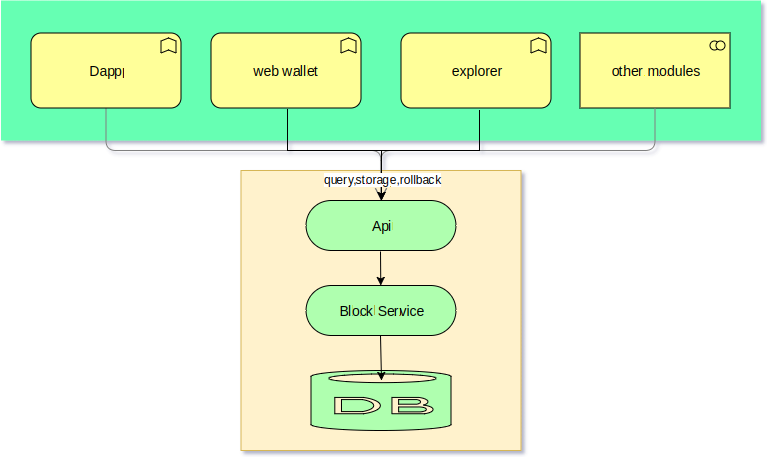
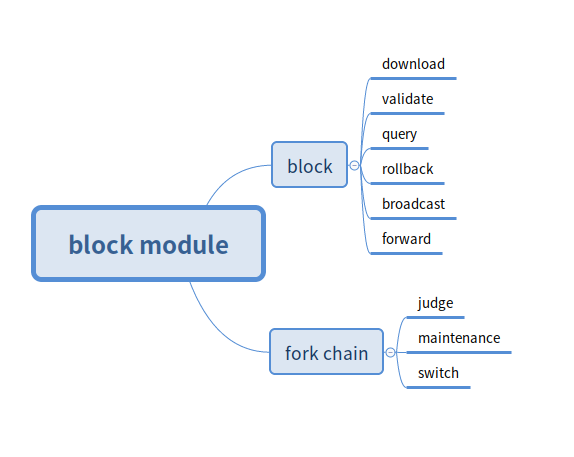
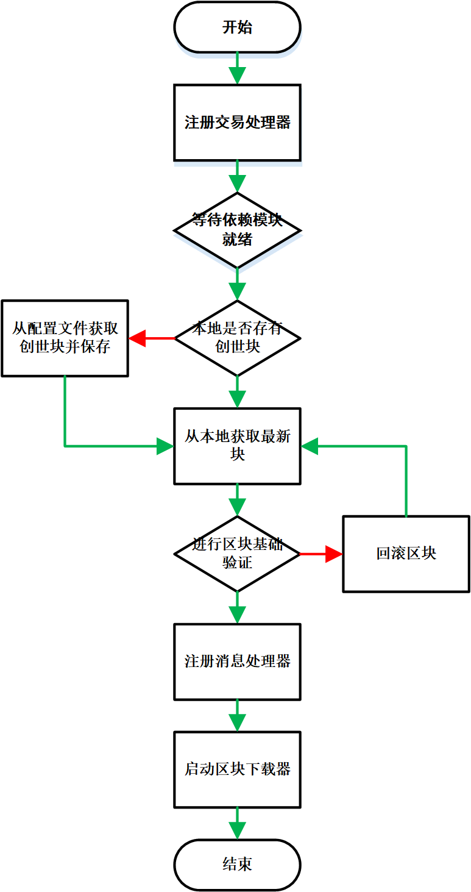
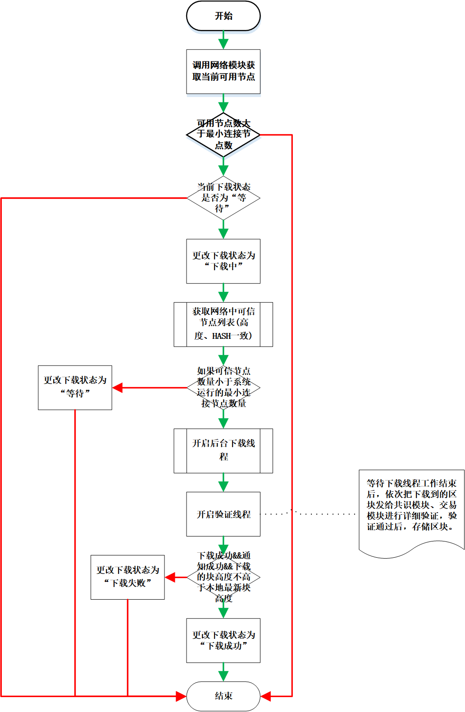
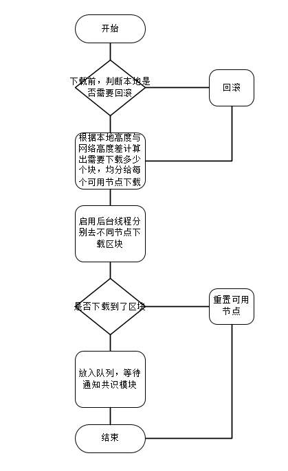
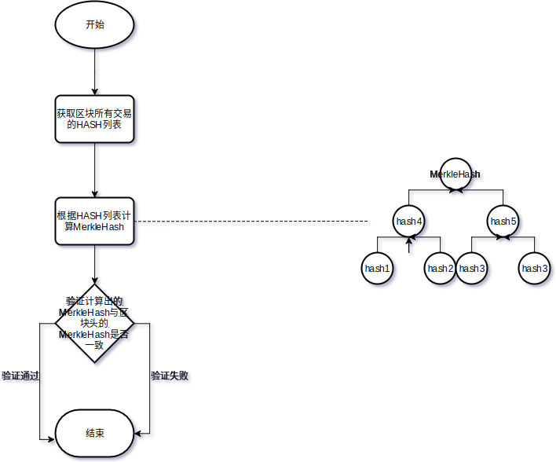

# Block management module design documents

[TOC]

## Chapter 1. General description

### 1.1 The module overview

#### 1.1.1 Why do you should have the block management module

All transaction data in the blockchain is stored in the block, so there is a module responsible for the saving and management of the block, so that other modules can obtain the block when verifying the data in the block and processing the business etc.

When the blockchain program is started for the first time, it is necessary to synchronize the full blocks from the network to the local. This process is generally time consuming, and the transaction cannot be initiated when the synchronization is not completed, so it is suitable for the work to be performed by a separate module.

In summary, it is necessary to provide a unified block data service for other modules, and it is also better to separate the management of the block from the specific service of the block. The modules who used the block do not have to care about the details of block's acquire.

#### 1.1.2 Block management module's tasks

1. When the system starts, it is judged whether the height of the local block reaches the latest height of most nodes on the network. If it is not reached, the block is downloaded from the network to the local, and then the block will be verified. If the verification is passed, the data is saved to the local database. This is called synchronization of blocks.

2. After the block synchronization is completed, the system starts normal operation.Let's discuss separately below

- If the self-node performs the packing block, the consensus module broadcasts the block information to the network before the packaged block is handed over to the block management module. The block management module verifies whether the block is legal, if legal then save it to the database, and respond to requests from other nodes on the network to get this block.

- If other nodes on the network are packing blocks, the local node will receive the forwarding block message sent from the network. At this time, the block information is obtained from other nodes, verified and saved.

3. In the abnormal case, the block's verification fails, and the new block cannot be connected to the last block on the main chain. The block is regarded as a forked block and placed in the forked chain set for maintenance. When it is found that one of the forked chains A is longer than the main chain B, the switching is performed, and the bifurcation chain A is the latest main chain, and the original main chain B enters the bifurcation chain assembly maintenance.

4. Provide block header and block's query services for other modules or clients.

#### 1.1.3 The position of block management module in the system

Block management is one of the underlying modules. The following sub-functions discuss module dependencies.

rely

* Block synchronization - depends on the communication interface of the network module, relying on the serialization tool of the tool module
* Block storage, rollback-dependent tool module database storage tool, consensus module, transaction management module
* Block forwarding - dependent on the network module's broadcast message interface

Be dependent

* The entire system can initiate transactions - block synchronization
* Consensus module: block detailed verification, packing - block query, block saving, block broadcasting, block rollback

### 1.2 Architecture diagram



## Chapter 2. Functional design

### 2.1 Functional architecture diagram



1. Provide the API to block storage, query, rollback operations.
2. Synchronous latest blocks from the Internet, a preliminary verification, validation, bifurcation without bifurcate, call consensus in a consensus based verification, the trading module dual authentication, all validation after saved to the local.
3. Block synchronization, broadcasting, forwarding message process
4. Fork blocks judgment and storage
5. Fork chains maintenance and switch

### 2.2 The module service

#### 2.2.1 Get the latest local block header

* Interface specification

1. Query the DB according to the chain ID and the latest block height in the cache to get the latest block header HASH.
2. According to the HASH query DB to get the block header byte array
3. Deserialize to block header object

* Sample request

    ```
    {
      "cmd": "bl_bestBlockHeader",
      "minVersion":"1.1",
      "params": ["888"]
    }
    ```

* Instructions of request parameters

| index | parameter | required | type    | description |
| ----- | --------- | -------- | ------- | :---------: |
| 0     | chainId   | true     | Long  |   chain ID    |
    
* response sample

    Failed
    
    ```
    {
        "version": 1.2,
        "code": 1,
        "msg": "error message",
        "result": {}
    }
    ```
    
    Success
    
    ```
    {
        "version": 1.2,
        "code": 0,
        "result": {
            "chainId": "888",
            "hash": "xxxxxxx",
            "preHash": "xxxxxxx",
            "merkleHash": "1",
            "height": 1,
            "size": 1,
            "time": 1,
            "txCount": 1,
            "packingAddress": "1",
            "reward": 0,
            "fee": 0,
            "extend": xxxxxxx,HEX
            "scriptSig": "1"
        }
    }
    ```
    
* Instructions of response parameters
  
| parameter | type      | description                                |
| --------- | --------- | ------------------------------------------ |
| chainId      | Long    | chain ID                                |
| hash      | String    | block HASH                                |
| preHash   | String    | pre block HASH                              |
| merkleHash   | String    | block's MerkleHash                              |
| height   | Long | block height                              |
| size   | Integer    | block size                              |
| time   | Long    | packing timestamp                              |
| txCount   | Integer    | count of transactions                              |
| packingAddress   | String    | packing address                              |
| reward   | Long    | Consensus reward                              |
| fee   | Long | procedure fee                             |
| extend   | String   | Extension field,HEX,contains roundIndex、roundStartTime、consensusMemberCount、packingIndexOfRound、stateRoot                              |
| scriptSig   | String    | block's signature                               |

#### 2.2.2 Get the latest local block

* Interface specification：

1. Get the latest local block header according to the the chain ID
2. Query the DB according to the block head height to get the transaction HASH list.
3. Obtain transaction data from the transaction management module according to the HASH list
4. Assemble into a block object

* Sample request

    ```
    {
      "cmd": "bl_bestBlock",
      "minVersion":"1.1",
      "params": [“888”]
    }
    ```

* Instructions of request parameters

| index | parameter | required | type    | description |
| ----- | --------- | -------- | ------- | :---------: |
| 0     | chainId   | true     | Long  |   chain ID    |

* response sample 

    Failed

      ```
      {
          "version": 1.2,
          "code":1,
          "msg" :"xxxxxxxxxxxxxxxxxx",
          "result":{}
      }
      ```

    Success

    ```
    {
        "version": 1.2,
        "code": 0,
        "result": {
        	"blockHeader": {
                "chainId": "888",
                "hash": "xxxxxxx",
                "preHash": "xxxxxxx",
                "merkleHash": "1",
                "height": 1,
                "size": 1,
                "time": 1,
                "txCount": 1,
                "packingAddress": "1",
                "reward": 0,
                "fee": 0,
                "extend": xxxxxxx,HEX
                "scriptSig": "1"
        	}, //block header
        	"transactions": [
        	    {
                    "chainId": "888", //chain Id
                    "height": "1", //block height
                    "hash": "1", //transaction HASH
                    "remark": "1", //transaction remark
                    "size": "1", //transaction size
                    "time": "1", //transaction timestamp
                    "type": "1", //transaction type
                    "transactionSignature": "1", //transaction sign
                    "coinData": {
                        "from" : [
                            {
                                “fromAssetsChainId”：“”  
                                “fromAssetsId”：“”
                                “fromAddress”：“”
                                “amount”：“”
                                “nonce”：“”//Transaction sequence number and increasing
                            },{...}
                        ]
                        "to" : [
                            {
                                “toAssetsChainId”：“”
                                “toAssetsId”：“”
                                “toAddress”：“”
                                “amount”：“”
                                “locktime”：“”
                            },{...}
                        ]
                    }
                    "txData": XXXX, //Special transaction data HEX
        	    },
        	    {...}
        	], //transaction list
        }
    }
    ```

* Instructions of response parameters

    omit

#### 2.2.3 get block header according to the height

* Interface specification

1. Query DB according to the chain ID and height, get the latest block header HASH
2. Query DB according to the HASH to get the block header byte array
3. Deserialize to block header object

* Sample request

    ```
    {
      "cmd": "bl_getBlockHeaderByHeight",
      "minVersion":"1.1",
      "params": ["111","888"]
    }
    ```

* Instructions of request parameters

| index | parameter | required | type    | description |
| ----- | --------- | -------- | ------- | :---------: |
| 0     | chainId   | true     | Long  |   chain ID    |
| 1     | height   | true     | Long  |   block's height    |
    
* response sample

    Failed
    
    ```
    {
        "version": 1.2,
        "code": 1,
        "msg": "error message",
        "result": {}
    }
    ```
    
    Success
    
    ```
    {
        "version": 1.2,
        "code": 0,
        "result": {
            "chainId": "888",
            "hash": "xxxxxxx",
            "preHash": "xxxxxxx",
            "merkleHash": "1",
            "height": 1,
            "size": 1,
            "time": 1,
            "txCount": 1,
            "packingAddress": "1",
            "reward": 0,
            "fee": 0,
            "extend": xxxxxxx,HEX
            "scriptSig": "1"
        }
    }
    ```
    
* Instructions of response parameters
  
| parameter | type      | description                                |
| --------- | --------- | ------------------------------------------ |
| chainId      | Long    | chain ID                                |
| hash      | String    | block hash                                |
| preHash   | String    | pre block hash                              |
| merkleHash   | String    | block's MerkleHash                              |
| height   | Long | block's height                              |
| size   | Integer    | block's size                              |
| time   | Long    | block's packing timestamp                              |
| txCount   | Integer    | count of transactions                              |
| packingAddress   | String    | address of packing                              |
| reward   | Long    | Consensus reward                              |
| fee   | Long | procedure fee                             |
| extend   | String   | Extension field,HEX,contains roundIndex、roundStartTime、consensusMemberCount、packingIndexOfRound、stateRoot                              |
| scriptSig   | String    | Signature of block                              |

#### 2.2.4 get block according to the height

* Interface specification：

1. Get the block header according to the chain ID and height
2. Query the DB according to the block head height to get the transaction HASH list.
3. Obtain transaction data from the transaction management module according to the HASH list
4. Assemble into a block object

* Sample request

    ```
    {
      "cmd": "bl_getBlockByHeight",
      "minVersion":"1.1",
      "params": [“111”,"888"]
    }
    ```

* Instructions of request parameters

| index | parameter | required | type    | description |
| ----- | --------- | -------- | ------- | :---------: |
| 0     | chainId   | true     | Long  |   chain ID    |
| 1     | height   | true     | Long  |   block's height    |

* response sample 

    Failed

      ```
      {
          "version": 1.2,
          "code":1,
          "msg" :"xxxxxxxxxxxxxxxxxx",
          "result":{}
      }
      ```

    Success

    ```
    {
        "version": 1.2,
        "code": 0,
        "result": {
        	"blockHeader": {
                "chainId": "888",
                "hash": "xxxxxxx",
                "preHash": "xxxxxxx",
                "merkleHash": "1",
                "height": 1,
                "size": 1,
                "time": 1,
                "txCount": 1,
                "packingAddress": "1",
                "reward": 0,
                "fee": 0,
                "extend": xxxxxxx,HEX
                "scriptSig": "1"
        	}, //block header
        	"transactions": [
        	    {
                    "chainId": "888",//chain ID
                    "height": "1", //block's height
                    "hash": "1", //transaction's hash
                    "remark": "1", //transaction's remark
                    "size": "1", //transaction's size
                    "time": "1", //transaction's timestamp
                    "type": "1", //transaction's type
                    "transactionSignature": "1", //transaction's sign
                    "coinData": {
                        "from" : [
                            {
                                “fromAssetsChainId”：“”  
                                “fromAssetsId”：“”
                                “fromAddress”：“”
                                “amount”：“”
                                “nonce”：“”
                            },{...}
                        ]
                        "to" : [
                            {
                                “toAssetsChainId”：“”  
                                “toAssetsId”：“”
                                “toAddress”：“”
                                “amount”：“”
                                “nonce”：“”
                            },{...}
                        ]
                    }
                    "txData": XXXX, //HEX
        	    },
        	    {...}
        	], 
        }
    }
    ```

* Instructions of response parameters

    omit

#### 2.2.5 get block header according to the hash

* Interface specification

1. According to the chain ID, HASH query DB to get the block header byte array
2. Deserialize to block header object

* Sample request

    ```
    {
      "cmd": "bl_getBlockHeaderByHash",
      "minVersion":"1.1",
      "params": ["888","aaa"]
    }
    ```

* Instructions of request parameters

| index | parameter | required | type    | description |
| ----- | --------- | -------- | ------- | :---------: |
| 0     | chainId   | true     | Long  |   chain ID    |
| 1     | hash   | true     | String  |   block hash    |
    
* response sample

    Failed
    
    ```
    {
        "version": 1.2,
        "code": 1,
        "msg": "error message",
        "result": {}
    }
    ```
    
    Success
    
    ```
    {
        "version": 1.2,
        "code": 0,
        "result": {
            "chainId": "888",
            "hash": "xxxxxxx",
            "preHash": "xxxxxxx",
            "merkleHash": "1",
            "height": 1,
            "size": 1,
            "time": 1,
            "txCount": 1,
            "packingAddress": "1",
            "reward": 0,
            "fee": 0,
            "extend": xxxxxxx,HEX
            "scriptSig": "1"
        }
    }
    ```
    
* Instructions of response parameters
  
| parameter | type      | description                                |
| --------- | --------- | ------------------------------------------ |
| chainId      | Long    | chain ID                                |
| hash      | String    | block hash                                |
| preHash   | String    | pre block hash                              |
| merkleHash   | String    | block's MerkleHash                              |
| height   | Long | block's height                              |
| size   | Integer    | block's size                              |
| time   | Long    | block's packing timestamp                              |
| txCount   | Integer    | count of transactions                              |
| packingAddress   | String    | address of packing                              |
| reward   | Long    | Consensus reward                              |
| fee   | Long | procedure fee                             |
| extend   | String   | Extension field,HEX,contains roundIndex、roundStartTime、consensusMemberCount、packingIndexOfRound、stateRoot                              |
| scriptSig   | String    | Signature of block                              |

#### 2.2.6 get block according to the hash

* Interface specification：

1. Get the block header according to the chain ID and hash
2. Query the DB according to the block head height to get the transaction HASH list.
3. Obtain transaction data from the transaction management module according to the HASH list
4. Assemble into a block object

* Sample request

    ```
    {
      "cmd": "bl_getBlockByHash",
      "minVersion":"1.1",
      "params": ["888",“aaa”]
    }
    ```

* Instructions of request parameters

| index | parameter | required | type    | description |
| ----- | --------- | -------- | ------- | :---------: |
| 0     | chainId   | true     | Long  |   chain ID    |
| 1     | hash   | true     | String  |   block hash    |

* response sample 

    Failed

      ```
      {
          "version": 1.2,
          "code":1,
          "msg" :"xxxxxxxxxxxxxxxxxx",
          "result":{}
      }
      ```

    Success

    ```
    {
        "version": 1.2,
        "code": 0,
        "result": {
        	"blockHeader": {
        	    "chainId": "888",
                "hash": "xxxxxxx",
                "preHash": "xxxxxxx",
                "merkleHash": "1",
                "height": 1,
                "size": 1,
                "time": 1,
                "txCount": 1,
                "packingAddress": "1",
                "reward": 0,
                "fee": 0,
                "extend": xxxxxxx,HEX
                "scriptSig": "1"
        	}, //block header
        	"transactions": [
        	    {
        	        "chainId": "888",
                    "height": "1", //block's height
                    "hash": "1", //transaction's hash
                    "remark": "1", //transaction's remark
                    "size": "1", //transaction's size
                    "time": "1", //transaction's timestamp
                    "type": "1", //transaction's type
                    "transactionSignature": "1", //transaction's sign
                    "coinData": {
                        "from" : [
                            {
                                “fromAssetsChainId”：“”  
                                “fromAssetsId”：“”
                                “fromAddress”：“”
                                “amount”：“”
                                “nonce”：“”
                            },{...}
                        ]
                        "to" : [
                            {
                                “toAssetsChainId”：“”  
                                “toAssetsId”：“”
                                “toAddress”：“”
                                “amount”：“”
                                “nonce”：“”
                            },{...}
                        ]
                    }
                    "txData": XXXX, //HEX
        	    },
        	    {...}
        	], 
        }
    }
    ```

* Instructions of response parameters

    omit

#### 2.2.7 get block header according to the height range

* Interface specification

1. Make queryHash = endHash
2. Query DB according to queryHash to get block header byte array
3. Deserialization for block header object blockHeader, added to the List as a return value
4. If the blockHeader.Hash!= startHash, make queryHash = blockHeader.preHash, repeat step 2
5. Return to the List

* Sample request

    ```
    {
      "cmd": "bl_getBlockHeaderBetweenHeights",
      "minVersion":"1.1",
      "params": ["888",111","111"]
    }
    ```

* Instructions of request parameters

| index | parameter | required | type    | description |
| ----- | --------- | -------- | ------- | :---------: |
| 0     | chainId   | true     | Long  |   chain ID    |
| 1     | startHeight   | true     | Long  |   start Height    |
| 2     | endHeight   | true     | Long  |   end Height    |
    
* response sample

    Failed
    
    ```
    {
        "version": 1.2,
        "code": 1,
        "msg": "error message",
        "result": {}
    }
    ```
    
    Success
    
    ```
    {
        "version": 1.2,
        "code": 0,
        "result": {
            “list” : [
                {
               "chainId": "888",
               "hash": "xxxxxxx",
               "preHash": "xxxxxxx",
               "merkleHash": "1",
               "height": 1,
               "size": 1,
               "time": 1,
               "txCount": 1,
               "packingAddress": "1",
               "reward": 0,
               "fee": 0,
               "extend": xxxxxxx,HEX
               "scriptSig": "1"
               }
            ]

        }
    }
    ```
    
* Instructions of response parameters
  
| parameter | type      | description                                |
| --------- | --------- | ------------------------------------------ |
| chainId      | Long    | chain ID                                |
| hash      | String    | block hash                                |
| preHash   | String    | pre block hash                              |
| merkleHash   | String    | block's MerkleHash                              |
| height   | Long | block's height                              |
| size   | Integer    | block's size                              |
| time   | Long    | block's packing timestamp                              |
| txCount   | Integer    | count of transactions                              |
| packingAddress   | String    | address of packing                              |
| reward   | Long    | Consensus reward                              |
| fee   | Long | procedure fee                             |
| extend   | String   | Extension field,HEX,contains roundIndex、roundStartTime、consensusMemberCount、packingIndexOfRound、stateRoot                              |
| scriptSig   | String    | Signature of block                              |

#### 2.2.8 get block according to the height range

* Interface specification

1. make queryHash=endHash
2. Query DB according to the chain ID, queryHash to get the block byte array
3. Deserialize to block object block, add to List as return value
4. If block.hash!=startHash, make queryHash=block.preHash, repeat step 2
5. Return to List

* Sample request

    ```
    {
      "cmd": "bl_getBlockBetweenHeights",
      "minVersion":"1.1",
      "params": ["888",111","111"]
    }
    ```

* Instructions of request parameters

| index | parameter | required | type    | description |
| ----- | --------- | -------- | ------- | :---------: |
| 0     | chainId   | true     | Long  |   chain ID    |
| 1     | startHeight   | true     | Long  |   start Height    |
| 2     | endHeight   | true     | Long  |   end Height    |
    
* response sample

    Failed
    
    ```
    {
        "version": 1.2,
        "code": 1,
        "msg": "error message",
        "result": {}
    }
    ```
    
    Success
    
    ```
    {
        "version": 1.2,
        "code": 0,
        "result": {
            “list” : [
                {
                    "blockHeader": {
                        "chainId": "888",
                        "hash": "xxxxxxx",
                        "preHash": "xxxxxxx",
                        "merkleHash": "1",
                        "height": 1,
                        "size": 1,
                        "time": 1,
                        "txCount": 1,
                        "packingAddress": "1",
                        "reward": 0,
                        "fee": 0,
                        "extend": xxxxxxx,HEX
                        "scriptSig": "1"
                    }, //block header
                    "transactions": [
                        {
                            "chainId": "888",
                            "height": "1", //block's height
                            "hash": "1", //transaction's hash
                            "remark": "1", //transaction's remark
                            "size": "1", //transaction's size
                            "time": "1", //transaction's timestamp
                            "type": "1", //transaction's type
                            "transactionSignature": "1", //transaction's sign
                            "coinData": {
                                "from" : [
                                    {
                                        “fromAssetsChainId”：“”  
                                        “fromAssetsId”：“”
                                        “fromAddress”：“”
                                        “amount”：“”
                                        “nonce”：“”
                                    },{...}
                                ]
                                "to" : [
                                    {
                                        “toAssetsChainId”：“”  
                                        “toAssetsId”：“”
                                        “toAddress”：“”
                                        “amount”：“”
                                        “nonce”：“”
                                    },{...}
                                ]
                            }
                            "txData": XXXX, //HEX
                        },
                        {...}
                    ], 
               }
            ]

        }
    }
    ```
    
* Instructions of response parameters
  
    omit

#### 2.2.9 Receive the latest packaging block

* Interface specification

After the local node's consensus module paking a block, this interface is called to save the block data.

* Sample request

    ```
    {
      "cmd": "bl_receivePackingBlock",
      "minVersion":"1.1",
      "params": [
      	blockhex
      ]
    }
    ```

* Instructions of request parameters

    omit
    
* response sample

    Failed
    
    ```
    {
        "version": 1.2,
        "code": 1,
        "msg": "error message",
        "result": {}
    }
    ```
    
    Success
    
    ```
    {
        "version": 1.2,
        "code": 0,
        "result": {"sync": "true"}
    }
    ```
    
* Instructions of response parameters
  
| parameter | type      | description                                |
| --------- | --------- | ------------------------------------------ |
| sync      | String    | wherther the Block's save is completed    |

#### 2.2.10 run a chain

* Interface specification

After the chain factory releases a chain, the core module calls the interface of the block management module, initializes the block and the forked chain database according to the chainID, starts a series of work threads corresponding to the chainID, and prepares for running the new chain.

* Sample request

    ```
    {
      "cmd": "bl_startChain",
      "minVersion":"1.1",
      "params": ["888"]
    }
    ```

* Instructions of request parameters

    omit

* response sample

    Failed

    ```
    {
        "version": 1.2,
        "code": 1,
        "msg": "error message",
        "result": {}
    }
    ```

    Success

    ```
    {
        "version": 1.2,
        "code": 0,
        "result": {"result": "true"}
    }
    ```

* Instructions of response parameters

| parameter | type      | description                                |
| --------- | --------- | ------------------------------------------ |
| result      | String    | whether the new chain started successfully    |

#### 2.2.11 stop a chain

* Interface specification

After stopping a chain in the chain factory, the core module will call the interface of the block management module, delete the cache block and the fork chain data of the chain, and stop a series of work threads corresponding to the chainID.

* Sample request

    ```
    {
      "cmd": "bl_stopChain",
      "minVersion":"1.1",
      "params": ["888"]
    }
    ```

* Instructions of request parameters

    omit

* response sample

    Failed

    ```
    {
        "version": 1.2,
        "code": 1,
        "msg": "error message",
        "result": {}
    }
    ```

    Success

    ```
    {
        "version": 1.2,
        "code": 0,
        "result": {"result": "true"}
    }
    ```

* Instructions of response parameters

| parameter | type      | description                                |
| --------- | --------- | ------------------------------------------ |
| result      | String    | whether the new chain started successfully    |

### 2.3 module's internal function

#### 2.3.1 module's boot

* Functional specifications：

  omit

* process description



-1.RPC service initialization
-2. Initialize the universal database
-3. Load configuration information
-4. Initialize each chain database
-5. Wait for dependent modules to be ready
-6. Register the message processing class with the network module
-7. Start synchronized block thread, database size monitoring thread, fork chain processing thread, orphan chain processing thread, and orphan chain maintenance thread

* Dependent service

  Tool module、kernel module

#### 2.3.2 block's storage

* Functional specifications：

Description storage table division

    Store the block header data on the main chain and the complete block data of bifurcated chain and orphan chain

- main chain storage

    Different chains are stored in different tables, with the table name suffix chainID
    A complete block consists of a block header and a transaction, which are stored separately from the transaction.
    Block header :(placed in the block management module)
        Key (block height)-value(block head hash) block-header-index
        Key (block head hash)-value(full block head) block-header
    Transaction :(put in the transaction management module)

- fork chain, orphan chain storage

    All forked chain and orphan chain objects are cached in memory (only key information such as starting height, starting hash, ending height and ending hash are recorded), and the full amount of block data is cached in the hard disk. If the operation of switching and cleaning the forked chain is needed, the database can be read only once
    The bifurcated chain sets of different chains have different tables, the table name plus the suffix of chainID, and each bifurcated chain object is as follows:
        Key (block hash)-value(full block data) CachedBlock

* process description

    omit

* Dependent service

  Database storage tool of tool modules

#### 2.3.2 Block's clean

* Functional specifications：

Description storage table division

    In order to avoid excessive garbage data occupying disk space, bifurcation chain and orphan chain are cleaned regularly

* process description

    1. Clean up according to the configured maximum number of cache blocks. When the number of blocks in the bifurcated chain + orphan chain cache is greater than the threshold value, clean up
    2. Clean up according to the difference between the starting height of the bifurcated chain or orphan chain and the latest height of the main chain
    3. According to the age of the orphan chain, the initial value of the age of the orphan chain is 0. Every time the orphan chain is maintained, the age of the orphan chain increases by 1 when no legal block is added to the chain head of the orphan chain

* Dependent service

  Database storage tool of tool modules

#### 2.3.4 block's Synchronization

* Functional specifications：

  After the system is started, local block data is maintained consistent with most nodes on the network.

It is mainly composed of a total scheduling thread and three sub-worker threads:

Total synchronizer thread: BlockSynchronizer calculates the latest synchronized height on a network, checks whether a local block needs to be rolled back, initializes parameters during synchronization of various blocks, and schedules three child threads

Sub-worker thread 1: BlockDownloader, work content: starting from the initial height, according to the credit value of each download node to allocate the download task, and start the background download task BlockWorker

Sub-worker thread 1-1: BlockWorker, job content: assemble the HeightRangeMessage, send it to the target node, calculate the messageHash, cache it, and wait for the CompleteMessage to be returned from the target node (messageHash to be carried).

Sub-worker thread 2: BlockCollector, job content: collect BlockDownloader downloaded to the block, sort into the Shared queue for BlockConsumer consumption

Subworker thread 3: BlockConsumer. What it does: it takes out the blocks in the Shared queue and saves them one by one

* process description

    * Block synchronization main flow
    
    
    
    * Get a list of available nodes on the network
    
    ```
        1. Traverse the node and count the two MAPs, assuming that each node (the latest HASH+ latest height) is the key
        2. A key with the key as the number of statistics
        3. A key is used to record the list of nodes holding the key.
        4. Finally, the most frequently occurring key is obtained, and the current trusted latest height and latest hash, as well as the list of trusted nodes are obtained.
        
        for example:
        Now connect to 10 nodes at the same time. The latest block's height of 4 nodes (A, B, C, D) is 100, the latest block hash is aaa, and the latest block's height of 6 nodes (E, F, G, H, I, J) is 101. The latest block hash is bbb.
        Finally return (101, bbb, [E, F, G, H, I, J]).
    ```
    
    * Download block logic
    
    
    
    ```
            Before the official download of the block, it is necessary to determine whether the local and the network are forked, and whether it needs to be rolled back. In order to find the exact block download height.
            The following discussion is divided into:
            Take the result of the previous step (101, bbb, [E, F, G, H, I, J]), while LH(N) represents the hash of the local Nth block, and RH(N) represents the hash of the Nth block on the network. .
            1. Local height 100 < network height 101, LH (100) == RH (100), normal, behind the remote node, download block
            2. Local height 100 < network height 101, LH (100)! = RH (100), think local fork, roll back the local block, if LH (99) == RH (99)
            At the end of the rollback, download from 99 blocks. If LH(99)!=RH(99), continue to roll back and repeat the above logic. However, if you roll back 10 blocks at most, it will stop and wait for the next synchronization. This will avoid being attacked by malicious nodes and roll back normal blocks in large quantities.
            1. Local height 102> network height 101, LH (101) == RH (101), normal, leading than remote node, no need to download block
            2. Local height 102> network height 101, LH (101)! = RH (101), think local fork, first roll back to the height and remote consistency, repeat scene 2
            3. Local height 101 = network height 101, LH (101) == RH (101), normal, consistent with the remote node, no need to download the block
            4. Local height 101 = network height 101, LH (101)! = RH (101), think local fork, repeat scene 2
            
            In the scenario that needs to be rolled back, the number of available nodes (10) > configuration, the number of consistent available nodes (6) accounted for more than 80%, and avoiding too few nodes leads to frequent rollback. The above two conditions are not met, empty the connected nodes, and re-acquire the available nodes.
     
            When you actually download the block, for example:
    The current height is 100 and the network height is 500. There are 12 available nodes and 10 uniformly available nodes. Each node has 2 initial download blocks
    Pseudocode representation
    Idle download node queue: nodes(each download node has an initial download credit value, which increases every time the download succeeds, and the maximum credit value is twice the initial value)
    Download to the block cache queue: queue
    Download starting height: startHeight = 101;
    End of download height: netLatestHeight = 500;
        While (startHeight <= netLatestHeight) {
            While (queue.size() > 100) {
                BlockDownloader wait! Cached queue size beyond config
            }
            Gets an available node
            The number of download blocks is calculated as size according to the node download credit value
            Submit the asynchronous download task
            StartHeight + = size;
        }
    ```
    
    If one node fails to download, the other node does the downloading for it
Consider that other nodes on the network continue to generate new blocks during the download process. After the download, it is necessary to determine whether the latest local block height is the same as the latest online consistent height. If the height is the same, it indicates the end of block synchronization. If not, it is necessary to continue downloading
    
    

* Dependent service

  Database storage tool of tool modules、RPC tool

#### 2.3.5 block's validation

* Functional specifications：

  Verify the correctness of the block's own data, verify during the download process, verify that there is no problem with the block data itself, and discard the block if the verification fails.

* process description

    * block's basic validation
    
    
    
    * block header's validation
    
    
    
    * Merkelhash validation
    
    

* Dependent service

  Database storage tool of tool modules

#### 2.3.6 Verification of forked block and orphan block

* Functional specifications：

  Verify the correctness of the block context. After the download is complete, verify that the block is connected to the main chain. 
  The verification failure indicates that the block is bifurcated and enters the forked chain processing logic.

* process description

* verification of forked block and orphan block
* there are four relationships between blockchain B and chain A:
* 1.B is the repeated block on A
* 2.B is the bifurcated block on A
* 3.B can connect directly to A
* 4.B has nothing to do with A
* the above four relationships apply to main chain, bifurcated chain and orphan chain

If the height difference is less than 1000, it will be cached to disk, the disk space will be limited to size, if it exceeds the height, it will be discarded, and if the cache space is full, it will clean up the bifurcation chain according to the order of adding cache time.
If it is in normal operation, after receiving the block forwarded by other nodes, it is found that the bifurcation should inform the consensus module to give the node generating this block a red card punishment, and this judgment will not be made in the synchronization process after the system starts

* Dependent service

  Database storage tool of tool modules

#### 2.3.7 fork chain management

* Functional specifications：

  Determine if the fork chain and the main chain need to be switched

* process description
  ​      
- find out the maximum height difference and compare it with the chain switching threshold. If it is greater than the threshold, the chain switching will be carried out
- find the bifurcation point of the main chain and the longest bifurcation chain, and find the chain switching path
- roll back the main chain block. The rolled back blocks form a new bifurcated chain and link to the original main chain
- successively add the block of the branch chain on the switching path
- switch complete

* Dependent service

  Database storage tool of tool modules

#### 2.3.8 Orphan chain management

* Functional specifications：

    It is used to connect orphan chain with bifurcated chain and main chain and bifurcate operation

* process description

Chains are related to each other in two ways, by joining, or by bifurcating.

1. Marking (change chain attribute stage)
Main chain, FORK chain and ORPHAN chain correspond to MASTER, FORK and ORPHAN respectively
* if the orphan chain is connected to the main chain, temporarily mark the orphan chain as MASTER_APPEND, and the child chain of the marked orphan chain as MASTER_FORK
* if the orphan chain and the main chain fork, temporarily mark the orphan chain as MASTER_FORK, mark the child chain of the orphan chain as FORK_FORK
* if the orphan chain is connected to the bifurcated chain, temporarily mark the orphan chain as FORK_APPEND and the child chain of the marked orphan chain as FORK_FORK
* if the orphan chain is forked with the forked chain, temporarily mark the orphan chain as FORK_FORK, and mark the child chain of the orphan chain as FORK_FORK
* if the orphans are connected to the orphan chain chain, temporary marker for ORPHAN_APPEND orphan chain, chain of sub chain for ORPHAN_FORK tag orphans
* if orphan chain chain and orphan bifurcate, temporary marker for ORPHAN_FORK orphan chain, chain of sub chain for ORPHAN_FORK tag orphans
* if the ORPHAN chain has not changed through the above process, it is not associated with other chains, and the flag is still ORPHAN

2. Copy and clear

* if marked as connected to the main chain, chain orphanChain not copied into the new orphan collection, collection will not enter the branch chain, but the immediate child orphanChain marked chain ChainTypeEnum. MASTER_FORK

* if marked as split from the main chain, chain orphanChain not copied into the new orphan collection, collection, but can split into chain all marked orphanChain immediate child chain ChainTypeEnum FORK_FORK

* if marked as connected with branch chain, chain orphanChain not copied into the new orphan collection, collection will not enter the branch chain, but all marked orphanChain immediate child chain ChainTypeEnum FORK_FORK

* if marked as from bifurcation chain, chain orphanChain not copied into the new orphan collection, collection, but can split into chain all marked orphanChain immediate child chain ChainTypeEnum FORK_FORK

* if marked with orphan chains are linked together, not copied into the new orphans chain set, all orphanChain immediate child of the chain will be copied into the new orphans chain set, type the same

* if marked with orphan chain bifurcate, chain set, will be copied into the new orphan all orphanChain immediate child of the chain will be copied into the new orphans chain set, type the same

* if marked as orphan chain (unchanged), or forked from orphan chain, copied to new set of orphan chain

* Dependent service

  Database storage tool of tool modules

#### 2.3.9 Orphan chain maintenance

* Functional specifications：

  Timed attempt to add block at the head of the orphan chain request, maintenance failed orphan chain age plus one.

* process description

PreHash the starting block of the chain, assemble it into a HashMessage, send it to any of the currently available nodes, and wait for the result to be returned asynchronously.
  
* Dependent service

  Database storage tool of tool modules
  
#### 2.3.10 Block forward

* Functional specifications：

  After the non-outgoing node saves the block, it goes through the forwarding process

* process description

1. Using blockHash to assemble the HashMessage, which is sent to the target node
2. After the target node receives the HashMessage, the hash is taken out to determine whether the HashMessage is repeated. If not, the HashMessage is assembled and sent to the source node using hash
3. After the source node receives the GetSmallBlockMessage, it takes out the hash, queries the SmallBlock, assembles the SmallBlockMessage, and sends it to the target node
4. Reference broadcast block for subsequent interactive process

* Dependent service

  Database storage tool of tool modules

#### 2.3.11 Block broadcast

* Functional specifications：

  The block node goes through the broadcast process

* process description

1. Received the packaged Block of the consensus module, saved successfully, and assembled the SmallBlockMessage according to the Block
2. Call the network module to broadcast the message
3. After the target node receives the message, it determines which transactions are not local according to the txHashList, and reassembles the HashListMessage to send to the source node
4. After the source node receives the information, assemble TxGroupMessage according to hashlist and return it to the target node
5. At this point, the complete block data has been sent to the target node.

* Dependent service

  Database storage tool of tool modules

## Chapter 3. Events

### 3.1 published event

#### 3.1.1 Synchronization completed

Description: The synchronization is completed. When the height of the area is the same as the height of the network, the event is released.

  Event_topic : "bl_blockSyncComplete",

```
Data:{
     chainId
     Height
     Hash
}
```

#### 3.1.2 save block event

Description：Each save a block, release the event

 event_topic : "evt_bl_saveBlock",

```
data:{
    chainId
    height
    hash
}
```

#### 3.1.3 rollback block event

Description：Each roll back a block, release the event

 event_topic : "evt_bl_rollbackBlock",

```
data:{
    chainId
    height
    hash
}
```

### 3.2 Subscribed event

    omit

## Chapter 4. Network Message

### 4.1 Network communication protocol

    See network module

### 4.2 Message protocol

#### 4.2.1 Digest message-NulsDigestData

* Message description：Base message, referenced by another business message

* Message type（cmd）

  omit

* Message format（txData）

| Length | Fields  | Type      | Remark         |
| ------ | ------- | --------- | -------------- |
| 1     | digestAlgType  | byte      | digest algorithm identifier           |
| ?     | hashLength        | VarInt    | array's length           |
| ?     | hash        | byte[]    | hash           |

* Message validation

    omit

* Message processing logic

    omit

#### 4.2.2 Transaction message-Transaction

* Message description：Base message, referenced by another business message

* Message type（cmd）

  GetSmallBlock

* Message format（txData） 

| Length | Fields  | Type      | Remark         |
| ------ | ------- | --------- | -------------- |
| 16     | type  | Uint16      | Transaction type           |
| 48     | time   | Uint48    | Transaction timestamp           |
| ?     | remark   | VarInt    | Transaction remark           |
| ?     | remark      | byte[]    | Transaction remark           |
| ?     | txData   | VarInt    | Transaction data           |
| ?     | txData      | byte[]    | Transaction data           |
| ?     | coinData   | VarInt    | Transaction coin data           |
| ?     | coinData      | byte[]    | Transaction coin data           |
| ?     | transactionSignature   | VarInt    | Transaction sign    |
| ?     | transactionSignature      | byte[]    | Transaction sign   |

* Message validation

    omit

* Message processing logic

    omit

#### 4.2.3 single hash message-HashMessage

* Message description：Used for "forwarding block "," orphan chain maintenance" function

* Message type（cmd）

  forward,getBlock,getsBlock

* Message format（txData）

| Length | Fields  | Type      | Remark         |
| ------ | ------- | --------- | -------------- |
| ?     | hash  | NulsDigestData  | Structure of the reference 4.2.1  |

* Message validation

    omit

* Message processing logic

1. After the target node receives the message, it first determines whether the hash in the cache is repeated according to the chainID
2. If it is repeated, it means that it has received the SmallBlock forwarded by other nodes and discarded the message
3. If there is no duplication, assemble the GetSmallBlockMessage with hash and send it to the source node

#### 4.2.4 hash list message-HashListMessage

* Message description：Used for the "forward block" function

* Message type（cmd）

  GetTxGroup

* Message format（txData）

| Length | Fields  | Type      | Remark         |
| ------ | ------- | --------- | -------------- |
| 1     | digestAlgType  | byte      | Abstract algorithm identification           |
| ?     | hashLength      | VarInt    | The length of the array           |
| ?     | blockHash            | byte[]    | hash           |
| ?     | hashLength      | VarInt    | The length of the array           |
| 1     | digestAlgType  | byte      | Abstract algorithm identification           |
| ?     | hashLength        | VarInt    | The length of the array           |
| ?     | hash        | byte[]    | hash           |

* Message validation

    omit

* Message processing logic

1. Transaction list is obtained according to chainID and hash
2. Assemble TxGroupMessage and send it to the source node

#### 4.2.5 small block message-SmallBlockMessage

* Message description：Used for "forwarding block" and "broadcasting block" functions

* Message type（cmd）

  SmallBlock

* Message format（txData）

| Length | Fields  | Type      | Remark         |
| ------ | ------- | --------- | -------------- |
| 1     | digestAlgType  | byte      | Abstract algorithm identification           |
| ?     | preHashLength   | VarInt    |  The length of the preHash array           |
| ?     | preHash         | byte[]    | preHash           |
| 1     | digestAlgType  | byte      | Abstract algorithm identification           |
| ?     | merkleHashLength| VarInt    |  The length of the merkleHash array          |
| ?     | merkleHash      | byte[]    | merkleHash           |
| 48     | time          | Uint48    | time           |
| 32     | height      | Uint32    | block's height           |
| 32     | txCount      | Uint32    | transaction's count           |
| ?     | extendLength| VarInt    | The length of the extend array           |
| ?     | extend      | byte[]    | extend           |
| 32     | publicKeyLength      | Uint32    | The length of the public key array   |
| ?     | publicKey      | byte[]    | The public key           |
| 1     | signAlgType      | byte    | Signature algorithm type           |
| ?     | signBytesLength| VarInt    | The length of the sign array           |
| ?     | signBytes      | byte[]    | sign            |
| ?     | txHashListLength| VarInt    | Transaction hash list array length           |
| 1     | digestAlgType  | byte      | Abstract algorithm identification           |
| ?     | txHashLength| VarInt    | The length of the transaction's hash array     |
| ?     | txHash      | byte[]    | transaction's hash           |

* Message validation

    omit

* Message processing logic

1. Determine whether the block time stamp is greater than (current time +10s). If it is greater than this time, it will be judged as malicious early block out and the message will be ignored
2. Determine whether the message is repeated according to chainID and block hash. If it is repeated, the message will be ignored.
3. According to the chainID and block hash, query the DB to see if the block already exists. If so, ignore the message
4. Verify the block header. If the validation fails, the message is ignored
5. Take txHashList, judge those tx local does not have, assemble HashListMessage, send to the source node, get the transaction information that does not have
6. If all transactions have groups, put them into the cache queue and wait for the verification thread to verify them before storing them

#### 4.2.6 height range message-HeightRangeMessage

* Message description：Used for the "sync block" function

* Message type（cmd）

  GetBlocksByHeight

* Message format（txData）

| Length | Fields  | Type      | Remark         |
| ------ | ------- | --------- | -------------- |
| 32     | startHeight  | uint32      | begin heitght           |
| 32     | endHeight  | uint32      | end height           |

* Message validation

    omit

* Message processing logic

1. Validation of chainID and height parameters
Return the response message ReactMessage
Find blocks, assemble blockmessages, and send them to the target node
4. Until endHeight is found, assemble the CompleteMessage and send it to the target node

#### 4.2.7 Complete block message-BlockMessage

* Message description：Used for "block synchronization"

* Message type（cmd）

  Block

* Message format（txData）

| Length | Fields  | Type      | Remark         |
| ------ | ------- | --------- | -------------- |
| 32     | chainID  | uint32      | chain ID           |
| 1     | digestAlgType  | byte      | digest algorithm identifier           |
| ?     | preHashLength   | VarInt    | preHash array's length           |
| ?     | preHash         | byte[]    | preHash           |
| 1     | digestAlgType  | byte      | digest algorithm identifier           |
| ?     | merkleHashLength| VarInt    | merkleHash array's length           |
| ?     | merkleHash      | byte[]    | merkleHash           |
| 48     | time          | Uint48    | time           |
| 32     | height      | Uint32    | block's height           |
| 32     | txCount      | Uint32    | count of transactions           |
| ?     | extendLength| VarInt    | extend array's length           |
| ?     | extend      | byte[]    | extend           |
| 32     | publicKeyLength      | Uint32    | public key array's length           |
| ?     | publicKey      | byte[]    | public key           |
| 1     | signAlgType      | byte    | Signature algorithm type           |
| ?     | signBytesLength| VarInt    | sign array's length           |
| ?     | signBytes      | byte[]    | Signature of block           |
| 16     | type      | uint16    | transaction's type           |
| 48     | time      | uint48    | transaction's timestamp           |
| ?     | remarkLength| VarInt    | remark array's length           |
| ?     | remark      | byte[]    | remark bytes           |
| 32     | fromCount      | Uint32    | count of froms           |
| 32     | fromAssetsChainId      | Uint32    | chain id           |
| 32     | fromAssetsId      | Uint32    | asset id           |
| ?     | fromAddress      | VarChar    | from account address            |
| 48     | amount      | Uint48    | Transfer amount           |
| 32     | nonce      | Uint32    | Transaction sequence number, increment           |
| 32     | toCount      | Uint32    | count of tos           |
| 32     | toAssetsChainId      | Uint32    |  chain id           |
| 32     | toAssetsId      | Uint32    | asset id           |
| ?     | toAddress      | VarChar    | to account address           |
| 48     | amount      | Uint48    | Transfer amount           |
| 32     | lockTime      | Uint32    | lock time           |
| ?     | txData      | T    | data of special transaction           |
| ?     | txSignLength| VarInt    | transaction's sign array's length           |
| ?     | txSign      | byte[]    | transaction's sign           |

* Message validation

    omit

* Message processing logic

1. Put into the cache queue
2. Wait for other blocks to be synchronized

#### 4.2.8 Request completion message-CompleteMessage

* Message description：A generic message for asynchronous requests that marks the end of asynchronous request processing.

* Message type（cmd）

  Complete

* Message format（txData）

| Length | Fields  | Type      | Remark         |
| ------ | ------- | --------- | -------------- |
| 32     | chainID  | uint32      | chain ID           |
| 1     | digestAlgType  | byte      | digest algorithm identifier           |
| ?     | HashLength   | VarInt    | Hash array's length           |
| ?     | Hash         | byte[]    | Hash           |
| 1     | success  | byte      | flag           |

* Message validation

    omit

* Message processing logic

1. Find the asynchronous request of the source node cache according to the chainID and hash, and set the processing result flag to complete.

#### 4.2.9 Transaction list message-TxGroupMessage

* Message description：Used for "forwarding blocks"

* Message type（cmd）

  TxGroup

* Message format（txData）

| Length | Fields  | Type      | Remark         |
| ------ | ------- | --------- | -------------- |
| 32     | chainID  | uint32      | chain ID           |
| 1     | digestAlgType  | byte      | digest algorithm identifier           |
| ?     | requestHashLength   | VarInt    | requestHash array's length           |
| ?     | requestHash         | byte[]    | requestHash           |
| ?     | txCount   | VarInt    | count of transactions           |
| 16     | type      | uint16    | transaction's type           |
| 48     | time      | uint48    | transaction's timestamp           |
| ?     | remarkLength| VarInt    | remark array's length           |
| ?     | remark      | byte[]    | remark bytes           |
| 32     | fromCount      | Uint32    | count of froms           |
| 32     | fromAssetsChainId      | Uint32    | chain id           |
| 32     | fromAssetsId      | Uint32    | asset id           |
| ?     | fromAddress      | VarChar    | from account address            |
| 48     | amount      | Uint48    | Transfer amount           |
| 32     | nonce      | Uint32    | Transaction sequence number, increment           |
| 32     | toCount      | Uint32    | count of tos           |
| 32     | toAssetsChainId      | Uint32    |  chain id           |
| 32     | toAssetsId      | Uint32    | asset id           |
| ?     | toAddress      | VarChar    | to account address           |
| 48     | amount      | Uint48    | Transfer amount           |
| 32     | lockTime      | Uint32    | lock time           |
| ?     | txData      | T    | data of special transaction          |
| ?     | txSignLength| VarInt    | transaction's sign array's length           |
| ?     | txSign      | byte[]    | transaction's sign           |

* Message validation

    omit

* Message processing logic

    omit

## Chapter 5. The module configuration

```
[
  {
    "name": "logLevel",
    "remark": "The level of logging",
    "readOnly": "false",
    "value": "DEBUG"
  },
  {
    "name": "orphanChainMaxAge",
    "remark": "Orphan chain maximum age",
    "readOnly": "true",
    "value": "10"
  },
  {
    "name": "validBlockInterval",
    "remark": "To prevent malicious nodes from exiting blocks early, set this parameter and discard the block if the block timestamp is greater than the current time",
    "readOnly": "true",
    "value": "60000"
  },
  {
    "name": "blockCache",
    "remark": "How many blocks can be cached at most when synchronizing blocks",
    "readOnly": "true",
    "value": "10000"
  },
  {
    "name": "smallBlockCache",
    "remark": "The maximum number of cells received from other nodes that the system can cache during normal operation",
    "readOnly": "true",
    "value": "100"
  },
  {
    "name": "chainSwtichThreshold",
    "remark": "Bifurcation chain switches the height difference threshold of the main chain",
    "readOnly": "true",
    "value": "1"
  },
  {
    "name": "chainName",
    "remark": "chain name",
    "readOnly": "true",
    "value": "nuls2.0"
  },
  {
    "name": "chainId",
    "remark": "chain ID",
    "readOnly": "true",
    "value": "1"
  },
  {
    "name": "blockMaxSize",
    "remark": "Maximum block size",
    "readOnly": "false",
    "value": "2097152"
  },
  {
    "name": "resetTime",
    "remark": "When the block height is not updated for how long, the available nodes are retrieved",
    "readOnly": "true",
    "value": "180"
  },
  {
    "name": "cacheSize",
    "remark": "Fork chain, orphan chain cache block maximum number",
    "readOnly": "true",
    "value": "100"
  },
  {
    "name": "heightRange",
    "remark": "Cache to the height range of the fork chain",
    "readOnly": "false",
    "value": "1000"
  },
  {
    "name": "maxRollback",
    "remark": "How many blocks can be rolled back at most per roll",
    "readOnly": "true",
    "value": "10"
  },
  {
    "name": "consistencyNodePercent",
    "remark": "Consistently lowest ratio of available nodes below this number of asynchronous blocks",
    "readOnly": "false",
    "value": "60"
  },
  {
    "name": "minNodeAmount",
    "remark": "Minimum number of available nodes, below which unsynchronized blocks",
    "readOnly": "false",
    "value": "3"
  },
  {
    "name": "downloadNumber",
    "remark": "During synchronization, how many blocks are downloaded from one node at a time",
    "readOnly": "true",
    "value": "20"
  },
  {
    "name": "extendMaxSize",
    "remark": "The block header extends the maximum value of the field",
    "readOnly": "false",
    "value": "1024"
  }
]
```

## Chapter 6. Java's design

- Block Object design
> | `field name`          | `field type` | `instruction`     |
> | ------------------- | ---------- | ---------- |
> | blockHeader             | BlockHeader     | block header   |
> | transactions | List<Transaction>     | transaction's list |

- SmallBlock Object design
> | `field name`          | `field type` | `instruction`     |
> | ------------------- | ---------- | ---------- |
> | blockHeader             | BlockHeader     | block header   |
> | transactions | List<String>     | transaction's hash list |
> | subTxList | List<Transaction>     | Transactions that other nodes must not have (such as consensus reward transactions, red and yellow card transactions, etc. |

- BlockHeader Object design
> | `field name`          | `field type` | `instruction`     |
> | ------------------- | ---------- | ---------- |
> | chainId             | long     | chain ID   |
> | hash             | String     | block hash   |
> | preHash             | String     | pre block hash   |
> | merkleHash             | String     | block's MerkleHash   |
> | height             | int     | block's height   |
> | size             | short     | block's size   |
> | time             | long     | block's packing timestamp   |
> | txCount             | short     | count of transactions   |
> | packingAddress             | String     | address of packing   |
> | extend             | byte[]     | Extension field   |
> | blockSignature             | BlockSignature     | Signature of block   |

- BlockSignature Object design
> | `field name`          | `field type` | `instruction`     |
> | ------------------- | ---------- | ---------- |
> | signData             | String     | Signature of block   |
> | publicKey | byte[]     | public key |

- Chain Object design
> | `field name`          | `field type` | `instruction`     |
> | ------------------- | ---------- | ---------- |
> | parent              | Chain     | The parent chain   |
> | sons                | SortedSet<Chain>     | Collection of sub chain |
> | chainId             | int     | chain ID   |
> | previousHash        | NulsDigestData     | The starting block on the chain's previousHash   |
> | startHeight         | long     | Initial chain height   |
> | startHashCode       | int     | Int from chain start hash   |
> | endHeight           | long     | End of chain height   |
> | hashList            | LinkedList     | Blockchain hash list   |
> | type                | ChainTypeEnum     | chain type   |
> | age                 | AtomicInteger     | Chain age (orphan chain cleaning use)   |

## Chapter 7. additional content
