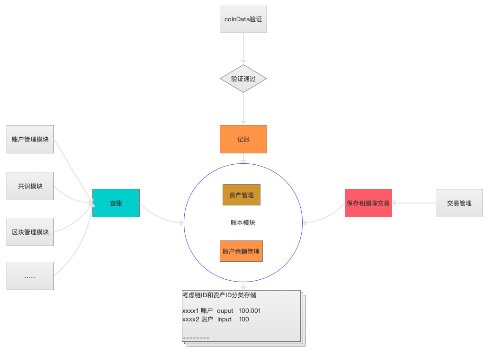

# Account Ledger module design document

[TOC]

## 1. Overall description

### 1.1 Module Overview

#### 1.1.1 Why do you have a "Ledger module"?

> The ledger module is the data hub of the blockchain. The balances and transactions of all accounts are saved in the ledger module.
  A network-wide account ledger is saved on each network node to ensure complete, open and transparent data, while ensuring that data cannot be tampered and traceable.

#### 1.1.2 What should be done in the Ledger Module?

> Provide data support for assembly transactions, mainly accounting and auditing, verify the legality of the transaction, such as: whether there is sufficient balance, whether to repeat payment (double flower)

#### 1.1.3 Positioning of the "Ledger module" in the system

> The ledger module is the data hub, which stores the result data of all existing transactions in the system. It does not depend on any business modules, and other modules depend on it as needed.
#### 1.1.4 Explanation of terms in "Ledger module"

- The random number of the transaction (nonce, a 32-bit hash value)
    - nonce: A scalar value equal to the number of transactions sent at this address, which will be included in every transaction initiated by the user.
    - Each transaction in the account needs to save the nonce (hash) of the previous transaction
    - Strictly speaking, a nonce is an attribute of the originating address (it only makes sense in the context of the sending address). However, the nonce is not explicitly stored in the blockchain as part of the account status.
    - The nonce value is also used to prevent incorrect calculation of account balances. For example, suppose an account has 10 NULS balances and signs two transactions, all of which cost 6 NULS with nonce 1 and nonce 2, respectively. Which of the two transactions is valid? In a blockchain distributed system, nodes may receive transactions out of order. Nonce forces transactions of any address to be processed in order, regardless of the interval, regardless of the order in which the nodes receive. This way, all nodes will calculate the same balance. The transaction paying 6 Ethereum will be successfully processed and the account balance will be reduced to 4 ether. Whenever it is received, all nodes believe that the transaction with nonce 2 is invalid. If a node receives a nonce 2 transaction first, it will hold it, but will not verify it until it receives and processes the nonce 1 transaction.
    - Use nonce to ensure that all nodes calculate the same balance and correctly sort the transactions, which is equivalent to the mechanism used in Bitcoin to prevent "double payment". However, because Ethereum tracks account balances and does not track individual coins separately (called UTXO in Bitcoin), "double payments" occur only when the account balance is incorrectly calculated. The nonce mechanism prevents this from happening.

### 1.2 Architecture
> The core of the Ledger is assets management and ledger management.



## 2. functional design

### 2.1 Functional Architecture


### 2.2 Module Service
#### 2.2.1 System Service of the Ledger Module


> The RPC interface call provided by the ledger module. For detailed interface, please refer to the interface design section.

#### 2.2.2 Modifying system operating parameters

> Only rely on the core system, the core system can start, stop, modify parameters, etc. of the event module system,

### 2.3 Module internal function
#### 2.3.1 Hot (online) transaction processing

> Module internal work mainly includes asset management, obtaining account address balance and nonce, and verifying transaction coinData.

- asset Management
    - Total assets of the account
    - Available assets
    - Freeze assets. For locked assets, separate record and locked asset information, including chain ID, asset ID, asset amount, lock time, lock height, etc.
    - In the asset unlocking process, when the user's locked asset time or height reaches the unlock condition, the account will unlock the asset information, accumulate the available balance, and delete the asset lock record of the local data.
    - Multi-asset situation, need to join chainId.
- Get account address balance and nonce
    - Get account address balance
    - Get the account address nonce (the nonce is a hash value, meaning that the nonce of the first transaction is 0. Each transaction in the account will contain the nonce value of the previous transaction)
- Verify the transaction
    - Double flower verification (nonce mechanism prevents double payment)
    - Transaction creator verification, verifying that the issuer of the transaction has sufficient balance to verify that the nonce of the transaction creator is legal
    - Continuous transaction verification
- Function Interface Management (rpc)
    - rpc interface for use by other modules

#### 2.3.2 Cold (offline) transaction processing
> A cold wallet is an unconnected wallet, also called an offline wallet. A hot wallet is a wallet that keeps online, that is, an online wallet. Cold wallets are not more secure than hot wallets.

> Since the cold wallet only signs the transaction information, the signed hex string is transmitted to the server through the hot wallet, and then the server performs unified transaction processing, so the client needs to perform the offline signature function.
> The offline transaction system maintains the storage information of the nonce. After using a nonce, the nonce is saved in the business system.

### 2.4 Ledger flowcharts
#### 2.4.1 Transfer Transaction Process

- User enters the address of the transfer and the transferred address and the transferred amount
- The system signs the transfer information by the private key of the transferred address (used to prove that the transaction was actually initiated by me)
- The system verifies the transaction information
    - Balance verification
    - Fee verification
    - nonce continuity verification
    - Signature and input account verification
- Put this transaction into the local TxPool (that is, the account unconfirmed trading pool)
- Broadcast transaction information to other nodes
- Packing blocks, verifying blocks
- Confirm transaction
    - Update the balance of all accounts related (transferred or transferred)
    - Update the nonce corresponding to the account asset

#### 2.4.2 Ordinary transaction process (reference example)


#### 2.4.3 Transaction verification process


## 3.Interface design

### 3.1 Module core interaction interface

#### 3.1.1  Get account balance

> cmd: getBalance

##### Parameter Description (request)

| Field        | Required or not |   type |                                 desc |
| ------------ | :-------------: | -----: | -----------------------------------: |
| chainId      |        Y        |    int | Chain id of the interface call chain |
| address      |        Y        | String |     The address to check the balance |
| assetChainId |        Y        |    int |             Asset-initiated chain ID |
| assetId      |        Y        |    int |                             Asset ID |

```json
{
   
    "chainId":5,
    "address":"0x407d73d8a49eeb85d32cf465507dd71d507100c1",
    "assetChainId":34,
    "assetId":5,
}
```

##### Return value description (response)

```json
{ 
       "available": "10000000000",
       "freeze": "200000000",
       "total": "12000000000"
}
```

> remarks: 1NULS=10^8Na

| Field     |    type    |                     DESC |
| --------- | :--------: | -----------------------: |
| available | BigInteger |        Available Balance |
| freeze    | BigInteger |                   freeze |
| total     | BigInteger | total = available+freeze |


#### 3.1.2 Get the current account nonce value

> cmd: getNonce
>
>

##### Parameter Description(request)

| Field        | Required or not |   type |                                 desc |
| ------------ | :-------------: | -----: | -----------------------------------: |
| chainId      |        Y        |    int | Chain id of the interface call chain |
| address      |        Y        | String |     The address to check the balance |
| assetChainId |        Y        | String |             Asset-initiated chain ID |
| assetId      |        Y        |    int |                             Asset ID |

```json
{
   
    "chainId":5,
    "address":"0x407d73d8a49eeb85d32cf465507dd71d507100c1",
    "assetChainId":34,
    "assetId":5,
}
```

##### Return value description(response)

```json
{
   "nonce":"xxxxxxxxxxx"，
   "nonceType":1
}
```


| Field     |  Type  |                                                         Desc |
| --------- | :----: | -----------------------------------------------------------: |
| nonce     | String |                                    Spending transaction hash |
| nonceType |  int   | 1The last transaction has been confirmed, 0 the transaction has not been confirmed |


#### 3.1.3 Get balance and nonce value

> cmd: getBalanceNonce

##### Parameter Description (request)

##### 

| Field        | Required or not |   type |                                 desc |
| ------------ | :-------------: | -----: | -----------------------------------: |
| chainId      |        Y        |    int | Chain id of the interface call chain |
| address      |        Y        | String |     The address to check the balance |
| assetChainId |        Y        | String |             Asset-initiated chain ID |
| assetId      |        Y        |    int |                             Asset ID |

```json
{
   
    "chainId":5,
    "address":"0x407d73d8a49eeb85d32cf465507dd71d507100c1",
    "assetChainId":"34",
    "assetId":"5",
}
```

##### Return value description：(response)

```json
{
    "available": "10000000000",
    "nonce": "xxxxx"
}
```

| Field     |    Type    |                                                         Desc |
| --------- | :--------: | -----------------------------------------------------------: |
| available | BigInteger |                                       User available balance |
| nonce     |   String   | A random value of the account that holds the hash of the user's last transaction. |
| nonceType |    int     | 1The last transaction has been confirmed, 0 the transaction has not been confirmed |

#### 3.1.4  Verify coinData

> cmd: validateCoinData

##### Parameter Description (request)

| Field           | Required or not |    Type |                                        desc |
| --------------- | :-------------: | ------: | ------------------------------------------: |
| chainId         |        Y        |     int |        Chain id of the interface call chain |
| txHex           |        Y        |  String |                      Transaction hex stream |
| isBatchValidate |        Y        | boolean | true  batch validate，false per tx validate |

```json
{
    "chainId": 458,
    "txHex": "xxxxxxxx",
    "isBatchValidate": "false"
}
```

##### Return value description：(response)

```json
{
    "validateCode":1,
    "validateDesc":"success" 
}
```

| Field        |  Type  |                                                         Desc |
| ------------ | :----: | -----------------------------------------------------------: |
| validateCode |  int   | 1 check pass, 2 orphan trade 3 double flower 4 other abnormalities |
| validateDesc | String |                                     Check return description |


#### 3.1.5  Batch verification notify

> cmd: bathValidateBegin

##### Parameter Description (request)

| Field   | Required or not | Type |     desc |
| ------- | :-------------: | ---: | -------: |
| chainId |        Y        |  int | chain Id |

```json
{
     "chainId": 21  
}
```

##### Return value description：(response)

```json
{
    "value":1
}
```

| Field | Type |     Desc     |
| ----- | :--: | :----------: |
| value | int  | 1成功，0失败 |

#### 

#### 3.1.6  Submit  transactions

> cmd: commitTx

##### Parameter Description (request)

| Field       | Required or not |    Type |                                  Desc |
| ----------- | :-------------: | ------: | ------------------------------------: |
| chainId     |        Y        |     int |  Chain id of the interface call chain |
| txHex       |        Y        |  String |                Transaction hex stream |
| isConfirmTx |        Y        | boolean | true: comfirm tx  false: unconfirm tx |

```json
{
     "chainId": 21,
     "txHex": "xxxxxxxx",
     "isConfirmTx": "true",
}
```

##### Return value description：(response)

```json
{
    "value":1
}
```

| Field | Type |               Desc |
| ----- | :--: | -----------------: |
| value | int  | 1Success，0 failed |


#### 3.1.7  Rollback transaction

> cmd: rollBackConfirmTx

##### Parameter Description (request)

| Field       | Required or not |    Type |                                 desc |
| ----------- | :-------------: | ------: | -----------------------------------: |
| chainId     |        Y        |     int | Chain id of the interface call chain |
| txHex       |        Y        |  String |               Transaction hex stream |
| isConfirmTx |        Y        | boolean | true: comfirm tx false: unconfirm tx |

```json
{
     "chainId": 21,
     "txHex": "xxxxxxxx"
}
```

##### Return value description：(response)

```json
{
    "value":1
}
```

| Field | Type |               Desc |
| ----- | :--: | -----------------: |
| value | int  | 1Success，0 failed |


### 3.2 Other interface

#### 3.2.1 Obtain asset information based on asset id

> cmd: getAsset

##### Parameter Description (request)

| Field        | Required or not |   type |                                 desc |
| ------------ | :-------------: | -----: | -----------------------------------: |
| chainId      |        Y        |    int | Chain id of the interface call chain |
| assetChainId |        Y        | String |             Asset-initiated chain ID |
| assetId      |        Y        |    int |                             Asset ID |

```json
{
  "chainId": 5,
  "assetChainId": 12,
  "assetId": 41
}
```

##### Return value description (response)

```json
{
    "chainId": 5,
    "assetChainId": 12,
    "assetId": 41,
    "balance" : {
      "available": "10000000000",
      "freeze": "200000000",
      "total": "12000000000"
    }
}
```

| Field             |    Type    |                                Desc |
| ----------------- | :--------: | ----------------------------------: |
| chainId           |    int     | The chain ID of the initiating call |
| assetChainId      |    int     |            Asset-initiated chain id |
| assetId           |    int     |                            Asset ID |
| balance.available | BigInteger |                   Available Balance |
| balance.freeze    | BigInteger |                      Freeze balance |
| balance.total     | BigInteger |            total = available+freeze |


## 4. Description of the event

> does not depend on any events

## 5. agreement

### 5.1 Network Communication Protocol

NA

### 5.2 Trading Agreement

## 6. Module Configuration
### 6.1 Configuration Instructions

### 6.2 Module Dependencies

- Kernel module
    - Module registration
    - Module logout
    - Module status escalation (heartbeat)
    - Service interface data acquisition and timing update

## 7. Java-specific design

> Core object class definition, storing data structures, ...

## 8. supplementary content

### References Literature
- [Proficient in Ethereum - Chapter 7 Transaction](https://github.com/inoutcode/ethereum_book/blob/master/%E7%AC%AC%E4%B8%83%E7%AB%A0.asciidoc)
```

```