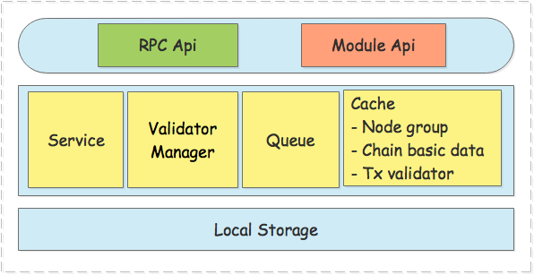

# 	Transaction Management Module Design

[TOC]

##  一、Overview

### 1.1 Transaction Module

#### 1.1.1 Why need "Transaction Management"

​	In the NULS 2.0 ecosystem, transactions are traded within the blockchain or between chains and chains. The nodes of each chain not only deal with transactions within the chain, but also deal with cross-chain transactions. So each node needs to process more and more transactions, and more complex, so we need a single but separate module to handle various transactions. And from the architectural design of NULS 2.0, we need a separate module to collecting transactions, verification, storage and forwarding of transactions. For all transactions, these functions are shared and unified,so we designed the transaction management as a separate module.

#### 1.1.2 "Transaction Management" What can do

The core work of transaction management has the following two points:

**一、Handling of ordinary transactions**

- Collecting transactions
- Local verification
- Extract packageable transactions
- Submit, rollback transaction
- Save unconfirmed, packageable, and confirmed transactions
- Provide data query for transactions

**二、Processing cross-chain transactions**

The transaction management module needs to perform cross-chain verification on cross-chain transactions, while cross-chain verification involves interaction between different nodes in different chains. There are mainly three types of cross-chain transactions that need to be processed.

1. Friend chain sends a transaction to NULS mainnet


The friend chain node initiates a new cross-chain transaction, which is confirmed inside the friend chain. When the friend chain reaches a certain number of confirmation blocks, the friend chain node will send the cross-chain transaction to the NULS mainnet nodes. **For example, the friend chain node A sends the cross-chain transaction to the NULS mainnet node S, and the node S sends the transaction to the node other than the node A in the friend chain for verification.** The NULS mainnet node S will receive the verification result of multiple friend chain nodes, and then calculate the node S's own cross-chain verification result, and then broadcast it to other nodes of the NULS mainnet, so each node of the NULS mainnet will The verification result of all other nodes is received, and finally the final verification result of the NULS mainnet is calculated.

- The transaction management module will receive new cross-chain transactions from the friend chain
- Verify cross-chain transactions with other nodes in the friend chain
- Count the verification results of each node


2. NULS mainnet sends a transaction to the friend chain


The NULS main-net node initiates a new cross-chain transaction. When a certain number of confirmation blocks is reached in the NULS mainnet, the transaction management module will take out the cross-chain transaction and send it to the target chain. For example, the NULS mainnet node S sends the transaction to the target chain node A, and the target chain node A will send the transaction to the NULS mainnet except the node S for verification. After the A node obtains the results of multiple NULS mainnet nodes, it calculates the final cross-chain verification result of the A node and broadcasts it to the target chain. The nodes of the target chain will receive the results of all other nodes, and then calculate the final verification result of the target chain.

- Send cross-chain transactions to the target chain
- Receiving the verification request of the target chain node, extracting the corresponding transaction and sending it back


3. Send a transaction between the friend chain and another friend chain

Since the transaction protocol between the friends chain may be incompatible, the transaction between them needs to be transferred by the NULS mainnet. The process of sending a friend chain to another friend chain is actually to complete the transaction of the friend chain to the NULS mainnet, and the NULS mainnet sends the transaction to the friend chain. The transaction management module plays the same role.


#### 1.1.3 Positioning

Transaction management controls the verification and circulation of all transactions throughout the system.

The following modules need to be used during normal operation.

- Kernel Module
- Network Module
- Chain Manager Module
- Ledger Module


### 1.2 Architecture diagram



The module is divided into three parts: interface, implementation layer, local storage

The implementation layer contains 4 parts: 

- Functional implementation logic of the interface
- Validator manager, call transaction validator as needed
- Queue for transaction reception, asynchronous verification processing, and push consensus
- Cache, maintain node group, chain data and other basic data

## 二、Feature Design

### 2.1 Functional Architecture Diagram


### 2.2 The Core Processes

#### 2.2.1 Transaction management caches data from other modules

The basic data of other modules needs to be obtained when the module starts

- Maintain the basic data of all chains in the chain management module

  The way to get the data is：

  1. After the chain management is started, the chain management module interface is called
  2. When a new chain completes registration, it is acquired periodically, event notification

- Maintain a collection correspondence between transaction and its validator, processor submission interface, and rollback interface with the transaction type as the key.

  The way to get the data is：

  After each module starts, it calls the transaction management module registration transaction interface to register itself.

#### 2.2.2 Collect new transactions

- Collect new transactions created by each module of this node

  Newly created transactions for each module (including cross-chain transactions), collected via the interface [newTx](#232-receive-local-new-transactions) provided by the transaction management module, When a new transaction is received, basic verification is performed first, then placed in the local transaction queue to be verified, waiting for the verification process.

  Note: There are also cross-chain transactions in the pending local trading queue, which is the local verification process for all transactions.

- Collect cross-chain transactions broadcast by other nodes

  Cross-chain transactions broadcast by other nodes (provided that the cross-chain transaction has been packaged to confirm a certain height in the chain in which the transaction was created), will be sent by means of network messages, first sent the transaction hash, transaction management module Once received, send a message requesting a full transaction before receiving a full cross-chain transaction. After receiving, the basic verification will also be carried out, and then placed in the cross-chain transaction queue to be verified, waiting for the verification process.

#### 2.2.3 Cross-chain transaction detailed process

For example: initiate a transaction atx from the a address of the A chain, and transfer aCoin to the B chain b address (A --> NULS mainnet --> B)

- The a address in the A chain is the address of the NULS system format, Start with the A chainId
- The b address in the B chain is the address of the NULS system format, Start with the B chainId
- When the asset is transferred to the b address, the b address is not allowed to initiate a transaction in the A chain.

That is: other chain addresses cannot initiate transactions in this chain.

**(1) Local process of cross-chain Transaction in the A chain**

1. The ledger module create the transfer transaction **atx** . If the cross-chain transaction is generated, the cross-chain module needs to be called to create the **atx_trans** of the NULS mainnet protocol and sign. 

   - According to the NULS mainnet protocol, the type, time, remark, and txData are extracted from the **atx** into the newly generated **atx_trans**.

   - Extract the CoinData data. If it is a UTXO model, calculate the actual payment amount based on the assets, input, output, and fee, and generate the NULS mainnet protocol (account balance model) "from"

     from_total = input_utxo_total - output_utxo(not change) - fee

     Recalculate the "to" of the NULS mainnet protocol

     to = output_utxo(not change)

     Note: Consider multi-address transfer. Calculate "from" to the owner of UTXO in input. If it is utxo of multiple addresses, calculate the multiple inputs and the output as the utxo owner.

     For example: input has 3 addresses of utxo, transferred to 2 different addresses (not change),and the "from" of the three account balance models is calculated

     from_1 = input_utxo1

     from_2 = input_utxo2

     from_3 = from_total  - input_utxo1 - input_utxo2

     to_1 = output(not change)_addr_1

     to_2 = output(not change)_addr_2

     The end result must be：from_total <= input_utxo_total、to_total = output_utxo(total except for change)。

   - If it is the account balance model, extract the corresponding "from" and "to", and generate CoinData of the NULS mainnet protocol.

   - The txData of the **atx_trans** transaction contains the hash of the **atx** transaction.

   - Finally, sign the **atx_trans** transaction and set up scriptSig

2. The **atx_trans** cross-chain transaction is sent to the transaction management module via the interface [newCrossTx](#2322-receive-cross-chain-transactions-for-local-new-primary-network-protocols) for broadcast. After the atx transfer transaction is generated in the A chain, it is sent to the transaction management module, and the basic format and legality of the transaction data are basically verified by the [newTx](#232-receive-local-new-transactions) interface, and then stored in the local transaction queue to be verified.

   + Receive transaction to deserialize data

   + Verify the basic format, legality, and integrity of Transaction data

   + Check the basic format, legality, and integrity of the chain and asset in coinData

3. The task that validates the transaction will take the transaction from the queue. First, the coinData is verified by the ledger module. After the verification, the corresponding transaction validator is found from the cache with the transaction type, and then the verification interface is called to verify. The verified transaction is broadcasted to other nodes in the chain through [newHash](#59-BroadcastTxMessage), and the transaction **atx_trans** of the mainnet protocol is broadcasted through [newCrossHash](#51-broadcastcrosstxhashmessage), and will be placed in the transaction management module to be packaged in the transaction memory pool, waiting for the consensus package.

   + Check out the pending transaction at regular intervals

   + CoinData is verified by calling the account module interface

   + Verify the transaction by calling the validator interface of the transaction

   + Verify that the passed transaction is placed in the transaction memory pool to be packaged

4. When the consensus needs to be packaged, the [tx_packableTxs](#233-get-packageable-transaction-list) interface is called to obtain the packageable transaction set according to the chain id, the specified end packing time, and the maximum capacity value of the transaction data. At this time, the transaction management module obtains the transaction from the transaction memory pool to be packaged, and then performs the transaction. verification.

   + First, take a transaction from the transaction memory pool to be packaged, and then perform a separate verification process (which is basically the same as step 2), and then put the corresponding collection by module.

   + This process is repeated until the specified end packing time or transaction maximum capacity value is reached.

5. According to the unified verifier of the ledger module, the CoinData of all transactions is verified at one time, the unverified transaction is obtained, and the unverified transaction is filtered out. and the transaction set of each module is verified according to each module unified transaction validator, and the unverified verification is obtained. The transaction then summarizes the results and then returns a packageable transaction set to the consensus module.

6. After the packaged block is verified, the block management module will call the [tx_commit](#234-transaction-commit) submission interface corresponding to the transaction, call the account module interface to update the balance and other book data, and finally call the save transaction interface [tx_save](#236-save-transaction), which means that the transaction is blocked. Chain confirmation.

   PS: If a transaction is a non-cross-chain transaction, the normal transaction process is completed by this step.

**(2) Cross-chain transactions enter the cross-chain process**

7. The transaction management module of the A-chain node will always scan the cross-chain transactions in the blockchain. When the **atx** transaction is confirmed by the blockchain to confirm n heights, the A-chain node transaction management module sends a message to send the **atx_trans** transaction to the connected NULS mainnet nodes

   ​	*Send cross-chain transaction process*：

   1. The A-chain node Anode1 broadcasts the hash of the **atx_trans** transaction to the connected NULS mainnet node through the message interface[newCrossHash](#51-broadcastcrosstxhashmessage).
   2. After the transaction management module obtains the transaction hash, it sends a message to acquire the complete cross-chain transaction to the A-chain node Anode1 through [askCrossTx]( #52-receivecrosstxmessage).
   3. The A-chain node Anode1 receives the request, and then sends the complete **atx_trans** cross-chain transaction to the main network node Mn through [newMnTx](#56-sendcrosstxmessage), and the main network node transaction management module parses and processes the **atx_trans** transaction.       

8. The NULS mainnet node transaction management module deserializes the atx_trans transaction and then performs a check.

   - Verify the basic format, legality, and integrity of the transaction data
   - Check the basic format, legality, and integrity of the chain and assets in coinData.

9. For cross-chain verification, the NULS primary network node Mn will send  **atx_hash** (transaction hash before protocol conversion) and **atx_trans_hash** (complete transaction hash after protocol conversion received by NULS mainnet)  through the message interface [verifyFc](#54-verifycrosswithfcmessage) to the node except the Anode1 in the node connected to the A chain to verify the **atx_trans** transaction.

   ​	*Verification logic of node Anode2 performing verification in A chain*：

   1. After receiving the message, the network module sends the message to the transaction management through the interface [verifyFc](#2315-verify-to-the-friend-chain-whether-the-transaction-is-confirmed). The transaction management module first queries the corresponding atx transaction from the database through atx_hash, and verifies that the block in which the transaction is located has been confirmed to be n block heights.
   2. The atx transaction is protocol converted to generate a new **Anode2_atx_trans**, and then the received **atx_trans_hash** is consistent with **Anode2_atx_trans_hash**.

   After the above two verifications, the node Anode2 will send the atx_trans_hash and the acknowledgement height to the NULS mainnet node Mn through [verifyResult](#55-verifycrossresultmessage).

   **Note** : When the NULS mainnet node sends the cross-chain verification message [verifyFc](#54-verifycrosswithfcmessage) to the A-chain node group through the network module, the transaction management will cache the node information of successful transmission and failure. If the number of nodes successfully sent is less than S (the connection between Mn and A-chain) 51% of the number of nodes is resent to the failed node until S is not less than 51%.

10. The NULS mainnet node Mn (consensus node) receives the message that the A chain node Anode2 verifies the transaction **atx_trans**, and sends it to the transaction management through the transaction management [verifyResult](#2317-receive-cross-chain-verification-results) interface. The transaction management will store the verification result with the successfully sent node.  After Mn receives all the verification results sent by the self, it calculates the percentage of the verification pass. If more than 51% of the nodes of all the link nodes pass the verification, the node Mn determines that the verification of the transaction atx_trans is passed, The node that failed to send is considered as failed to pass the verification. 

    Summary: The number of verification results received by the node Mn cannot be less than S. If it is less than S, the [verifyFc](#54-verifycrosswithfcmessage) is resent to the node that has not responded to the result. The ordinary node of the NULS mainnet queries any node of the A chain, and the mainnet consensus node queries all nodes of the A chain. The normal node is deemed to have passed the transaction and forwarded the transaction if it is confirmed by any three nodes.

11. The consensus node Mn signs the cross-chain transaction **atx_trans_hash** and broadcasts the hash and signature data to the NULS mainnet through the [crossNodeRs](#58-broadcastcrossnodersmessage).

12. The NULS mainnet consensus nodes receive messages sent by all other consensus nodes, and are collected and summarized by the transaction management module interface [crossNodeRs](#2318-receive-in-chain-node-verification-results-for-cross-chain-transactions). When the signer of a transaction exceeds 80% of the total number of consensus nodes, it is determined that the cross-chain transaction passed the verification of the mainnet, put in the transaction memory pool to be packaged, and wait for the package confirmation.

13. When the NULS mainnet node consensus module is to be packaged, the transaction module first takes the transaction (similar to step 4) and verifies the number of signatures of the cross-chain transaction atx_trans again (PS: Since the extracted transaction set contains transactions created by the NULS mainnet, such transactions do not have the step of verifying the number of signatures). CoinData is then verified by the ledger module, and if the transaction meets the requirements, the consensus module is sent into the block.


**(3) Cross-chain transactions into the process of the B chain**

14. The transaction management module of the NULS mainnet node will always scan the cross-chain transactions in the blockchain. When the **atx_trans** transaction is found to be n heights by the blockchain, the **atx_trans** transaction is sent out to the connected B-chain nodes

    ​	*Send a cross-chain transaction process (similar to step 7)*：

    1. The NULS primary network node Mn first broadcasts the hash of the atx_trans transaction to the connected B-chain node via the message [newCrossHash](#51-broadcastcrosstxhashmessage).
    2. The transaction hash obtained by the transaction management module is sent through the [askCrossTx](#52-receivecrosstxmessage) to obtain the message of the complete cross-chain transaction to the NULS mainnet node Mn.
    3. After receiving the message, the Mn network module sends the complete **atx_trans** cross-chain transaction to Bnode1 via [newMnTx](#56-sendcrosstxmessage). After receiving the message, Bnode1 needs to use **_the cross-chain module_** to process the **atx_trans** transaction.

15. The B-node node Bnode1 transaction management module sends the **atx_trans** transaction hash (which has been obtained in step 14-2) through [verifyMn](#57-verifycrosswithmainmessage) to the node other than Mn in the node connected to the NULS mainnet to verify the **atx_trans** transaction.

    ​	*Verification logic of node Mn2 performing verification in NULS mainnet*：

    1. After receiving the message, the network module sends the message to the transaction management through the interface [verifyMn](#2316-verify-to-the-mainnet-whether-the-transaction-is-confirmed). The transaction management module first queries the corresponding **atx** transaction from the database through **atx_hash**, and verifies that the block in which the transaction is located has been confirmed to be n block heights.

    After verification, node Mn2 will send the atx_trans_hash and the acknowledgement height to the B-chain node Bnode1 via [verifyResult](#55-verifycrossresultmessage).

16. When the B-chain node sends the cross-chain verification message [verifyMn](#57-verifycrosswithmainmessage) to the NULS mainnet node group through the network module, the transaction management will cache the node information of the successful transmission and the failure. If the number of successfully sent nodes is smaller than S (S is 51% of the number of nodes connected to the NULS mainnet by Node Bnode1), the information is resent to the failed node. Until S is not less than 51%.
17. (Similar to step 10) The B-chain node Bnode1 receives the message that the mainnet node Mn verifies the transaction **atx_trans**, and sends it to the transaction management through the transaction management [verifyResult](#2317-receive-cross-chain-verification-results) interface, Transaction management caches the verification results against the successful nodes that were sent. After receiving all the verification results sent by the self, Bnode1 calculates the percentage of the verification pass. If more than 51% of the nodes pass the verification, the node Bnode1 determines that the verification of the transaction atx_trans is passed (The node that failed to send is considered as not passing).
18. After the verification is passed, the transaction management module calls **the cross-chain module** to convert the **atx_trans** transaction through the protocol to generate the B-chain protocol transaction **btx** and broadcast it to the B-chain network through the [crossNodeRs](#58-broadcastcrossnodersmessage). If the Bnode1 node is the B-chain nearest x-block outperger (POW needs Adaptation), the transaction needs to be signed and broadcast to the B-chain network via the [crossNodeRs](#58-broadcastcrossnodersmessage).
19. The B-chain node receives the messages sent by other nodes, collects and summarizes the transaction management module interface [crossNodeRs](#2318-receive-in-chain-node-verification-results-for-cross-chain-transactions), and counts the signature of the transaction. When the signer reaches 80% of the latest 20 blockers, the transaction is verified and placed. Enter the packaged transaction memory pool and wait for the package confirmation (The packager also confirms the transaction and the packaged transaction contains all signatures).
20. (Similar to step 13)When the B-chain node consensus module is packaged, the transaction module first takes out the transaction consistently, verifies the signature number of the transaction btx again, and then verifies the CoinData through the account book module. If the requirements are met, the transaction transmission consensus module is packaged into the block.
21. When the new block verification is finalized, the entire cross-chain transaction process is completed.

### 2.3 Module Service

#### 2.3.1 Registration transaction

- Function description

  The transaction type of each module, the corresponding transaction validator and the processor interface are cached.

- Process description

  When the NULS mainnet is started, each module needs to register its transaction type, validator and other information with the transaction management module. The transaction management module will cache each transaction and the corresponding validator and processor interface. When a new transaction needs to be verified by the validator, the transaction management module will take out the corresponding validator interface name and call the validator interface for verification.

- Interface definition

  - method: `tx_register`

    Interface description：The registration transaction needs to pass the transaction type, the verifier name, and the processor name to return whether the registration is successful.

  - Request

    ```json
    {
        "cmd": "tx_register",
        "minVersion": "1.0",
        "params":[
            "moduleCode", 
            "moduleValidateCmd",
            [
                [
                    "txType",
                    "validateCmd",
                    "commitCmd",
                    "rollbackCmd",
                    "systemTx",
                    "unlockTx",
                    "verifySignature"
                ],
                 [
                    "txType",
                    "validateCmd",
                    "commitCmd",
                    "rollbackCmd",
                    "systemTx",
                    "unlockTx",
                    "verifySignature"
                ]
             ]
        ]
    }
    ```

  - Request parameter

    | index | type   | description                                      |
    | ----- | ------ | ------------------------------------------------ |
    | 0     | String | Module code                                      |
    | 1     | String | Module unified verifier interface name           |
    | 2     | Array  | Module transaction registration information list |

  - Object of the module transaction registration information list

    | index | type   | description                                   |
    | ----- | ------ | --------------------------------------------- |
    | 0     | int    | Transaction Type                              |
    | 1     | String | Single transaction validator interface name   |
    | 2     | String | Transaction processor submit interface name   |
    | 3     | String | Transaction processor rollback interface name |

  - Response

    Success

    ```json
    {
      "code":0,
      "version": 1.0,
      "msg": "Success",
      "result": {
        	"value":true	
      	}
    }
    ```

  - Return

    | parameter | type    | description |
    | --------- | ------- | ----------- |
    | value     | boolean | Success     |

##### 2.3.1.1 Transaction validator, processor interface specification

- **Module unified transaction verifier interface specification**

  - Request

    ```json
    {
        "cmd": "",
        "minVersion": "1.0",
        "params":["chianId", ["txHex","txHex","txHex"]]
    }
    ```

  - Request parameter

    | index | type    | description                          |
    | ----- | ------- | ------------------------------------ |
    | 0     | chianId | Chian Id                             |
    | 1     | array   | Transaction serialization data array |

  - Response

    - result：Verify the failed transaction list

    ```json
    {
    	"version": 1.0,
    	"code":0,
        "result":{
            "list":["txHex", "txHex", "txHex"]
    	}
    }
    ```

    | parameter | type      | description                                            |
    | --------- | --------- | ------------------------------------------------------ |
    | list      | jsonArray | Verify the failed transaction serialization data array |

- **Transaction validator interface uniform specification**

  - Request

    ```json
    {
        "cmd": "",
        "minVersion": "1.0",
        "params":["chainId","txHex"]
    }
    ```

  - Request parameter

    | index | type   | description                    |
    | ----- | ------ | ------------------------------ |
    | 0     | int    | chainId                        |
    | 1     | String | Transaction serialization data |

  -  Response

     -  result：Verify the failed transaction list

     ```json
     {
     	"version": 1.0,
     	"code":0,
         "result":{
             "value":true
     	}
     }
     ```

     | parameter | type    | description                     |
     | --------- | ------- | ------------------------------- |
     | value     | boolean | Verification passed return true |

- **Transaction processor commit interface uniform specification**

  - Request

    ```json
    {
        "cmd": "",
        "minVersion": "1.0",
        "params":["chainId","txHex","secondaryDataHex"]
    }
    ```

  - Request parameter

    | index | type   | description                                        |
    | ----- | ------ | -------------------------------------------------- |
    | 0     | int    | Chain Id                                           |
    | 1     | String | Transaction serialization data                     |
    | 2     | String | Block header hash, height, time serialization data |

  - Response 

    - result：Commit successfully returns true, failure returns error message

    ```
    {
    	"version": 1.0,
    	"code":0,
        "result":{
            "value":true
    	}
    }
    ```

    | parameter | type    | description                      |
    | --------- | ------- | -------------------------------- |
    | value     | boolean | Commit successfully returns true |

- **Transaction processor rollback interface uniform specification**

  - Request

    ```json
    {
        "cmd": "",
        "minVersion": "1.0",
        "params":["txHex","secondaryDataHex"]
    }
    ```

  - Request parameter

    | index | type   | description                                        |
    | ----- | ------ | -------------------------------------------------- |
    | 0     | int    | Chain Id                                           |
    | 1     | String | Transaction serialization data                     |
    | 2     | String | Block header hash, height, time serialization data |

  - Response

    - result：Rollback successfully returns true, failure returns error message

    ```json
    {
    	"version": 1.0,
    	"code":0,
        "result":{
            "value":true
    	}
    }
    ```

    | parameter | type    | description                        |
    | --------- | ------- | ---------------------------------- |
    | value     | boolean | Rollback successfully returns true |


#### 2.3.2 Receive local new transactions

- Function description：

  Collect newly created transactions from other modules of this node

- Process description

  When other modules in a node have new transactions, you need to call this interface for unified collection and processing. The transaction management module will place the new transaction in the unconfirmed queue and wait for the transaction thread to process it.

  1. Basic verification of transactions, removal of duplicate transactions, illegally discarding

  2. Put in pending verification local transation queue

- Interface definition

  - method: `newTx`

    Interface description：Receive a new transaction serialization data

  - Requset

    ```json
    {
        "cmd": "newTx",
        "minVersion": "1.0",
        "params": ["chainId", "txHex"]
    }
    ```

  - Requset parameter

    | index | type   | description                    |
    | ----- | ------ | ------------------------------ |
    | 0     | int    | Chain Id                       |
    | 1     | String | Transaction serialization data |

  - Response

    Success

    ```json
    {
      "code":0,
      "version": 1.0,
      "msg": "Success",
      "result": {
        	"value":true
      	}
    }
    ```

  - Result

    | parameter | type    | description |
    | --------- | ------- | ----------- |
    | value     | boolean | Success     |


#### 2.3.3 Get packageable transaction list

- Function description：

  Extract a packaged transaction list based on the packaging end time and transactions total size

- Process description

  When the node needs to be packaged, the packaged transaction is obtained according to the chain id, the specified end packing time and transactions total size. The transaction management module will take out the corresponding transaction set from the transaction memory pool to be packaged, and then verify the coinData of all transactions in the collection from the account module at one time, filter out the unverified transaction, obtain the verified collection, and then unify through each module. The transaction validator verifies the transaction set of the respective module and then summarizes the results back to the packageable transaction list.

- Interface definition

  - method: `tx_packableTxs`

    Interface description：Return a packaged transaction list

  - Requset

    ```json
    {
        "cmd": "tx_packableTxs",
        "minVersion": "1.0",
        "params": ["chainId", "endtimestamp", "maxTxDataSize"]
    }
    ```

  - Requset parameter

    | index | type | description             |
    | ----- | ---- | ----------------------- |
    | 0     | int  | Chain Id                |
    | 1     | long | End packaging timestamp |
    | 2     | int  | Transactions total size |

  - Response

    Success

    ```json
    {
      "code":0,
      "version": 1.0,
      "msg": "Success",
      "result": {
        	"list":[]
      	}
    }
    ```

  - Result

    | parameter | type        | description      |
    | --------- | ----------- | ---------------- |
    | list      | Transaction | Transaction list |


#### 2.3.4 Transaction commit

- Function description：

  Execute the transaction processor commit

- Process description

  The transaction commit interface is invoked when the transaction is packaged into a block and the block validation passes

- Interface definition

  - method: `tx_commit`

    Interface description：Call the transaction handler commit interface

  - Requset

    ```json
    {
        "cmd": "tx_commit",
        "minVersion": "1.0",
        "params": ["chainId", "txHex", "secondaryData"]
    }
    ```

  - Requset parameter

    | index | type   | description                                        |
    | ----- | ------ | -------------------------------------------------- |
    | 0     | int    | Chain Id                                           |
    | 1     | String | Transaction serialization data                     |
    | 2     | String | Block header hash, height, time serialization data |

  - Response

    Success

    ```json
    {
      "code":0,
      "version": 1.0,
      "msg": "Success",
      "result": {
        	"value":true
      	}
    }
    ```

  - Result

    | parameter | type    | description |
    | --------- | ------- | ----------- |
    | value     | boolean | Success     |


#### 2.3.5 Transaction rollback

- Function description：

  Execute transaction processor rollback

- Process description

  The transaction rollback interface is invoked when the transaction is packaged into a block and the block verification fails, or the block is rolled back and the transaction is not a cross-chain transaction.

- Interface definition

  - method: `tx_rollback`

    Interface description：Call the transaction handler rollback interface

  - Requset

    ```json
    {
        "cmd": "tx_rollback",
        "minVersion": "1.0",
        "params": ["chainId", "txHex", "secondaryData"]
    }
    ```

  - Requset parameter

    | index | type   | description                                        |
    | ----- | ------ | -------------------------------------------------- |
    | 0     | int    | Chain Id                                           |
    | 1     | String | Transaction serialization data array               |
    | 2     | String | Block header hash, height, time serialization data |

  - Response

    Success

    ```json
    {
      "code":0,
      "version": 1.0,
      "msg": "Success",
      "result": {
        	"value":true
      	}
    }
    ```

  - Result

    | parameter | type    | description |
    | --------- | ------- | ----------- |
    | value     | boolean | Success     |

#### 2.3.6 Save transaction

- Function description：

  Save the transaction in the new block that was verified to the database

- Process description

  When the block management saves the block, the transaction is sent to the transaction management module for saving.

- Interface definition

  - method: `tx_save`

  - Requset

    ```json
    {
        "cmd": "tx_save",
        "minVersion": "1.0",
        "params": ["chainId", ["txHex", "txHex"]]
    }
    ```

  - Requset parameter

    | index | type  | description                          |
    | ----- | ----- | ------------------------------------ |
    | 0     | int   | Chain Id                             |
    | 1     | array | Transaction serialization data array |

  - Response

    Success

    ```json
    {
      "code":0,
      "version": 1.0,
      "msg": "Success",
      "result": {
        	"value":true
      	}
    }
    ```

  - Result

    | parameter | type    | description |
    | --------- | ------- | ----------- |
    | value     | boolean | Success     |

#### 2.3.7 Get transaction

- Function description：

  Get the transaction that have been packaged into the block from the database

- Interface definition

  - method: `tx_getTx`

    Interface description：return transaction serialization data 

  - Requset

    ```json
    {
        "cmd": "tx_getTx",
        "minVersion": "1.0",
        "params": ["chainId", "txHash"]
    }
    ```

  - Requset parameter

    | index | type   | description      |
    | ----- | ------ | ---------------- |
    | 0     | int    | Chain Id         |
    | 1     | String | Transaction hash |

  - Response

    Success

    ```json
    {
      "code":0,
      "version": 1.0,
      "msg": "Success",
      "result": {
        	"tx":"txHex"
      	}
    }
    ```

  - Result

    | parameter | type   | description                    |
    | --------- | ------ | ------------------------------ |
    | tx        | String | Transaction serialization data |


#### 2.3.8 Delete saved transaction

- Function description：

  Delete transactions that have been packaged into blocks from the database, block rollback, etc.

- Interface definition

  - method:` tx_delete`

    Interface description：return execution result

  - Requset

    ```json
    {
        "cmd": "tx_delete",
        "minVersion": "1.0",
        "params": ["chainId", "txHash"]
    }
    ```

  - Requset parameter

    | index | type   | description      |
    | ----- | ------ | ---------------- |
    | 0     | int    | Chain Id         |
    | 1     | String | Transaction hash |

  - Response

    Success

    ```json
    {
      "code":0,
      "version": 1.0,
      "msg": "Success",
      "result": {
        	"value":true
      	}
    }
    ```

  - Result

    | parameter | type    | description |
    | --------- | ------- | ----------- |
    | value     | boolean | Success     |


#### 2.3.9 Verify transaction

- Function description：

  Local validation of transactions (including cross-chain transactions), including calling the validator, verifying the coinData. Cross-chain verification of cross-chain transactions is not included.

- Interface definition

  - method:` tx_verify`

    Interface description：return execution result

  - Requset

    ```json
    {
        "cmd": "tx_verify",
        "minVersion": "1.0",
        "params": ["chainId", "txHex"]
    }
    ```

  - Requset parameter

    | index | type   | description                    |
    | ----- | ------ | ------------------------------ |
    | 0     | int    | Chain Id                       |
    | 1     | String | Transaction serialization data |

  - Response

    Success

    ```json
    {
      "code":0,
      "version": 1.0,
      "msg": "Success",
      "result": {
        	"value":true
      	}
    }
    ```

  - Result

    | parameter | type    | description |
    | --------- | ------- | ----------- |
    | value     | boolean | Success     |


#### 2.3.10 Receive new transaction hash

- Function description：

  Receive a message of a new transaction hash broadcast by other nodes in the chain

- Interface definition

  - method:`newHash` Receive new transaction hash message

    Interface description：Receive transaction hash serialization data

  - Requset

    ```json
    {
        "cmd": "newHash",
        "minVersion": "1.0",
        "params": ["chainId", "txHashHex"]
    }
    ```

  - Requset parameter

    | index | type   | description               |
    | ----- | ------ | ------------------------- |
    | 0     | int    | Chain Id                  |
    | 1     | String | Transaction hash hex data |

  - Response

    Success

    ```json
    {
      "code":0,
      "version": 1.0,
      "msg": "Success",
      "result": {
        	"value":true
      	}
    }
    ```

  - Result

    | parameter | type    | description |
    | --------- | ------- | ----------- |
    | value     | boolean | Success     |


####  2.3.11 Receive new cross-chain transaction hash

- Function description：

  Receive messages for new cross-chain transaction hashes sent by other chains

- Process description

  When a cross-chain transaction has been confirmed to a certain height within the chain, it will be sent by the transaction module to the target chain (NULS mainnet or the friend chain), and the target chain will receive the transaction for verification. The hash of the transaction is sent first before the transaction is sent, and the interface will receive the hash.

- Interface definition

  - method: `newCrossHash` Receive new cross transaction hash

    Interface description：Receive a new transaction hash hex

  - Requset

    ```json
    {
        "cmd": "newCrossHash", 
        "minVersion": "1.0",
        "params": ["chainId", "nodeId", "txHashhex"]
    }
    ```

  - Requset parameter

    | index | type   | description               |
    | ----- | ------ | ------------------------- |
    | 0     | int    | Chain Id                  |
    | 1     | int    | Node Id                   |
    | 2     | String | Transaction hash hex data |

  - Response

    Success

    ```json
    {
      "code":0,
      "version": 1.0,
      "msg": "Success",
      "result": {
          	"value":true
      	}
    }
    ```

  - Result

    | parameter | type    | description |
    | --------- | ------- | ----------- |
    | value     | boolean | Success     |


#### ~~2.3.12 Receive a new cross-chain transaction for the friend chain~~ （Deprecated）

- Function description：

  Processing message for new cross-chain transactions sent from other chains to the NULS mainnet

- Process description

  When the NULS mainnet node receives the cross-chain transaction hash of other chain broadcasts, it will request the complete transaction from the sent hash node. At this time, the node will send the complete transaction and the original hash to the NULS mainnet node.

- Interface definition

  - method: `newFcTx` Receive new cross transaction

    Interface description：Receive a new full cross-chain transaction, and the original hash of the transaction (The hash value of the transaction before the conversion of the friend chain agreement).

  - Requset

    ```json
    {
        "cmd": "newFcTx",
        "minVersion": "1.0",
        "params": ["chainId", "nodeId", "txHex"]
    }
    ```

  - Requset parameter

    | index | type   | description                                                  |
    | ----- | ------ | ------------------------------------------------------------ |
    | 0     | Int    | Chain Id                                                     |
    | 1     | int    | Node Id                                                      |
    | 2     | String | Original transaction hash，and transaction serialization data of NULS mainnet protocol after protocol conversion |

  - Response

    Success

    ```json
    {
      "code":0,
      "version": 1.0,
      "msg": "Success",
      "result": {
          "value":true
      	}
    }
    ```

  - Result

    | parameter | type    | description |
    | --------- | ------- | ----------- |
    | value     | boolean | Success     |


#### 2.3.13 Receive a new complete cross-chain transaction on the mainnet

- Function description：

  Processing message for new cross-chain transactions sent from the NULS mainnet to the friend chain

- Process description

  When the friend chain node receives the cross-chain transaction hash broadcast by the NULS mainnet, it will request a complete transaction from the sent hash node, and the node will send the complete transaction partner chain node.

- Interface definition

  - method: `newMnTx` Receive new mainnet cross transaction

    Interface description：Transaction serialization data hex

  - Requset

    ```json
    {
        "cmd": "newMnTx",
        "minVersion": "1.0",
        "params": ["chainId", "nodeId", "txHex"]
    }
    ```

  - Requset parameter

    | index | type   | description                    |
    | ----- | ------ | ------------------------------ |
    | 0     | Int    | Chain Id                       |
    | 1     | int    | Node Id                        |
    | 2     | String | Transaction serialization data |

  - Response

    Success

    ```json
    {
      "code":0,
      "version": 1.0,
      "msg": "Success",
      "result": {
          "value":true
      	}
    }
    ```

  - Result

    | parameter | type    | description |
    | --------- | ------- | ----------- |
    | value     | boolean | Success     |


#### 2.3.14 Ask for a complete cross-chain transaction

- Function description：

  Take a complete cross-chain transaction with a certain height confirmed according to the transaction hash, and then send it back by message.

- Process description

  NULS mainnet has new cross-chain transactions sent to the target chain (or the ordinary chain has a cross-chain transaction sent to the NULS mainnet), the hash is sent to the target chain first, and the target chain node requests a complete transaction from the NULS mainnet according to the hash, and the interface processes the message.

- Interface definition

  - method: `askCrossTx` send cross transaction

    Interface description：Receiving the transaction hash sent by the network node

  - Requset

    ```json
    {
        "cmd": "askCrossTx",
        "minVersion": "1.0",
        "params": ["chainId", "nodeId", "txHash"]
    }
    ```

  - Requset parameter

    | index | type   | description               |
    | ----- | ------ | ------------------------- |
    | 0     | Int    | Chain Id                  |
    | 1     | int    | Node Id                   |
    | 2     | String | Transaction hash hex data |

  - Response

    Success

    ```json
    {
      "code":0,
      "version": 1.0,
      "msg": "Success",
      "result": {
          "value":true
      	}
    }
    ```

  - Result

    | parameter | type    | description |
    | --------- | ------- | ----------- |
    | value     | boolean | Success     |


#### 2.3.15 Verify to the friend chain whether the transaction is confirmed

- Function description：

  The friend chain node receives the message of the cross-chain verification request of the NULS mainnet node

- Process description

  The NULS mainnet node newly receives the cross-chain transaction, and will verify the transaction to the friend chain (nodes other than the sender) that sent the transaction, and the message to be sent will be processed by the interface.

- Interface definition

  - method: `verifyFc` 

  - Interface description：Receive cross-chain transaction hash and original hash of the transaction, return confirmation result through network message

  - Requset

    ```json
    {
        "cmd": "verifyFc",
        "minVersion": "1.0",
        "params": ["chainId", "nodeId", "txHashHex"]
    }
    ```

  - Requset parameter

    | index | type   | description                                                  |
    | ----- | ------ | ------------------------------------------------------------ |
    | 0     | Int    | Chain Id                                                     |
    | 1     | int    | Node Id                                                      |
    | 2     | String | [txOriginalHash] Raw transaction hash (before protocol conversion) , [txCrossHash] Cross-chain transaction hash (after protocol conversion) |

  - Response

    Success

    ```json
    {
      "code":0,
      "version": 1.0,
      "msg": "Success",
      "result": {
          "value":true
      	}
    }
    ```

  - Result

    | parameter | type    | description |
    | --------- | ------- | ----------- |
    | value     | boolean | Success     |


#### 2.3.16 Verify to the mainnet whether the transaction is confirmed

- Function description：

  The NULS mainnet node receives the message of the cross-chain verification request of the friend chain node

- Process description

  The friend chain node newly receives the cross-chain transaction, and will verify the transaction to the NULS mainnet node (node other than the sender) that sent the transaction, and the message to be sent during the verification is processed by the interface.

- Interface definition

  - method: `verifyMn` 

  - Interface description：receive cross-chain transaction hash, return confirmation result via network message

  - Requset

    ```json
    {
        "cmd": "verifyMn",
        "minVersion": "1.0",
        "params": ["chainId", "nodeId", "txHash"]
    }
    ```

  - Requset parameter

    | index | type   | description               |
    | ----- | ------ | ------------------------- |
    | 0     | Int    | Chain Id                  |
    | 1     | int    | Node Id                   |
    | 2     | String | Transaction hash hex data |

  - Response

    Success

    ```json
    {
      "code":0,
      "version": 1.0,
      "msg": "Success",
      "result": {
          "value":true
      	}
    }
    ```

  - Result

    | parameter | type    | description |
    | --------- | ------- | ----------- |
    | value     | boolean | Success     |


#### 2.3.17 Receive cross-chain verification results

- Function description：

  Process messages that receive cross - chain transaction validation result

- Process description

  The NULS mainnet verifies cross - chain transactions to other chain nodes, which send verification results

- Interface definition

  - method: `verifyResult` cross result

  - Interface description：receive cross-chain transaction verification results

  - Requset

    ```json
    {
        "cmd": "verifyResult",
        "minVersion": "1.0",
        "params": ["chainId", "nodeId", "rsHex"]
    }
    ```

  - Requset parameter

    | index | type   | description                                                 |
    | ----- | ------ | ----------------------------------------------------------- |
    | 0     | Int    | Chain Id                                                    |
    | 1     | int    | Node Id                                                     |
    | 2     | String | Transaction hash and confirmation of highly serialized data |

  - Response

    Success

    ```json
    {
      "code":0,
      "version": 1.0,
      "msg": "Success",
      "result": {
          "value":true
      	}
    }
    ```

  - Result

    | parameter | type    | description |
    | --------- | ------- | ----------- |
    | value     | boolean | Success     |

#### 2.3.18 Receive in-chain node verification results for cross-chain transactions

- Function description：

  Receive in-chain node verification results for cross-chain transactions and statistics.

- Process description

  The node performs cross-chain verification on a cross-chain transaction, and obtains the cross-chain verification result of the node for the transaction. The node broadcasts the result to other nodes of the chain, and the other node will invoke the interface after receiving the message.

- Interface definition

  - method: `crossNodeRs` cross tx node result

  - Interface description：receive sender's signature, cross-chain transaction hash, node verification result

  - Requset

    ```json
    {
        "cmd": "crossNodeRs",
        "minVersion": "1.0",
        "params": ["chainId", "nodeId", "nodeRsHex"]
    }
    ```

  - Requset parameter

    | index | type   | description                                                  |
    | ----- | ------ | ------------------------------------------------------------ |
    | 0     | Int    | Chain Id                                                     |
    | 1     | int    | Node Id                                                      |
    | 2     | String | Sender's signature, cross-chain transaction hash, node verification result Serialization data |

  - Response

    Success

    ```json
    {
      "code":0,
      "version": 1.0,
      "msg": "Success",
      "result": {
          "value":true
      	}
    }
    ```

  - Result

    | parameter | type    | description |
    | --------- | ------- | ----------- |
    | value     | boolean | Success     |


####  2.3.19 View transaction pool information

- Function description：

  View data in the transaction memory pool

- Interface definition

  - method: `tx_getTxsInfo` 

  - Interface description：Statistics transaction memory pool data

  - Requset

    ```json
    {
        "cmd": "tx_getTxsInfo",
        "minVersion": "1.0",
        "params": ["chainId"]
    }
    ```

  - Requset parameter

    | index | type | description |
    | ----- | ---- | ----------- |
    | 0     | Int  | Chain Id    |

  - Response

    Success

    ```json
    {
      "code":0,
      "version": 1.0,
      "msg": "Success",
      "result": {
          "localTxCount":111,	
          "crossChainTxCount":111,
          "pushingCount":111
      }
    }
    ```

  - Result

    | parameter         | type | description                           |
    | ----------------- | ---- | ------------------------------------- |
    | localTxCount      | int  | Number of local transactions          |
    | crossChainTxCount | int  | Number of cross-chain transactions    |
    | pushingCount      | int  | Number of transactions to be packaged |


#### 2.3.20 Get transaction registration information

- Function description：

  Returns the relationship list of the transaction and its corresponding commit processor and rollback processor

- Interface definition

  - method: `tx_getTxProcessors` 

  - Interface description：return `Map<List<String>>` jsonObject

  - Requset

    ```
    {
        "cmd": "tx_getTxProcessors",
        "minVersion": "1.0",
        "params": ["txType"]
    }
    ```

  - Requset parameter

    | index | type | description                                         |
    | ----- | ---- | --------------------------------------------------- |
    | 0     | int  | Transaction type (Fill in NULL to return all types) |

  - Response

    Success

    ```
    {
      "code":0,
      "version": 1.0,
      "msg": "Success",
      "result": {
          "2":["commitCmd","rollbackCmd"],
          "3":["commitCmd","rollbackCmd"],
          "4":["commitCmd","rollbackCmd"]
      }
    }
    ```

  - Result

    | parameter | type   | description             |
    | --------- | ------ | ----------------------- |
    | 0         | String | Commit interface name   |
    | 1         | String | Rollback interface name |


#### 2.3.21 Query transaction records

- Function description：

  Query the transaction list based on conditions such as account, chain, asset, and paging information.

- Interface definition

  - method: `tx_getTxs` 

  - Interface description：return `Page<Transaction>` 

  - Requset

    ```
    {
        "cmd": "tx_getTxs",
        "minVersion": "1.0",
        "params": [
        	"ChainId",
        	"assetId",
        	"type",
        	"Nse7PfBkqtByKJ6AuxY151n1CM2xxxx",
        	"pageSize",
        	"pageNumber"
        ]
    }
    ```

  - Requset parameter

    | index | type   | description                                         |
    | ----- | ------ | --------------------------------------------------- |
    | 0     | int    | Chain Id                                            |
    | 1     | int    | AssetId                                             |
    | 2     | int    | Transaction type (Fill in NULL to return all types) |
    | 3     | String | Address                                             |
    | 4     | int    | Page size                                           |
    | 5     | int    | Page number                                         |

  - Response

    Success

    ```
    {
      "code":0,
      "version": 1.0,
      "msg": "Success",
      "result": {
         "pageNumber": 1,
         "pageSize": 10,
         "total": 31,
         "pages": 4,
         "list": []
      }
    }
    ```

  - Result

    | parameter  | type              | description             |
    | ---------- | ----------------- | ----------------------- |
    | pageNumber | int               | Page number             |
    | pageSize   | int               | Page size               |
    | total      | int               | Total number of records |
    | pages      | int               | Total page number       |
    | list       | Page<Transaction> | Records                 |


#### 2.3.22 Receive cross-chain transactions for local new primary network protocols

- Function description：

  Collect a complete transaction for the new NULS mainnet protocol for broadcast

- Interface definition

  - method: `newCrossTx` 

  - Requset

    ```
    {
        "cmd": "newCrossTx",
        "minVersion": "1.0",
        "params": ["chainId", "txHex"]
    }
    ```

  - Requset parameter

    | index | type   | description                    |
    | ----- | ------ | ------------------------------ |
    | 0     | int    | Chain Id                       |
    | 1     | String | Transaction serialization data |

  - Response

    Success

    ```
    {
      "code":0,
      "version": 1.0,
      "msg": "Success",
      "result": {
      	value:true
      }
    }
    ```

  - Result

    | parameter | type    | description |
    | --------- | ------- | ----------- |
    | value     | boolean | Success     |


#### 2.3.23 Run chain

- Function description：

  Run a new subchain locally 

- Interface definition

  - method: `tx_runChain` 

  - Interface description：run a new subchain locally 

  - Requset

    ```
    {
        "cmd": "tx_runChain",
        "minVersion": "1.0",
        "params": ["chainId"]
    }
    ```

  - Requset parameter

    | index | type | description |
    | ----- | ---- | ----------- |
    | 0     | Int  | chainId     |

  - Response

    Success

    ```
    {
      "code":0,
      "version": 1.0,
      "msg": "Success",
      "result": {
      	"value":true
      }
    }
    ```

  - Result

    | parameter | type    | description |
    | --------- | ------- | ----------- |
    | value     | boolean | Success     |

#### 2.3.24 Stop chain

- Function description：

  Stop a running subchain locally 

- Interface definition

  - method: `tx_stopChain` 

  - Interface description：Stop a running subchain locally 

  - Requset

    ```
    {
        "cmd": "tx_stopChain",
        "minVersion": "1.0",
        "params": ["chainId"]
    }
    ```

  - Requset parameter

    | index | type | description |
    | ----- | ---- | ----------- |
    | 0     | int  | Chain Id    |

  - Response

    Success

    ```
    {
      "code":0,
      "version": 1.0,
      "msg": "Success",
      "result": {
          "value":true
      }
    }
    ```

  - Result

    | parameter | type    | description |
    | --------- | ------- | ----------- |
    | value     | boolean | Success     |

## 四、Event description

### 4.1 Published event

​	nothing

### 4.2 Subscribed event

* Chain registration event

  Chain information interface for sending verification tx coinData

* Chain logout event

  Confirmation for terminating the chain transaction

## 五、Network message body protocol

### 5.1 BroadcastCrossTxHashMessage

- Broadcast new cross-chain trading hash

- Message description：Messages sent when a cross-chain transaction needs to be broadcast to nodes of other nodes or other chains after the chain is confirmed
- cmd：newCrossHash

| Length | Fields        | Type   | Remark                        |
| ------ | ------------- | ------ | ----------------------------- |
| 2      | chainId       | uint16 | Chain Id                      |
| 1      | digestAlgType | byte   | Abstract algorithm identifier |
| ?      | hashLength    | VarInt | Hash array length             |
| ?      | hash          | byte[] | Hash array                    |

- Message processing

  - Upon receipt of this message, newCrossHash will send askCrossTxMessage to get the complete cross-chain transaction.

### 5.2 ReceiveCrossTxMessage

- Message description：Requesting a complete cross-chain transaction message, for example, the NULS mainnet receives a new cross-chain transaction hash of the friend chain, and the mainnet node will obtain a complete transaction from the friend chain node.
- cmd：askCrossTx

| Length | Fields        | Type   | Remark                        |
| ------ | ------------- | ------ | ----------------------------- |
| 2      | chainId       | uint16 | Chain Id                      |
| 1      | digestAlgType | byte   | Abstract algorithm identifier |
| ?      | hashLength    | VarInt | Hash array length             |
| ?      | hash          | byte[] | hash                          |

- Message processing
  - The message is processed by askCrossTx and will send a SendcrossTxMessage/SendHashcrossTxMessage message to deliver the complete transaction.


### ~~5.3 SendHashCrossTxMessage~~ （Deprecated）

- Message description：The friend chain sends the complete cross-chain transaction converted by the protocol to the NULS mainnet, and the original transaction hash
- cmd：newFcTx

| Length | Fields                    | Type      | Remark                                  |
| ------ | ------------------------- | --------- | --------------------------------------- |
| 2      | chainId                   | uint16    | Chain Id                                |
| 2      | type                      | uint16    | Transaction type                        |
| 4      | time                      | uint32    | Transaction date                        |
| ？     | txData                    | VarByte   | Transaction txData                      |
| ？     | coinData                  | VarByte   | Transaction coinData                    |
| ？     | remark                    | VarString | Remark                                  |
| ？     | scriptSig                 | VarByte   | Digital script or transaction signature |
| 1      | originalHashDigestAlgType | byte      | Abstract algorithm identifier           |
| ?      | originalHashLength        | VarInt    | Hash array length                       |
| ?      | originalHash              | byte[]    | originalHash友链原始交易hash            |

- Message processing
  - newFcTx will process the transaction after receiving the message, and then cross-chain verification through the message

### 5.4 VerifyCrossWithFCMessage

- Message description：Transmit the transaction hash before the protocol conversion, the transaction hash after the protocol conversion, and verify the cross-chain transaction to the friend chain node.
- cmd：verifyFc

| Length | Fields                    | Type   | Remark                                                  |
| ------ | ------------------------- | ------ | ------------------------------------------------------- |
| 2      | chainId                   | uint16 | Chain Id                                                |
| 1      | digestAlgType             | byte   | Abstract algorithm identifier                           |
| ?      | hashLength                | VarInt | Hash array length                                       |
| ?      | hash                      | byte[] | Transaction hash after converting NULS mainnet protocol |
| 1      | originalHashDigestAlgType | byte   | Abstract algorithm identifier                           |
| ?      | originalHashLength        | VarInt | Original hash array length                              |
| ?      | originalHash              | byte[] | Friends chain original transaction hash                 |

- Message processing
  - verifyFc processes the message, validates the result and sends it back via VerifyCrossResultMessage

### 5.5 VerifyCrossResultMessage

- Message description：After the node receives the cross-chain verification request, it sends the verification result back.
- cmd：verifyResult

| Length | Fields        | Type   | Remark                        |
| ------ | ------------- | ------ | ----------------------------- |
| 2      | chainId       | uint16 | Chain Id                      |
| 1      | digestAlgType | byte   | Abstract algorithm identifier |
| ?      | hashLength    | VarInt | Hash array length             |
| ?      | hash          | byte[] | hash                          |
| 32     | hight         | uint32 | Confirm height                |

- Message processing
  - verifyResult calculates the result of its own node after receiving the cross-chain verification result


### 5.6 SendCrossTxMessage

- Message description：Send a message for a complete cross-chain transaction
- cmd：newMnTx

| Length | Fields    | Data Type | Remark                                  |
| ------ | --------- | --------- | --------------------------------------- |
| 2      | type      | uint16    | Transaction type                        |
| 4      | time      | uint32    | Transaction date                        |
| ？     | txData    | VarByte   | Transaction txData                      |
| ？     | coinData  | VarByte   | Transaction coinData                    |
| ？     | remark    | VarString | Remark                                  |
| ？     | scriptSig | VarByte   | Digital script or transaction signature |

- Message processing
  - newMnTx will perform a series of verifications after receiving the transaction. If the node that is not the transaction origin chain receives the transaction, it will perform cross-chain verification.


### 5.7 VerifyCrossWithMainMessage

- Message description：The friend chain node sends the cross-chain transaction hash after the protocol conversion, and verifies the cross-chain transaction to the mainnet node.
- cmd：verifyMn

| Length | Fields        | Type   | Remark                                 |
| ------ | ------------- | ------ | -------------------------------------- |
| 32     | chainId       | uint16 | Chain Id                               |
| 1      | digestAlgType | byte   | Abstract algorithm identifier          |
| ?      | hashLength    | VarInt | Hash array length                      |
| ?      | hash          | byte[] | Converted cross-chain transaction hash |

- Message processing
  - verifyMn processes the message to verify that the transaction is confirmed in the NULS mainnet and sends the result back via the VerifyCrossResultMessage message.


### 5.8 BroadcastCrossNodeRsMessage

- Message description：Broadcast the verification result of this node for a cross-chain transaction to other nodes in the chain
- cmd：crossNodeRs

| Length | Fields        | Type    | Remark                                           |
| ------ | ------------- | ------- | ------------------------------------------------ |
| 2      | chainId       | uint16  | Chain Id                                         |
| 1      | digestAlgType | byte    | Abstract algorithm identifier                    |
| ?      | hashLength    | VarInt  | Hash array length                                |
| ?      | hash          | byte[]  | hash                                             |
| ？     | Signature     | VarByte | The verified node's signature on the transaction |
| 2      | result        | boolean | Validation result                                |

- Message processing
  - The crossNodeRs receives the message, counts the results of all other nodes, and finally calculates the verification result of the transaction for the transaction.


### 5.9 BroadcastTxMessage

- Message description：The transaction created by this node broadcasts the hash to other nodes after the local authentication is completed.
- cmd：newHash

| Length | Fields        | Type   | Remark                        |
| ------ | ------------- | ------ | ----------------------------- |
| 2      | chainId       | uint16 | Chain Id                      |
| 1      | digestAlgType | byte   | Abstract algorithm identifier |
| ?      | hashLength    | VarInt | Hash array length             |
| ?      | hash          | byte[] | Hash array                    |

- Message processing
  - The newHash interface processes the message and sends the full transaction back.

### 5.10 SendTxMessage

- Message description：Send the transaction to other nodes in the chain
- cmd：newTx

| Length | Fields    | Data Type | Remark                                  |
| ------ | --------- | --------- | --------------------------------------- |
| 2      | type      | uint16    | Transaction type                        |
| 4      | time      | uint32    | Transaction date                        |
| ？     | txData    | VarByte   | Transaction txData                      |
| ？     | coinData  | VarByte   | Transaction coinData                    |
| ？     | remark    | VarString | Remark                                  |
| ？     | scriptSig | VarByte   | Digital script or transaction signature |

- Message processing
  - Enter a new transaction process

## 六、Module configuration item

```
[tx-manager]
bootstrap=io.module.TxManagerModuleBootstrap
```

