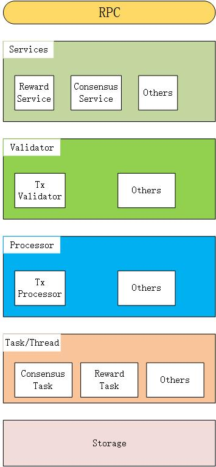
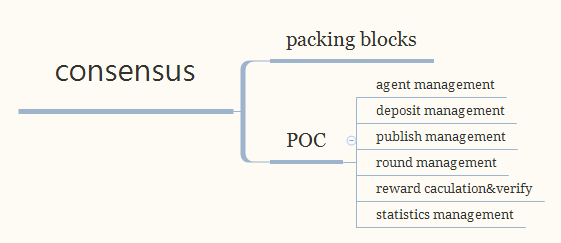
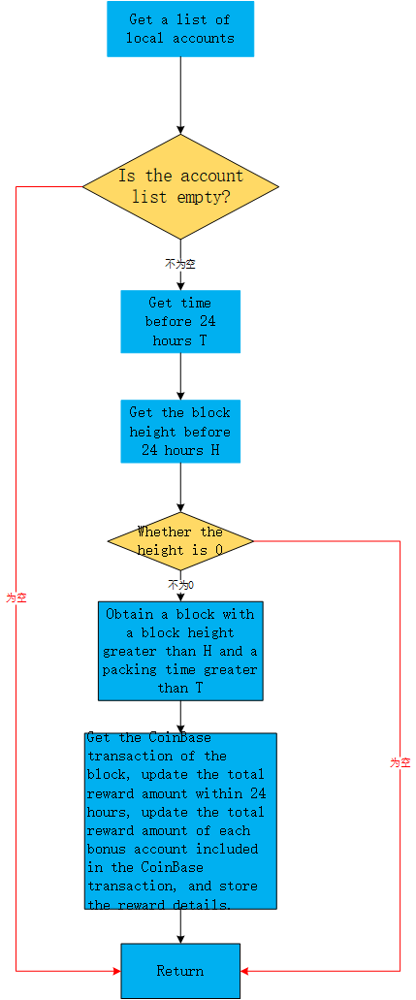

# Consensus module design document

[TOC]

## 1、General description

### 1.1 Module overview

#### 1.1.1 Why do you have a consensus module

​	As we all know, the core of the blockchain is the consensus mechanism. Unlike the traditional Internet's clipet-server architecture, the agents of the blockchain are peer-to-peer, without the center, and everyone has the same rights; so in order to make the data consistent, let a network without a center maintain a set of books that everyone agrees with. This is the role of the consensus mechanism.

​	Broadly speaking, the consensus mechanism is the rule or algorithm that each agent of the blockchain adheres to, and is the basis for mutual trust. In this way, it can achieve decentralized unsupervised and maintain the normal operation of the entire platform.

​	In a narrow sense, the consensus mechanism determines the mechanism by which each agent verifies and validates transactions on the blockchain.

#### 1.1.2 What does the consensus module do

​	Each transaction in the blockchain must be approved by each agent, and the transaction is completed only after the entire network has reached a consensus. It is like in a democratic election, the voting method or rules must be recognized by the whole people, based on which the election can be completed. In the blockchain, the main performance of the consensus mechanism is the incentive system, which is the reward for the miners. Under the guarantee of the consensus mechanism, every miner can be rewarded, and the entire blockchain can operate in an orderly manner, providing a fair, transparent and trusting environment. Therefore, the consensus module needs to provide a specific algorithm to maintain, that is, the consensus algorithm.

​	There are many public chain consensus mechanisms, and the mainstream is POW, POS, and DPOS. The NULS main network adopts the self-originated POC (Proof Of Credit) consensus mechanism, which inherits the security and high efficiency of the Dpos consensus mechanism. At the same time, it has made great improvements in collaboration, which can be regarded as an upgraded version. Dpos.

​	POC Consensus module responsibility：

- Legality verification after block synchronization

- Create consensus agents, delegate participation consensus, cancel delegation, and cancel consensus agents ★

- Consensus agent packs out blocks

- Disbursement of network maintenance incentives

- Bad agent punishment ★

  **PS：Different consensus mechanisms have different consensus algorithms. The above marked ★ is unique to POC consensus.**

#### 1.1.3 《Consensus module》Positioning in the system

​	The consensus module is a relatively core piece in the system. It is mainly responsible for packing transactions, verifying block headers, managing consensus agent information in the management system, entrusting information, and penalizing information.

### 1.2 Architecture diagram



Description：

- Services：
  - tx service : Additions, deletions and changes to transactions
  - consensus service : Consensus activities and state management, functional design
- Validator
  - tx Validator: Validator for consensus-related transactions for verifying consensus-related transactions
- Processor
  - Tx Processor:Consensus module related transaction processor for submitting rollback detection transactions
- Task/Thread：
  - consensus Task: Consensus packaging
  - Reward Task ： Data statistics
- Storage:Store consensus module related transaction data

### 2.0 Functional architecture diagram



### 2.1Consensus module functional requirements analysis

#### 2.1.1 Support multi-chain parallelism

​	The NULS 2.0 design concept is to provide modular services, and each module should support multiple chains of data running at the same time, so the consensus module needs to implement algorithms with different consensus mechanisms. When the consensus module is started, it can simultaneously support multiple chains to run at the same time.


#### 2.1.2 POC consensus mechanism

​	The main network of NULS adopts the independent POC consensus mechanism. To realize POC, you first need to know the design concept and business rules of POC. The following content is taken from the introduction part of the NULS white paper POC consensus. If you are familiar, you can skip it directly.

```
Consensus mechanism——POC
	The NULS main chain defaults to the credit consensus mechanism POC (Proof-Of-Credit). In the case where the agent credit is up to standard, a certain margin can be locked to join the consensus. After the consensus agent is reordered, each round will flow out of the block, and the margin will be unlocked when the consensus is exited.
	
1、Consensus entry and exit mechanism
	Anyone can join the NULS consensus at any time, as long as they meet the conditions and follow the rules, that is, they can continue to receive NULS token rewards. The addition of POC is divided into hard indicators and soft indicators. The hard indicator means that the credit score must reach a certain standard line, and exclude some agents that have been evil. The soft index refers to the need to freeze a certain amount of NULS tokens as a margin, in order to prevent the proliferation of agents and make the whole system more fair. The number of margins can be freely selected by anyone except the minimum value. The amount of the deposit will be tied to the final reward.
	
1.1 Yellow card penalty
	Due to the hardware configuration of the agent or the network, the disconnection, crash, etc. during the consensus period cannot be blocked. It is not a violation, but it will affect the whole system. Therefore, the system has a mild warning mechanism for such cases. : lower the agent credit value.
	
1.2 Red card penalty
	For some double-split, repeated block-outs, attempts to fork the system, and malicious human-induced damage that does not comply with system rules, the NULS system is firmly resisted, and all agents can detect this kind of situation; once a malicious agent tries to challenge the system, Then the corresponding margin will be locked for 2 months, and the credit rating will never reach the consensus threshold.
	
2、Credit Rating
	In the NULS system, credit is the credit factor of the account in the system, and the credit of all accounts is automatically calculated by the credit rating algorithm formula in the interval [-1, 1].
	
	Credit evaluation formula: credit base = capacity coefficient + responsibility coefficient
	Capacity factor: calculated based on the number of historical blocks
	Responsibility factor: Calculated according to violations and correctness of the block
	
3、Consensus reward
	For the balance and fairness of the entire NULS system, the consensus reward is calculated based on the margin and consensus agent credits submitted by all consensus agents. Consensus reward calculation formula: see (Figure p1)
	
4、Subchain consensus mechanism
	There are two types of sub-chains that access NULS. The first one is accessed through the standard interface protocol of the NULS system, and the second is deployed through the NULS program.
	
	NULS is a common blockchain underlying infrastructure that does not run any application services on its main chain, and all application services are run by sub-chains. Through the NULS system, NULS-based sub-chains can be quickly deployed, and various operational parameters of the sub-chain can be flexibly customized, including whether to support basic tokens, encryption algorithms, consensus mechanisms, and storage mechanisms.
	
	NULS defines a standard consensus module to provide interfaces that are compatible with different consensus mechanisms. The NULS community will develop consensus mechanisms such as POW, DPOS, POS, PBFT, and POOL verification pools for users to choose freely.

```

*Figure p1: Consensus reward calculation formula：*


##### In the POC system, there are four roles: agent, principal, packager, and rewarder

- Agent - the consensus agent creator. The NULS holder initiates a transaction to create a consensus agent, which is recorded in the chain and tells everyone that I want to be a consensus agent. The basic condition for agent creation is that 20,000-200,000 NULS need to be locked, and there is no red card penalty record. The purpose of setting up this basic condition is to prove that you are really trying to maintain the basic network of NULS.
- Packager- When creating a consensus agent, the agent can specify a packager. This packager can be his own other account, or a friend who knows technology. The most important thing is that the packager can not hold any NULS. Even if the server participating in the consensus is hacked, the user will not have a huge loss, and the loss will only be affected by the earnings after the attack. It should be noted that the packager is a real out-of-the-box account. Each time you package a block, you need to sign the block. Therefore, you must not set a password for the packaged account.
- Rewarding people- When creating a consensus agent, an agent can not only specify a packager, but also designate a beneficiary to specify who can get the reward generated by the consensus.
- The principal-NULS holder can entrust the NULS he holds to the agent according to the agent's credit value and the influence of the agent, etc., and enjoy the corresponding consensus. Revenue, if the agent agent quality or integrity is found to decrease, the principal may withdraw its entrustment and change to others at any time.

##### In the POC system, there are four business logics: creating a proxy (creating a consensus agent), stopping a proxy agent (exiting consensus), delegating a consensus, and canceling a delegation.

- Create proxy (create consensus agent): Lock 20,000-200,000 NULS and initiate a registration proxy transaction. After packaging, the whole network can be seen. Others can lock the NULS delegation to the proxy agent.
- Stop the agent agent (exit consensus): The agent can stop its agent qualification at any time, initiate a transaction to delete the agent agent, and after the transaction is packaged and confirmed, it will quickly withdraw from the consensus and no longer participate in the production of the new block. The 20,000 NULS locked during the registration of the agent will be unlocked after 72 hours, and the rest of the NULS delegated to the agent will be unlocked immediately.
- Delegate consensus: Users with NULS of 2000 or above can choose a proxy agent to commission and obtain the corresponding block revenue. Before exiting, the corresponding delegated NULS will be locked out of use. A proxy agent can accept up to 500,000 NULS delegates.
- Cancellation of the delegation: The user can cancel the previous entrustment. After the revocation, the locked NULS will immediately explain and no longer enjoy the corresponding consensus revenue.

##### Two punishment mechanisms for POC systems

- Yellow card penalty: When the block agent is disconnected from the network, card machine and other uncertain reasons, the block will not be out of the block, or the block is not used, then the yellow card will be punished in the next round. The yellow card penalty will affect the agent's income; when 100 consecutive yellow card penalties are awarded, a red card will be imposed.
- Red card penalty: When the block agent makes malicious fork, double flower and other behaviors that seriously endanger the stability of the network, or when it receives 100 yellow card penalties continuously, the system will give a red card penalty. The agent that receives the red card penalty will be forced to stop the consensus. The deposit when the agent is created is frozen for 3 months, and the agent can never be created again; the corresponding agent of the agent that received the red card penalty is immediately unlocked.

##### Hidden functional requirements of POC internal systems

- Maintain a consensus agent information table and update based on the above four transactions received in real time.
- Maintain a round of information table, so that each round of agents who meet the conditions of the outbound block are randomly queued out.
- The proxy agent that meets the condition of the outbound condition verifies and packages the transaction of the memory pool, assembles it into a new block and broadcasts it to the whole network.

The above is a functional analysis of the implementation of the consensus module POC consensus mechanism. The details of each function implementation are described in the next section.

### 2.2 Module service

​	The consensus module is the core module of the blockchain. Due to the different consensus mechanisms, the services provided by the outside are not the same. The module service will describe in detail the services shared by the consensus module and the services specific to the POC mechanism.


#### 2.2.1 Create agent

* Function Description:

  ```
  	Create an address that specifies the packaged block (the fast address when the consensus agent satisfies the packageable condition), the commission ratio (the commission ratio of other accounts participating in the agent consensus), and the consensus reward settlement address (the reward for the consensus agent) The consensus agent of the home address, waiting for other agents to delegate consensus, when the commissioned consensus amount reaches the standard amount, the agent can package the block to earn the reward.
  ```

* Process description

  ```
  - Verify parameter correctness
  - Create a transaction
  - Determine if the account balance is sufficient
  - Verify the transaction
  - Save the transaction
  - Broadcasting transactions
  ```

* Interface definition

  - Interface Description

    ```
    	By creating a agent interface, the NULS user can initiate the creation of a agent transaction, and after the transaction is confirmed and packaged, the consensus agent can be successfully created.
    ```

  * Request example

    ```
    {
        "method":"cs_createAgent",
        "version:"1.0",
        "params":["agentAddress","packingAddress","rewardAddress",10,20000,"password","chainId"]
    }
    ```

  * Request parameter description

    | index |   parameter    | required |  type  |                         description                          |
    | :---: | :------------: | :------: | :----: | :----------------------------------------------------------: |
    |   0   |  agentAddress  |   true   | String |          Request to create a agent account address           |
    |   1   | packingAddress |   true   | String |                    Packing block address                     |
    |   2   | rewardAddress  |  false   | String | Reward settlement address (default is the same as the agent address) |
    |   3   | commissionRate |   true   | double |                       Commission rate                        |
    |   4   |    deposit     |   true   |  long  |                   Create a agent's margin                    |
    |   5   |    password    |  false   | String |                           password                           |
    |   6   |    chainId     |   true   | String |                           chain ID                           |

  * Return example

    success
    ```
    {
     	"version": 1.0,
        "code":0,
        "msg" :"Success message",
        "result":{
            "value":"tx.getHash().getDigestHex()" //Generated transaction hash value
        }
    }
    ```

    fail

    ```
    {
    	"version": 1.0,
       	 "code":1,
       	 "msg" :"Error message",
         "result":{
            
      	  }
    }
    ```

  * Return parameter description

    | parameter |  type  |                      description                       |
    | :-------: | :----: | :----------------------------------------------------: |
    |   value   | String | The hex string of the generated transaction hash value |

#### 2.2.2 Create agent transaction verification

- Function Description:

  ```
  Create a validator for agent transactions
  ```

- Process description

  ```
  - Verify that the transaction contains agent information
  - Verify that the trade creator is correct
  - agent address and package address cannot be verified
  - agent reward address and package address cannot be verified
  - Commission proportional validity verification
  - Create a agent's margin validity verification
  - Signature correctness verification
  - CoinData verification (lock time verification)
  ```

- Interface definition

  - Interface Description

    ```
    	This interface is mainly to verify the block round information, the packager, the transaction in the block and whether the CoinBase is correct, and verify whether there is a red and yellow card penalty.
    ```

  - Request example

    ```
    {
        "method":"cs_createAgentValid",
        "version:"1.0",
        "params":["tx","chainId"]
    }
    ```

  - Request parameter description

    | index | parameter | required |  type  |                  description                  |
    | :---: | :-------: | :------: | :----: | :-------------------------------------------: |
    |   0   |    tx     |   true   | String | Create serialized data for agent transactions |
    |   1   |  chainId  |   true   | String |                   chain ID                    |

  - Return example

    success

    ```
    {
        "version":"1.0",  
        "code": 0,                                  //error code
        "msg": "Prompt message",                           //Prompt message                          
        "result": {                                 //Returned business data set  
      		
        }
    }
    ```

    fail

    ```
    {
         "version": 1.0,
       	 "code":1,                                //error code
       	 "msg" :"错误Prompt message",             //Prompt message
         "result":{
            
      	  }
    }
    ```

  - Return parameter description

    ```
    无
    ```

#### 2.2.3 Create a agent transaction submission

- Function Description:

  ```
  Save the created consensus node information
  ```

- Process description

  ```
  - Save node information to the database
  ```

- Interface definition

  - Interface Description

    ```
    Save consensus node information to the database
    ```

  - Request example

    ```
    {
        "method":"cs_createAgentCommit",
        "version:"1.0",
        "params":["tx","blockHeader","chainId"]
    }
    ```

  - Request parameter description

    | index |  parameter  | required |  type  |                  description                  |
    | :---: | :---------: | :------: | :----: | :-------------------------------------------: |
    |   0   |     tx      |   true   | String | Create serialized data for agent transactions |
    |   1   | blockHeader |   true   | String |            Block header hex string            |
    |   2   |   chainId   |   true   | String |                   chain ID                    |

  - Return example

    success

    ```
    {
        "version":"1.0",  
        "code": 0,                                  //error code
        "msg": "Prompt message",                    //Prompt message
        "result": {                                 //Returned business data set  
      		
        }
    }
    ```

    fail

    ```
    {
         "version": 1.0,
       	 "code":1,                            //error code
       	 "msg" :"Prompt message",             //Prompt message
         "result":{
            
      	  }
    }
    ```

  - Return parameter description

    ```
    nothing
    ```

#### 2.2.4 Create agent transaction rollback

- Function Description:

  ```
  Delete consensus agent information
  ```

- Process description

  ```
  - Delete consensus agent information
  ```

- Interface definition

  - Interface Description

    ```
    Remove consensus agent information from the data
    ```

  - Request example

    ```
    {
        "method":"cs_createAgentRollBack",
        "version:"1.0",
        "params":["tx","blockHeader","chainId"]
    }
    ```

  - Request parameter description

    | index |  parameter  | required |  type  |                  description                  |
    | :---: | :---------: | :------: | :----: | :-------------------------------------------: |
    |   0   |     tx      |   true   | String | Create serialized data for agent transactions |
    |   1   | blockHeader |   true   | String |            Block header hex string            |
    |   2   |   chainId   |   true   | String |                   chain ID                    |

  - Return example

    success

    ```
    {
        "version":"1.0",  
        "code": 0,                                  //error code
        "msg": "Prompt message",                    //Prompt message
        "result": {                                 //Returned business data set 
      		
        }
    }
    ```

    fail
    
    ```
    {
         "version": 1.0,
       	 "code":1,                            //error code
       	 "msg" :"Prompt message",             //Prompt message
         "result":{
            
      	  }
    }
    ```

  - Return parameter description

    ```
    nothing
    ```

#### 2.2.5 Logout consensus agent

- Function Description:

  ```
  	Log out a consensus agent created by yourself, and the consensus amount and consensus bonus of the agents participating in the consensus after unregistering the agent will be thawed after a certain time.
  ```

- Process description

  ```
  - Verify parameter correctness
  - Create a transaction
  - Determine if the account balance is sufficient
  - Verify the transaction
  - Save the transaction
  - Broadcasting transactions
  ```

- Interface definition

  - Interface Description

    ```
    	By deregistering the agent interface, the NULS user can initiate a transaction to cancel the agent created by himself. After the transaction is confirmed to be packaged, the consensus agent can be successfully logged out.
    ```

  - Request example

    ```
    {
        "method":"cs_stopAgent",
        "version:"1.0",
        "params":["address","password",chainId]
    }
    ```

  - Request parameter description

    | index | parameter | required |  type  |                      description                       |
    | :---: | :-------: | :------: | :----: | :----------------------------------------------------: |
    |   0   |  address  |   true   | String | Create the address of the logout agent trading account |
    |   1   | password  |  false   | String |                        password                        |
    |   2   |  chainId  |   true   | String |                        chian ID                        |

  - Return example

    success

    ```
    {
        "version":"1.0",  
        "code": 0,                                  //error code
        "msg": "Prompt message",                    //Prompt message        
        "result": {                                 //Returned business data set 
      		"value":"tx.getHash().getDigestHex()"   //Generated transaction hash value
        }
    }
    ```

    fail

    ```
    {
         "version": 1.0,
       	 "code":1,                            //error code
       	 "msg" :"Prompt message",             //Prompt message
         "result":{
            
      	  }
    }
    ```

  - Return parameter description

    | parameter |  type  |                      description                       |
    | :-------: | :----: | :----------------------------------------------------: |
    |   value   | String | The hex string of the generated transaction hash value |

#### 2.2.6 Logout agent transaction verification

- Function Description:

  ```
  Verify the correctness of the logout agent transaction验证注销节点交易的正确性
  ```

- Process description

  ```
  - Verify that the deleted consensus agent exists and that the consensus agent has       been logged out
  - Verify that the trade creator is correct
  - CoinData verification (output address must exist)
  - Query all consensus information participating in the consensus agent and the total   consensus amount of the agent
  - Check whether the total amount of UTXO spent in the logout agent transaction is     equal to the consensus agent entrusted amount in the database query. If not,         verify the fail.
  - Verify that each UTXO unlocked in the logout agent transaction is correct
  ```

- Interface definition

  - Interface Description

    ```
    Verify that the logout agent transaction is correct.
    ```

  - Request example

    ```
    {
        "method":"cs_stopAgentValid",
        "version:"1.0",
        "params":["tx",chainId]
    }
    ```

  - Request parameter description

    | index | parameter | required |  type  |                  description                  |
    | :---: | :-------: | :------: | :----: | :-------------------------------------------: |
    |   0   |    tx     |   true   | String | Logout serialized data for agent transactions |
    |   1   |  chainId  |   true   | String |                   chain ID                    |

  - Return example

    success

    ```
    {
        "version":"1.0",  
        "code": 0,                                  //error code
        "msg": "Prompt message",                    //Prompt message 
        "result": {                                 //Returned business data set
      		
        }
    }
    ```

    fail

    ```
    {
         "version": 1.0,
       	 "code":1,                            //error code
       	 "msg" :"Prompt message",             //Prompt message
         "result":{
            
      	  }
    }
    ```

  - Return parameter description

    ```
    nothing
    ```

#### 2.2.7 Logout agent transaction submission

- Function Description:

  ```
  Submit logout agent data transaction
  ```

- Process description

  ```
  - Set all delegate data under the consensus agent to deleted
  - Set the consensus agent data to deleted
  ```

- Interface definition

  - Interface Description

    ```
    	Log out the consensus agent and set all the delegate data and consensus agents under the consensus agent to the deleted state.
    ```

  - Request example

    ```
    {
        "method":"cs_stopAgentCommit",
        "version:"1.0",
        "params":["tx","blockHeader","chainId"]
    }
    ```

  - Request parameter description

    | index |  parameter  | required |  type  |                  description                  |
    | :---: | :---------: | :------: | :----: | :-------------------------------------------: |
    |   0   |     tx      |   true   | String | Create serialized data for agent transactions |
    |   1   | blockHeader |   true   | String |            Block header hex string            |
    |   2   |   chainId   |   true   | String |                   chain ID                    |

  - Return example

    success

    ```
    {
        "version":"1.0",  
        "code": 0,                                  //error code
        "msg": "Prompt message",                    //Prompt message 
        "result": {                                 //Returned business data set  
        }
    }
    ```

    fail

    ```
    {
         "version": 1.0,
       	 "code":1,                            //error code
       	 "msg" :"Prompt message",             //Prompt message
         "result":{
            
      	  }
    }
    ```

  - Return parameter description

    ```
    nothing
    ```

#### 2.2.8 Logout agent transaction rollback

- Function Description:

  ```
  Logout agent transaction data rollback
  ```

- Process description

  ```
  - Set all delegate data under the consensus agent to not deleted
  - Set the consensus agent data to not deleted
  ```

- Interface definition

  - Interface Description

    ```
    Rollback logout agent transaction data
    ```

  - Request example

    ```
    {
        "method":"cs_stopAgentRollback",
        "version:"1.0",
        "params":["tx","blockHeader","chainId"]
    }
    ```

  - Request parameter description

    | index |  parameter  | required |  type  |                  description                  |
    | :---: | :---------: | :------: | :----: | :-------------------------------------------: |
    |   0   |     tx      |   true   | String | Logout serialized data for agent transactions |
    |   1   | blockHeader |   true   | String |            Block header hex string            |
    |   2   |   chainId   |   true   | String |                   chian ID                    |

  - Return example

    success

    ```
    {
        "version":"1.0",  
        "code": 0,                                  //error code
        "msg": "Prompt message",                    //Prompt message 
        "result": {                                 //Returned business data set  
      		
        }
    }
    ```

    fail

    ```
    {
         "version": 1.0,
       	 "code":1,                            //error code
       	 "msg" :"Prompt message",             //Prompt message
         "result":{
            
      	  }
    }
    ```

  - Return parameter description

    ```
    nothing
    ```

#### 2.2.9 Apply to join the consensus

- Function Description:

  ```
  	Entrust the specified amount to the consensus agent to participate in the consensus to earn consensus rewards. The entrusted amount and consensus reward will be frozen during the consensus period.
  ```

- Process description

  ```
  - Verify parameter correctness
  - Create a transaction
  - Determine if the account balance is sufficient
  - Verify the transaction
  - Save the transaction
  - Broadcasting transactions
  ```

- Interface definition

  - Interface Description

    ```
    	Through this interface, users can entrust the specified agent address to join the consensus and earn bonuses.
    ```

  - Request example

    ```
    {
        "method":"cs_depositToAgent",
        "version:"1.0",
        "params":["address","agentHash",20000,"password","chainId"]
    }
    ```

  - Request parameter description

    | index | parameter | required |  type  |                         description                          |
    | :---: | :-------: | :------: | :----: | :----------------------------------------------------------: |
    |   0   |  address  |   true   | String |            Apply for a consensus account address             |
    |   1   | agentHash |   true   | String |                      Consensus agent id                      |
    |   2   |  deposit  |   true   |  long  |           Amount of participation in the consensus           |
    |   3   | password  |  false   | String | Apply for a password for participating in the consensus account |
    |   4   |  chainId  |   true   | String |                           chain ID                           |

  - Return example

    success

    ```
    {
        "version":"1.0",  
        "code": 0,                                  //error code
        "msg": "Prompt message",                    //Prompt message
        "result": {                                 //Returned business data set  
      		"value":"tx.getHash().getDigestHex()"     //Generated transaction hash value
        }
    }
    ```

    fail

    ```
    {
         "version": 1.0,
       	 "code":1,                            //error code
       	 "msg" :"Prompt message",             //Prompt message
         "result":{
            
      	  }
    }
    ```

  - Return parameter description

    | parameter |  type  |                 description                  |
    | :-------: | :----: | :------------------------------------------: |
    |   value   | String | The hex string of the transaction hash value |

#### 2.2.10 Commissioned consensus transaction verification

- Function Description:

  ```
  Entrusted consensus transaction correctness verification委托共识交易正确性验证
  ```

- Process description

  ```
  - Verify that the consensus agent to apply for is valid
  - Verify that the consensus agent that applied to join has reached the maximum         number allowed to join the consensus
  - Verify that the entrusted amount is valid
  - Verify that the transaction was created by the account that requested the           application.
  - Verify that the commission amount is equal to the output UTXO amount, and that     the output UTXO lock time is correct.
  ```

- Interface definition

  - Interface Description

    ```
    	Verify the validity of the entrusted agent in the entrusted transaction, verify the correctness of the entrusted amount, verify whether the entrusted transaction creator is correct, and whether the UTXO output by the entrusted transaction is correct. Verify that the logout agent transaction is correct.
    ```

  - Request example

    ```
    {
        "method":"cs_depositValid",
        "version:"1.0",
        "params":["tx","chainId"]
    }
    ```

  - Request parameter description

    | index | parameter | required |  type  |                       description                       |
    | :---: | :-------: | :------: | :----: | :-----------------------------------------------------: |
    |   0   |    tx     |   true   | String | Serialized data for commissioned consensus transactions |
    |   1   |  chainId  |   true   | String |                        chain ID                         |

  - Return example

    success

    ```
    {
        "version":"1.0",  
        "code": 0,                                  //error code
        "msg": "Prompt message",                    //Prompt message
        "result": {                                 //Returned business data set  
      		
        }
    }
    
    ```

    fail

    ```
    {
         "version": 1.0,
       	 "code":1,                            //error code
       	 "msg" :"Prompt message",             //Prompt message
         "result":{
            
      	  }
    }
    ```

  - Return parameter description

    ```
    nothing
    ```

#### 2.2.11 Entrusted consensus transaction submission

- Function Description:

  ```
  Entrusted transaction submission
  ```

- Process description

  ```
  - Save commissioned transaction information
  ```

- Interface definition

  - Interface Description

    ```
    Save commissioned transaction data
    ```

  - Request example

    ```
    {
        "method":"cs_depositCommit",
        "version:"1.0",
        "params":["tx",1000000,"chainId"]
    }
    ```

  - Request parameter description

    | index | parameter | required |  type  |                         description                          |
    | :---: | :-------: | :------: | :----: | :----------------------------------------------------------: |
    |   0   |    tx     |   true   | String |               Serialized data for transactions               |
    |   1   |  height   |   true   |  long  | The height of the block where the commissioned transaction is packaged |
    |   2   |  chainId  |   true   | String |                           chain ID                           |

  - Return example

    success

    ```
    {
        "version":"1.0",  
        "code": 0,                                  //error code
        "msg": "Prompt message",                    //Prompt message
        "result": {                                 //Returned business data set  
      		
        }
    }
    
    ```

    fail

    ```
    {
         "version": 1.0,
       	 "code":1,                            //error code
       	 "msg" :"Prompt message",             //Prompt message
         "result":{
            
      	  }
    }
    ```

  - Return parameter description

    ```
    nothing
    ```

#### 2.2.12 Delegate consensus transaction rollback

- Function Description:

  ```
  Delegate consensus transaction rollback, delete delegate consensus transaction data
  ```

- Process description

  ```
  - Delete delegate consensus transaction information
  ```

- Interface definition

  - Interface Description

    ```
    	When the commissioned consensus transaction commits an error, this interface needs to be dropped to delete the delegate consensus transaction data.
    ```

  - Request example

    ```
    {
        "method":"cs_depositRollback",
        "version:"1.0",
        "params":["tx",1000000,"chainId"]
    }
    ```

  - Request parameter description

    | index | parameter | required |  type  |                         description                          |
    | :---: | :-------: | :------: | :----: | :----------------------------------------------------------: |
    |   0   |    tx     |   true   | String |   Serialized data for commissioned consensus transactions    |
    |   1   |  height   |   true   |  long  | The height of the consigned consensus transaction is packaged |
    |   2   |  chainId  |   true   | String |                           chain ID                           |

  - Return example

    success

    ```
    {
        "version":"1.0",  
        "code": 0,                                  //error code
        "msg": "Prompt message",                    //Prompt message 
        "result": {                                 //Returned business data set  
      		
        }
    }
    
    ```

    fail

    ```
    {
         "version": 1.0,
       	 "code":1,                            //error code
       	 "msg" :"Prompt message",             //Prompt message
         "result":{
            
      	  }
    }
    ```

  - Return parameter description

    ```
    nothing
    ```

#### 2.2.13 Revoke commission

- Function Description:

  ```
  	Apply for withdrawal from the consensus, after the transaction is verified, the deposit and reward will be released after the specified time.
  ```

- Process description

  ```
  - Verify parameter correctness
  - Create a transaction
  - Determine if the account balance is sufficient
  - Verify the transaction
  - Save the transaction
  - Broadcasting transactions
  ```

- Interface definition

  - Interface Description

    ```
    	Apply for withdrawal from the consensus, after the transaction is verified, the deposit and reward will be released after the specified time.
    ```

  - Request example

    ```
    {
        "method":"cs_withdraw",
        "version:"1.0",
        "params":["address","txHash","password","chainId"]
    }
    ```

  - Request parameter description

    | index | parameter | required |  type  |                     description                      |
    | :---: | :-------: | :------: | :----: | :--------------------------------------------------: |
    |   0   |  address  |   true   | String | Apply to withdraw from the consensus account address |
    |   1   |  txHash   |   true   | String |       Transaction hash when joining consensus        |
    |   2   | password  |  false   | String |                       password                       |
    |   3   |  chainId  |   true   | String |                       chain ID                       |

  - Return example

    success

    ```
    {
        "version":"1.0",  
        "code": 0,                                  //error code
        "msg": "Prompt message",                    //Prompt message
        "result": {                                 //Returned business data set  
      		"value":"tx.getHash().getDigestHex()"   //Generated transaction hash value
        }
    }
    ```

    fail

    ```
    {
         "version": 1.0,
       	 "code":1,                            //error code
       	 "msg" :"Prompt message",             //Prompt message
         "result":{
            
      	  }
    }
    ```

  - Return parameter description

    | parameter |  type  |                 description                  |
    | :-------: | :----: | :------------------------------------------: |
    |   value   | String | The hex string of the transaction hash value |

#### 2.2.14 Exit consensus transaction verification

- Function Description:

  ```
  Verify that the exit consensus transaction is correct
  ```

- Process description

  ```
  - Verify that the consensus to exit has been delegated before and has not exited
  - Verify that the account that created the transaction is correct
  ```

- Interface definition

  - Interface Description

    ```
    	Before exiting, verify that the account has participated in the delegate and is still in the delegate. Also verify that the transaction creator is the principal.
    ```

  - Request example

    ```
    {
        "method":"cs_withdrawValid",
        "version:"1.0",
        "params":["tx","chainId"]
    }
    ```

  - Request parameter description

    | index | parameter | required |  type  |                  description                   |
    | :---: | :-------: | :------: | :----: | :--------------------------------------------: |
    |   0   |    tx     |   true   | String | Exit serialized data for a trusted transaction |
    |   1   |  chainId  |   true   | String |                    chain ID                    |

  - Return example

    success

    ```
    {
        "version":"1.0",  
        "code": 0,                                  //error code
        "msg": "Prompt message",                    //Prompt message  
        "result": {                                 //Returned business data set  
      		
        }
    }
    
    
    ```

    fail

    ```
    {
         "version": 1.0,
       	 "code":1,                            //error code
       	 "msg" :"Prompt message",             //Prompt message
         "result":{
            
      	  }
    }
    ```

  - Return parameter description

    ```
    nothing
    ```

#### 2.2.15 Exit consensus transaction submission

- Function Description:

  ```
  	Exit the consensus transaction submission, save the data related to the exit consensus transaction
  ```

- Process description

  ```
  - Save exit consensus transaction related data
  ```

- Interface definition

  - Interface Description

    ```
    	Save the transaction-related data by calling the interface after exiting the consensus transaction verification success
    ```

  - Request example

    ```
    {
        "method":"cs_depositCommit",
        "version:"1.0",
        "params":["tx","blockHeader","chainId"]
    }
    ```

  - Request parameter description

    | index |  parameter  | required |  type  |           description            |
    | :---: | :---------: | :------: | :----: | :------------------------------: |
    |   0   |     tx      |   true   | String | Serialized data for transactions |
    |   1   | blockHeader |   true   | String |     Block header hex string      |
    |   2   |   chainId   |   true   | String |             chain ID             |

  - Return example

    success

    ```
    {
        "version":"1.0", 
        "code": 0,                                  //error code
        "msg": "Prompt message",                    //Prompt message 
        "result": {                                 //Returned business data set  
      		
        }
    }
    
    
    ```

    fail

    ```
    {
         "version": 1.0,
       	 "code":1,                            //error code
       	 "msg" :"Prompt message",             //Prompt message
         "result":{
            
      	  }
    }
    ```

  - Return parameter description

    ```
    nothing
    ```

#### 2.2.16 Exit consensus transaction rollback

- Function Description:

  ```
  Exit consensus transaction data rollback
  ```

- Process description

  ```
  - Rollback exit consensus transaction data
  ```

- Interface definition

  - Interface Description

    ```
    	When exiting the consensus transaction submission error, you need to call this interface to roll back the data to ensure the correctness of the data.
    ```

  - Request example

    ```
    {
        "method":"cs_withdrawRollback",
        "version:"1.0",
        "params":["tx","blockHeader","chainId"]
    }
    ```

  - Request parameter description

    | index |  parameter  | required |  type  |                  description                   |
    | :---: | :---------: | :------: | :----: | :--------------------------------------------: |
    |   0   |     tx      |   true   | String | Exit serialized data for a trusted transaction |
    |   1   | blockHeader |   true   | String |            Block header hex string             |
    |   2   |   chainId   |   true   | String |                    chain ID                    |

  - Return example

    success

    ```
    {
        "version":"1.0",  
        "code": 0,                                  //error code
        "msg": "Prompt message",                    //Prompt message
        "result": {                                 //Returned business data set  
      		
        }
    }
    
    
    ```

    fail

    ```
    {
         "version": 1.0,
       	 "code":1,                            //error code
       	 "msg" :"Prompt message",             //Prompt message
         "result":{
            
      	  }
    }
    ```

  - Return parameter description

    ```
    nothing
    ```

#### 2.2.17 Query consensus agent list

- Function Description:

  ```
  	Obtain all the consensus agent lists that you have joined or the whole network, support keyword query, sort, page query
  ```

- Process description

  ```
  - Verify parameter correctness
  - Get a list of consensus agents on the local primary chain
  - Filter the list of consensus agents to get a list of consensus agents that meet the   criteria
  - Consensus agent list sorting
  - Pagination
  - Return to the list of consensus agents
  ```

- Interface definition

  - Interface Description

    ```
    	Obtain all the consensus agent lists that you have joined or the whole network, support keyword query, sort, page query
    ```

  - Request example

    ```
    {
        "method":"cs_getAgentList",
        "version:"1.0",
        "params":[1,10,"address","keyword","sortType","chainId"]
    }
    ```

  - Request parameter description

    | index | parameter  | required |  type  |                         description                          |
    | :---: | :--------: | :------: | :----: | :----------------------------------------------------------: |
    |   0   | pageNumber |   true   |  int   |                         page number                          |
    |   1   |  pageSize  |   true   |  int   |                   Amount of data per page                    |
    |   2   |  keyword   |  false   | String | Keyword (agent address, packed address, agent alias, agent ID) |
    |   3   |  sortType  |  false   | String | The sort type (deposit creates the lock amount of the consensus agent, the commissionRate commission ratio, the creditVal reward amount, the total amount of the total deposit consensus, the comprehensive sort of comprehensive) |
    |   4   |  chainId   |   true   | String |                           chain ID                           |

  - Return example

    success

    ```
    {
        "code": 0,                                  //error code
        "msg": "success",                           //Prompt message
        "version":"1.0",                            
        "result": {                                 //Returned business data set  
        	"pageNumber":1,                         //page number         
        	"pageSize":10,                          //Amount of data per page
        	"total":100,                            //Total data volume
        	"pages",10,                             //total pages
        	"data":[
                {
                    "agentHash":"",                  //agent hash
                    "agentAddress";""，            //Create the address of the agent
                    "packingAddress";""，            //Packed address
                    "rewardAddress";""，             //Reward address
                    "deposit";，                     //Margin
                    "commissionRate";，              //Commission rate
                    "agentName";""，                 //agent name
                    "agentId";""，                   //agent ID
                    "introduction";""，              //Introduction
                    "time";，                        //Creation time
                    "blockHeight";，                 //Block height
                    "delHeight":，                   //Block height at which the consensus agent is deleted
                    "status":，                      //status                    
                    "creditVal":，                   //Reputation value
                    "totalDeposit":，                //Total amount of participation in the consensus
                    "txHash":""，                    //Transaction hash
                    "memberCount":，                 //Number of people joining the agent consensus
                    "version":                       //version
                }，{
                    
                }
        	]
        }
    }
    ```

    fail

    ```
    {
         "version": 1.0,
       	 "code":1,                            //error code
       	 "msg" :"Prompt message",             //Prompt message
         "result":{
            
      	  }
    }
    ```

  - Return parameter description

    data:

    | parameter  |    type     |       description       |
    | :--------: | :---------: | :---------------------: |
    | pageNumber |     int     |       page number       |
    |  pageSize  |     int     | Amount of data per page |
    |   total    |     int     |    Total data volume    |
    |   pages    |     int     |       total pages       |
    |    data    | List<Agent> |  Consensus agent list   |

    Agent:

    |   parameter    |  type  |                         description                          |
    | :------------: | :----: | :----------------------------------------------------------: |
    |   agentHash    | String |                          agnet hash                          |
    |  agentAddress  | String |               Create the address of the agent                |
    | packingAddress | String |                        Packed address                        |
    | rewardAddress  | String |                        Reward address                        |
    |    deposit     |  long  |                            Margin                            |
    | commissionRate | double |                       Commission rate                        |
    |   agentName    | String |                          agent name                          |
    |    agentId     | String |                           agent ID                           |
    |  introduction  | String |                         Introduction                         |
    |      time      |  long  |                        Creation time                         |
    |  blockHeight   |  long  |  Create the height of the block where the agent is trading   |
    |   delHeight    |  long  | Write off the height of the block where the transaction is located |
    |     status     |  int   |                            status                            |
    |   creditVal    | double |                       Reputation value                       |
    |  totalDeposit  |  long  |                   Total commission amount                    |
    |     txHash     | String |                       Transaction hash                       |
    |  memberCount   |  int   |                       Number of orders                       |
    |    version     | String |                       Protocol version                       |

#### 2.2.18 Query agent details (basic information, credit value, agent status)

- Function Description:

  ```
  	Query detailed information of the specified consensus agent, including the creation time of the consensus agent, margin, commission ratio, agent address, package address, consensus status, credit value, commission amount, consensus number, etc.
  ```

- Process description

  ```
  - Verify parameter correctness
  - Get a list of consensus agents on the local primary chain
  - Find the corresponding agent information from the list
  ```

- Interface definition

  - Interface Description

    ```
    Query the details of the agent through the agent hash
    ```

  - Request example

    ```
    {
        "method":"cs_getAgent",
        "version:"1.0",
        "params":["agentHash","chainId"]
    }
    ```

  - Request parameter description

    | index | parameter | required |  type  |    description     |
    | :---: | :-------: | :------: | :----: | :----------------: |
    |   0   | agentHash |   true   | String | Consensus agent id |
    |   1   |  chainId  |   true   | String |      chain ID      |

  - Return example

    success

    ```
    {
        "code": 0,                                  //error code
        "msg": "success",                           //Prompt message
        "version":"1.0",                            
        "result": {                                 //Returned business data set  
        	"data":{
                    "agentHash":"",                  
                    "agentAddress";""，              
                    "packingAddress";""，          
                    "rewardAddress";""，             
                    "deposit";，                     
                    "commissionRate";，              
                    "agentName";""，                 
                    "agentId";""，                   
                    "introduction";""，              
                    "time";，                       
                    "blockHeight";，                 
                    "delHeight":，                   
                    "status":，                                      
                    "creditVal":，                   
                    "totalDeposit":，               
                    "txHash":""，                  
                    "memberCount":，                 
                    "version":       
             }
        }
    }
    ```

    fail

    ```
    {
         "version": 1.0,
       	 "code":1,                            //error code
       	 "msg" :"Prompt message",             //Prompt message
         "result":{
            
      	  }
    }
    ```

  - Return parameter description

    |   parameter    |  type  |                         description                          |
    | :------------: | :----: | :----------------------------------------------------------: |
    |   agentHash    | String |                          agent hash                          |
    |  agentAddress  | String |               Create the address of the agent                |
    | packingAddress | String |                        Packed address                        |
    | rewardAddress  | String |                        Reward address                        |
    |    deposit     |  long  |                            Margin                            |
    | commissionRate | double |                       Commission rate                        |
    |   agentName    | String |                          agent name                          |
    |    agentId     | String |                           agent ID                           |
    |  introduction  | String |                         Introduction                         |
    |      time      |  long  |                        Creation time                         |
    |  blockHeight   |  long  |  Create the height of the block where the agent is trading   |
    |   delHeight    |  long  | Write off the height of the block where the transaction is located |
    |     status     |  int   |                            status                            |
    |   creditVal    | double |                       Reputation value                       |
    |  totalDeposit  |  long  |                   Total commission amount                    |
    |     txHash     | String |                           tx hash                            |
    |  memberCount   |  int   |                       Number of orders                       |
    |    version     | String |                       Protocol version                       |

#### 2.2.19 Query agent penalty list (all, red, yellow)

- Function Description:

  ```
  	Obtain the penalty record (red card and yellow card penalty) obtained by the consensus agent. The user can customize the query for all penalty records or only the red card or yellow card penalty information.
  ```

- Process description

  ```
  - Verify parameter correctness
  - Get the penalty based on the type of query
  ```

- Interface definition

  - Interface Description

    ```
    Query the penalty record specifying the block address
    ```

  - Request example

    ```
    {
        "method":"cs_getPunishList",
        "version:"1.0",
        "params":["address",0,"chainId"]
    }
    ```

  - Request parameter description

    | index | parameter | required |  type  |                  description                  |
    | :---: | :-------: | :------: | :----: | :-------------------------------------------: |
    |   0   |  address  |   true   | String |                 Block address                 |
    |   1   |   type    |   true   |  int   | Penalty type 1 yellow card, 2 red card, 0 all |
    |   2   |  chainId  |   true   | String |                   chain ID                    |

  - Return example

    success

    ```
    {
        "code": 0,                                  //error code
        "msg": "success",                           //Prompt message
        "version":"1.0",                            
        "result": {                                 //Returned business data set  
        	"pageNumber":1,                         //page number         
        	"pageSize":10,                          //Amount of data per page
        	"total":100,                            //Total data volume
        	"pages",10,                             //total pages
        	"data":[
                {
                    "type",，                        
                    "address",""，                   
                    "time",""，                      
                    "height",，                     
                    "roundIndex",，                              
                    "reasonCode",""                 
                }，{
                   ......
                }
        	]
        }
    }
    ```

    fail
    ```
    {
         "version": 1.0,
       	 "code":1,                            //error code
       	 "msg" :"Prompt message",             //Prompt message
         "result":{
            
      	  }
    }
    ```

  - Return parameter description

    data:

    | parameter  |     type     |       description       |
    | :--------: | :----------: | :---------------------: |
    | pageNumber |     int      |       page number       |
    |  pageSize  |     int      | Amount of data per page |
    |   total    |     int      |       Total data        |
    |   pages    |     int      |       total pages       |
    |    data    | List<Punish> |    Penalty list data    |

    Punish:

    | parameter  |  type  |          description           |
    | :--------: | :----: | :----------------------------: |
    |    type    |  byte  |       Type of punishment       |
    |  address   | String |            address             |
    |    time    | String |        punishment time         |
    |   height   |  long  | Punish the height of the block |
    | roundIndex |  long  |             round              |
    | reasonCode | String |     Reason for punishment      |

#### 2.2.20 Query the list of delegates (according to the principal, according to the agent)

- Function Description:

  ```
  1. Query the list of all delegation information participating in the specified 	      address
  2. Query the delegation information of the specified consensus agent participating      in the specified account
  3. Query the specified consensus agent trust list information
  ```

- Process description

  ```
  - Verify parameter correctness
  - Get a list of participating consensus information on the local primary chain
  - Filter the consensus list to get the consensus list of the specified account       participation or the consensus list information of the specified agent
  ```

- Interface definition

  - Interface Description

    ```
    	Obtain the consensus list information accepted by the specified account or specified by the consensus agent. When querying all the consensus lists of the specified account, the agentHash field is passed "". When all the delegated lists of the specified agent need to be queried, the address field is passed "".
    ```

  - Request example

    ```
    {
        "method":"cs_getDepositList",
        "version:"1.0",
        "params":[1，10，"address","agentHash","chainId"]
    }
    ```

  - Request parameter description

    | index | parameter  | required |  type  |                         description                          |
    | :---: | :--------: | :------: | :----: | :----------------------------------------------------------: |
    |   0   | pageNumber |   true   |  int   |                         page number                          |
    |   1   |  pageSize  |   true   |  int   |                   Amount of data per page                    |
    |   2   |  address   |  false   | String | The account address of the participating delegation (the entrusted information of the query agent is the designated pass "") |
    |   3   | agentHash  |  false   | String | Specify the proxy agent ID (this field is passed "" when querying all account delegation information) |
    |   4   |  chainId   |   true   | String |                           chain ID                           |

  - Return example

    success

    ```
    {
        "code": 0,                                  //error code
        "msg": "success",                           //Prompt message
        "version":"1.0",                            
        "result": {                                 //Returned business data set  
        	"pageNumber":1,                         //page number         
        	"pageSize":10,                          //Amount of data per page
        	"total":100,                            //Total data volume
        	"pages",10,                             //total pages
        	"data":[
                {
                    "agentHash":"",                  
                    "address";""，                   
                    "deposit";，                     
                    "time";，                        
                    "blockHeight";，                 
                    "delHeight":，                         
                    "txHash":""，                    
                    "status":,                       
                    "agentName":"",                  
                    "agentAddress":""  
                }，{
                    
                }
        	]
        }
    }
    ```

    fail

    ```
    {
         "version": 1.0,
       	 "code":1,                            //error code
       	 "msg" :"Prompt message",             //Prompt message
         "result":{
            
      	  }
    }
    ```

  - Return parameter description

    data:

    | parameter  |     type      |            description             |
    | :--------: | :-----------: | :--------------------------------: |
    | pageNumber |      int      |            page number             |
    |  pageSize  |      int      |      Amount of data per page       |
    |   total    |      int      |             otal data              |
    |   pages    |      int      |            page number             |
    |    data    | List<Deposit> | Json string of consensus data list |

    Deposit:

    |  parameter   |  type  |                       description                        |
    | :----------: | :----: | :------------------------------------------------------: |
    |  agentHash   | String |                        agent hash                        |
    |   address    | String |       Apply to join the consensus account address        |
    |   deposit    |  long  |                    Commission amount                     |
    |     time     |  long  |                     Commission time                      |
    | blockHeight  |  long  | The height of the block where the transaction is located |
    |  delHeight   |  long  |       Exit the height of the commissioned exchange       |
    |    txHash    | String |                         tx hash                          |
    |    status    |  int   |     Consensus agent status (to be agreed, consensus)     |
    |  agentName   | String |                        agent name                        |
    | agentAddress | String |                      agent address                       |

#### 2.2.21 Query the consensus status of the entire network

- Function Description:

  ```
  	Query the overall information of the network consensus, including the number of agents, total mortgage, total number of participating consensus accounts, etc.
  ```

- Process description

  ```
  - Get a list of network-wide consensus agents
  - Filter the list of consensus agents and wait until the list of valid consensus       agents
  - Get current package round information
  - According to the current package round information, the total amount of accounts   and the total amount of entrusted funds that the current network participates in   the consensus
  ```

- Interface definition

  - Interface Description

    ```
    	Query the number of agents in the whole network, the total commission amount, the accounts participating in the consensus, and the number of consensus agents that meet the packaging conditions.
    ```

  - Request example

    ```
    {
        "method":"cs_getWholeInfo",
        "version:"1.0",
        "params":["chainId"]
    }
    ```

  - Request parameter description

    | index | parameter | required |  type  | description |
    | :---: | :-------: | :------: | :----: | :---------: |
    |   0   |  chainId  |   true   | String |  chain ID   |

  - Return example

    success

    ```
    {
        "code": 0,                                  //error code
        "msg": "success",                           //Prompt message
        "version":"1.0",                            
        "result": {                                 //Returned business data set  
        	"data":{
                "agentCount":,                     
                "totalDeposit":,                    
                "rewardOfDay":,                   
                "consensusAccountNumber":,          
                "packingAgentCount":     
        	}
        }
    }
    ```

    fail

    ```
    {
         "version": 1.0,
       	 "code":1,                            //error code
       	 "msg" :"Prompt message",             //Prompt message
         "result":{
            
      	  }
    }
    ```

  - Return parameter description

    |       parameter        | type |                    description                    |
    | :--------------------: | :--: | :-----------------------------------------------: |
    |       agentCount       | int  |                 Number of agents                  |
    |      totalDeposit      | long |         Total amount of entrusted amount          |
    |      rewardOfDay       | long |           Reward amount within 24 hours           |
    | consensusAccountNumber | int  | Number of accounts participating in the consensus |
    |   packingAgentCount    | int  |    Current rounded number of consensus agents     |

#### 2.2.22 Query individual account consensus status

- Function Description:

  ```
  Query the consensus information of the specified account, including the number of consensus nodes created by the account and the node hash, the total amount of participation in the consensus, the number of consensus nodes participating in the account, the available balance, the consensus bonus, and the consensus bonus obtained within 24 hours.
  ```

- Process description

  ```
   - Get a list of network-wide consensus nodes
  ```
   - Check if there is a consensus node created by the account in the consensus node list
   - Get the current network delegate list
   - Get the list of delegates participating in the account from the delegate list
   - Obtain commission information for the account from the delegate list of the account
  ```

- Interface definition

  - Interface Description

  ```
    Query the consensus information of the specified account, including the number of consensus nodes created by the account and the node hash, the total amount of participation in the consensus, the number of consensus nodes participating in the account, the available balance, the consensus bonus, and the consensus bonus obtained within 24 hours.
    ```

  - Request example

    ```
    {
        "method":"cs_getInfo",
        "version:"1.0",
        "params":["address","chainId"]
    }
    ```

  - Request parameter description

    | index | parameter | required |  type  |   description   |
    | :---: | :-------: | :------: | :----: | :-------------: |
    |   0   |  address  |   true   | String | Account address |
    |   1   |  chainId  |   true   | String |    chain ID     |

  - Return example

    success

    ```
    {
        "code": 0,                                  //error code
        "msg": "success",                           //Prompt message
        "version":"1.0",                            
        "result": {                                 //Returned business data set  
        	"data":{
                "agentCount":,                      
                "totalDeposit":,                    
                "joinAgentCount":,                 
                "usableBalance":,                   
                "reward":,                          
                "rewardOfDay":,                     
                "agentHash":""                    
        	}
        }
    }
    ```

    fail

    ```
    {
         "version": 1.0,
       	 "code":1,                         //error code
       	 "msg" :"错误Prompt message",             //Prompt message
         "result":{
            
      	  }
    }
    ```

  - Return parameter description

    |   parameter    |  type  |                         description                         |
    | :------------: | :----: | :---------------------------------------------------------: |
    |      data      | Object |                    Consensus information                    |
    |   agentCount   |  int   |        The number of agents created by this account         |
    |  totalDeposit  |  long  |         The total commission amount of the account          |
    | joinAgentCount |  int   | The number of consensus agents participating in the account |
    | usableBalance  |  long  |                      Available Balance                      |
    |     reward     |  long  |       All rewards for account participation consensus       |
    |  rewardOfDay   |  long  |  Consensus rewards obtained within 24 hours of the account  |
    |   agentHash    | String |        The hash of the agent created by the account         |

#### 2.2.23 Verify block correctness

- Function Description:

  ```
  Verify the block round information, package the person, the transaction information in the block, whether the CoinBase is correct, and verify whether there is red and yellow card transaction generation.
  ```

- Process description

  ```
   - Verify fork (call block management module interface), generate red card trade with fork
  ```
   - Verify double flower (call transaction module interface), generate double card transaction with double flower and return to verify fail directly
   - Generate red card trades and place red card trades in the trading pool to be packaged
   - Verify block rotation information and packager correct
   - Verify transaction correctness in the block (call transaction module interface)
   - Verify CoinBase transactions
  ```

- Interface definition

  - Interface Description

  ```
    This interface is mainly to verify the block round information, the packager, the transaction in the block and whether the CoinBase is correct, and verify whether there is a red and yellow card penalty.
    ```

  - Request example

    ```
    {
        "method":"cs_validSmallBlock",
        "version:"1.0",
        "params":["SmallBlock","chainId"]
    }
    ```

  - Request parameter description

    | index | parameter  | required |  type  |          description          |
    | :---: | :--------: | :------: | :----: | :---------------------------: |
    |   0   | smallBlock |   true   | String | SmallBlock serialization data |
    |   1   |  chainId   |   true   | String |           chain ID            |

  - Return example

    success

    ```
    {
        "version":"1.0",  
        "code": 0,                                  //error code
        "msg": "Prompt message",                    //Prompt message                          
        "result": {                                 //Returned business data set  
      		
        }
    }
    
    ```

    fail

    ```
    {
         "version": 1.0,
       	 "code":1,                            //error code
       	 "msg" :"Prompt message",             //Prompt message
         "result":{
            
      	  }
    }
    ```

  - Return parameter description

    ```
    nothing
    ```

#### 2.2.24 Consensus module batch verification

- Function Description:

  ```
  Consensus module transaction batch verification, verify the correctness of each transaction, verify transaction conflict
  ```

- Process description

  ```
   - Cycle to verify that each transaction is correct
  ```
   - Verify that there is a conflicting transaction in the transaction list
  ```

- Interface definition

  - Interface Description

  ```
    Loop to verify that each transaction in the incoming transaction list is correct and verify that there is a conflicting transaction in the transaction list
    ```

  - Request example

    ```
    {
        "method":"cs_batchValid",
        "version:"1.0",
        "params":[["tx1","tx2","tx3"],"chainId"]
    }
    ```

  - Request parameter description

    | index |     parameter     | required |  type  |           description            |
    | :---: | :---------------: | :------: | :----: | :------------------------------: |
    |   0   | tx1,tx2,tx3...... |   true   | String | Serialized data for transactions |
    |   1   |      chainId      |   true   | String |             chain id             |

  - Return example

    ```
    {
        "version":"1.0",  
        "code": 0,                                  //error code
        "msg": "Prompt message",                    //Prompt message                          
        "result": {                                 //Returned business data set  
      		"data":[							 
      				"tx1_hash",
      				"tx2_hash",
      				"tx3_hash"
      			  ]
        }
    }
    ```

  - Return parameter description

    |            parameter            |  type  |                  description                   |
    | :-----------------------------: | :----: | :--------------------------------------------: |
    |              data               | String |  Verify the list of transactions that failed   |
    | tx1_hash,tx2_hash,tx3_hash..... | String | Verify the hash of the transaction that failed |

#### 2.2.25 Get current round information

- Function Description:

  ```
  Query the package round information of the current network consensus node, including the consensus node of the current network in the packed state, the start end time of the current round of packaging, and the basic information of all the packed nodes in the current round.
  ```

- Process description

  ```
  nothing
  ```

- Interface definition

  - Interface Description

    ```
    Query the current network consensus node packaging round information
    ```

  - Request example

    ```
    {
        "method":"cs_getRoundInfo",
        "version:"1.0",
        "params":["chainId"]
    }
    
    ```

  - Request parameter description

    | index | parameter | required |  type  | description |
    | :---: | :-------: | :------: | :----: | :---------: |
    |   0   |  chainId  |   true   | String |  chain ID   |

  - Return example

    success

    ```
    {
        "code": 0,                                  //error code
        "msg": "success",                           //Prompt message
        "version":"1.0",                            
        "result": {                                 //Returned business data set  
        	"data":{
                "totalWeight":,                      
                "index":,                    
                "startTime":,                     
                "endTime":,          
                "memberCount":,
                "memberList":[
                    {
                        "agentAddress":"",
                        "packingAddress":"",
                        "agentHash":"",
                        "packingIndexOfRound":,
                        "creditVal":,
                        "packStartTime":,
                        "packEndTime":,
    					"Weight":
                    },{
                        
                    }
                ],
                "myMember":{
                    	"agentAddress":"",
                        "packingAddress":"",
                        "agentHash":"",
                        "packingIndexOfRound":,
                        "creditVal":,
                        "packStartTime":,
                        "packEndTime":,
    					"weight":
                }
        	}
        }
    }
    
    ```

    fail

    ```
    {
         "version": 1.0,
       	 "code":1,                         //error code
       	 "msg" :"Prompt message",             //Prompt message
         "result":{
            
      	  }
    }
    
    ```

  - Return parameter description

    data

    |  parameter  |        type         |                    description                     |
    | :---------: | :-----------------: | :------------------------------------------------: |
    | totalWeight |       double        | Total weight (used to calculate consensus rewards) |
    |    index    |        long         |              Current round subscript               |
    |  startTime  |        long         |          Current round start packing time          |
    |   endTime   |        long         |           Current end of packaging time            |
    | memberCount |         int         |        Current number of packaged packages         |
    | memberList  | List<MeetingMember> |   Current round packed agent packing information   |
    |  myMember   |    MeetingMember    |         Current agent packing information          |

    MeetingMember

    |      parameter      |  type  |                         description                          |
    | :-----------------: | :----: | :----------------------------------------------------------: |
    |    agentAddress     | String |                        agent address                         |
    |   packingAddress    | String |                        Packed address                        |
    |      agentHash      | String |                           agent ID                           |
    | packingIndexOfRound |  int   | The consensus agent packs the subscript in the current round |
    |      creditVal      | double |                         Credit value                         |
    |    packStartTime    |  long  |             Consensus agent packaging start time             |
    |     packEndTime     |  long  |              Consensus agent packaging end time              |
    |       weight        | double | Current consensus agent weight (total commission amount * credit value) |

#### 2.2.26 Specify consensus agent status query

- Function Description:

  ```
  Query the current status of the specified consensus agent (consensus, packaged)
  ```

- Process description

  ```
  - Query whether the agent exists
  - Query agent status
  ```

- Interface definition

  - Interface Description

    ```
    Query the current status of the specified consensus agent
    ```

  - Request example

    ```
    {
        "method":"cs_getAgentStatus",
        "version:"1.0",
        "params":["agentHash","chainId"]
    }
    
    ```

  - Request parameter description

    | index | parameter | required |  type  | description |
    | :---: | :-------: | :------: | :----: | :---------: |
    |   0   | agentHash |   true   | String |  agnet ID   |
    |   1   |  chainId  |   true   | String |  chain ID   |

  - Return example

    success

    ```
    {
        "code": 0,                                  //error code
        "msg": "success",                           //Prompt message
        "version":"1.0",                            
        "result": {                                 //Returned business data set  
        	"data":{
                "status":1                            
        	}
        }
    }
    
    ```

    fail

    ```
    {
         "version": 1.0,
       	 "code":1,                            //error code
       	 "msg" :"Prompt message",             //Prompt message
         "result":{
            
      	  }
    }
    
    ```

  - Return parameter description

    | parameter | type |              description              |
    | :-------: | :--: | :-----------------------------------: |
    |  status   | int  | agent status (0 consensus, 1 package) |

#### 2.2.27 Modify agent packing status

- Function Description:

  ```
  	When the local agent starts, notify the consensus module to package after the block management module synchronizes the block.
  ```

- Process description

  ```
  - Modify agent packing status
  ```

- Interface definition

  - Interface Description

    ```
    Modify agent packing status
    ```

  - Request example

    ```
    {
        "method":"cs_updatePackStatus",
        "version:"1.0",
        "params":["chainId"]
    }
    
    ```

  - Request parameter description

    | index | parameter | required |  type  | description |
    | :---: | :-------: | :------: | :----: | :---------: |
    |   0   |  chainId  |   true   | String |  chain ID   |

  - Return example

    success

    ```
    {
        "code": 0,                                  //error code
        "msg": "success",                           //Prompt message
        "version":"1.0",                            
        "result": {                                 //Returned business data set  
        	
        }
    }
    
    ```

    fail

    ```
    {
         "version": 1.0,
       	 "code":1,                            //error code
       	 "msg" :"Prompt message",             //Prompt message
         "result":{
            
      	  }
    }
    
    ```

  - Return parameter description

    ```
    nothing
    ```

#### 2.2.28 Stop chain 

- Function Description:

  ```
  Pause a running chain
  ```

- Process description

  ```
  nothing
  ```

- Interface definition

  - Interface Description

    ```
    Pause a running chain
    ```

  - Request example

    ```
    {
        "method":"cs_stopChain",
        "version:"1.0",
        "params":["chainId"]
    }
    
    ```

  - Request parameter description

    | index | parameter | required | type   | description |
    | ----- | --------- | -------- | ------ | ----------- |
    | 0     | chainId   | true     | String | chain ID    |

  - Return example

    success

    ```
    {
        "code": 0,                                  //error code
        "msg": "success",                           //Prompt message
        "version":"1.0",                            
        "result": {                                 //Returned business data set  
        	
        }
    }
    
    ```

    fail

    ```
    {
         "version": 1.0,
       	 "code":1,                            //error code
       	 "msg" :"Prompt message",             //Prompt message
         "result":{
            
      	  }
    }
    
    ```

  - Return parameter description

    ```
    nothing
    ```

#### 2.2.29 Run a new chain 

- Function Description:

  ```
  Run a new subchain locally 
  ```

- Process description

  ```
  nothing
  ```

- Interface definition

  - Interface Description

    ```
    Run a new subchain locally
    ```

  - Request example

    ```
    {
        "method":"cs_runChain",
        "version:"1.0",
        "params":["chainId",1999,8000,12131,24274727,54646,12.5,80.5,200000,700000,2000,500000]
    }

    ```

  - Request parameter description（待完善）

    | index | parameter           | required | type   | description                              |
    | ----- | ------------------- | -------- | ------ | ---------------------------------------- |
    | 0     | chainId             | true     | String | chain ID                                 |
    | 1     | packing_interval    | true     | long   | Packing interval (unit: s)               |
    | 2     | packing_amount      | true     | long   | Minimum amount of the block              |
    | 3     | coinbase_lockHeight | true     | long   | Bonus lock block number                  |
    | 4     | redPublish_lockTime | true     | long   | Get red card margin lock time (unit: s)  |
    | 5     | stopAgent_lockTime  | true     | long   | Logout agent margin lock time (unit: s)  |
    | 6     | commissionRate_min  | true     | double | Commission ratio minimum                 |
    | 7     | commissionRate_max  | true     | double | Commission ratio maximum                 |
    | 8     | deposit_min         | true     | int    | Create a agent margin minimum amount     |
    | 9     | deposit_max         | true     | int    | Create a agent margin maximum amount     |
    | 10    | commission_min      | true     | int    | Commissioned consensus minimum amount    |
    | 11    | Commission_max      | true     | int    | Maximum amount of commissioned consensus |

  - Return example

    success

    ```
    {
        "code": 0,                                  //error code
        "msg": "success",                           //Prompt message
        "version":"1.0",                            
        "result": {                                 //Returned business data set  
        	
        }
    }
    
    
    ```

    fail

    ```
    {
         "version": 1.0,
       	 "code":1,                            //error code
       	 "msg" :"Prompt message",             //Prompt message
         "result":{
            
      	  }
    }
    
    
    ```

  - Return parameter description

### 2.3 Module internal function

​	The POC consensus mechanism is to take the agent round out of the block that participates in the consensus, reach a consensus, and jointly maintain a set of books. However, due to network reasons or some consensus agents do evil (send different packing blocks to different agents), there will be bifurcation. For this malicious agent system, different penalties will be given according to the severity, when it is a turn When the agent fails to issue the block at the specified time, the system will give the agent a yellow card penalty. The penalty will lower the credit value of the agent. When the agent credit value drops to -1, the agent will be punished with a red card; The agent will be directly punished with a red card. The agent that receives the red card penalty will stop packing and the agent will never be able to create a consensus agent again, and the margin will be frozen for a certain period of time. The other commissioned amount of the agent will be returned to the client; When a normal block is issued, the agent will receive a block reward, and the account entrusted to the agent will also receive a corresponding proportion of the bonus according to the amount of the commission.

​	In addition to providing packaged blocks, the consensus module will also do the statistical work of bonuses, statistics on the total amount of rewards issued within 24 hours, the amount of rewards accumulated in local accounts within 24 hours, and the details of rewards within 24 hours.

- Consensus module startup process

  initialization：

  - Load consensus module configuration information (out of block interval, bonus lock block number)
  - Register Consensus Module Transaction, Transaction Verifier, Transaction Processor (registered with Transaction Module)
  -  Register Consensus Module Service Interface (registered with the core module)
  - Register consensus module event (register with event bus module)

  start up：

  - Get the latest round of block information in the database and calculate the round information
  - Get current protocol version information and cache
  - Start each relevant thread

- Package out process
  - Determine if the agent meets the requirements for becoming a packed agent
  - Calculate packaging round information
  - Waiting for packing out
  - Receive the latest block. If you wait for 5 seconds and have not received the latest block, the default last block agent does not have a block, and the current agent continues to perform the packing operation.
  - Verify the transactions that need to be packaged, and eliminate the new package after the duplicate package transaction
  - Verify the packaged new block and save the relevant data to the database
  - Broadcast block


- Consensus reward statistics

  

  - Get a list of local accounts
  - Get a list of blocks within 24 hours
  - Traverse block list to get CoinBase transactions
  - According to the CoinBase transaction, update the total reward amount within 24 hours, the accumulated bonus amount of the local account within 24 hours, and the reward details within 24 hours.

## 4、Event description

### 4.1 Published event

#### 4.1.1 Block packaging success event

```
Description: This event is released when a new zone is successfully packaged successfully.
```

```
 event_topic : "evt_cs_packing"
```

```
data:{
    "chainId":88,
    "smallBlock":"Serialize a smallBlock object into a hex string"
}
```


#### 4.1.2 Create agent

```
Description: Issue the event after the create agent transaction is confirmed and packaged into the block
```

```
 event_topic : "evt_cs_createAgent"
```

```
data:{
    "chainId":88,
    "agentList":{    //List of consensus agents created in the packaging block
        "agent1",    //Serialization of the Agent object to a hex string
        "agent2",
        "agent3"
    }
}
```


#### 4.1.3 Logout agent

```
Description: Issue the event after the logout agent transaction is confirmed and packaged into the block
```

```
 event_topic : "evt_cs_stopAgent"
```

```
data:{
    "chainId":88,
    "agentList":{    //List of consensus agents that are logged out in the packaging block
        "agent1",    //Serialization of the Agent object to a hex string
        "agent2",
        "agent3"
    }
}
```


#### 4.1.4 Consensus agent state change (in the consensus, out of the block)

```
Description: Issue the event when the consensus agent status changes
```

```
 event_topic : "evt_cs_agentStatusChage"
```

```
data:{
    "chainId":88,
    "agentList":{    //The list of consensus agents for the table in the state of the packed block
        "agent1",    //Serialization of the Agent object to a hex string
        "agent2",
        "agent3"
    }
}
```


#### 4.1.5Commission consensus

```
Description: Issue the event after the delegate consensus transaction is confirmed and packaged into the block
```

```
 event_topic : "evt_cs_deposit"
```

```
data:{
    "chainId":88,
    "depositList":{     //Delegate list in the packaging block
        "deposit1",     /Deposit object serialized to a hex string
        "deposit2"
    }
}
```


#### 4.1.6 Exit consensus

```
Description: Issue the event after the exit consensus transaction is confirmed and packaged into the block
```

```
 event_topic : "evt_cs_withdraw"
```

```
data:{
    "chainId":88,
    "depositList":{     //Exit the delegation list in the packaging block
        "deposit1",     //The deposit object is serialized as a hex string
        "deposit2"
    }
}
```


#### 4.1.7 Yellow card penalty

```
Description: When there is a consensus agent to get a yellow card penalty is to issue the event
```

```
 event_topic : "evt_cs_yellowPublish"
```

```
data:{
    "chainId":88,
    "yellowPublishList":{    //Yellow card list in the packing block
        "yellowPublish1",    //YellowPublish object serialized to a hex string
        "yellowPublish2"
    }
}
```


#### 4.1.8 Red card penalty

```
Description: Obtain the event when there is a consensus agent to get a red card transaction
```

```
 event_topic : "evt_cs_redPublish"
```

```
data:{
    "chainId":88,
    "redPublishList":{    //Red card list in the package block
        "redPublish1",    //Serializing a RedPublish object to a hex string
        "redPublish2"
    }
}
```


### 4.2 Subscribed event

```
nothing
```


## 五、protocol

### 5.1 Network communication protocol

#### broadBlock

- Send a new block (SmallBlock)
- Get blocks based on hash
- Send a full block
- Get multiple blocks based on height
- Get a list of transactions based on the trade hash list
- Send a list of transactions
- Get SmallBlock based on hash
- Get block hash list based on height interval
- Get the SmallBlock list based on the height interval

New area for broadcast packaging

| Length | Fields     | Type   | Remark                                  |
| ------ | ---------- | ------ | --------------------------------------- |
| 4      | chainId    | int    | chain ID                                |
| ??     | smallBlock | String | SmallBlock object serialized hex string |


## 六、Module configuration

```
{
    {
        "name": "packing_interval",
        "remark": “packaging interval”,
        "changable": "true",
        "default": "10秒"
    },
    {
    	"name": "packing_amount",
        "remark": “minimum amount of the block”,
        "changable": "true",
        "default": "200000"
    },
    {
    	"name": "coinbase_unlock_height",
        "remark": “Number of bonus lock blocks”,
        "changable": "true",
        "default": "100"
    },
    {
    	"name": "redPublish_lockTime",
        "remark": “Get red card margin lock time”,
        "changable": "true",
        "default": "3 months"
    },
    {
    	"name": "stopAgent_lockTime",
        "remark": “Logout agent margin lock time”,
        "changable": "true",
        "default": "3 days"
    },
    {
    	"name": "commissionRate_min",
        "remark": “minimum and minimum commission ratio”,
        "changable": "true",
        "default": "10"
    },
    {
    	"name": "commissionRate_max",
        "remark": “Maximum commission ratio”,
        "changable": "true",
        "default": "80"
    },
    {
    	"name": "deposit_min",
        "remark": “Create the minimum margin for the agent”,
        "changable": "true",
        "default": "20000"
    },
    {
    	"name": "deposit_max",
        "remark": “Create the maximum margin for the agent”,
        "changable": "true",
        "default": "700000"
    },
    {
    	"name": "commission_min",
        "remark": “trust the maximum amount”,
        "changable": "true",
        "default": "2000"
    },
    {
    	"name": "commission_max",
        "remark": “delegate the minimum amount”,
        "changable": "true",
        "default": "680000"
    }
}
```

## 七、Java-specific design

## 八、to add on

