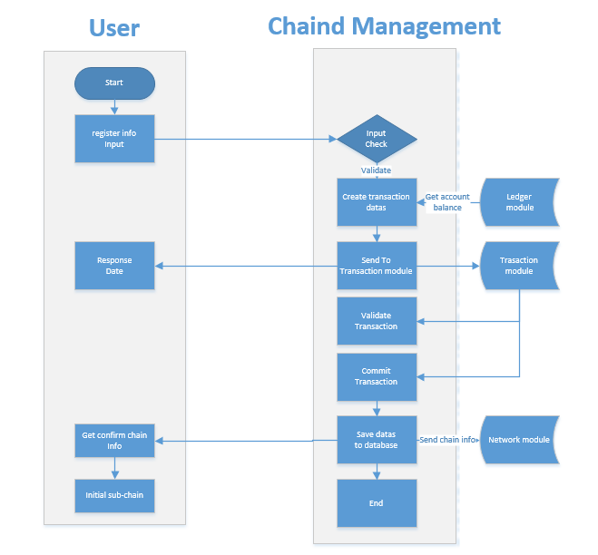
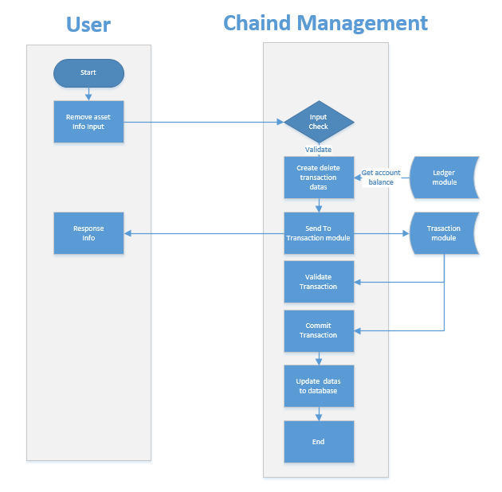

# Chain management module design document

[TOC]

## 1、General description

### 1.1 Module overview

#### 1.1.1 Why do you have a Chain Management module

In NULS 1.0, there is only one chain (NULS main network), so no chain management module is required.

In NULS 2.0, the NULS main network can register other friend information, including:        

- Chains in the NULS ecosystem: Derived from the same set of code as the NULS main network.
- Other chains: Bitcoin, Ethereum, etc.

The Chain Management module is used to manage all the friends that join the NULS main network.


Glossary：

- NULS main network: Unlike NULS 1.0, it is another chain that runs independently, also known as NULS 2.0."Chain Management" is one of the modules of the NULS main network.
- Friends Chain: Other chains registered on the NULS main website.


Hypothesis 1: Friendship A, which owns asset A

Hypothesis 2: Friendship B, which owns asset B

- Cross-chain trading：
  - Friend chain A transfers asset A to friend chain B
  - Friendship B internal transfer of assets A
  - Friend Chain B turns asset A back to friend chain A
  - Friendship B transfers asset A to other friends (C, D, etc.)
- Non-cross-chain trading：
  - Friend Chain A Internal Transfer Asset A
  - Friendship B internal transfer of assets B

Remarks: Regardless of the assets in the chain or the assets outside the chain, as long as the assets are traded across the chain, the main network needs to be confirmed.


#### 1.1.2  What does "Chain Management" do?

The Chain Management module is used to manage basic information about the chain that joins the NULS main network, including:

* Sign up for a new friend chain
* Destroy existing friendship chains
* Query friend information
* Increase the asset type for a specific friend chain
* Destroy asset type for a specific friend chain
* Cross-chain asset verification


#### 1.1.3  The Positioning of "Chain Management" in the System

"chain management"  dependent module：

- Kernel module
- Network module
- Transaction management module
- Account module

   "chain management" weakly dependent module：

- Event bus module


### 1.2 Module internal architecture diagram


## 2、feature design

### 2.1 Functional architecture diagram


### 2.2 Module service

#### 2.2.1 Sign up for a new friend chain

* Function Description：

  he NULS main network will provide an entry (web page) through which you can register a new friend chain to the NULS main network.

* Process description


  

步骤描述：

Step description:

    1> The user registers the registration chain information with the terminal and the asset information initialized with the chain.
    
    2> The chain management module performs the encapsulation of the chain transaction and sends it to the transaction module.
         During the period, you need to obtain the account balance and the transaction nonce value through the ledger module.
          A success or failure message is returned to the user after the transaction is sent.
    
    3>The transaction module will perform a callback of the data check during the transaction process.
    
    4>The chain management module performs registration data submission through the transaction module callback interface of the “submission chain registration transaction”.
    
    5> The chain management module stores the data and sends the registration information to the network module.
    
    6> The registration chain requires 1000NULS, of which 20% is directly destroyed, 80% is used for mortgages, and is returned when assets are deleted.


- Interface definition

  - Interface Description

  ​      Register friendchain information with the chain management module.

  ​        method : cm_chainReg

  - Request example

  ```
  {
          "chainId": 152,
          "assetId": 23,
          "chainName": "nuls chain",
          "addressType": "1",
          "magicNumber":454546,
          "supportInflowAsset":"1",
          "minAvailableNodeNum":5,
          "singleNodeMinConnectionNum":5,
          "txConfirmedBlockNum":30,
          "address":"NsdxSexqXF4eVXkcGLPpZCPKo92A8xpp",
          "assetId":85,
          "symbol":"NULS",
          "assetName":"NULS CHAIN",
          "initNumber":"1000000000",
          "decimalPlaces":8,
          "password":"xxxxxxxxxxxxx"
          
  }
  ```
  - Request parameter description

  | parameter               | required | type   | description                                                  |
  | :---------------------- | :------- | :----- | ------------------------------------------------------------ |
  | chainId                 | true     | int    | Chain identification                                         |
  | assetId                 | true     | int    | asset id                                                     |
  | chainName               | true     | string | Chain name                                                   |
  | addressType             | true     | int    | The address type of the account created on the chain: 1 within the ecological 2 non-ecological |
  | magicNumber             | true     | string | Network magic parameter                                      |
  | minAvailableNodeNum     | true     | int    | Minimum number of available nodes                            |
  | singleNodeConMinNodeNum | true     | int    | Minimum number of single node connections                    |
  | txConfirmBlockNum       | true     | int    | Transaction confirmation block number                        |
  | symbol                  | true     | string | Asset symbol                                                 |
  | assetName               | true     | string | Asset Name                                                   |
  | initNumber              | true     | string | Initial value of assets                                      |
  | decimalPlaces           | true     | int    | Minimum asset separable digits                               |
  | address                 | true     | string | Create the primary network address of the chain              |
  | password                | true     | string | Password corresponding to the private key                    |

  - Return example

     Failed

     ```
     Unified RPC standard format
     
     ```

     Success

     ```
     {
     "seeds":"xxx.xxx.xxx.xxx:8001,xxx.xxx.xxx.xxx:8002"
     }
     
     ```

  - Return field description

  | parameter | type   | description |
  | --------- | ------ | ----------- |
  | seeds     | String | Seed node   |


* Dependent service

  - Network management module
  - Transaction management module, send transaction
  - Account book module, get the book information


#### 2.2.2  Log out of existing friends

- Function Description：

  The NULS main network will provide an entry (web page) through which you can log out existing friends.

- Process description

  

   1>The chain is created with the asset, so the logout chain must be checked for assets. Only the last asset will be deleted and the chain will be logged off.

  2>Conditions for determining whether to allow cancellation:

​        Assets and chains exist.

​       There is only one last asset with the chain.

​       Chain assets have n% of assets in their own main chain.

3>The chain management module performs the encapsulation of the chain transaction and sends it to the transaction module.

​       During the period, you need to obtain the account balance and the transaction nonce value through    the ledger module.

4>The transaction module will perform a callback of the data check during the transaction process.

5>The chain management module performs the logout data submission through the transaction module callback interface of the “commit chain cancellation transaction”.

6>The chain management module stores the data and sends the registration information to the network module.

7>Deleting the chain with the cancelled assets will return 80% of the mortgage deposit.

- Interface definition

  - Interface Description

  ​        Unregister the chain information to the chain management module (the asset logout interface is called because the chain is logged off with the last asset)

  ​        method : cm_assetDisable

  - Request example

  ```
  {
          "chainId": 152,
          "assetId": 45,
          "address":"NsdxSexqXF4eVXkcGLPpZCPKo92A8xpp",
          "password":"xxxxxxxxxxxxx"
          
  }
  ```

  - Request parameter description

  | parameter | required | type   | description                                          |
  | :-------- | :------- | :----- | ---------------------------------------------------- |
  | chainId   | true     | int    | Chain identification                                 |
  | assetId   | true     | int    | Asset id                                             |
  | address   | true     | string | Create the main network account address of the chain |
  | password  | true     | string | Password corresponding to the private key            |

  - Return example

    Failed

    ```
    Unified RPC standard format
    
    ```

    Success

    ```
    Unified RPC standard format
    
    ```

  - Return field description

  | parameter | type | description |
  | --------- | ---- | ----------- |
  |           |      |             |

- Dependent service

  - Network management module
  - Transaction management module, send transaction
  - Ledger module, checkbook information

#### 2.2.3  Increase asset information

- Function Description：

  The NULS main network will provide an entry (web page) through which the selection chain and registered assets can be registered.

- Process description


Step description:
​    1>The user enters the asset information through the terminal selection chain and the chain: judge whether the assets overlap.
​    2> The chain management module performs the encapsulation of the chain transaction and sends it to the transaction module.
​        During the period, you need to obtain the account balance and the transaction nonce value through the ledger module.
​    3> The transaction module will perform a callback of the data check during the transaction process.
​    4> The chain management module performs registration data submission through the transaction module callback interface of “submit asset registration transaction”.
​    5> Registered assets receive 1000NULS, of which 20% are directly destroyed, 80% are used for mortgage, and returned when assets are deleted.

- Interface definition

  - Interface Description

  ​        Register asset information with the chain management module

  ​        method : cm_assetReg

  - Request example

  ```
  {
          "chainId": 152,
          "assetId":85,
          "symbol":"NULS",
          "assetName":"NULS",
          "initNumber":"1000000000",
          "decimalPlaces":8,
           "address":"NsdxSexqXF4eVXkcGLPpZCPKo92A8xpp",
          "password":"xxxxxxxxxxxxx"
          
  }
  ```

  - 请求参数说明

  | parameter     | required | type   | description                                     |
  | :------------ | :------- | :----- | ----------------------------------------------- |
  | chainId       | true     | int    | Chain identification                            |
  | symbol        | true     | string | Asset symbol                                    |
  | assetName     | true     | string | Asset Name                                      |
  | initNumber    | true     | string | Initial value of assets                         |
  | decimalPlaces | true     | int    | Minimum asset separable digits                  |
  | address       | true     | string | Create the primary network address of the chain |
  | password      | true     | string | Password corresponding to the private key       |

  - Return example

    Failed

    ```
    Unified RPC standard format
    ```

    Success

    ```
    Unified RPC standard format
    ```

  - Return field description

  | parameter | type | description |
  | --------- | ---- | ----------- |
  |           |      |             |


- Dependent service

  - Transaction management module, send transaction
  - Account book module, get the book information


#### 2.2.4 Deleting an asset type for a specific friend chain

- Function Description：

  The NULS main network will provide an entry (web page) through which the assets can be destroyed for the specified friend chain.

- Process description

  

  Step description:
  1> When there are multiple assets registered, the single asset is allowed to be written off. If there is only one asset, the asset is written off along with the chain.
  2> Conditions for determining whether to allow cancellation:
  ​     There are multiple assets in the chain.
  ​     Chain assets have n% of assets in their own main chain.
  3>The chain management module performs the encapsulation of the chain transaction and sends it to the transaction module.
  ​     During the period, you need to obtain the account balance and the transaction nonce value through the ledger module.
  4>The transaction module will perform a callback of the data check during the transaction process.
  5>The chain management module performs the logout data submission through the transaction module callback interface of the “commit chain cancellation transaction”.
  6>The cancellation of the assets will be refunded 80% of the mortgage deposit.

- Interface definition

  - Interface Description

  ​        Log out asset information to the chain management module

  ​        method : cm_assetDisable

  - Request example

  ```
  {
          "chainId": 152,
          "assetId": 45,
          "address":"NsdxSexqXF4eVXkcGLPpZCPKo92A8xpp",
          "password":"xxxxxxxxxxxxx"
          
  }
  ```

  - Request parameter description

  | parameter | required | type   | description                                          |
  | :-------- | :------- | :----- | ---------------------------------------------------- |
  | chainId   | true     | int    | Chain identification                                 |
  | assetId   | true     | int    | Asset id                                             |
  | address   | true     | string | Create the main network account address of the chain |
  | password  | true     | string | Password corresponding to the private key            |

  - Return example

    Failed

    ```
    Unified RPC standard format
    
    ```

    Success

    ```
    Unified RPC standard format
    
    ```

  - Return field description

  | parameter | type | description |
  | --------- | ---- | ----------- |
  |           |      |             |


  - Dependent service

    - Transaction management module, send transaction
    - Ledger module, checkbook information

#### 2.2.5 Chain asset verification for cross-chain transactions

- Function Description：

  When the transaction module generates a cross-chain transaction, the interface is called to perform cross-chain asset verification.

- Process description

  1>Check chain and assets are registered normally in the cross-chain module

  2>Check if the amount of assets on the chain is overdrawn.

  3>Verify that the asset status is normal.

- Interface definition

  - Interface Description

  ​      Submit verification to chain management when cross-chain assets are in circulation

  ​        method : cm_assetCirculateValidator

  - Request example

  ```
  {
          "coinDatas": "FFAABB214324"       
  }
  ```

  - Request parameter description

  | parameter | required | type   | description                       |
  | :-------- | :------- | :----- | --------------------------------- |
  | coinDatas | true     | String | Trading the HEX value of coindata |

  - Return example

    Failed

    ```
    Unified RPC standard format
    
    ```

    Success

    ```
    Unified RPC standard format
    
    ```

  - Return field description

  | parameter | type | description |
  | --------- | ---- | ----------- |
  |           |      |             |


- Dependent service

  - Transaction management module, cross-chain transaction verification call

#### 2.2.6  Chain asset submission for cross-chain trading

- Function Description：

  When the transaction module generates a cross-chain transaction and verifies the pass, it calls the interface to submit the cross-chain asset.

- Process description

    Used to change chain assets and manage them for chain assets

   Direct call  cm_assetCirculateCommit  

- Interface definition

  - Interface Description

  ​       When the cross-chain asset is circulated, the transaction can be submitted to the chain management when the verification is passed and the confirmation is submitted.

  ​        method : cm_assetCirculateCommit

  - Request example

  ```
  {
          "coinDatas": "FFAABB214324"       
  }
  ```

  - Request parameter description

  | parameter | required | type   | description                       |
  | :-------- | :------- | :----- | --------------------------------- |
  | coinDatas | true     | String | Trading the HEX value of coindata |

  - Return example

    Failed

    ```
    Unified RPC standard format
    
    ```

    Success

    ```
    Unified RPC standard format
    
    ```

  - Return field description

  | parameter | type | description |
  | --------- | ---- | ----------- |
  |           |      |             |


- Dependent service

  - Transaction management module, cross-chain transaction call

#### 2.2.7 Registration of chain management transaction processing functions

- Function Description：

   When the module is started, registration of the transaction callback function is required, so that the transaction module performs callback processing when performing related type transaction processing.

  The registration function is divided into 4 categories: 1> transaction verification 2> transaction submission 3> transaction rollback 4> module batch transaction verification within a block  

- Process description

  1>Chain management module startup.

  2>Determine whether the transaction module RPC call status is accessible.

  3>Submit callback interface.

- Interface definition

  See the "Registering a Transaction" section in the Transaction Module Design Document.

- Dependent service

  - Transaction management module

#### 2.2.8  Query chain information

- Function Description：

  Query registration chain information

- Process description

​        NA

- Interface definition

  - Interface Description

  ​        Query registration friend information

  ​        method : cm_chain

  - Request example

  ```
  {
     "chainId":4545 
  }
  ```

  - Request parameter description

  | parameter | required | type | description          |
  | :-------- | :------- | :--- | -------------------- |
  | chainId   | true     | int  | Chain identification |

  - Return example

    Failed

    ```
    Unified RPC standard format
    
    ```

    Success

    ```
    {
            "chainId": 152,
            "chainName": "nuls chain",
            "addressType": 1,
            "magicNumber":454546,
            "supportInflowAsset":"1",
            "minAvailableNodeNum":5,
            "singleNodeMinConnectionNum":5,
            "txConfirmedBlockNum":30,
            "regAddress":"NsdxSexqXF4eVXkcGLPpZCPKo92A8xpp",
            "regTxHash":"FFFFF", 
            "selfAssetKeyList":["1232_32","528_8"],
            "totalAssetKeyList":["1232_32","528_8"],
            "createTime":1212131，
            "seeds":"xxx.xxx.xxx.xxx:8001,xxx.xxx.xxx.xxx:8002"
    }
    ```

  - Return field description

  | parameter               | type   | description                                                  |
  | :---------------------- | :----- | ------------------------------------------------------------ |
  | chainId                 | int    | Chain identification                                         |
  | chainName               | string | Chain name                                                   |
  | addressType             | int    | The address type of the account created on the chain: 1 within the ecological 2 non-ecological |
  | magicNumber             | string | Network magic parameter                                      |
  | minAvailableNodeNum     | int    | Minimum number of available nodes                            |
  | singleNodeConMinNodeNum | int    | Minimum number of single node connections                    |
  | txConfirmBlockNum       | int    | Transaction confirmation block number                        |
  | regTxHash               | string | Transaction hash                                             |
  | regAddress              | string | Create the primary network address of the chain              |
  | selfAssetKeyList        | list   | List of assets registered under the chain, asset key value combined by chainId_assetId |
  | totalAssetKeyList       | list   | List of assets circulating under the chain, asset key value combined by chainId_assetId |
  | createTime              | long   | Creation time                                                |
  | seeds                   | String | cross Seed node                                              |


- Dependent service

   NA

#### 2.2.9  Query chain asset information

- Function Description：

  Query a chain asset information

- Process description

​        NA

- Interface definition

  - Interface Description

  ​        Query the asset management module for an asset information.

  ​        method : cm_asset

  - Request example

  ```
  {
     "chainId":4545， 
     "assetId":45
  }
  ```

  - Request parameter description

  | parameter | required | type | description          |
  | :-------- | :------- | :--- | -------------------- |
  | chainId   | true     | int  | Chain identification |
  | assetId   | true     | int  | Asset id             |

  - Return example

    Failed

    ```
    Unified RPC standard format
    
    ```

    Success

    ```
    {
            "chainId": 152,
            "assetId":85,
            "symbol":"NULS",
            "assetName":"NULS ASSET",
            "initNumber":"1000000000",
            "decimalPlaces":8,
            "address":"NsdxSexqXF4eVXkcGLPpZCPKo92A8xpp",
            "txHash":"xxxxxxxxxxxxx",
            "createTime":125848
            }
    ```

  - Return field description

  | parameter     | type   | description                                     |
  | :------------ | :----- | ----------------------------------------------- |
  | chainId       | int    | Chain identification                            |
  | symbol        | string | Asset symbol                                    |
  | assetName     | string | Asset Name                                      |
  | initNumber    | string | Initial value of assets                         |
  | decimalPlaces | int    | Minimum asset separable digits                  |
  | address       | string | Create the primary network address of the chain |
  | txHash        | string | Transaction hash                                |
  | createTime    | long   | Creation time                                   |

- Dependent service

   NA

## 3、Event description

* Chain registration event
* Chain logout event
* New asset event
* Logout asset event


## 4、protocol

### 4.1 Network communication protocol

####  4.1.1 Asking the friend chain for the total amount of assets issued 

- Message description: Periodic chain management initiates the issue of total asset data request message to the friend chain
- cmd：requestAssetAmount

| Length | Fields     | Type   | Remark        |
| ------ | ---------- | ------ | ------------- |
| 2      | chainId    | uint16 | Chain Id      |
| 2      | assetId    | uint16 | Asset id      |
| 4      | randomCode | uint32 | random number |

#### 4.1.1 Receive the total amount of assets returned by the friend chain 

- Message Description: Received a reply from the friend chain to the asset.
- cmd：responseAssetAmount

| Length | Fields     | Type       | Remark              |
| ------ | ---------- | ---------- | ------------------- |
| 2      | chainId    | uint16     | Chain Id            |
| 2      | assetId    | uint16     | Asset id            |
| 48     |            | biginteger | Total assets amount |
| 4      | randomCode | uint32     | random number       |


### 4.2 Transaction agreement

##### 4.2.1 Sign up for a new friend chain

Compared with the general transaction, only the type and txData are different, the specific difference is as follows

Transaction type definition：10101

txData definition

| Length | Fields                     | Type       | Remark                                |
| ------ | -------------------------- | ---------- | ------------------------------------- |
| 2      | chainId                    | uint16     | Chain ID                              |
| ？     | name                       | byte[]     | Chain Name                            |
| 1      | addressType                | uint8      | address type                          |
| 4      | magicNumber                | uint32     | Magic parameter                       |
| 1      | supportInflowAsset         | uint8      | Whether to spend asset inflows        |
| 2      | minAvailableNodeNum        | uint16     | Minimum number of available nodes     |
| 2      | singleNodeMinConnectionNum | uint16     | Single node minimum connection number |
| ？     | address                    | byte[]     | Account address                       |
| 2      | assetId                    | uint16     | Asset id                              |
| ？     | symbol                     | byte[]     | symbol                                |
| ？     | assetName                  | byte[]     | Asset name                            |
| 2      | depositNuls                | uint16     | Mortgage NULS quantity                |
| 48     | initNumber                 | Biginteger | Initial quantity of assets            |
| 1      | decimalPlaces              | uint8      | Minimum number of assets              |


##### 4.2.2  Log out of existing friends

Compared with the general transaction, only the type and txData are different, the specific difference is as follows

Transaction type definition：10102

  txData definition：Same as 4.2.1 chain registration transaction


##### 4.2.3 New friend chain assets

Compared with the general transaction, only the type and txData are different, the specific difference is as follows

Transaction type definition：10103

txData definition：

| Length | Fields        | Type       | Remark                     |
| ------ | ------------- | ---------- | -------------------------- |
| 2      | chainId       | uint16     | Chain Id                   |
| 2      | assetId       | uint16     | Asset id                   |
| ？     | symbol        | byte[]     | symbol                     |
| ？     | assetName     | byte[]     | Asset name                 |
| 2      | depositNuls   | uint16     | Mortgage NULS quantity     |
| 48     | initNumber    | Biginteger | Initial quantity of assets |
| 1      | decimalPlaces | uint8      | Minimum number of assets   |
| ？     | address       | byte[]     | Account address            |

##### 4.2.2  Log out of existing assets

  Compared with the general transaction, only the type and txData are different, the specific difference is as follows

  Transaction type definition：10104

  txData definition：New transactions with 4.2.3 assets


## 5、Module configuration

```
[system]
language = en
encoding = UTF-8

[db]
rocksdb.datapath = ../data

[param]
asset_symbol_max = 5
asset_name_max = 20
asset_depositNuls = 200000
asset_depositNuls_destroy_rate = 0.2
asset_depositNuls_lock_rate = 0.8
asset_initNumber_min = 10000
asset_initNumber_max = 100000000
asset_decimalPlaces_min = 4
asset_decimalPlaces_max = 8
asset_recovery_rate = 0.9

[defaultAsset]
nuls_chain_id = 8964
nuls_chain_name = nuls chain
nuls_asset_id = 1
nuls_asset_initNumber_max = 100000000
nuls_asset_symbol = NULS
```


## 6、Java-specific design

NA

## 7、to add on

NA

