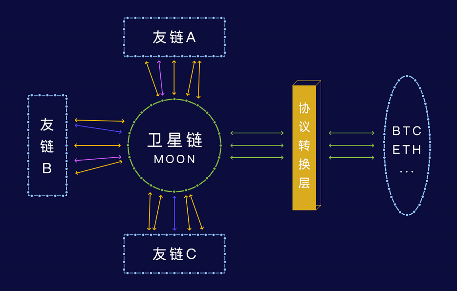
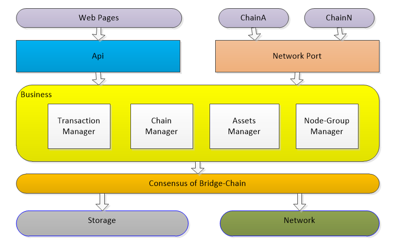
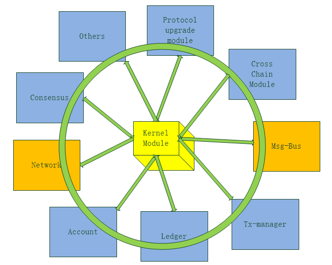

Chapter 1

[TOC]

## 一、行业背景

区块链是去中心化应用的操作系统，需要跨链技术把一个个运行的操作系统连接起来，才能形成生态的大发展，即区块链的互联网。

秉承让区块链更简单的思想，让NULS成为最重要的区块链基础设施之一，故NULS核心团队决定开发更开放的、包容的、全新的模块化底层架构，其核心目的围绕让区块链更简单进行一系列的尝试。
其一：丰富NULS的模块
新的架构让NULS的模块能够独立运行，通过标准的基础模块接口，组合一套基础的区块链运行框架。NULS模块不限制任何开发者，支持所有可以提供http服务的编程语言，尽最大可能去争取每一个区块链技术人员的参与，不设置任何门槛。在这基础之上，延伸出更多的可能性。

其二：建设NULS的技术社区
NULS是一个纯正的区块链项目，融合区块链思想打造一个开发、自由、进化的区块链社区，所以NULS的生命力取决于社区的发展程度，尤其是技术社区的建设程度。所以NULS利用全新架构设计的同时，同步大力重视与发展技术社区，让技术社区和核心开发团队一开始就“不分家”；以技术的开放性和理想的前瞻性来吸引全世界各个地区的区块链开发中加入。

基于以上内容，NULS核心团队发起了新版本架构的设计工作，希望社区中的伙伴们积极参与，为NULS的建设，为区块链行业的发展，贡献出自己的力量，收获一个美好的明天。

## 二、设计目标

* 定义跨链标准，实现不同区块链间的通信。
* 搭建“卫星链”，实现不同区块链间的资产流转。
* 使用微服务架构，各模块为独立进程的服务，不限制开发语言

说明：

* 为什么要做跨链

  区块链被很多媒体介绍为下一代的互联网，这个说法是很有道理的，但是目前距离实现还非常遥远，有非常多的路要走，而区块链要成为真正的互联网，还有一个关口要迈过，那就是价值的传递。目前来看有两种解决方案：1、一条区块链完成所有应用、用户的价值传递。2、一种通用的区块链间的价值传递协议。第一个方案看似简单，但受到的限制非常多，很难实现。NULS认为方案2是当前环境下更好的解决方案，所以在向这个方向努力，跨链协议和相关的配套设施就是在这个方向上努力的第一步。

* 从模块化到微服务

  nuls是一个模块化的底层基础设施，目前运行的区块链程序都是基于Java语言实现的，模块化也只做到了编码层的模块化，我们的目标是一个更加灵活的，运行状态的模块化底层设施。它应该可以支持任何想做技术贡献的人参与，所以不应该设置语言门槛，它应该更加易于扩展、修改、替换，它的每一个模块应该是简单的、存粹的，不应该受到区块链程序整体的复杂度影响。于是我们提出了微服务的架构思路，让模块更独立，模块的业务更单纯，模块支持多语言开发，模块更易于扩展，模块支持分布式部署，模块的插拔更容易……

风险：

​	区块链客户端对性能的要求比较高，新架构下每个模块都是独立的进程，进程间通过http协议通讯，在没有初步搭建起网络的情况下，只能通过一些简单的性能测试预估性能指标，是有可能满足不了一个高性能区块链应用的要求的。解决方式：尽量短的时间内搭建一套简单的网络，对性能进行更准确的测试。

## 三、总体方案

### 3.1总体架构

说明：

​	一条独立的卫星链，负责和所有链对接。以开放的方式实现链间通信

​	基于NULS模块仓库实现的区块链（生态内的区块链），可以通过模块选择的方式，添加跨链模块，实现底层上可以和卫星链互通。

​	针对以太坊和比特币等，不受NULS影响的公有链，需要通过特殊的机制实现协议的转换，将公有链的协议和NULS跨链协议做适配，达到统一协议通讯的目的。

​	所有区块链都只和卫星链通信，交易的验证由卫星链负责，各平行链信任卫星链的验证结果。

* 链间连接方式

  区块链上的每个节点都运行跨链模块，每个节点都连接卫星链上的部分节点。通过随机算法决定连接那些节点，尽可能的确保节点连接的分散，保证网络的安全性。

* 多算法适配

  卫星链支持市面上大部分数学算法，包括摘要算法、对称加密、非对称加密等，可以通过算法库提供的统一的接口进行使用

* 社区化治理

  卫星链会内置社区治理机制，包括系统运行参数修改、协议升级、恶意链处理、社区资金使用等等功能

## 四、 卫星链设计

###  4.1 卫星链架构

 

* 卫星链使用POC共识机制，结合拜占庭容错机制实现跨链交易的确认和打包，做到去中心化和性能、安全性的兼顾。
* 卫星链上的每个节点都会连接多个区块链的多个节点，因为协议是统一定义的NULS跨链协议，所以可以实现单个节点同时连接不同的区块链上的多个节点。
* 卫星链提供链管理机制，用来管理所有的在卫星链上登记的对等区块链。登记的内容包括链信息、资产信息、跨链抵押金等内容
* 当一条区块链上收到其他链的资产时，需要在本链产生对应的资产。不同区块链上的token，都以资产的方式在其他链上存储
* 一条区块链中转入其他链资产的明细会在卫星链中存储，该资产转出这条区块链时，会进行验证，不允许非法的资产从该区块链中产生，对有恶意的区块链，会通过社区机制进行处理，如：暂停跨链、中止跨链、没收保证金等
* 卫星链将提供Api使用手册，任一开发者都可以根据手册开发自己的钱包、浏览器、轻钱包等工具
* 为了降低卫星链的业务复杂度，将不在卫星链中运行智能合约
* 卫星链中提供协议供应用扩展，可以使用该协议进行DAPP的开发和跨链协议的优化

### 4.2 卫星链的运行

* 卫星链以模块化的方式架构
* 每个模块都是一个可以独立运行的微服务
* 微服务之间直接通过http协议通信
* 模块不限制开发语言
* 提供微内核模块负责服务管理、配置管理和数据共享功能
* 卫星链的模块在一定程度上将可以与NULS主网共用，所以卫星链的模块也会和NULS的模块一样加入到NULS模块仓库中，供“链工厂”等应用直接使用
* 每个模块在使用的同时都支持扩展，即如果模块仓库中的模块只能满足部分业务需求时，可以对该模块进行扩展，以避免重新开发的工作量

### 4.3 链工厂的底层支撑

​	未来的NULS生态中，会存在一个NULS主网和若干条应用链，目前规划中已经有两条基础应用链要搭建，智能合约链和链工厂应用链。链工厂是一个应用，同时也是一条区块链，用户可以在链上发行自己的链，链工厂中的节点可以选择自己的节点运行几条链，实现硬件设备的共享。

​	链工厂基于NULS模块搭建，所以在设计NULS模块时，考虑同时运行多条链的支持。

##  五、核心流程

### 5.1 跨链交易流程

1、友链A中的a地址发起交易tx_a，转移aCoin到B链的b地址上

* b地址的格式为以ChainId_B起始的nuls格式的地址，当资产转移到该地址后，该地址不允许在A链上发起交易，即：其他链的地址不能在本链发起交易
* 将此交易根据跨链协议，生成一个卫星链的交易tx_a_trans，用a的私钥对跨链交易签名。

2、tx_a在A链中打包，并在n块确认后由跨链模块（独立于A链功能之外的基本模块）发送卫星链。

3、跨链模块将该交易广播给连接的卫星链节点（广播方式：先广播hash，等待对方获取完整交易）

4、卫星链节点（交易管理模块）收到该交易（tx_a_trans）后，先进行基础校验（格式、必填字段、签名、链余额等），通过后询问连接的A链节点，是否有一个tx_a_hash的交易被确认了n块，且转换为卫星链格式交易后，交易摘要为tx_a_trans_hash。

5、卫星链节点汇总询问的结果，如果超过51%的节点确认了该交易，则本节点认可该交易

* 普通节点询问任意个节点，共识节点询问全部节点，普通节点在任意3个节点确认的情况下就转发该交易，否则丢弃。共识节点得到超过51%节点的确认，则对tx_a_trans_hash签名，并将hash和签名数据广播到网络中。

6、卫星链共识节点汇总本链中的跨链交易签名，当一个交易的签名者超过共识节点总数的80%，则认为该交易可以被打包到区块中。

* 该功能由“交易管理”模块提供，当完成80%签名收集后，将交易推送给共识模块准备打包

7、卫星链共识节点的共识模块在打包时，验证签名数量和转出链的资产余额，符合要求则将交易打包进区块。

8、区块确认逻辑：验证区块中包含的跨链交易时，验证签名数量和转出链的资产余额，符合要求就确认该交易

9、当交易所在的区块被确认后，“交易管理模块”推送该交易（tx_a_trans）到目标链节点中

10、目标链的跨链模块接收到该交易后，询问连接的卫星链节点，该交易是否存在且已被确认，如果超过51%的节点确认了该交易，则本节点认可该交易。

11、节点认可了该交易后，由跨链模块将tx_a_trans转换为B链的资产交易，并广播

12、如果该节点是B链最近20块的出块者（pow需要适配），则在广播前对该交易进行签名

13、其他节点统计该交易的签名，当签名者达到了最近20块的出块者的80%时，该交易可以被打包（打包者也要确认该交易），且打包的交易中包含所有签名

14、区块被确认后，b地址产生相应的a资产，并可以使用。

15、完成

### 5.2 区块处理流程

1、“交易管理”模块验证通过的交易，都会放入内存池中，等待打包

2、“共识模块”打包时调用“交易管理"模块的获取待打包交易接口获取可以打包的交易

* “交易管理"模块对本地交易验证coindata和业务冲突

* “交易管理"模块对跨链交易验证签名个数和链对应资产的余额

3、“共识模块”生成coinbase交易和punish交易

4、生成区块头并打包区块

5、广播区块头

6、将区块加入“区块管理”模块的验证队列

7、验证线程将区块取出，并进行验证

8、通过验证后，依次确认每一笔交易

9、存储交易和区块头

10、完成

### 5.3 本链交易处理流程

1、组装业务数据到交易中

2、向“账本”模块获取账户余额，计算手续费及找零，填充数据到coindata

3、对交易进行签名

4、将本地交易交给“账本”模块进行存储

5、广播交易

6、将交易交给“交易管理”模块进行验证

7、验证通过的交易，放入内存池

8、共识模块获取待打包交易列表（“交易管理”模块重新验证交易）

9、“区块管理”模块验证通过后，调用交易的processor接口，处理交易的业务

10、和区块头一起存储在“区块管理”模块中

## 六、模块简要说明

| module name          | description                                                  |
| -------------------- | ------------------------------------------------------------ |
| kernel               | 内核模块，负责模块管理，服务治理、配置管理功能，是系统的核心 |
| account              | 账户模块，负责本地账户信息的存储、维护                       |
| block                | 区块管理：用于维护区块链数据，接收区块、分叉处理、验证区块、存储区块头 |
| chain                | 链管理：用于管理所有接入跨链协议的友链信息                   |
| consensus            | 共识模块：用于运行POC共识机制                                |
| ledger               | 账本模块：记录本地账户交易信息摘要，记录所有账户余额模型     |
| transaction          | 交易管理模块：交易的收集、验证、提交共识打包、交易处理、交易存储、查询 |
| network              | 网络模块：连接管理、节点管理、消息的接收和发送               |
| smart-contract       | 智能合约模块：提供智能合约引擎的所有功能                     |
| community-governance | 社区治理模块：链上治理方案的实现                             |
| event-bus            | 事件总线：发布和订阅事件                                     |
|                      |                                                              |

