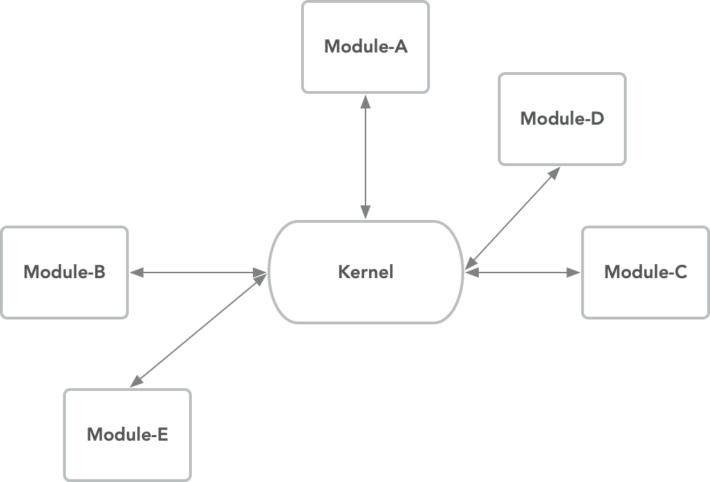
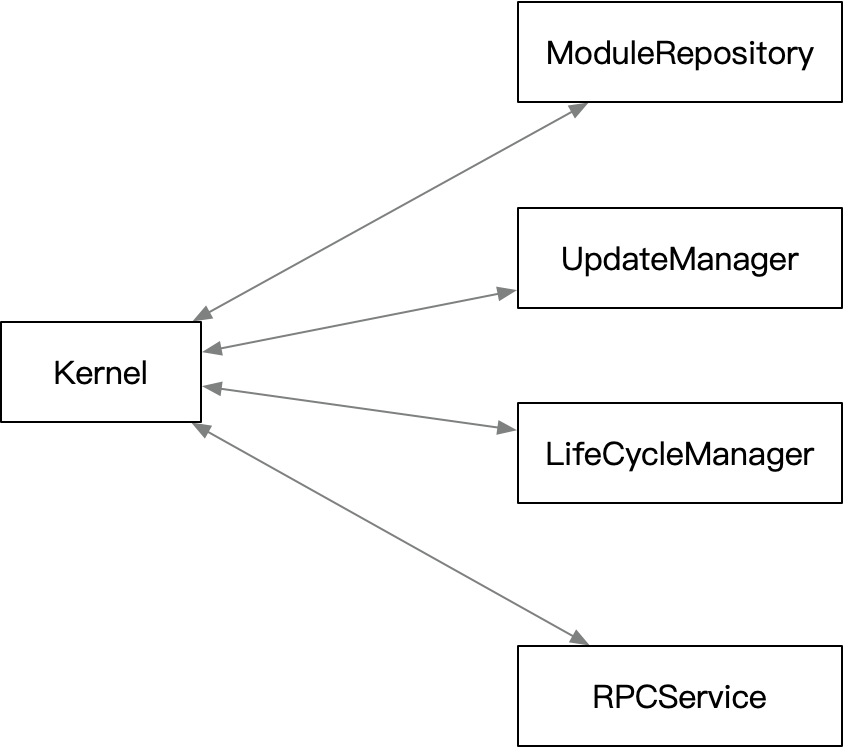

# 核心模块设计文档

[TOC]

## 一、总体描述

### 1.1 模块概述

#### 1.1.1 为什么要有《核心模块》

NULS 2.0 设计为多进程组件框架。需要一个管理者，作为启动器启动所有子组件。
同时作为子组件沟通的桥梁，配合组件之间的生命周期与依赖管理，接口发现等。

#### 1.1.2 《核心模块》要做什么

- 启动子组件，生命周期检查与维持
- 组件间的发现
- 组件依赖性管理与状态变更通知
- 心跳管理
- 提供整体的接口定义规范
- 为子模块提供自动更新功能

核心模块实现了接口规范中定义的所有命令。扫描所有子模块，传递启动参数执行子模块。
为子模块间协作提供了基础桥梁。
核心模块实现了自动更新功能，为符合规范要求的官方模块提供在线升级服务。

#### 1.1.3 《核心模块》在系统中的定位

将是所有组件的管理者。负责子组件的启动，停止等。
同时负责检测组件是否存在新版本，并提供升级服务。

### 1.2 架构图

Kernel 作为一个中心，用于子模块的相互发现。同时，提供 CMD 代理功能，转发 CMD 到实现该 CMD 的子模块中执行，并将执行结果返回给调用者。

> 注意：子模块间的RPC 调用不经过 kernel，可直接互访执行 CMD 请求获得结果。



## 二、功能设计

### 2.1 功能架构图

按职责，划分为四大类：模块仓库、更新管理、状态与依赖管理 和 RPC 服务。

模块仓库会识别出本地磁盘上符合标准的子模块。
更新管理会拉取远端仓库的所有子模块版本信息，与模块仓库中的本地已有的子模块对比，找出存在更新到模块。
状态生命周期管理则负责启动子模块。存储子模块的状态与配置信息。当子模块的依赖条件发生变化时，主动通知。
RPC 服务就是模块间的通讯接口，管理器的所有RPC 功能都由此处导出。



### 2.2 模块服务

核心模块负责引导启动所有模块文件夹下的子模块。提供模块间的信息交换，依赖状态变更通知。

### 2.3 模块职责

核心模块主要实现了接口规范中描述的管理规范接口。

#### 2.3.1 配置参数管理

每个模块独立存储配置信息，核心模块会缓存一份当前所有子模块的配置信息表。

通过核心模块修改子模块信息，核心模块通知子模块执行成功后才会修改本地缓存。

当子模块主动修改了自定义配置信息，则会主动发出一个 status 请求，更新核心管理器中的缓存。

#### 2.3.2 依赖管理

子模块启动后，通过 version 命令传递了自己的依赖模块列表。
核心模块通过 status 命令请求子模块时，参数 available 表达子模块的依赖是否已满足。
当 available 为 true 时，子模块应启动自己的业务处理。
当收到 available 为 false 时，子模块应当停止业务处理。等待 available 标志重新为 true。

#### 2.3.3 自动更新

[*] 待定

#### 2.3.4 启动参数

启动子模块进程时，会通过命令行参数传递一些必备的参数给子模块。

| properties       | description                                              |
| ---------------- | :------------------------------------------------------- |
| --kernel-addr    | 核心模块工作的 IP 地址与端口。忽略 IP 地址则代表本地网络 |
| --data-folder    | 可恢复数据存储根目录。                                   |
| --profile-folder | 用户数据存储根目录                                       |

> **data-folder 与 profile-folder 的细节**
> --data-folder 中存储的数据被删除后可以从链上恢复。主要存储链上数据。
> --profile-folder 中存储不可恢复的用户数据，如用户的地址私钥。
> 子模块在使用 data 与 profile 目录时，都需要创建一个子目录，将自己的数据存放在子目录中。

### 2.4 核心模块RPC 命令表

#### version

- 接口说明

子模块启动后，主动请求 kernel 模块，上报自己的版本信息、可提供的 CMD 表、依赖模块、RPC 工作端口等信息。

- 请求示例

```json
{
"cmd":"version",
"params": [{
    "version":"请求者自己的版本号",
    "author": "作者",
    "url":"首页",
    "rpcList":[
        {
            "method": "nuls_accounts",
            "version": 1
        },
        {
            "method": "nuls_nodes",
            "version": 1
        }
    ],
    "dependsModule":["network","asset"],
    "port":10000
}]
}
```

- 请求参数说明

| index | parameter | required | type  | description |
| :---: | :-------: | :------: | :---: | :---------- |
| 0     | version   | true     | map   | 子模块信息 |

version

| properties    | required | type          | description              |
| :------------ | -------- | :------------ | :----------------------- |
| version       | true     | String        | 子模块版本号             |
| rpcList       | true     | array[{}]     | 子模块披露的所有命令集合 |
| dependsModule | true     | array[String] | 依赖的子模块列表         |
| port          | true     | short         | 子模块 RPC 工作端口      |

- 返回示例

Success

```json
{
"code":0,
"version": 1.2,
}
```

- 返回字段说明

执行失败返回 code 非0。

#### status

- 接口说明

查询子模块当前运行状态。

- 请求示例

```json
{
    "cmd": "status",
    "params": []
}
```

- 请求参数说明

无

- 返回示例

```json
{
    "code": 0,
    "version": 1.0,
    "result": {
        "Module_A": {
            "status" : "",
            "rpcList":[],
            "dependsModule":[],
            "addr":"192.168.1.8",
            "port": 8100
        },
        "Module_B": {
            "status" : "",
            "rpcList":[],
            "dependsModule":[],
            "addr":"192.168.2.56",
            "port": 8200
        }
    }
}
```

- 返回字段说明

返回模块名为 key 的 map。map 中包含各模块的信息。

| parameter     | type          | description                                                                            |
| ------------- | ------------- | -------------------------------------------------------------------------------------- |
| status        | String        | 该模块当前状态：unknown 未知， ready 已连接， service 工作，shutdown 已通知停止服务。 |
| rpcList       | Enum          | 该模块提供的服务表                                                                     |
| dependsModule | array[String] | 依赖的模块名字列表                                                                     |
| addr          | ip            | 子模块的 IP                                                                            |
| port          | short         | 子模块的RPC工作端口                                                                    |

#### shutdown

- 接口说明

关闭 kernel 与所有运行的子模块。

- 请求示例

```json
{
    "method":"shutdown",
    "params":[]
}
```

- 请求参数说明

无

- 返回示例

```json
{
"code":0,
"version": 1.2,
}
```

- 返回字段说明

请求成功返回 0，否则返回失败错误码。

#### restart

- 接口说明

重启 kernel 与所有运行的子模块。

- 请求示例

```json
{
    "method":"restart",
    "params":[]
}
```

- 请求参数说明

无

- 返回示例

```json
{
"code":0,
"version": 1.2,
}
```

- 返回字段说明

请求成功返回 0，否则返回失败错误码。

#### terminate

- 接口说明

立即退出 kernel 与所有运行的子模块。所有未完成操作都将丢弃。

- 请求示例

```json
{
    "method":"terminate",
    "params":[]
}
```

- 请求参数说明

无

- 返回示例

```json
{
"code":0,
"version": 1.2,
}
```

- 返回字段说明

请求成功返回 0，否则返回失败错误码。

#### proxy

- 接口说明

通过 kernel 代理，去请求正在运行模块暴露的方法。

- 请求示例

```json
{
    "method":"proxy",
    "version":"1.1",
    "params":[
        "nuls_accounts",
        {
            "name":"wangkun",
            "nickname":"uncle",
            "features":"handsome"
        }
    ]
}
```

- 请求参数说明

| index | parameter    | required | type   | description        |
| ----- | ------------ | -------- | ------ | :----------------: |
| 0     | targetMethod | true     | String | 目标命令           |
| 1     | methodParams | true     | map    | 目标命令的请求参数 |

> methodParams 字段的参数会被 kernel 执行时作为最终请求的 params 实际参数。

- 返回字段说明

返回结果由目标方法决定。如果目标方法不存在，则返回相应错误码。

#### conf_get

- 接口说明

获取 kernel 当前生效的配置。当 params 为空时， 返回所有生效配置。否则，只返回存在的指定配置信息。

- 请求示例

```json
{
    "method":"conf_get",
    "params":["Key1","Key2"]
}
```

- 请求参数说明

- 空。查询kernel 所有的可配置信息。
- str。 查询指定的配置信息。对于不存在的配置，则忽略。

- 返回示例

```json
{
"code":0,
"version": 1.2,
"result":{
    "Key1": "value1",
    "Key2": "value2"
    }
}
```

- 返回字段说明

配置项键值对。具体意义参考自定义参数表。

#### conf_set

- 接口说明

修改 kernel 配置参数。

- 请求示例

```json
{
    "method":"conf_set",
    "version":"1.1",
    "params":[{
        "Key1": "newValue",
        "Key2": "newValue",
    }]
}
```

- 请求参数说明

| index | parameter | required | type | description    |
| ----- | --------- | -------- | ---- | :------------: |
| 0     | configure | true     | map  | 新的配置参数表 |

> configure: 要设置新值的键值对。

- 返回示例

```json
{
"code":0,
"version": 1.2
}
```

- 返回字段说明

修改成功返回0，否则返回错误码。

#### mod_status

- 接口说明

查询指定模块的状态信息。

- 请求示例

```json
{
    "method":"mod_status",
    "version":"1.1",
    "params":[ "Module_A","Module_B" ]
}
```

- 请求参数说明

- 空。 查询所有子模块的状态信息
- String。 查询指定模块名的状态信息

- 返回示例

```json
{
    "code": 0,
    "version": 1.0,
    "result": {
        "Module_A": {
            "status" : "",
            "rpcList":[],
            "dependsModule":[],
            "addr":"192.168.1.8",
            "port": 8100
        },
        "Module_B": {
            "status" : "",
            "rpcList":[],
            "dependsModule":[],
            "addr":"192.168.2.56",
            "port": 8200
        }
    }
}
```

- 返回字段说明

返回模块名为 key 的 map。map 中包含各模块的信息。

| parameter     | type          | description                                                                            |
| ------------- | ------------- | -------------------------------------------------------------------------------------- |
| status        | String        | 该模块当前状态：unknown 未知， ready 已连接， service 工作，shutdown 已通知停止服务。 |
| rpcList       | Enum          | 该模块提供的服务表                                                                     |
| dependsModule | array[String] | 依赖的模块名字列表                                                                     |
| addr          | ip            | 子模块的 IP                                                                            |
| port          | short         | 子模块的RPC工作端口                                                                    |

#### mod_conf_get

- 接口说明

查询模块提供的配置信息。

- 请求示例

```json
{
    "method":"mod_conf_get",
    "version":"1.1",
    "params":["mod_name","key1","key2"]
}
```

- 请求参数说明

| index | parameter  | required | type   | description |
| ----- | ---------- | -------- | ------ | :---------: |
| 0     | moduleName | true     | String | 模块标识    |
| 1     | key        | false    | String | 配置 Key    |

> 模块标识后可选声明0个或 N 个配置 Key。
> 只传递模块标识，则查询所有指定模块的配置信息。
> 如果指定了 key，则只查询指定 Key 的当前配置。如果 Key 不存在则忽略。

- 返回示例

```json
{
"code":0,
"version": 1.2,
"result":{
    "Key1":"value",
    "Key2":"value",
    }
}
```

- 返回字段说明

> 返回查询的指定模块配置信息。具体 key 含义请参考模块手册。

#### mod_conf_set

- 接口说明

设置指定模块配置信息。

- 请求示例

```json
{
    "method":"mod_conf_set",
    "version":"1.1",
    "params":[
        "ModuleName",
        {
            "name":"wangkun",
            "nickname":"uncle",
            "features":"handsome"
        }
    ]
}
```

- 请求参数说明

| index | parameter  | required | type   | description    |
| ----- | ---------- | -------- | ------ | :------------: |
| 0     | moduleName | true     | String | 模块标识       |
| 1     | configure  | true     | map    | 设置信息键值对 |

> configure 为要更新的键 与对应的新值。

- 返回示例

```json
{
"code":0,
"version": 1.2,
}
```

- 返回字段说明

> 执行成功返回0，否则返回失败错误码。

#### mod_update

- 接口说明

检查模块更新信息。

- 请求示例

```json
{
    "method":"mod_update",
    "version":"1.1",
    "params":["Module-A","Module-B"]
}
```

- 请求参数说明

> params 为空，则检查所有子模块的更新信息。
> params 为模块标识列表，则检查参数中指定的模块更新信息。

- 返回示例

```json
{
"code":0,
"version": 1.2,
"result":{
    "Module-A": {
        "currentVersion": "",
        "latestVersion": "",
        "list": {
            "1.3.1" : {
                "releaseDate": "",
                "url": "",
            },
            "1.3.0" : "",
        }
    },
    "Module-B": {

    }
    }
}
```

- 返回字段说明

> 返回以模块标识符为 key 的 map。值为指定模块的版本信息

| parameter      | type   | description                               |
| -------------- | ------ | ----------------------------------------- |
| currentVersion | String | 当前版本                                  |
| latestVersion  | String | 最新版本                                  |
| list           | map    | 更新信息：key 为版本号，Value 为 更新信息 |

模块更新信息

| parameter   | type   | description |
| ----------- | ------ | ----------- |
| releaseDate | String | 发布时间    |
| url         | String | 下载地址    |

#### mod_upgrade

- 接口说明

更新模块到最新版。

- 请求示例

```json
{
    "method":"mod_upgrade",
    "version":"1.1",
    "params":["Module-A","Module-B"]
}
```

- 请求参数说明

> params 为空，更新所有可更新模块到最新版。
> params 为模块标识，则仅更新指定的模块到最新版。

- 返回示例

```json
{
"code":0,
"version": 1.2,
}
```

- 返回字段说明

> 请求执行成功返回0，否则返回失败错误码。

#### mod_restart

- 接口说明

重启某个指定模块。

- 请求示例

```json
{
    "method":"mod_restart",
    "version":"1.1",
    "params":["Module-A","Module-B"]
}
```

- 请求参数说明

> params

| index | parameter  | required | type   | description                      |
| ----- | ---------- | -------- | ------ | :------------------------------: |
| 0     | moduleName | true     | String | 模块标识，至少存在一个模块标识。 |

- 返回示例

```json
{
"code":0,
"version": 1.2,
}
```

- 返回字段说明

> 执行成功返回0，否则返回失败错误码。
