# 网络模块设计文档

[TOC]

## 一、总体描述

### 1.1 模块概述

#### 1.1.1 为什么要有《网络模块》

网络模块保障了去中心化节点间的通讯，为NULS基础模块之一，提供最底层的网络通信、节点发现等服务。区块链的网络基础就是Peer to  Peer,即P2P。P2P网络中的所有参与者，可以是提供服务（server），也可以是资源使用者（client）。P2P网络的特点：去中心化、可扩展性、健壮性、高性价比、隐私保护、负载均衡。

#### 1.1.2 《网络模块》要做什么

网络模块是整个系统的基础模块，用来管理节点、节点间的连接及连接的状态、数据的发送与接收。网络模块不涉及复杂的业务逻辑。

* 接收到的网络消息，根据内核模块中的指令服务映射关系，推送消息相应的处理模块中。

* 开放接口供其他模块封装好的消息调用推送到指定的peer节点以及广播到指定的网络组中。


#### 1.1.3 《网络模块》在系统中的定位

* 网络模块是底层应用模块，任何需要网络通讯的模块都要通过网络模块来进行消息的收发。
* 网络模块依赖核心模块进行服务接口的治理。
* 网络模块按网络id（魔法参数） 来进行不同网络的构建。
* 网络模块在主网链中的节点在进行跨链网络组建时，需要链管理模块提供跨链配置信息。
* 网络模块在平行链中的节点在进行跨链网络组建时，需要跨链模块提供跨链配置信息。

### 1.2 架构图


## 二、功能设计

### 2.1 功能架构图

   网络模块在业务上功能有：节点管理，节点组管理，p2p网络连接管理，消息的收发管理。

   在内部基础功能含有:模块的状态管理（包含启动与关闭管理），对外的接口提供管理，

  线程任务管理，数据存储管理等。

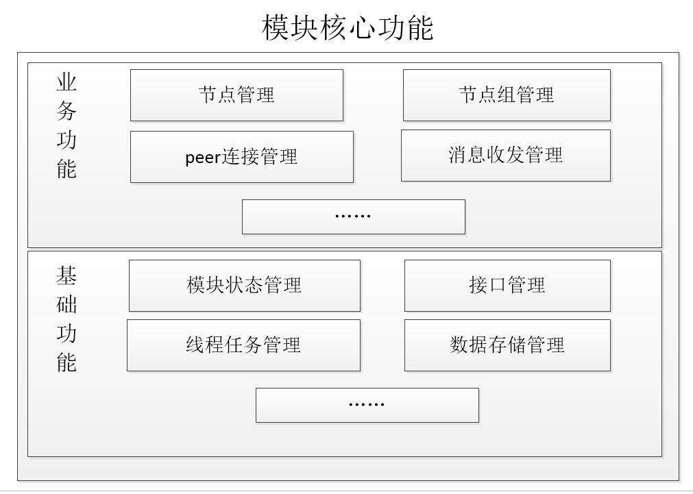

- 节点管理 Node management 

  管理所有可连接的、已连接的节点信息、状态，提供节点操作接口

  - 节点发现
  - 节点存储

- 节点组管理 Node Group management

  管理不同的网络节点，将节点分为不同的集合，每个集合分别管理。每个集合内的节点连接的魔法参数都是相同的，并且和其他集合的魔法参数不同。

  每个NodeGroup都根据链登记的信息或者自身配置的网络信息进行初始化（魔法参数、节点数量限制等）

  每初始化一个NodeGroup，网络服务都多监听一个MagicNumber。

- 连接器管理 Connection management

  - 初始化连接
    - 链内节点：初始通过种子节点进行连接，通过协议请求peer地址或接收到分享的peer地址后，进行缓存。
    - 跨链节点：主网被动等待平行链节点的连接。
  - 连接管理：需要进行节点的可用性探测，心跳维护，有多余可用节点时候，断开种子节点连接。
  - 连接断开

- 消息收发管理

  1>消息接收 Message receiver

  接收网络节点发送过来的消息，对消息进行判断（判断cmd），根据消息cmd字段，将消息透传到对应的模块服务中。

​      2>  消息发送 Message sender

​                  a> 对网络组(NodeGroup)广播消息

​                  b> 指定peer节点发送消息

- 模块状态管理

  ​       a>启动，关闭逻辑处理

​              b>对自身模块状态的维护与管理：管理模块的运行状态，内部功能状态等

​        

- 接口管理

  a>注册自身接口到NUSTAR模块中

  b>同步模块信息与状态到NUSTAR模块中 

  c>获取服务列表到本地模块

  d>开放对外接口调用

- 线程任务管理

  a>管理 心跳线程

  b>管理 节点发现/淘汰机制线程

  

### 2.2 模块服务

#### 2.2.1 网络消息接收

* 功能说明：

    接收（外部）网络节点发送过来的消息，对消息进行简单的判断（判断魔法参数），根据消息头含有的command字段，将消息发送到关心的模块服务中。

* 流程描述

  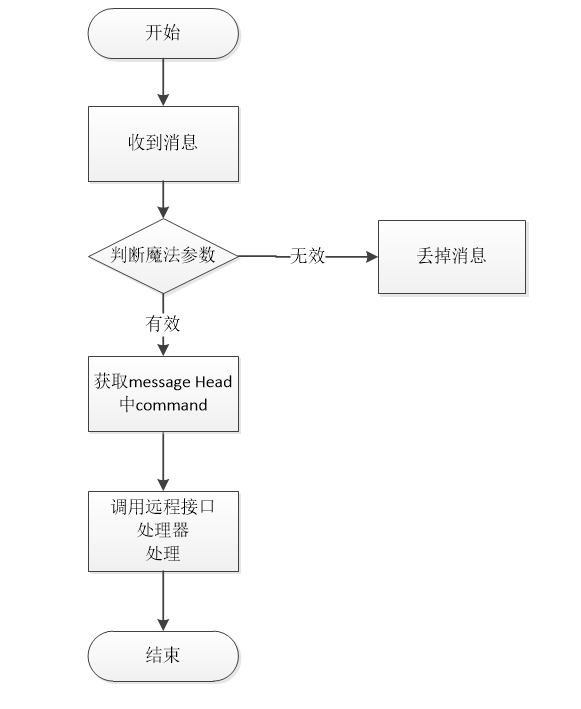

* 消息校验部分：

​        payload校验

​        magicNumber校验

* 外部模块提供的接口参数约束

   - method : ***  //同消息头中的CMD指令，约束12字节

   - params

```
    0：chainId //链id
    1：nodeId //节点Id
    2：message //16进制网络序消息体
    ......
```

- 依赖服务

​        解析消息头中的command参数，在调用远程接口处理时，依赖内核模块提供的远程的服务接口数据。

  #### 2.2.2网络消息发送

转发 其他或自身模块封装的消息，含广播消息以及指定节点发送消息。

##### 2.2.2.1、广播网络消息

功能说明：

   转发 其他或自身模块封装的消息，对外部模块提供转发调用的接口有以下2种情况：

  a> 对NodeGroup（指定某个网络）广播消息。

  b> 对NodeGroup（指定某个网络）广播消息，并排除某些节点。

  c> 对NodeGroup（指定某个网络）按指定比例广播消息，并排除某些节点。

- 流程描述


  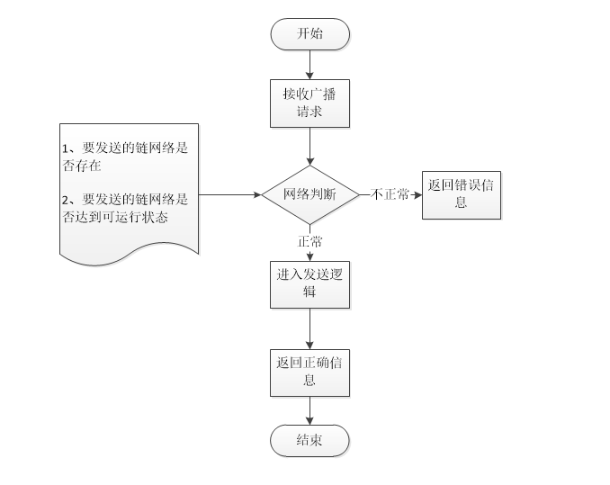

- 接口定义

  - 接口说明

    method : nw_broadcast

    外部模块可以通过该接口去广播消息

  - 请求示例

    ```
    {
       "chainId":1234，
       "excludeNodes": "10.13.25.36:5003,20.30.25.65:8009",
       "messageBody":     "03847ABDFF303847ABDFF303847ABDFF303847ABDFF303847ABDFF303847ABDFF3"，
       "command":"block"，
       "isCross":"false"，
       "percent":"50"，
        }
    ```

  - 请求参数说明

    | index | parameter    | required | type    |         description         |
    | ----- | ------------ | -------- | ------- | :-------------------------: |
    | 0     | chainId      | true     | int     |           链标识            |
    | 1     | excludeNodes | true     | String  |      排除节点,逗号分割      |
    | 2     | messageBody  | true     | String  |       对象16进制字符        |
    | 3     | command      | true     | String  |        消息协议指令         |
    | 4     | isCross      | true     | boolean |         是否是跨链          |
    | 5     | percent      | false    | int     | 广播发送比例,不填写,默认100 |

  - 返回示例

    Failed

    ```
    {
       "version": 1.2,
        "code":1,
        "msg" :"xxxxxxxxxxxxxxxxxx",
        "result":{
            "value":false
        }
    }
    ```

    Success

    ```
    {
     "version": 1.2,
        "code":0,
        "result":{
           "value":true
        }
    }
    ```


- 依赖服务

  无

##### 2.2.2.2、指定节点发送网络消息

功能说明：

转发 其他或自身模块封装的消息，可以指定某些节点（可以为1个节点）发送消息。

- 流程描述

  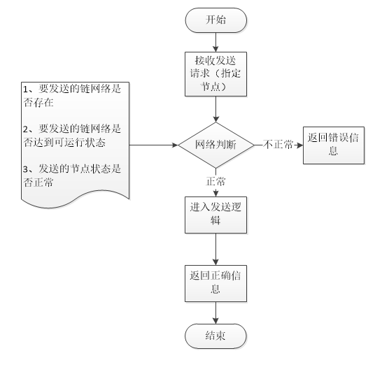

- 接口定义

  - 接口说明

    外部模块可以通过该接口去广播消息

    method : nw_sendPeersMsg

  ```
  @Parameter(parameterName = "chainId", requestType = @TypeDescriptor(value = int.class), parameterValidRange = "[1-65535]", parameterDes = "连接的链Id,取值区间[1-65535]"),
  @Parameter(parameterName = "nodes", requestType = @TypeDescriptor(value = String.class), parameterDes = "指定发送peer节点Id，用逗号拼接的字符串"),
  @Parameter(parameterName = "messageBody", requestType = @TypeDescriptor(value = String.class), parameterDes = "消息体Hex"),
  @Parameter(parameterName = "command", requestType = @TypeDescriptor(value = String.class), parameterDes = "消息协议指令")
  ```

  

  - 请求示例

    ```
    {
    "chainId":  1234，
    "nodes":  "10.13.25.36:5003,20.30.25.65:8009",
    "messageBody":"03847ABDFF303847ABDFF303847ABDFF303847ABDFF303847ABDFF303847ABDFF3"，
    "command":  "block"
        }
    ```

  - 请求参数说明

    | index | parameter   | required | type   |    description    |
    | ----- | ----------- | -------- | ------ | :---------------: |
    | 0     | chainId     | true     | int    |      链标识       |
    | 1     | nodes       | true     | String | 发送节点,逗号分割 |
    | 2     | messageBody | true     | String |    16进制字符     |
    |       | command     | true     | String |       指令        |

  - 返回示例

    Failed

    ```
    {
       "version": 1.2,
        "code":1,
        "msg" :"xxxxxxxxxxxxxxxxxx",
        "result":{}
    }
    ```

    Success

    ```
    {
     "version": 1.2,
        "code":0,
        "result":{
           
        }
    }
    ```

  - 返回字段说明

    | parameter | type | description |
    | --------- | ---- | ----------- |
    |           |      |             |

- 依赖服务

  无

#### 2.2.3 创建节点组

主网链除了自身网络，还存在n个跨链网络，自身网络与跨链网络使用不同的magicNumber.

平行链上除了自身网络，还可以去主网上注册跨链网络，自身网络与跨链网络使用同一个magicNumber。

节点组就是用来管理不同网络信息的。网络模块通过节点组去隔离维护不同网络。

节点组类型：1>自身网络 2>跨链网络 (主网链跨链网络&平行链跨链网络)

网络模块的创建节点组:

1>自身的配置文件加载创建自身网络组。

2>跨链网络：

​    作为主网链节点，平行链向链管理模块进行注册登记后，系统产生交易验证确认后调用网络模块，产生跨链网络组，之后存储配置，后续模块启动自动加载。

​    作为平行链节点，由跨链协议模块启动时，跨链协议模块从模块配置中获取跨链配置信息，调用网络模块，

网络模块触发跨链 连接。

##### 2.2.3.1  自有网络创建节点组

- 功能说明：

    自有网络对应自有chainId，以及一个魔法参数，通过配置初始化创建节点组

* 流程描述

   通过配置文件加载创建节点组

* 接口定义

​        内部创建，无外部接口。

- 依赖服务

​        无

##### 2.2.3.2  创建跨链节点组

- 功能说明：

  主网链上的跨链节点组由平行链在主网链进行跨链注册触发。平行链则获得跨链配置信息，由跨链协议来更新自有网络组的跨链状态。

* 流程描述

  1>主网链通过 链管理模块调用来触发跨链节点组的创建。

  2>平行链通过跨链协议模块来 更新自有网络组的跨链状态。

 

* 接口定义

  - 接口说明

    接收外部模块的调用，创建节点组

    method : nw_createNodeGroup

  - 请求示例

    ```
    {
          "chainId":  1234,
          "magicNumber": 232342,
          "maxOut":  10,
          "maxIn":  100,
          "minAvailableCount":  20，
          "seedIps":  "10.20.30.10:8002,48.25.32.12:8003,52.23.25.32:9003",
          "isCrossGroup":  0
        }
    ```

  - 请求参数说明

    | index | parameter         | required | type    |                   description                    |
    | ----- | ----------------- | -------- | ------- | :----------------------------------------------: |
    | 0     | chainId           | true     | int     |                      链标识                      |
    | 1     | magicNumber       | true     | long    |                     魔法参数                     |
    | 2     | maxOut            | true     | int     |                  最大主动连接数                  |
    | 3     | maxIn             | true     | int     |                  最大被动连接数                  |
    | 4     | minAvailableCount | true     | int     |                  友链最小连接数                  |
    | 5     | seedIps           | true     | String  |                种子节点，逗号分割                |
    | 6     | isMoonNode        | true     | boolean | 是否创建跨链连接组:true 跨链连接，false 普通连接 |

  - 返回示例

    Failed

    ```
    {
       "version": 1.2,
        "code":1,
        "msg" :"xxxxxxxxxxxxxxxxxx",
        "result":{}
    }
    ```

    Success

    ```
    {
     "version": 1.2,
        "code":0,
        "result":{
           
        }
    }
    ```

  - 返回字段说明

    | parameter | type | description |
    | --------- | ---- | ----------- |
    |           |      |             |


- 依赖服务

​       依赖内核模块提供的远程的服务接口数据。

​     

#### 2.2.4 注销节点组

- 功能说明：

  接收外部模块的调用，注销跨链节点组。

  作为主网链节点，由链管理模块进行注销登记，系统产生交易验证确认后调用。

- 流程描述

   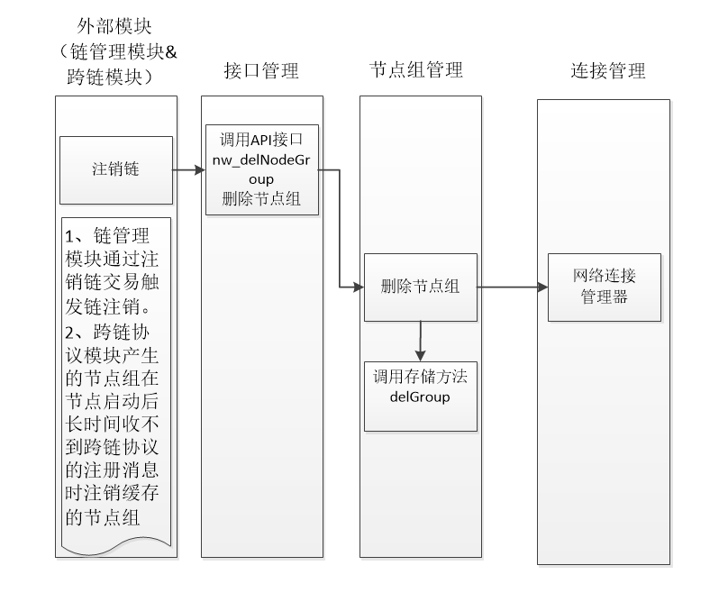

- 接口定义

  - 接口说明

    接收外部模块的调用，删除节点组

    method : nw_delNodeGroup

  - 请求示例

    ```
    {
        "chainId": 1234
        }
    ```

  - 请求参数说明

    | index | parameter | required | type | description |
    | ----- | --------- | -------- | ---- | :---------: |
    | 0     | chainId   | true     | int  |   链标识    |

  - 返回示例

    Failed

    ```
    {
       "version": 1.2,
        "code":1,
        "msg" :"xxxxxxxxxxxxxxxxxx",
        "result":{}
    }
    ```

    Success

    ```
    {
     "version": 1.2,
        "code":0,
        "result":{
           
        }
    }
    ```

  - 返回字段说明

    | parameter | type | description |
    | --------- | ---- | ----------- |
    |           |      |             |

 

- 依赖服务

  依赖内核模块提供的远程的服务接口数据。


#### 2.2.5 跨链种子节点提供

- 功能说明：

  种子节点是在网络初始化时候，用于提供peer连接信息的节点。链管理模块在进行链注册时，需要获取主网链上跨链种子节点信息用于初始化连接。

- 流程描述

   无

- 接口定义

  - 接口说明

    获取卫星链种子节点

    method : nw_getSeeds

  - 请求示例

    ```
    {
        "chainId": 1234
        }
    ```

  - 请求参数说明

    | index | parameter | required | type | description |
    | ----- | --------- | -------- | ---- | :---------: |
    | 0     | chainId   | true     | int  |   链标识    |

  - 返回示例

    Failed

    ```
    {
       "version": 1.2,
        "code":1,
        "msg" :"xxxxxxxxxxxxxxxxxx",
        "result":{}
    }
    ```

    Success

    ```
    {
     "version": 1.2,
        "code":0,
        "result":{
          seedsIps:"101.132.33.140:8003,116.62.135.185:8003,47.90.243.131:8003" 
        }
    }
    ```

  - 返回字段说明

    | parameter | type   | description          |
    | --------- | ------ | -------------------- |
    | seedsIps  | String | 种子节点信息逗号分割 |

- 依赖服务

  依赖内核模块提供的远程的服务接口数据。


#### 2.2.6 添加连接节点

- 功能说明：

  cmd指令下，对某个网络添加peer连接信息。

- 流程描述

  添加的节点会触发网络连接 流程。

- 接口定义

  - 接口说明

    添加网络peer节点

    method : nw_addNodes

  - 请求示例

    ```
    {
        "chainId":455，
        "isCross":0,
        "nodes":"10.20.23.02:5006,53.26.65.58:8003"
           }
    ```

  - 请求参数说明

    | index | parameter | required | type   |        description        |
    | ----- | --------- | -------- | ------ | :-----------------------: |
    | 0     | chainId   | true     | int    |          链标识           |
    | 1     | isCross   | true     | int    | 是否跨链：0 非跨链，1跨链 |
    | 2     | nodes     | true     | String |          节点组           |

  - 返回示例

    Failed

    ```
    {
       "version": 1.2,
        "code":1,
        "msg" :"xxxxxxxxxxxxxxxxxx",
        "result":{}
    }
    ```

    Success

    ```
    {
     "version": 1.2,
        "code":0,
        "result":{
           
        }
    }
    ```

  - 返回字段说明

    | parameter | type | description |
    | --------- | ---- | ----------- |
    |           |      |             |

- 依赖服务

  ​        无


#### 2.2.7 删除连接节点

- 功能说明：

  cmd指令下，删除某个网络下的peers连接信息。

- 流程描述

  删除节点会触发 网络节点的断开。

- 接口定义

  - 接口说明

    删除网络peer节点

    method : nw_delNodes

  - 请求示例

    ```
    {
        "chainId":234,
        "nodes": "10.20.23.02:5006,53.26.65.58:8003"
        }
    ```

  - 请求参数说明

    | index | parameter | required | type   | description |
    | ----- | --------- | -------- | ------ | :---------: |
    | 0     | chainId   | true     | int    |   链标识    |
    | 1     | nodes     | true     | String |   节点组    |

  - 返回示例

    Failed

    ```
    {
       "version": 1.2,
        "code":1,
        "msg" :"xxxxxxxxxxxxxxxxxx",
        "result":{}
    }
    ```

    Success

    ```
    {
     "version": 1.2,
        "code":0,
        "result":{
           
        }
    }
    ```

  - 返回字段说明

    | parameter | type | description |
    | --------- | ---- | ----------- |
    |           |      |             |

- 依赖服务

  无


####  2.2.8重连指定网络

- 功能说明：

  cmd指令下，对指定的nodeGroup进行网络重新连接

- 流程描述

  接收指令后，对指定的nodeGroup下的所有peer进行断连接后，重新连接网络。

  重新刷新nodegroup下peer 连接地址 ，并重启网络连接。

  如果peer连接 为多个 网络业务所有，则只需要取消关联关系，如果只有自身业务使用，则可以断开连接。

- 接口定义

  - 接口说明

    重新刷新并连接网络节点

    method : nw_reconnect

  - 请求示例

    ```
    {
        "chainId":1234
        }
    ```

  - 请求参数说明

    | index | parameter | required | type | description |
    | ----- | --------- | -------- | ---- | :---------: |
    | 0     | chainId   | true     | int  |   链标识    |

  - 返回示例

    Failed

    ```
    {
       "version": 1.2,
        "code":1,
        "msg" :"xxxxxxxxxxxxxxxxxx",
        "result":{}
    }
    ```

    Success

    ```
    {
     "version": 1.2,
        "code":0,
        "result":{
           
        }
    }
    ```

  - 返回字段说明

    | parameter | type | description |
    | --------- | ---- | ----------- |
    |           |      |             |

- 依赖服务

  无


#### 2.2.9 获取nodeGroup列表

- 功能说明：

  获取节点管理的所有网络列表。

- 流程描述

  无

- 接口定义

  - 接口说明

    获取节点组信息

    method : nw_getGroups

  - 请求示例

    ```
    {
        "startPage":1,
        "pageSize":10
     }
    ```

  - 请求参数说明

    | index | parameter | required | type | description |
    | ----- | --------- | -------- | ---- | :---------: |
    | 0     | startPage | true     | int  |  开始页数   |
    | 1     | pageSize  | true     | int  | 每页记录数  |

  - 返回示例

    Failed

    ```
    {
       "version": 1.2,
        "code":1,
        "msg" :"xxxxxxxxxxxxxxxxxx",
        "result":{}
    }
    ```

    Success

    ```
    {
     "version": 1.2,
        "code":0,
        "result":{
            list:[{
                chainId：1212, //链id
                magicNumber：324234,//魔法参数
                totalCount：2323, //总连接数
                inCount：22,   //被动连接数
                outCount：33,  //主动连接数
                isActive：1，//0未激活，1 已激活
                isCrossChain:1 //0不是跨链网络，1跨链网络
                },{}
                ]
        }
    }
    ```

  - 返回字段说明

    | parameter    | type | description              |
    | ------------ | ---- | ------------------------ |
    | chainId      | int  | 链id                     |
    | magicNumber  | int  | 魔法参数                 |
    | totalCount   | int  | 总连接数                 |
    | inCount      | int  | 被动连接数               |
    | outCount     | int  | 主动连接数               |
    | isActive     | int  | 0未激活，1 已激活        |
    | isCrossChain | int  | 0不是跨链网络，1跨链网络 |

- 依赖服务

​        无


#### 2.2.10 获取指定nodeGroup下的连接信息

- 功能说明：

  获取指定的网络id下所有节点的信息

- 流程描述

  无

- 接口定义

  - 接口说明

    获取节点信息

    method : nw_getNodes

  - 请求示例

  ```
  {
      "chainId":125,
      "state":1,
      "isCross":1,
      "startPage":1,
      "pageSize":5
  }
  ```

  - 请求参数说明

  | index | parameter | required | type |          description          |
  | ----- | --------- | -------- | ---- | :---------------------------: |
  | 0     | chainId   | true     | int  |            网络id             |
  | 1     | state     | true     | int  | 0所有链接，1已连接，2 未 连接 |
  | 2     | isCross   | true     | int  |      0普通连接 1跨链连接      |
  | 3     | startPage | true     | int  |           开始页数            |
  | 4     | pageSize  | true     | int  |          每页记录数           |

  - 返回示例

  Failed

  ```
  {
     "minVersion": 1.2,
      "code":1,
      "msg" :"xxxxxxxxxxxxxxxxxx",
      "result":{}
  }
  
  ```

  Success

  ```
  {
   "minVersion": 1.2,
   "code":0,
   "msg" :"xxxxxxxxxxxxxxxxxx",
   "result":{
         list:[{
                  chainId：122,//链id
                  nodeId:"20.20.30.10:9902"
                  magicNumber：134124,//魔法参数
                  blockHeight：6000,   //区块高度
                  blockHash："0020ba3f3f637ef53d025d3a8972462c00e84d9
                       ea1a960f207778150ffb9f2c173ff",  //区块Hash值
                  ip："200.25.36.41",//ip地址
                  port：54,//
                  state："已连接",
                  isOut："1", //0被动连接，1主动连接
                  time："6449878789", //最近连接时间
  	     },{}
  	     ]
      }
  }
  
  ```


  - 返回字段说明


| parameter   | type   | description              |
| ----------- | ------ | ------------------------ |
| chainId     | int    | 链id                     |
| nodeId      | String | 节点id                   |
| magicNumber | int    | 魔法参数                 |
| blockHeight | long   | 最新区块高度             |
| blockHash   | String | 最新区块hash             |
| ip          | String | ip地址                   |
| port        | int    | 端口号                   |
| state       | int    | 连接状态 1 连接 0 未连接 |
| isOut       | int    | 0被动连接，1主动连接     |
| time        | long   | 最近连接时间             |

 

- 依赖服务

无


#### 2.2.11  获取指定链网络概要信息

- 功能说明：

  获取指定chainId的网络信息。

- 流程描述

   无

- 接口定义

  - 接口说明

    获取链网络信息

    method : nw_getGroupByChainId

  - 请求示例

    ```
    {
        "chainId":142
     }
    ```

  - 请求参数说明

    | index | parameter | required | type | description |
    | ----- | --------- | -------- | ---- | :---------: |
    | 0     | chainId   | true     | int  |    链Id     |

  - 返回示例

    Failed

    ```
    {
       "version": 1.2,
        "code":1,
        "msg" :"xxxxxxxxxxxxxxxxxx",
        "result":{}
    }
    ```

    Success

    ```
    {
     "version": 1.2,
        "code":0,
        "result":{
                "chainId"：1212, //链id
                "magicNumber"：324234,//魔法参数
                "totalCount"：2323, //总连接数
                "connectCount"：44，//已连接数量
                "disConnectCount"：32，//未连接数量
                "inCount"：22,   //被动连接数
                "outCount"：33,  //主动连接数
                "connectCrossCount"：44，//已连接跨链数量
                "disConnectCrossCount"：32，//未连接数量
                "inCrossCount"：22,   //跨链被动连接数
                "outCrossCount"：33,  //跨链主动连接数
                "isActive"：1，//0未激活，1 已激活
                "isCrossActive":1， //0跨链网络未激活，1跨链激活
                "isMoonNet":0 //0友链 ，1卫星链
                }
    }
    ```

  - 返回字段说明

    | parameter            | type | description                |
    | -------------------- | ---- | -------------------------- |
    | chainId              | int  | 链id                       |
    | magicNumber          | int  | 魔法参数                   |
    | totalCount           | int  | 总连接数                   |
    | connectCount         | int  | 已连接数量                 |
    | disConnectCount      | int  | 未连接数量                 |
    | inCount              | int  | 被动连接数                 |
    | outCount             | int  | 主动连接数                 |
    | connectCrossCount    | int  | 跨链已连接数量             |
    | disConnectCrossCount | int  | 跨链未连接数量             |
    | inCrossCount         | int  | 跨链被动连接数             |
    | outCrossCount        | int  | 跨链主动连接数             |
    | isActive             | int  | 0未激活，1 已激活          |
    | isCrossActive        | int  | 0跨链网络未激活，1跨链激活 |
    | isMoonNet            | int  | 0友链 ，1卫星链            |

- 依赖服务

​        无


#### 2.2.12 更新peer连接节点的信息（高度&Hash）

  - 功能说明：

    网络连接，在进行握手连接时带有peer节点的高度与Hash值，后续的peer连接节点的高度与Hash值由外部模块（区块管理模块）进行调用更新。

  - 流程描述

      1>节点启动时等待 区块管理接口 初始化完成，然后调用区块管理接口获取最新区块高度及hash值。

      2>握手时将节点相关信息放入Verion协议消息中发送到peer端。

      3>建立连接后，区块管理模块会调用该接口进行最新区块高度与hash值的更新。

  - 接口定义

    - 接口说明

      区块管理模块 调用进行节点的高度与Hash值的更新。

      method : nw_updateNodeInfo

    - 请求示例

      ```
      {
          "method":"nw_reconnect",
          "minVersion":1.1,
          "params":[
              1598,
              "10.20.30.20:8856",
              10,
              "0020ba3f3f637ef53d025d3a8972462c00e84d9ea1a960f207778150ffb9f2c173ff"
          ]
      }
      ```

    - 请求参数说明

    | index | parameter   | required | type   | description  |
    | ----- | ----------- | -------- | ------ | :----------: |
    | 0     | chainId     | true     | int    |    网络id    |
    | 1     | nodeId      | true     | String |  网络节点id  |
    | 2     | blockHeight | true     | long   |   开始页数   |
    | 3     | blockHash   | true     | String | 区块最新hash |

    - 返回示例

    Failed

    ```
    {
       "version": 1.2,
        "code":1,
        "msg" :"xxxxxxxxxxxxxxxxxx",
        "result":{}
    }
    
    ```

    Success

    ```
    {
     "version": 1.2,
     "code":0,
     "msg" :"xxxxxxxxxxxxxxxxxx",
     "result":{
       
        }
    }
    
    ```
    - 返回字段说明

| parameter | type | description |
| --------- | ---- | ----------- |
|           |      |             |

- 依赖服务

​    无

#### 2.2.13 注册网络协议处理器

- 功能说明：

  网络模块在接收到对端发送过来的消息后，需要根据 消息协议头中的 cmd 来调用对应模块处理。

  cmd与模块的映射关系，需要各个模块在启动时候进行提交注册。

- 流程描述

  略

- 接口定义

  - 接口说明

     注册远程节点间的消息调用指令

    method : nw_protocolRegister

  - 请求示例

    ```
    {
      "role": "bl",
      "protocolCmds": [
       "getBlockRequest",
        "downLoadBlock"
      ]
    }
    
    ```

  - 请求参数说明

  | index | parameter    | required | type   | description  |
  | ----- | ------------ | -------- | ------ | :----------: |
  | 0     | role         | true     | String |   模块角色   |
  | 1     | protocolCmds | true     | array  | 协议指令数组 |
  |       |              |          |        |              |

  - 返回示例

  Failed

  ```
  {
    
  }
  
  
  ```

  Success

  ```
  {
     
  }
  
  ```

  - 返回字段说明

    

- 依赖服务

​    无

#### 2.2.14 网络时间获取

- 功能说明：

   获取网络时间进行本地时间偏差同步。

* 流程描述

  网络模块获取网络上若干服务器的时间，进行偏差计算调整。如果网络时间获取失败，则向10个对等节点发出“时间获取协议”获取对等节点时间 进行偏差计算，如果还无法获取，则直接返回本地时间。

  说明：定时进行偏差修正。

- 接口定义

  - 接口说明

    获取网络时间

    method : nw_currentTimeMillis

  - 请求示例

    ```
    RPC 统一格式
    ```

  - 请求参数说明

  | index | parameter | required | type | description |
  | ----- | --------- | -------- | ---- | :---------: |
  |       |           |          |      |             |

  - 返回示例

  Failed

  ```
  RPC 统一格式
  
  ```

  Success

  ```
  {
     "currentTimeMillis":11544545466 
  }
  
  
  ```

  - 返回字段说明

| parameter         | type | description                    |
| ----------------- | ---- | ------------------------------ |
| currentTimeMillis | long | 1970-01-01至今的差值，单位毫秒 |

- 依赖服务

​    无

### 2.3 模块内部功能

#### 2.3.1 模块启动

- 功能说明：

  模块启动时，进行配置信息的初始化，注册服务初始化，各个内部功能管理数据库信息的初始化等。

- 流程描述

​        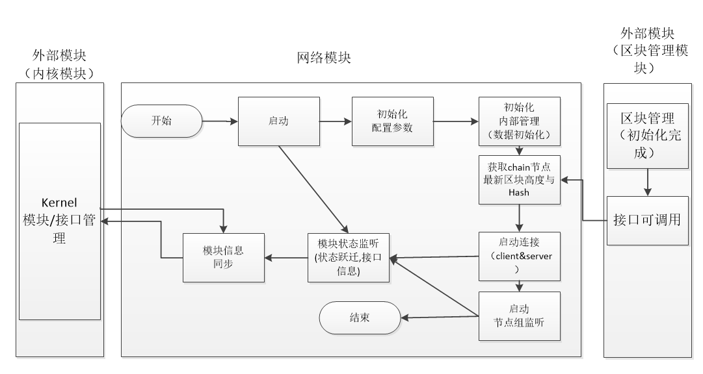

​       1>本地进行配置数据加载，数据库节点组及节点信息数据加载。

​       2>监听区块管理模块的状态进入初始化完成，接口可调用，则调用获取最新本地节点的区块高度与Hash值。

​       3>初始化完成，进入peer节点连接。

​       4>网络模块在启动连接稳定后，可作为事件发送出去。

 网络模块启动连接稳定的判定条件：x秒内 无新的握手连接产生，x秒内无高度的增长。x=10

​     

- 依赖服务

  依赖 核心模块，区块管理模块

#### 2.3.2 模块关闭

- 功能说明：

   模块关闭时，进行连接的关闭，线程管理的关闭，各个资源的释放，并通知状态给核心接口。

- 流程描述

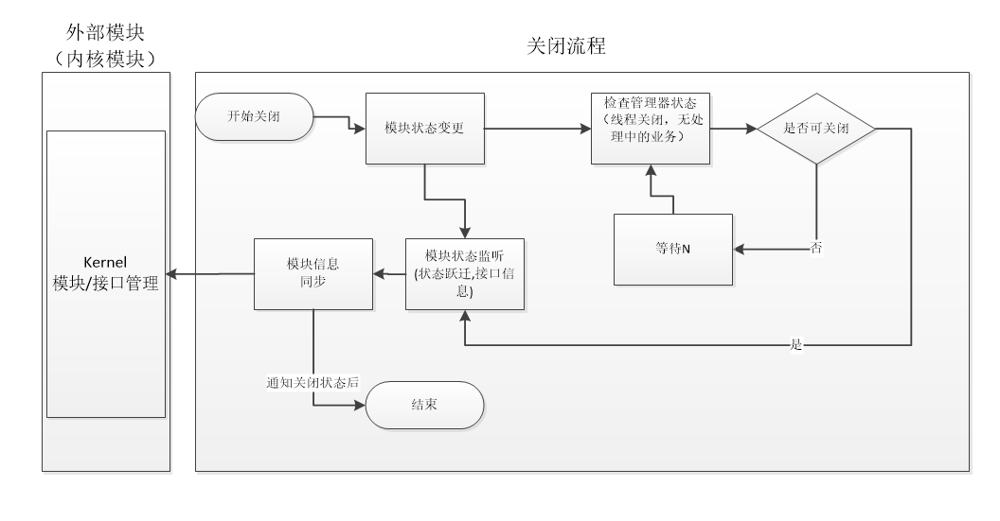


- 依赖服务

  无

#### 2.3.3 peer节点发现

- 功能说明：

  在网络模块启动后，进行peer节点的获取管理。

  节点获取的途径有：

  1>连接向种子节点，并请求地址获取。

  2>接收广播过来的节点消息。

  2>跨链网络的连接，比如作为主网链上的节点与平行链的连接，或者平行链上的节点与主网链的连接。

- 流程描述

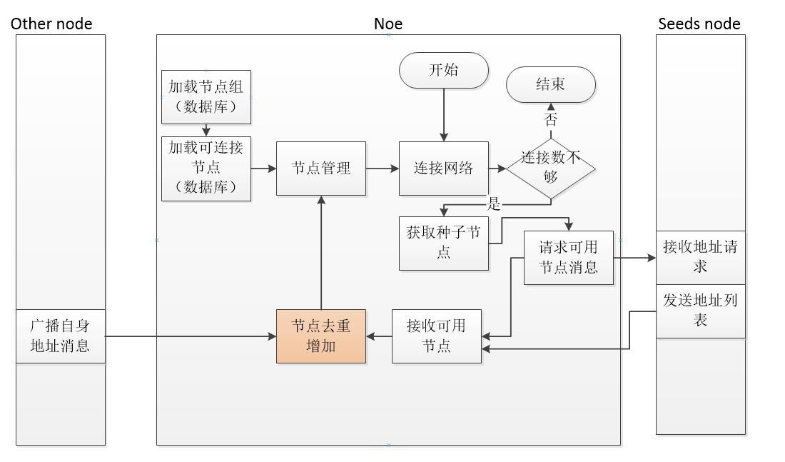


- 依赖服务

​          无

#### 2.3.4 网络连接

- 功能说明：

   一个节点即作为client端，主动连接已知的peer节点，同时也是server端，等待peer节点的连接。

  一个连接能够正常工作，需要通过握手协议，即互相发送version协议消息，协议具体定义参看下面的

  “协议-网络通讯协议部分”。

- 流程描述

​        client在与server完成tcp连接后，需要通过业务version协议握手，只有握手成功的连接才能进行业务转发工作。连接中状态在持续X分钟后无法跃迁到已连接，则主动断开连接。

流程中发送version协议（参看协议的version结构体）：

1>协议携带了节点的信息，包含：协议的版本信息，本端口的最高区块高度，区块hash值，

​       对方节点的外网IP，端口，及跨链服务端口，以及本节点的外网IP，端口，及跨链服务端口。

2>只有通过version协议，才能建立业务连接，否则等待X=1分钟后将断开连接。


- 依赖服务


#### 2.3.5 心跳检测

- 功能说明：

  检测连接是否还保持连接。通过client与server的ping-pong消息来进行维持保活。涉及的ping-pong协议定义参看“协议-网络通讯协议部分”

- 流程描述

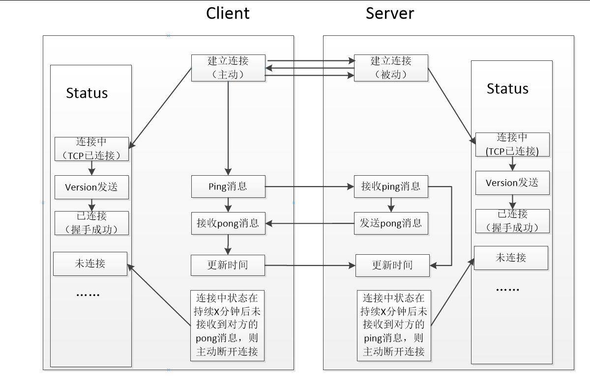


- 依赖服务


#### 2.3.6 连接数量验证

- 功能说明：

  在建立节点连接时，会进行连接数量，如果达到最大值，则主动断开连接。

  流程描述

​      


- 依赖服务


#### 2.3.7 节点的外网IP存储

- 功能说明：

​        一个节点可能存在多个网卡，也可能是在某个局域网内，所以在建立连接时，并不知道自己的外网IP地址。

而节点要广播自己的地址供外网peers节点连接，则需要知道自身的外网IP地址。我们的设计中，节点的外网是通过version协议消息进行携带发出的。

- 流程描述

    在client接收到version消息时，可以知道自己的IP地址信息。

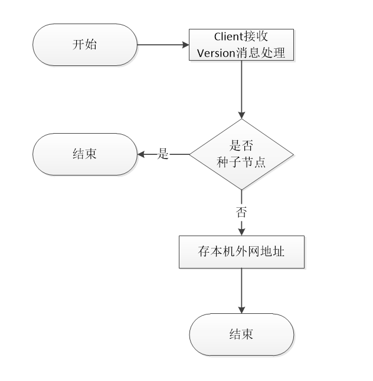


- 依赖服务


#### 2.3.8 节点的外网可连接检测

- 功能说明：

​        一个节点在建立连接时，可以广播自身的外网IP+port，给其他节点。但若一个节点是在某局域网内，则其外网的IP地址是无法直接去连接通的。因此为了检测节点的外网IP是否可用，可以通过自己的client连接自己的server来判断，如果连接成功，则IP可以用于广播，如果不成功则节点外网IP不能广播给其他节点。

- 流程描述

  自我连接可能成功，也可能失败，如果成功则说明外网IP是可达的，便可以在建立连接时广播传递给网络中其他节点，如果不可达，则连接无法建立不用处理。

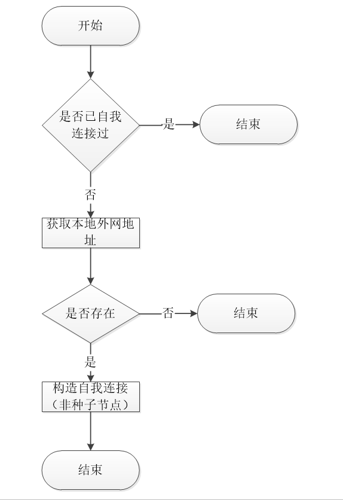


- 依赖服务


#### 2.3.9 peer节点的广播

- 功能说明：

  将自身节点广播给网络中其他节点，在设计中，我们将通过组网网络稳定后，促发广播自身外网IP。

- 流程描述


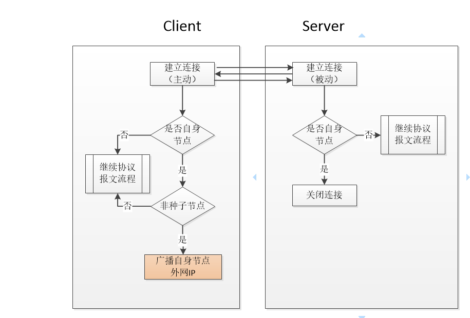


- 依赖服务

#### 2.3.10 请求/回复 getaddr协议消息

  - 功能说明：

     请求地址协议消息，获取更多的网络连接

  - 流程描述

     请求getaddr：

​         1>网络稳定后，广播给peer连接节点，请求可连接地址列表。

​      回复 getaddr

​       1>peer跨链连接，主网链回复主网nodeGroup 的地址列表（ IP+跨链端口），平行链回复自有链地址列表(IP+跨链端口)

​       2>peer自有网络连接，节点则回复地址列表（IP+自有链端口）

  - 依赖服务


####  2.3.11  发送/接收地址逻辑

- 功能说明：

   接收 网络传送的 addr协议消息处理逻辑

- 流程描述

   发送addr：

​       1>在新节点接入时会向同一nodegroup的其他连接peer广播 addr 消息。

​       2> 在请求getaddr消息时，会得到addr消息回复。

​       接收addr：

​       1>判断地址是否本地已经拥有，如果拥有不转发，获取新增的addr。

​       2>接收到的节点要通过 连接验证后，才能进行转发。

- 依赖服务


#### 2.3.12 跨链server端口的传递

- 功能说明：

   一个node可以存在2个角色，一个是维护自有的内部链网络。另一个是作为跨链角色维护跨链网络。

  因此在server定义中我们将这2个网络的端口监听进行区分，以便各自相对独立。自有链定义一个serverPort1，跨链部分定义一个serverPort2.

- 流程描述

  如下图，我们主网链网络与平行链网络产生一个跨链连接，当主网链中有个节点2连接上节点1时，是通过内部服务Port1来建立的连接，而节点1是可以将节点2 发送给 友链的节点A与节点B来进行连接，则此时发送给友链的信息中 应该是serverPort2，因此serverPort2需要再主网链的内部交互中进行传递。我们将该部分数据定义在version协议中进行传递。

​      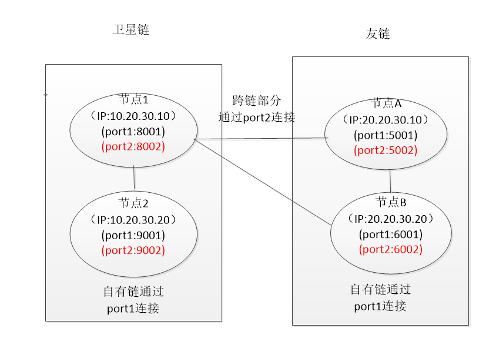

* 依赖服务


## 三、事件说明

### 3.1 发布的事件

​      暂无

### 3.2 订阅的事件

​       暂无


## 四、协议

### 4.1 网络通讯协议

#### version

用于建立连接(握手)

| Length | Fields       | Type     | Remark                                                       |
| ------ | ------------ | -------- | ------------------------------------------------------------ |
| 4      | version      | uint32   | 节点使用的协议版本标识                                       |
| 20     | addr_you     | byte[20] | 对方网络地址【IP+PORT1+PORT2】PORT2为跨链server端口   如：[10.32.12.25  8003  9003]  16byte+2byte+2byte |
| 20     | addr_me      | byte[20] | 本节点网络地址【IP+PORT1+PORT2】PORT2为跨链server端口   如：[20.32.12.25 7003 6003]    16byte+2byte+2byte |
| 4      | block_height | uint32   | 节点高度                                                     |
| ？     | block_hash   | varInt   | 区块hash                                                     |
| ??     | extend       | VarByte  | 扩展字段，不超过10个字节？                                   |

#### verack

用于应答version

| Length | Fields   | Type  | Remark                           |
| ------ | -------- | ----- | -------------------------------- |
| 1      | ack_code | uint8 | 返回码，1代表正常，2代表连接已满 |

#### ping

用于维护连接，当一段时间未收到某个节点任何信息后，发送该消息，若能得到pong消息的回馈，则节点依然保持连接，否则关闭连接并删除节点

| Length | Fields     | Type   | Remark |
| ------ | ---------- | ------ | ------ |
| 4      | randomCode | uint32 | 随机数 |

#### pong

用于回应ping

| Length | Fields     | Type   | Remark |
| ------ | ---------- | ------ | ------ |
| 4      | randomCode | uint32 | 随机数 |

#### getaddr

用于请求网络中可用节点的连接信息。

| Length | Fields         | Type   | Remark           |
| ------ | -------------- | ------ | ---------------- |
| 2      | chainId        | uint16 | 链id             |
| 1      | isCrossAddress | uint8  | 是否请求跨链地址 |

#### addr

用于应答getaddr，或向网络中宣告自身的存在，节点接收到该消息后，判断节点是否已知，如果是未知节点，则保存，待验证通过后向网络中传播该地址。

| Length | Fields    | Type            | Remark                               |
| ------ | --------- | --------------- | ------------------------------------ |
| ??     | addr_list | network address | 每个节点18字节（16字节IP+2字节port） |

#### bye

 用于对等连接主动断开连接，拒绝服务对端消息业务

| Length | Fields  | Type  | Remark   |
| ------ | ------- | ----- | -------- |
| 1      | byeCode | uint8 | 预留字段 |

#### getTime

 用于向对等节点获取时间

| Length | Fields    | Type   | Remark |
| ------ | --------- | ------ | ------ |
| 4      | messageId | uint32 | 请求id |

 

#### responseTime

 回复对等节点时间

| Length | Fields    | Type   | Remark |
| ------ | --------- | ------ | ------ |
| 4      | messageId | uint32 | 请求id |
| 4      | time      | uint32 | 时间值 |

 

### 4.2 交易协议

​         暂无

## 五、模块配置


```
[network]
port=18001
crossPort=18002
#魔法参数
packetMagic=20190807
#种子节点
selfSeedIps=39.98.226.51:18001,47.244.186.65:18001,47.254.234.223:18001,47.74.86.85:18001
#主网的跨链种子连接节点，供平行链初始连接使用
moonSeedIps=39.98.226.51:18002,47.244.186.65:18002,47.254.234.223:18002,47.74.86.85:18002
#最大入网连接数
maxInCount=100
#最大出网连接数
maxOutCount=20
```

## 六、Java特有的设计

[^说明]: 核心对象类定义,存储数据结构，......

## 七、补充内容

[^说明]: 上面未涉及的必须的内容

