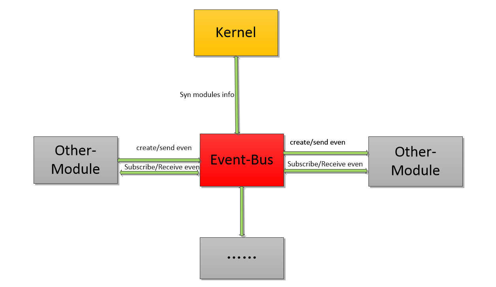
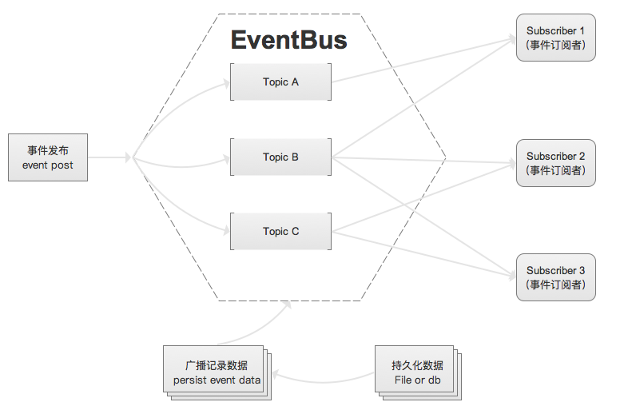
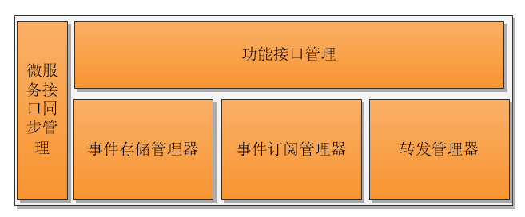
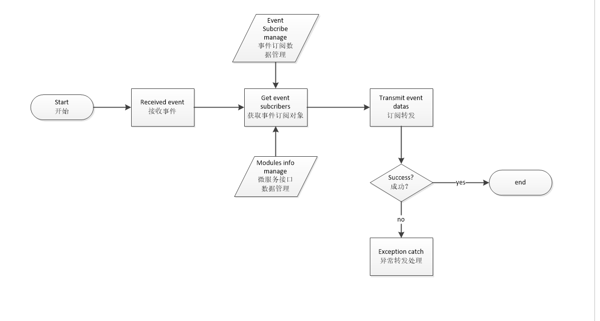

# 事件总线模块设计文档

[TOC]

## 一、总体描述

### 1.1 模块概述

#### 1.1.1 为什么要有《事件总线》模块

> 事件总线模块是专门用来接收及通知处理模块事件的功能性模块，管理着所有模块事件。

#### 1.1.2 《事件总线》要做什么

> 提供事件的订阅、接收、发送等功能，是模块间的事件中转站

#### 1.1.3 《事件总线》在系统中的定位

> 事件模块是一个边缘系统，提供主要一些异步的消息发送，也就说，即使没有事件总线，系统一样可以正常运行，比较轻量级，而且不依赖其他模块系统。

### 1.2 架构图


- 事件总线模块主要含2部分交互逻辑：
  - 与系统核心模块的微服务注册与服务信息获取。
  - 与其他基础模块间的事件消息创建、订阅、转发管理。

## 二、功能设计

### 2.1 功能架构图


### 2.2 模块服务


> 该模块提供事件的订阅，事件的转发

#### 2.2.1 修改系统运行参数

> 只依赖核心系统，核心系统可以对事件模块系统的启动，停止，参数修改等，

### 2.3 模块内部功能


> 模块内部工能主要包含，订阅管理器，事件管理器，转发管理器。

- 微服务接口信息同步管理
  - 用于与kernel服务治理模块之间的服务接口同步
- 事件储存管理(eventBus)
  -  用于进行事件信息的创建，订阅等储存，并且在模块重启是进行信息的初始化。
- 事件订阅管理(subscribe)
  - 维护订阅事件的“配置表”：包括所有各个模块订阅的重要参数
- 事件转发管理(dispatcher)
  - 开放接口用于事件的接收，对接收事件按订阅进行转发，转发调用接口通过服务信息管理接口获得
- 功能接口管理(rpc)
  - 开放查询接口供外部查询
### 2.4 事件总线流程

* 事件处理时序

  

- 事件处理基本流程



### 2.5 业务逻辑

> 在事件转发失败（比如网络原因）情况下进行的异常逻辑处理 ，按以下2种逻辑处理:

- 1、保留事件调用 按队列重复调用，直到转发成功。
- 2、尝试多次后直接丢弃,(暂定5次)每10秒后重试一次。

## 三、接口设计

### 3.1 模块接口
#### 3.1.1 事件主题订阅
> cmd: subscribe

##### 参数说明 (request body)

```json
{
  "cmd": "subscribe",
  "min_version": "1.0",
  "params":[
    "app.nuls.network.bandwidth",//topic 事件主题
    "moduleId" //moduleId订阅者模块id
  ]
}
```
##### 返回值说明 (response content)

```json
{
  "version": "1.0",
  "code": 0,//操作码
  "msg": "reponse message.",//失败时的信息
  "result": {
    "app_secret": "xxxxxxxxxxxx" // app_secret,暂时不需要，后期如果需要不是本机调用可能需要验证
  }
}
```

#### 3.1.2 事件取消订阅
> cmd: unsubscribe

##### 参数说明 (request body)

```json
{
"cmd": "unsubscribe",
"min_version": "1.0",
"params":[
  "app.nuls.network.bandwidth", //topic 事件主题
  "moduleId" //moduleId订阅者模块id
  ]
}
```

##### 返回值说明：(response content)

```json
{
  "version": "1.0",
  "code": 0, //操作码
  "msg": "reponse message.",//失败时的信息
  "result": {
  }
}
```

#### 3.1.3 事件发送【自动创建topic】
> 在没人订阅情况下是否保留一定时间？

> cmd: send

##### 参数说明(request body)

```json
{
 "cmd": "send",
 "min_version": "1.0",
 "params":[
   "app.nuls.network.bandwidth",//topic 事件主题
   "moduleId", //moduleId订阅者模块id
   {"key" : "data value"} // 需要发送的事件，jsonObj
 ]
}
```

##### 返回值说明(response content)

```json
{
  "version": "1.0",
  "code": 0, //操作码
  "msg": "reponse message.",//失败时的信息
  "result": {
  }
}
```
#### 3.1.4 事件广播(推送push or dispatcher)
> 需要每个接口在订阅事件时提供接口，我在广播时调用即可,我这里是多线程去掉你们接口，你们需要返回正确的code,否则会有走重试机制

##### 参数说明(request body)

```json
{
 "cmd": "dispatcher",
 "min_version": "1.0",
 "params":[
   {} //data 需要发送的事件，payload
 ]
}
```

##### 返回值说明(response content)

```json
{
  "version": "1.0",
  "code": 0, //一定要正确返回,不要需要告诉你业务逻辑是否出错，你只要接收到了就告诉我你成功接收到了即可。
  "msg": "reponse message.",//失败时的信息
  "result": {
  }
}
```
### 3.2 功能接口
> 功能接口是提供给界面和命令行工具使用的接口

#### 获取事件主题信息
>  cmd: topics

##### 参数说明(request body)

```json
{
 "cmd": "topics",
 "min_version": "1.0",
 "params":[]
}
```

##### 返回值说明(response content)

```json
{
  "version": "1.0",
  "code": 0, //一定要正确返回,不要需要告诉你业务逻辑是否出错，你只要接收到了就告诉我你成功接收到了即可。
  "msg": "reponse message.",//失败时的信息
  "result": {
    "topics":[{
        "topic": "",  //主题id
        "createTime":"",	//创建时间
        "moduleId":"",   //主题创建者（模块）Id
        "subscribes":[//订阅者信息
            {
                "moduleId":"", //订阅者
                "subscribeTime":"" //订阅时间
            }
        ]}
    ]
  }
}
```

#### 获取事件主题信息(包含该主题上所有事件信息？) 每个事件其实我不关心的。
> cmd : get_topic

## 四、事件说明

> 不依赖任何事件

## 五、协议

### 5.1 网络通讯协议

无

### 5.2 交易协议

## 六、模块配置
### 6.1 配置说明
> 一般支持性配置，端口，重试次数，重试时间，默认执行器的线程池大小，网络调用超时配置等。
```yml
server:
  ip: 127.0.0.1   //本机ip，用于提供服务给其他模块,可以不填，默认自动获取
  port: 8080    //提供服务的端口,可以不填，默认自动获取
```
### 6.2 模块依赖关系

- 内核模块
  - 模块注册
  - 模块注销
  - 模块状态上报（心跳）
  - 服务接口数据获取及定时更新

## 七、Java特有的设计

> 核心对象类定义,存储数据结构，......

## 八、补充内容

> 上面未涉及的必须的内容

