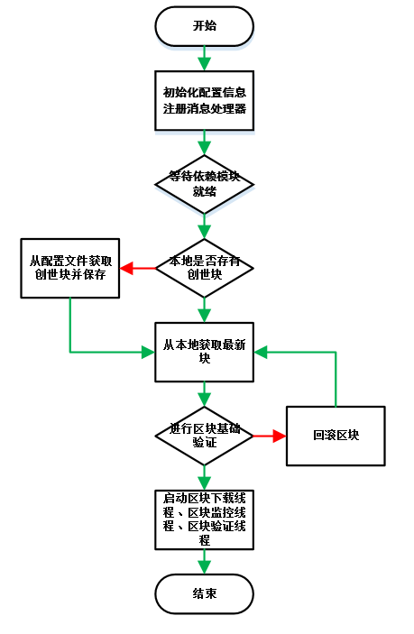

# 区块管理模块设计文档

[TOC]

## 一、总体描述

### 1.1 模块概述

#### 1.1.1 为什么要有《区块管理》模块

[^说明]: 介绍模块的存在的原因

    区块链上所有数据都保存在区块中，其他模块对区块中数据进行验证、业务处理都要先获取区块。
    区块链程序初次启动时，需要同步主网的全量区块到本地，耗时长，且同步未完成时系统处于不可用状态，适合由单独模块完成该工作。
    所以为其他模块提供统一的区块数据服务是必要的，也能更好地把区块的增删改查同区块的具体业务进行解耦，用到区块的模块不必关心区块的获取细节。

#### 1.1.2 《区块管理》要做什么

[^说明]: 模块要做些什么事情，达到什么目的，目标是让非技术人员了解要做什么事情

    主链区块的同步、存储(DB)、查询、广播、转发、回滚、基础验证
    分叉区块的判断、存储(cache)
    分叉链与主链高度对比、切换

#### 1.1.3 《区块管理》在系统中的定位

[^说明]: 模块在系统中的定位，是什么角色，依赖哪些模块做哪些事情，可以被依赖用于做哪些事情

    区块管理是底层模块之一，以下分功能讨论模块依赖情况
    
    依赖
    
    * 区块同步-依赖网络模块的"获取指定nodeGroup下的连接信息"接口，依赖工具模块的序列化工具
    * 区块存储、回滚-依赖工具模块的数据库存储工具
    * 区块广播、转发-依赖网络模块的广播消息接口
    
    被依赖
    
    * 整个系统可以发起交易-区块同步
    * 交易管理模块：交易确认-区块查询
    * 共识模块：区块详细验证、打包-区块查询、区块保存、区块广播、区块回滚
    * 账户模块：更新账户余额-区块查询
    * 智能合约模块：处理合约相关交易-区块查询

### 1.2 架构图

[^说明]: 图形说明模块的层次结构、组件关系，并通过文字进行说明


## 二、功能设计

### 2.1 功能架构图

[^说明]: 说明模块的功能设计，可以有层级关系，可以通过图形的形式展示，并用文字进行说明。


1、提供api，进行区块存储、查询、回滚的操作

2、从网络上同步最新区块，进行初步验证，调用共识模块进行共识验证，调用交易模块进行双花验证，全部验证通过后保存到本地。

3、同步模块运行状态到内核(所有模块都有)

### 2.2 模块服务

[^说明]: 这里说明该模块对外提供哪些服务，每个服务的功能说明、流程描述、接口定义、实现中依赖的外部服务

#### 2.2.1 获取本地最新区块头

* 接口说明

    * 根据缓存的最新区块高度查询DB得到最新区块头HASH
    * 根据HASH查询DB得到区块头byte数组
    * 反序列化为区块头对象

* 请求示例

    ```
    {
      "method": "bl_bestBlockHeader",
      "version":"1.1",
      "params": []
    }
    ```

* 请求参数说明

    略
    
* 返回示例

    Failed
    
    ```
    {
        "version": 1.2,
        "code": 1,
        "msg": "error message",
        "result": {}
    }
    ```
    
    Success
    
    ```
    {
        "version": 1.2,
        "code": 0,
        "msg": "What happend",
        "result": {
            "hash": "xxxxxxx",
            "preHash": "xxxxxxx",
            "merkleHash": "1",
            "height": 1,
            "size": 1,
            "time": 1,
            "txCount": 1,
            "packingAddress": "1",
            "reward": 0,
            "fee": 0,
            "confirmCount": 5315,
            "extend": xxxxxxx,
            "scriptSig": "1"
        }
    }
    ```
    
* 返回字段说明
  
| parameter | type      | description                                |
| --------- | --------- | ------------------------------------------ |
| hash      | String    | 区块HASH                                |
| preHash   | String    | 上一区块HASH                              |
| merkleHash   | String    | 区块MerkleHash                              |
| height   | Integer    | 区块高度                              |
| size   | Integer    | 区块大小                              |
| time   | Long    | 区块打包时间                              |
| txCount   | Integer    | 交易数                              |
| packingAddress   | String    | 打包地址                              |
| reward   | Integer    | 共识奖励                              |
| fee   | Integer    | 手续费                             |
| confirmCount   | Integer    | 确认次数                              |
| extend   | String   | 扩展字段,HEX,包含roundIndex、roundStartTime、consensusMemberCount、packingIndexOfRound、stateRoot                              |
| scriptSig   | String    | 区块签名                              |

#### 2.2.2 获取本地最新区块

* 接口说明：

    1.获取本地最新区块头
    2.根据区块头高度查询DB得到交易HASH列表
    3.根据HASH列表查询DB得到交易byte数组
    4.反序列化为交易对象
    5.组装成block对象

* 请求示例

    ```
    {
      "method": "bl_bestBlock",
      "version":"1.1",
      "params": []
    }
    ```

* 请求参数说明

    略

* 返回示例 

    Failed
    
      ```
      {
          "version": 1.2,
          "code":1,
          "msg" :"xxxxxxxxxxxxxxxxxx",
          "result":{}
      }
      ```
      
    Success

    ```
    {
        "version": 1.2,
        "code": 0,
        "result": {
        	"blockHeader": {
                "hash": "1", //区块HASH
                "preHash": "1", //上一区块HASH
                "merkleHash": "1", //区块MerkleHash
                "height": 1, //区块高度
                "size": 1, //区块大小
                "time": 1, //区块打包时间
                "txCount": 1, //交易数
                "packingAddress": "1", //打包地址
                "reward": 0,//共识奖励
                "fee": 0,//手续费
                "confirmCount": 5315,//确认次数
                "extend": "1", //扩展字段 HEX   包含roundIndex、roundStartTime、consensusMemberCount、packingIndexOfRound、stateRoot
                "scriptSig": "1", //区块签名 HEX
        	}, //区块头
        	"transactions": [
        	    {
                    "height": "1", //区块高度
                    "hash": "1", //交易HASH
                    "remark": "1", //交易备注
                    "size": "1", //交易大小
                    "status": "1", //交易确认状态
                    "time": "1", //交易时间
                    "type": "1", //交易类型
                    "transactionSignature": "1", //交易签名
                    “fromAssetsChainId”：“”//资产发行链的id
                    “fromAssetsId”：“”//资产id
                    “fromAddress”：“”//转出账户地址
                    “toAssetsChainId”：“”//资产发行链的id
                    “toAssetsId”：“”//资产id
                    “toAddress”：“”//转入账户地址
                    “amount”：“”//转出金额
                    “nonce”：“”//交易顺序号，递增
                    "txData": {...}, //交易数据 jsonObj
        	    },
        	    {...}
        	], //交易列表
        }
    }
    ```
    
* 返回字段说明

| parameter | type      | description                                |
| --------- | --------- | ------------------------------------------ |
| blockHeader       | String    | xxxxxxxxxxx                                |
| transactions       | Enum      | xxxxxxxxxxxxxxxxxx,1:amean,2:bmean,3:cmean |

#### 2.2.3 根据高度获取区块头

* 功能说明：

  略

* 流程描述

```
  1.根据高度查询DB得到最新区块头HASH
  2.根据HASH查询DB得到区块头byte数组
  3.反序列化为区块头对象
```

* 接口定义

  * 根据高度获取区块头接口

  * method : bl_getBlockHeaderByHeight

    接口说明： 略

    * params

    ```
    {
      "jsonrpc": "1.0",
      "method": "bl_getBlockHeaderByHeight",
      "params": ["111"] //高度
    }
    ```

    * returns 

    ```
    {
        "code": -1,
        "msg": "What happend",
        "jsonrpc":"1.0",
        "result": {
        	"hash": "1", //区块HASH
        	"preHash": "1", //上一区块HASH
        	"merkleHash": "1", //区块MerkleHash
        	"height": 1, //区块高度
        	"size": 1, //区块大小
        	"time": 1, //区块打包时间
        	"txCount": 1, //交易数
        	"packingAddress": "1", //打包地址
            "reward": 0,//共识奖励
            "fee": 0,//手续费
            "confirmCount": 5315,//确认次数
        	"extend": "1", //扩展字段 HEX   包含roundIndex、roundStartTime、consensusMemberCount、packingIndexOfRound、stateRoot
        	"scriptSig": "1", //区块签名 HEX
        }
    }
    ```
    
* 依赖服务

  [^说明]: 文字描述依赖了哪些服务，做什么事情
  
  工具模块的数据库存储工具、序列化工具

#### 2.2.4 根据高度获取区块

* 功能说明：

  略

* 流程描述

```
    1.根据高度获取区块头
    2.根据区块头高度查询DB得到交易HASH列表
    3.根据HASH列表查询DB得到交易byte数组
    4.反序列化为交易对象
    5.组装成block对象
```

* 接口定义

  * 获取本地区块接口

  * method : bl_getBlockByHeight

    接口说明： 略

    * params

    ```
    {
      "jsonrpc": "1.0",
      "method": "bl_getBlockByHeight",
      "params": [”111“] //高度
    }
    ```

    * returns 

    ```
    {
        "code": -1,
        "msg": "What happend",
        "jsonrpc":"1.0",
        "result": {
        	"blockHeader": {
                "hash": "1", //区块HASH
                "preHash": "1", //上一区块HASH
                "merkleHash": "1", //区块MerkleHash
                "height": 1, //区块高度
                "size": 1, //区块大小
                "time": 1, //区块打包时间
                "txCount": 1, //交易数
                "packingAddress": "1", //打包地址
                "reward": 0,//共识奖励
                "fee": 0,//手续费
                "confirmCount": 5315,//确认次数
                "extend": "1", //扩展字段 HEX   包含roundIndex、roundStartTime、consensusMemberCount、packingIndexOfRound、stateRoot
                "scriptSig": "1", //区块签名 HEX
        	}, //区块头
        	"transactions": [
        	    {
                    "height": "1", //区块高度
                    "hash": "1", //交易HASH
                    "remark": "1", //交易备注
                    "size": "1", //交易大小
                    "status": "1", //交易确认状态
                    "time": "1", //交易时间
                    "type": "1", //交易类型
                    "transactionSignature": "1", //交易签名
                    “fromAssetsChainId”：“”//资产发行链的id
                    “fromAssetsId”：“”//资产id
                    “fromAddress”：“”//转出账户地址
                    “toAssetsChainId”：“”//资产发行链的id
                    “toAssetsId”：“”//资产id
                    “toAddress”：“”//转入账户地址
                    “amount”：“”//转出金额
                    “nonce”：“”//交易顺序号，递增
                    "txData": {...}, //交易数据 jsonObj
        	    },
        	    {...}
        	], //交易列表
        }
    }
    ```
    
* 依赖服务

  [^说明]: 文字描述依赖了哪些服务，做什么事情
  
  工具模块的数据库存储工具、序列化工具

#### 2.2.5 根据HASH获取区块头

* 功能说明：

  略

* 流程描述

```
  1.根据HASH查询DB得到区块头byte数组
  2.反序列化为区块头对象
```

* 接口定义

  * 根据HASH获取本地区块头接口

  * method : bl_getBlockHeaderByHash

    接口说明： 略

    * params

    ```
    {
      "jsonrpc": "1.0",
      "method": "bl_getBlockHeaderByHash",
      "params": [”aaa“] //hash
    }
    ```

    * returns 

    ```
    {
        "code": -1,
        "msg": "What happend",
        "jsonrpc":"1.0",
        "result": {
        	"hash": "1", //区块HASH
        	"preHash": "1", //上一区块HASH
        	"merkleHash": "1", //区块MerkleHash
        	"height": 1, //区块高度
        	"size": 1, //区块大小
        	"time": 1, //区块打包时间
        	"txCount": 1, //交易数
        	"packingAddress": "1", //打包地址
            "reward": 0,//共识奖励
            "fee": 0,//手续费
            "confirmCount": 5315,//确认次数
        	"extend": "1", //扩展字段 HEX   包含roundIndex、roundStartTime、consensusMemberCount、packingIndexOfRound、stateRoot
        	"scriptSig": "1", //区块签名 HEX
        }
    }
    ```
    
* 依赖服务

  [^说明]: 文字描述依赖了哪些服务，做什么事情
  
  工具模块的数据库存储工具、序列化工具

#### 2.2.6 根据HASH获取区块

* 功能说明：

  略

* 流程描述

```
    1.根据HASH获取区块头
    2.根据区块头高度查询DB得到交易HASH列表
    3.根据HASH列表查询DB得到交易byte数组
    4.反序列化为交易对象
    5.组装成block对象
```

* 接口定义

  * 根据HASH获取区块接口

  * method : bl_getBlockByHash

    接口说明： 略

    * params

    ```
    {
      "jsonrpc": "1.0",
      "method": "bl_getBlockByHash",
      "params": [”aaa“] //hash
    }
    ```

    * returns 

    ```
    {
        "code": -1,
        "msg": "What happend",
        "jsonrpc":"1.0",
        "result": {
        	"blockHeader": {
                "hash": "1", //区块HASH
                "preHash": "1", //上一区块HASH
                "merkleHash": "1", //区块MerkleHash
                "height": 1, //区块高度
                "size": 1, //区块大小
                "time": 1, //区块打包时间
                "txCount": 1, //交易数
                "packingAddress": "1", //打包地址
                "reward": 0,//共识奖励
                "fee": 0,//手续费
                "confirmCount": 5315,//确认次数
                "extend": "1", //扩展字段 HEX   包含roundIndex、roundStartTime、consensusMemberCount、packingIndexOfRound、stateRoot
                "scriptSig": "1", //区块签名 HEX
        	}, //区块头
        	"transactions": [
        	    {
                    "height": "1", //区块高度
                    "hash": "1", //交易HASH
                    "remark": "1", //交易备注
                    "size": "1", //交易大小
                    "status": "1", //交易确认状态
                    "time": "1", //交易时间
                    "type": "1", //交易类型
                    "transactionSignature": "1", //交易签名
                    “fromAssetsChainId”：“”//资产发行链的id
                    “fromAssetsId”：“”//资产id
                    “fromAddress”：“”//转出账户地址
                    “toAssetsChainId”：“”//资产发行链的id
                    “toAssetsId”：“”//资产id
                    “toAddress”：“”//转入账户地址
                    “amount”：“”//转出金额
                    “nonce”：“”//交易顺序号，递增
                    "txData": {...}, //交易数据 jsonObj
        	    },
        	    {...}
        	], //交易列表
        }
    }
    ```
    
* 依赖服务

  [^说明]: 文字描述依赖了哪些服务，做什么事情
  
  工具模块的数据库存储工具、序列化工具

#### 2.2.7 保存区块

* 功能说明：

  略

* 流程描述

```
    1.根据hash获取未保存区块
    2.取出交易列表，遍历列表中交易
          调用交易管理模块的commit交易接口(主要处理不同交易例如红牌、黄牌的业务逻辑)
          调用账本模块的commit交易接口(主要处理账户余额)
          成功后保存交易到DB
    3.保存区块头
    4.调用智能合约模块处理智能合约相关交易
    5.广播区块
```

* 接口定义

  * 保存区块接口

  * method : bl_addBlock

    接口说明： 略

    * params

    ```
    {
      "jsonrpc": "1.0",
      "method": "bl_addBlock",
      "params": [”aaa“] //hash
    }
    ```

    * returns 

    ```
    {
        "code": 0,
        "msg": "What happend",
        "jsonrpc":"1.0",
        "result": {
        }
    }
    ```
    
* 依赖服务

  [^说明]: 文字描述依赖了哪些服务，做什么事情
  
  工具模块的数据库存储工具，网络模块的RPC工具

#### 2.2.8 回滚区块

* 功能说明：

  略

* 流程描述

```
    1.根据hash获取区块
    2.取出交易列表，遍历列表中交易
          调用交易管理模块的rollback交易接口(主要处理不同交易例如红牌、黄牌的业务逻辑)
          调用账本模块的rollback交易接口(主要处理账户余额)
          成功后根据txHash删除DB中交易
    3.根据hash删除区块头
    4.调用智能合约模块回滚智能合约相关交易
```

* 接口定义

  * 回滚区块接口

  * method : bl_rollBlock

    接口说明： 略

    * params

    ```
    {
      "jsonrpc": "1.0",
      "method": "bl_rollBlock",
      "params": [”aaa“] //hash
    }
    ```

    * returns 

    ```
    {
        "code": -1,
        "msg": "What happend",
        "jsonrpc":"1.0",
        "result": {
        }
    }
    ```
    
* 依赖服务

  [^说明]: 文字描述依赖了哪些服务，做什么事情
  
  工具模块的数据库存储工具，网络模块的RPC工具

### 2.3 模块内部功能

[^说明]: 这里说明该模块内部有哪些功能，每个功能的说明、流程描述、实现中依赖的外部服务，参考上面外部服务格式

#### 2.3.1 模块启动

* 功能说明：

  略

* 流程描述



- 1.加载区块模块配置信息
- 2.注册区块模块消息、消息处理器
- 3.注册区块模块服务接口
- 4.注册区块模块事件
- 5.启动同步区块线程

* 依赖服务

  [^说明]: 文字描述依赖了哪些服务，做什么事情
  
  工具模块的数据库存储工具

### 2.3.2 区块存储

* 功能说明：

    说明存储表划分
    
   * 主链存储
   ```
        一个完整的区块由区块头和交易组成，区块头与交易分别进行存储。
          区块头：(放在区块管理模块)
              key(区块高度)-value(区块头hash)              block-header-index
              key(区块头hash)-value(完整的区块头)           block-header
          交易：(放在交易管理模块)
              key(区块高度)-value(交易hash列表)             transaction-index
              key(交易hash)-value(完整的交易)              transaction
    ```
   * 分叉链存储
   ```
        ChainContainer(分叉链)
            private Chain chain;
                    private String id;
                    private String preChainId;
                    private BlockHeader startBlockHeader;
                    private BlockHeader endBlockHeader;
                    private List<BlockHeader> blockHeaderList;
                    private List<Block> blockList;
                    private List<Agent> agentList;
                    private List<Deposit> depositList;
                    private List<PunishLogPo> yellowPunishList;
                    private List<PunishLogPo> redPunishList;
            private RoundManager roundManager;
                    private List<MeetingRound> roundList = new ArrayList<>();
                            private Account localPacker;
                            private double totalWeight;
                            private long index;
                            private long startTime;
                            private long endTime;
                            private int memberCount;
                            private List<MeetingMember> memberList;
                                private long roundIndex;
                                private long roundStartTime;
                                private byte[] agentAddress;
                                private byte[] packingAddress;
                                private byte[] rewardAddress;
                                private NulsDigestData agentHash;
                                private int packingIndexOfRound;
                                private double creditVal;
                                private Agent agent;
                                private List<Deposit> depositList = new ArrayList<>();
                                private Na totalDeposit = Na.ZERO;
                                private Na ownDeposit = Na.ZERO;
                                private double commissionRate;
                                private String sortValue;
                                private long packStartTime;
                                private long packEndTime;
                            private MeetingRound preRound;
                            private MeetingMember myMember;
    ```

* 流程描述

    略

* 依赖服务

  [^说明]: 文字描述依赖了哪些服务，做什么事情
  
  工具模块的数据库存储工具

#### 2.3.2 区块同步

* 功能说明：

  略

* 流程描述

    * 区块同步主流程
    
    
    * 获取网络上可用节点列表
    
    
    * 下载区块逻辑
    
    
    * 从节点下载某高度区间内的区块
    

* 依赖服务

  [^说明]: 文字描述依赖了哪些服务，做什么事情
  
  工具模块的数据库存储工具、RPC工具

#### 2.3.3 区块基础验证

* 功能说明：

  验证区块自身数据正确性,下载过程中验证，验证通过说明区块数据本身没有问题，验证失败则丢弃该区块

* 流程描述

    * 区块基本验证
    
    
    * 区块头验证
    
    
    * 梅克尔hash验证
    

* 依赖服务

  [^说明]: 文字描述依赖了哪些服务，做什么事情
  
  工具模块的数据库存储工具

#### 2.3.4 分叉链管理

* 功能说明：

  判断分叉链与主链是否需要进行切换

* 流程描述
        
  - 检查共识模块状态，等到共识模块为运行RUNNING状态时继续往下执行
  - 检查是否有孤儿链能链接上主链或分叉链，如果有则链接
  - 取出最长的一条分叉链与主链长度对比判断是否需要切换主链
  - 如果分叉链长度比主链长度长3个区块以上则需要切换主链
  - 找到主链与最长分叉链的分叉点
  - 验证分叉链中的区块，如果验证通过继续往下执行
  - 回滚主链区块
  - 切换分叉链为主链


* 依赖服务

  [^说明]: 文字描述依赖了哪些服务，做什么事情
  
  工具模块的数据库存储工具

#### 2.3.5 分叉块管理
管理

* 功能说明：

  验证区块上下文正确性，下载完成后验证，验证通过说明该区块与主链相连，验证失败说明该区块分叉，进入分叉链处理逻辑

* 流程描述

    - 定义一条主链(MasterChain)，一个分叉链集合(forkChains)和一个孤儿链集合(orphanChains)
    - 定义待验证区块为Block
    - 定义主链高度MG，待验证区块高度BG
    - 定义主链最新区块HASH为MH，待验证区块HASH为BH，待验证区块PREHASH为BPH
    
    - 分六种情况讨论
    - 1.MG==BG，MH==BH，说明重复收到最新主链区块，丢弃
    - 2.MG==BG，MH!=BH，说明网络分叉
        - 遍历已有分叉链集合，判断是否已存在此区块
            - 如果已存在，丢弃该区块
            - 如果不存在，新建一条分叉链
              - 判断是否能连接上其他的分叉链（若能连上，则连接到其他分叉链则视为一条链）
              - 递归判断
    - 3.MG==BG-1，MH==BPH，说明区块连续，保存到主链
    - 4.MG==BG-1，MH!=BPH，说明网络分叉，处理同第2步
    - 5.MG<BG-1，说明网络分叉，处理同第2步
    - 6.MG>BG，MH==BH，丢弃

  

* 依赖服务

  [^说明]: 文字描述依赖了哪些服务，做什么事情
  
  工具模块的数据库存储工具

#### 2.3.6 区块监控

* 功能说明：

  略

* 流程描述


  - 启动监控定时任务，每分钟执行一次
  - 取本地最新区块头
  - 验证网络模块是否需要重启（如果本地最新区块3分钟都没有更新过则需要重启网络模块？网络模块清空可用节点，并重新获取？）

* 依赖服务

  [^说明]: 文字描述依赖了哪些服务，做什么事情
  
  工具模块的数据库存储工具

#### 2.3.7 转发区块

* 功能说明：

  1.根据HASH获取区块
  2.组装ForwardSmallBlockMessage,参考协议模块
  3.调用网络模块发送广播

* 流程描述

    

* 依赖服务

  [^说明]: 文字描述依赖了哪些服务，做什么事情
  
  工具模块的数据库存储工具

#### 2.3.8 广播区块

* 功能说明：

  略

* 流程描述

```
    1.根据HASH获取BlockHeader,TxList,组装成SmallBlock，
    2.将一个SmallBlock放入内存中，若不主动删除，则在缓存存满或者存在时间超过1000秒时，自动清理
    3.本地缓存blockHash，用于过滤重复下载
    4.组装SmallBlockMessage，调用RPC模块发送消息给目标节点
    5.目标节点收到消息后根据txHashList,再发GetTxGroupRequest给源节点
    6.源节点收到信息后按照hashlist组装TxGroupMessage,返回给目标节点
    7.至此所有区块数据已经发送给目标节点。
```

* 接口定义

  * 广播区块接口

  * method : bl_broadcastBlock

    接口说明： 略

    * params

    ```
    {
      "jsonrpc": "1.0",
      "method": "bl_broadcastBlock",
      "params": [”aaa“] //hash
    }
    ```

    * returns 

    ```
    {
        "code": -1,
        "msg": "What happend",
        "jsonrpc":"1.0",
        "result": {
        }
    }
    ```
    
* 依赖服务

  [^说明]: 文字描述依赖了哪些服务，做什么事情
  
  工具模块的数据库存储工具

## 四、事件说明

[^说明]: 业务流程中尽量避免使用事件的方式通信

### 4.1 发布的事件

[^说明]: 这里说明事件的topic，事件的格式协议（精确到字节），事件的发生情景。

    无

### 4.2 订阅的事件

[^说明]: 这里说明订阅哪些事件，订阅的原因，事件发生后的处理逻辑

* 打包生成新区块事件

## 五、协议

### 5.1 网络通讯协议

[^说明]: 节点间通讯的具体协议，参考《网络模块》

参考《网络模块》

### 5.2 交易协议

#### 5.2.1 转发区块消息ForwardSmallBlockMessage

* 交易说明：用于“转发区块”功能

* 交易类型（short）

  18

* 交易的格式（txData）

| Length | Fields  | Type      | Remark         |
| ------ | ------- | --------- | -------------- |
| 32     | magicNumber    | uint32    | 魔法参数，用于隔离网段 |
| 32     | length         | uint32    | 消息体大小           |
| 1      | xor            | byte      | 校验位，用于消息体的奇偶校验           |
| 1      | arithmetic     | byte      | 加密算法标识           |
| 16     | moduleId       | uint16    | 模块id           |
| 16     | msgType        | uint16    | 消息类型           |
| 1     | digestAlgType  | byte      | 摘要算法标识           |
| ?     | hashLength        | VarInt    | 数组长度           |
| ?     | hash        | byte[]    | hash           |

* 交易的验证

    略

* 交易的处理逻辑

  ```
  1、判断hash是否重复
  2、如果没有重复，用hash组装GetSmallBlockMessage，并发送给源节点
  ```

* 其他说明

#### 5.2.2 获取小区块消息GetSmallBlockMessage

* 交易说明：用途

* 交易类型（short）

  19

* 交易的格式（txData） 

| Length | Fields  | Type      | Remark         |
| ------ | ------- | --------- | -------------- |
| 32     | magicNumber    | uint32    | 魔法参数，用于隔离网段 |
| 32     | length         | uint32    | 消息体大小           |
| 1      | xor            | byte      | 校验位，用于消息体的奇偶校验           |
| 1      | arithmetic     | byte      | 加密算法标识           |
| 16     | moduleId       | uint16    | 模块id           |
| 16     | msgType        | uint16    | 消息类型           |
| 1     | digestAlgType  | byte      | 摘要算法标识           |
| ?     | hashLength      | VarInt    | 数组长度           |
| ?     | hash            | byte[]    | hash           |

* 交易的验证

    略

* 交易的处理逻辑

  ```
  1、根据hash获取SmallBlock对象
  2、组装SmallBlockMessage，并发送给源节点
  ```

* 其他说明

#### 5.2.3 区块广播消息SmallBlockMessage

* 交易说明：广播区块时使用

* 交易类型（short）

  11

* 交易的格式（txData）

| Length | Fields  | Type      | Remark         |
| ------ | ------- | --------- | -------------- |
| 32     | magicNumber    | uint32    | 魔法参数，用于隔离网段 |
| 32     | length         | uint32    | 消息体大小           |
| 1      | xor            | byte      | 校验位，用于消息体的奇偶校验           |
| 1      | arithmetic     | byte      | 加密算法标识           |
| 16     | moduleId       | uint16    | 模块id           |
| 16     | msgType        | uint16    | 消息类型           |
| 1     | digestAlgType  | byte      | 摘要算法标识           |
| ?     | preHashLength   | VarInt    | preHash数组长度           |
| ?     | preHash         | byte[]    | preHash           |
| 1     | digestAlgType  | byte      | 摘要算法标识           |
| ?     | merkleHashLength| VarInt    | merkleHash数组长度           |
| ?     | merkleHash      | byte[]    | merkleHash           |
| 48     | time          | Uint48    | 时间           |
| 32     | height      | Uint32    | 区块高度           |
| 32     | txCount      | Uint32    | 交易数           |
| ?     | extendLength| VarInt    | extend数组长度           |
| ?     | extend      | byte[]    | extend           |
| 32     | publicKeyLength      | Uint32    | 公钥数组长度           |
| ?     | publicKey      | byte[]    | 公钥           |
| 1     | signAlgType      | byte    | 签名算法类型           |
| ?     | signBytesLength| VarInt    | 签名数组长度           |
| ?     | signBytes      | byte[]    | 签名           |
| ?     | txHashListLength| VarInt    | 交易hash列表数组长度           |
| 1     | digestAlgType  | byte      | 摘要算法标识           |  
| ?     | txHashLength| VarInt    | 交易hash数组长度           |
| ?     | txHash      | byte[]    | 交易hash           |

* 交易的验证

    略

* 交易的处理逻辑

  ```
  1、判断区块时间戳是否大于(当前时间+10s)，如果大于这个时间，则判定为恶意提前出块，忽略该消息
  2、根据区块hash判断消息是否重复，如果重复，则忽略该消息(这里要求维护一个set,储存收到的区块hash)
  3、根据区块hash在DB中查询本地是否已经有该区块，如果已经有了，则忽略该消息
  4、验证区块头，验证失败，则忽略该消息
  5、？？？？？？？
  ```

* 其他说明

#### 5.2.4 根据高度获取区块消息GetBlocksByHeightMessage

* 交易说明：同步区块时发送给网络上可用节点，用来下载区块

* 交易类型（short）

  6

* 交易的格式（txData）

| Length | Fields  | Type      | Remark         |
| ------ | ------- | --------- | -------------- |
| 32     | magicNumber    | uint32    | 魔法参数，用于隔离网段 |
| 32     | length         | uint32    | 消息体大小           |
| 1      | xor            | byte      | 校验位，用于消息体的奇偶校验           |
| 1      | arithmetic     | byte      | 加密算法标识           |
| 16     | moduleId       | uint16    | 模块id           |
| 16     | msgType        | uint16    | 消息类型           |
| 32     | startHeight  | uint32      | 起始高度           |
| 32     | endHeight  | uint32      | 结束高度           |


* 交易的验证

    略

* 交易的处理逻辑

    略

* 其他说明

#### 5.2.5 根据hash获取区块消息GetBlocksByHashMessage

* 交易说明：用途

* 交易类型（short）

  5

* 交易的格式（txData）

| Length | Fields  | Type      | Remark         |
| ------ | ------- | --------- | -------------- |
| 32     | magicNumber    | uint32    | 魔法参数，用于隔离网段 |
| 32     | length         | uint32    | 消息体大小           |
| 1      | xor            | byte      | 校验位，用于消息体的奇偶校验           |
| 1      | arithmetic     | byte      | 加密算法标识           |
| 16     | moduleId       | uint16    | 模块id           |
| 16     | msgType        | uint16    | 消息类型           |
| 1     | digestAlgType  | byte      | 摘要算法标识           |
| ?     | startHashLength   | VarInt    | startHash数组长度           |
| ?     | startHash         | byte[]    | startHash           |
| 1     | digestAlgType  | byte      | 摘要算法标识           |
| ?     | endHashLength| VarInt    | endHash数组长度           |
| ?     | endHash      | byte[]    | endHash           |

* 交易的验证

    略

* 交易的处理逻辑

  ```
  1、
  ```

* 其他说明

#### 5.2.6 获取区块消息GetBlockMessage

* 交易说明：用途

* 交易类型（short）

  3

* 交易的格式（txData）

| Length | Fields  | Type      | Remark         |
| ------ | ------- | --------- | -------------- |
| 32     | magicNumber    | uint32    | 魔法参数，用于隔离网段 |
| 32     | length         | uint32    | 消息体大小           |
| 1      | xor            | byte      | 校验位，用于消息体的奇偶校验           |
| 1      | arithmetic     | byte      | 加密算法标识           |
| 16     | moduleId       | uint16    | 模块id           |
| 16     | msgType        | uint16    | 消息类型           |
| 1     | digestAlgType  | byte      | 摘要算法标识           |
| ?     | HashLength   | VarInt    | Hash数组长度           |
| ?     | Hash         | byte[]    | Hash           |

* 交易的验证

    略

* 交易的处理逻辑

  ```
  1、
  ```

* 其他说明

#### 5.2.7 获取区块hash列表的消息GetBlocksHashMessage

* 交易说明：用途

* 交易类型（short）

  12

* 交易的格式（txData）

| Length | Fields  | Type      | Remark         |
| ------ | ------- | --------- | -------------- |
| 32     | magicNumber    | uint32    | 魔法参数，用于隔离网段 |
| 32     | length         | uint32    | 消息体大小           |
| 1      | xor            | byte      | 校验位，用于消息体的奇偶校验           |
| 1      | arithmetic     | byte      | 加密算法标识           |
| 16     | moduleId       | uint16    | 模块id           |
| 16     | msgType        | uint16    | 消息类型           |
| 32     | startHeight  | uint32      | 起始高度           |
| 32     | endHeight  | uint32      | 结束高度           |

* 交易的验证

    略

* 交易的处理逻辑

  ```
  1、
  ```

* 其他说明

#### 5.2.8 区块hash列表响应消息BlocksHashMessage

* 交易说明：用途

* 交易类型（short）

  13

* 交易的格式（txData）

| Length | Fields  | Type      | Remark         |
| ------ | ------- | --------- | -------------- |
| 32     | magicNumber    | uint32    | 魔法参数，用于隔离网段 |
| 32     | length         | uint32    | 消息体大小           |
| 1      | xor            | byte      | 校验位，用于消息体的奇偶校验           |
| 1      | arithmetic     | byte      | 加密算法标识           |
| 16     | moduleId       | uint16    | 模块id           |
| 16     | msgType        | uint16    | 消息类型           |
| 1     | digestAlgType  | byte      | 摘要算法标识           |
| ?     | HashLength   | VarInt    | 请求Hash数组长度           |
| ?     | Hash         | byte[]    | 请求Hash           |
| ?     | txHashListLength| VarInt    | 响应hash列表数组长度           |
| 1     | digestAlgType  | byte      | 摘要算法标识           |  
| ?     | txHashLength| VarInt    | 响应hash数组长度           |
| ?     | txHash      | byte[]    | 响应hash           |

* 交易的验证

    略

* 交易的处理逻辑

  ```
  1、
  ```

* 其他说明

#### 5.2.9 完整的区块消息BlockMessage

* 交易说明：承载区块完整数据的信息

* 交易类型（short）

  4

* 交易的格式（txData）

| Length | Fields  | Type      | Remark         |
| ------ | ------- | --------- | -------------- |
| 32     | magicNumber    | uint32    | 魔法参数，用于隔离网段 |
| 32     | length         | uint32    | 消息体大小           |
| 1      | xor            | byte      | 校验位，用于消息体的奇偶校验           |
| 1      | arithmetic     | byte      | 加密算法标识           |
| 16     | moduleId       | uint16    | 模块id           |
| 16     | msgType        | uint16    | 消息类型           |
| 1     | digestAlgType  | byte      | 摘要算法标识           |
| ?     | preHashLength   | VarInt    | preHash数组长度           |
| ?     | preHash         | byte[]    | preHash           |
| 1     | digestAlgType  | byte      | 摘要算法标识           |
| ?     | merkleHashLength| VarInt    | merkleHash数组长度           |
| ?     | merkleHash      | byte[]    | merkleHash           |
| 48     | time          | Uint48    | 时间           |
| 32     | height      | Uint32    | 区块高度           |
| 32     | txCount      | Uint32    | 交易数           |
| ?     | extendLength| VarInt    | extend数组长度           |
| ?     | extend      | byte[]    | extend           |
| 32     | publicKeyLength      | Uint32    | 公钥数组长度           |
| ?     | publicKey      | byte[]    | 公钥           |
| 1     | signAlgType      | byte    | 签名算法类型           |
| ?     | signBytesLength| VarInt    | 签名数组长度           |
| ?     | signBytes      | byte[]    | 区块签名           |
| ?     | txCount   | VarInt    | 交易数           |
| 16     | type      | uint16    | 交易类型           |
| 48     | time      | uint48    | 交易时间           |
| ?     | remarkLength| VarInt    | 备注数组长度           |
| ?     | remark      | byte[]    | 备注           |
| 32     | fromAssetsChainId      | Uint32    | 资产发行链的id           |
| 32     | fromAssetsId      | Uint32    | 资产id           |
| ?     | fromAddress      | VarChar    | 转出账户地址           |
| 32     | toAssetsChainId      | Uint32    | 资产发行链的id           |
| 32     | toAssetsId      | Uint32    | 资产id           |
| ?     | toAddress      | VarChar    | 转入账户地址           |
| 48     | amount      | Uint48    | 转出金额           |
| 32     | nonce      | Uint32    | 交易顺序号，递增           |
| ?     | txData      | T    | 交易数据           |
| ?     | txSignLength| VarInt    | 交易签名数组长度           |
| ?     | txSign      | byte[]    | 交易签名           |

* 交易的验证

    略

* 交易的处理逻辑

  ```
  1、
  ```

* 其他说明

#### 5.2.10 未找到数据消息NotFoundMessage

* 交易说明：当请求的数据不存在时，返回该消息。

* 交易类型（short）

  1

* 交易的格式（txData）

| Length | Fields  | Type      | Remark         |
| ------ | ------- | --------- | -------------- |
| 32     | magicNumber    | uint32    | 魔法参数，用于隔离网段 |
| 32     | length         | uint32    | 消息体大小           |
| 1      | xor            | byte      | 校验位，用于消息体的奇偶校验           |
| 1      | arithmetic     | byte      | 加密算法标识           |
| 16     | moduleId       | uint16    | 模块id           |
| 16     | msgType        | uint16    | 消息类型           |
| 1     | msgType        | byte    | 未找到的数据类型           |
| 1     | digestAlgType  | byte      | 摘要算法标识           |
| ?     | HashLength   | VarInt    | Hash数组长度           |
| ?     | Hash         | byte[]    | Hash           |

* 交易的验证

    略

* 交易的处理逻辑

  ```
  1、
  ```

* 其他说明

#### 5.2.11 响应消息ReactMessage

* 交易说明：用于异步请求，标志目标节点收到请求，正在处理。

* 交易类型（short）

  16

* 交易的格式（txData）

| Length | Fields  | Type      | Remark         |
| ------ | ------- | --------- | -------------- |
| 32     | magicNumber    | uint32    | 魔法参数，用于隔离网段 |
| 32     | length         | uint32    | 消息体大小           |
| 1      | xor            | byte      | 校验位，用于消息体的奇偶校验           |
| 1      | arithmetic     | byte      | 加密算法标识           |
| 16     | moduleId       | uint16    | 模块id           |
| 16     | msgType        | uint16    | 消息类型           |
| 1     | digestAlgType  | byte      | 摘要算法标识           |
| ?     | HashLength   | VarInt    | Hash数组长度           |
| ?     | Hash         | byte[]    | Hash           |

* 交易的验证

    略

* 交易的处理逻辑

  ```
  1、
  ```

* 其他说明

#### 5.2.12 请求完成消息CompleteMessage

* 交易说明：用于异步请求，标志目标节点处理请求结束。

* 交易类型（short）

  15

* 交易的格式（txData）

| Length | Fields  | Type      | Remark         |
| ------ | ------- | --------- | -------------- |
| 32     | magicNumber    | uint32    | 魔法参数，用于隔离网段 |
| 32     | length         | uint32    | 消息体大小           |
| 1      | xor            | byte      | 校验位，用于消息体的奇偶校验           |
| 1      | arithmetic     | byte      | 加密算法标识           |
| 16     | moduleId       | uint16    | 模块id           |
| 16     | msgType        | uint16    | 消息类型           |
| 1     | digestAlgType  | byte      | 摘要算法标识           |
| ?     | HashLength   | VarInt    | Hash数组长度           |
| ?     | Hash         | byte[]    | Hash           |
| 1     | success  | byte      | 成功标志           |

* 交易的验证

    略

* 交易的处理逻辑

  ```
  1、
  ```

* 其他说明

#### 5.2.13 获取交易列表的消息GetTxGroupRequest

* 交易说明：接收到其他节点发送的区块广播时，如果交易列表中有交易还没有存在本地DB，则组装该消息，发给源节点获取交易

* 交易类型（short）

  9

* 交易的格式（txData）

| Length | Fields  | Type      | Remark         |
| ------ | ------- | --------- | -------------- |
| 32     | magicNumber    | uint32    | 魔法参数，用于隔离网段 |
| 32     | length         | uint32    | 消息体大小           |
| 1      | xor            | byte      | 校验位，用于消息体的奇偶校验           |
| 1      | arithmetic     | byte      | 加密算法标识           |
| 16     | moduleId       | uint16    | 模块id           |
| 16     | msgType        | uint16    | 消息类型           |
| ?     | ArrayLength   | VarInt    | Hash列表长度           |
| 1     | digestAlgType  | byte      | 摘要算法标识           |
| ?     | HashLength   | VarInt    | Hash数组长度           |
| ?     | Hash         | byte[]    | Hash           |

* 交易的验证

    略

* 交易的处理逻辑

  ```
  1、目标节点收到该消息后，取出hashList，遍历hashList，根据txHash获取Tx，组装TxGroupMessage，发给源节点
  ```

* 其他说明

#### 5.2.14 交易列表的消息TxGroupMessage

* 交易说明：接收到其他节点发送的GetTxGroupRequest后，则组装该消息，发给源节点

* 交易类型（short）

  10

* 交易的格式（txData）

| Length | Fields  | Type      | Remark         |
| ------ | ------- | --------- | -------------- |
| 32     | magicNumber    | uint32    | 魔法参数，用于隔离网段 |
| 32     | length         | uint32    | 消息体大小           |
| 1      | xor            | byte      | 校验位，用于消息体的奇偶校验           |
| 1      | arithmetic     | byte      | 加密算法标识           |
| 16     | moduleId       | uint16    | 模块id           |
| 16     | msgType        | uint16    | 消息类型           |
| 1     | digestAlgType  | byte      | 摘要算法标识           |
| ?     | requestHashLength   | VarInt    | requestHash数组长度           |
| ?     | requestHash         | byte[]    | requestHash           |
| ?     | txCount   | VarInt    | 交易数           |
| 16     | type      | uint16    | 交易类型           |
| 48     | time      | uint48    | 交易时间           |
| ?     | remarkLength| VarInt    | 备注数组长度           |
| ?     | remark      | byte[]    | 备注           |
| 32     | fromAssetsChainId      | Uint32    | 资产发行链的id           |
| 32     | fromAssetsId      | Uint32    | 资产id           |
| ?     | fromAddress      | VarChar    | 转出账户地址           |
| 32     | toAssetsChainId      | Uint32    | 资产发行链的id           |
| 32     | toAssetsId      | Uint32    | 资产id           |
| ?     | toAddress      | VarChar    | 转入账户地址           |
| 48     | amount      | Uint48    | 转出金额           |
| 32     | nonce      | Uint32    | 交易顺序号，递增           |
| ?     | txData      | T    | 交易数据           |
| ?     | txSignLength| VarInt    | 交易签名数组长度           |
| ?     | txSign      | byte[]    | 交易签名           |

* 交易的验证

    略

* 交易的处理逻辑

  ```
  1、获取消息中的RequestHash
  2、根据RequestHash查询缓存中是否有对应的SmallBlock
  3、如果没有，忽略该消息
  4、？？？？？
  ```

* 其他说明

## 六、模块配置

[^说明]: 本模块必须要有的配置项

```
[tx-manager]
server.ip:0.0.0.0   //本机ip，若不配置则默认使用0.0.0.0
server.port:8080    //若未配置，则随机选择端口
whitelist=0.0.0.0   //白名单
blacklist=0.0.0.0   //黑名单
```

## 七、Java特有的设计

[^说明]: 核心对象类定义,存储数据结构，......

- Block对象设计

> | `字段名称`          | `字段类型` | `说明`     |
> | ------------------- | ---------- | ---------- |
> | blockHeader             | BlockHeader     | 区块头   |
> | transactions | List<Transaction>     | 交易列表 |

- SmallBlock对象设计

> | `字段名称`          | `字段类型` | `说明`     |
> | ------------------- | ---------- | ---------- |
> | blockHeader             | BlockHeader     | 区块头   |
> | transactions | List<String>     | 交易HASH列表 |

- BlockHeader对象设计

> | `字段名称`          | `字段类型` | `说明`     |
> | ------------------- | ---------- | ---------- |
> | hash             | String     | 区块HASH   |
> | preHash             | String     | 上一区块HASH   |
> | merkleHash             | String     | 区块MerkleHash   |
> | height             | int     | 区块高度   |
> | size             | short     | 区块大小   |
> | time             | long     | 区块打包时间   |
> | txCount             | short     | 交易数   |
> | stateRoot             | String     | 状态根(智能合约)   |
> | packingAddress             | String     | 打包地址   |
> | extend             | byte[]     | 扩展字段   |
> | blockSignature             | BlockSignature     | 区块签名   |

- BlockSignature对象设计

> | `字段名称`          | `字段类型` | `说明`     |
> | ------------------- | ---------- | ---------- |
> | signData             | String     | 区块签名   |
> | publicKey | byte[]     | 公钥 |

- Transaction对象设计

> | `字段名称`          | `字段类型` | `说明`     |
> | ------------------- | ---------- | ---------- |
> | blockHeight             | int     | 区块高度   |
> | hash             | String     | 交易HASH   |
> | remark             | String     | 交易备注   |
> | size             | int     | 交易大小   |
> | status             | short     | 交易确认状态   |
> | time             | long     | 交易时间   |
> | type             | byte     | 交易类型   |
> | transactionSignature             | byte[]     | 交易签名   |
> | fromAssetsChainId             | int     | 资产发行链的id   |
> | fromAssetsId             | int     | 资产id   |
> | fromAddress             | String     | 转出账户地址   |
> | toAssetsChainId             | int     | 资产发行链的id   |
> | toAssetsId             | int     | 资产id   |
> | toAddress             | String     | 转入账户地址  |
> | amount             | long     | 转出金额   |
> | nonce             | long     | 交易顺序号，递增   |
> | txData             | T     | 交易数据   |

## 八、补充内容

[^说明]: 上面未涉及的必须的内容