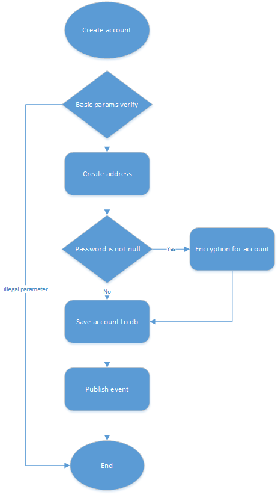
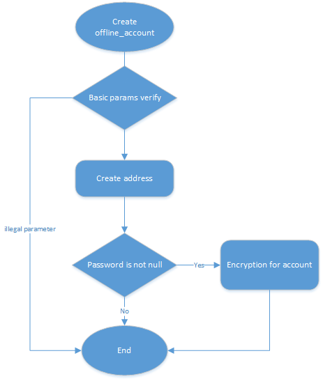
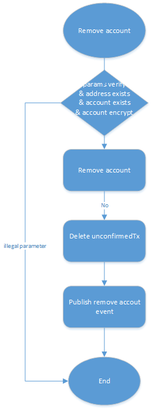
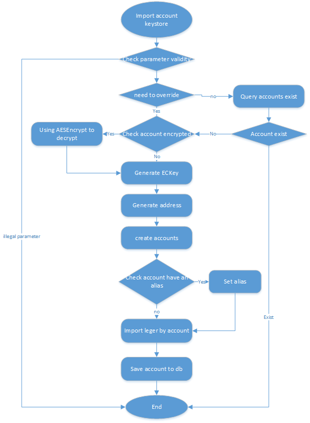
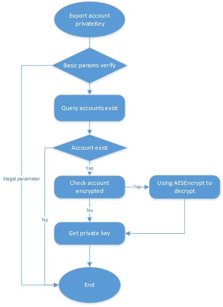

# 账户模块设计文档

[TOC]

## 一、总体描述

### 1.1 模块概述

#### 1.1.1 为什么要有《账户》模块

- 用于管理账户的生成、安全和保管、信息的获取
- 用户保存账户的地址、公私钥对、以及验证数据签名

#### 1.1.2 《账户》要做什么

账户模块是提供关于账户各项功能的基础性模块。主要对账户的生成、安全和保管、信息的获取等几个方面的功能提供支持，其他模块可以根据账户模块提供的接口来使用账户的各种功能以及获取账户信息，用户或者其他应用可以根据RPC接口对账户进行更加实用性和个性化的操作。账户是基础模块，也是用户数据的载体 。

- 账户的生成

  创建账户、导入账户

- 账户的安全和保管

  账户的备份、设置账户密码、修改账户密码、移除账户

- 账户信息的获取

  查询单个账户信息、获取多个账户信息、获取账户地址、查询账户余额、查询账户别名

- 其他实用性和个性化功能

  设置账户别名、设置账户备注、验证账户是否加密、签名、验证账户地址格式、验证账户密码是否正确等功能 

#### 1.1.3 《账户》在系统中的定位


账户是底层模块，与账本、共识、交易、内核、事件总线、社区治理模块有依赖关系。

1、账户模块依赖账本模块

	ledger模块需要处理本地交易，依赖于账户信息。
	
	账户模块需要发起设置别名交易，需要ledger模块支付费用
	
	账户余额查询，需要依赖ledger模块

2、账户模块依赖内核模块

```
上报模块信息、共享数据操作
```

3、账户模块依赖网络模块

```
通过网络模块来接收和发送数据
```

4、账户模块依赖事件总线模块

```
创建账户、删除账户、修改密码事件通过事件总线模块发送消息
账户模块并非强依赖事件总线模块，因为即使事件发送失败也不影响业务正常流程
```

5、共识模块依赖账户模块

```
共识需要账户信息进行打包出块
```

6、交易管理模块依赖账户模块

```
交易管理模块要对交易进行验证，依赖账户中address功能，验证地址是否合法
```

7、社区治理模块依赖账户模块

```
社区治理需要账户签名
```

### 1.2 架构图


1、API：对外提供接口层，提供账户的创建、备份、设置别名等操作；

2、业务逻辑层：定义账户、账户地址、别名的功能；

3、数据持久化层：保存账户、别名数据；

## 二、功能设计

### 2.1 功能架构图


### 2.2 模块服务

#### 2.2.1 创建账户

- 功能说明：

  创建用户的账户，包括账户的地址、公匙、私匙的创建，账户信息保存到数据库，并将创建账户通过事件通知其他节点

- 流程描述

  

  创建地址：创建卫星链标准账户地址

  ```
  1、生成随机公私钥对
  2、获取chainId和账户类型
  3、根据公钥计算hash160
  4、拼接字节数组组成地址：
  4.1、如果是NULS体系地址：address=type+hash160
  4.2、如果非NULS体系地址(比特币)：address=原始地址长度+原始地址
  5、生成地址字符串：地址字节[]+校验位，然后执行Base58计算生成字符串
  5.1、如果是NULS体系校验位：xor=XOR(addressType+pkh)
  5.1、如果非NULS体系校验位：xor=XOR(length+address)
  6、base58计算生成地址字符串：
     NULS体系地址：Base58(type+hash160+xor)+Hex(chainId)
     非NULS体系地址：Base58(length+address+xor)+Hex(chainId)
  7、根据密码对私钥进行加密，并将私钥的明文删除
  8、存储账户信息
  9、将账户加入缓存
  10、发送创建账户事件
  ```

- ac_createAccount接口

  - 接口说明

    该接口创建一个或多个账户。

  - 请求示例

  ```
  {
      "cmd":"ac_createAccount",
      "minVersion":1.0,
      "params":[
          1234,
          10,
          "123456"
      ]
  }
  ```

  - 请求参数说明

    | index | parameter | required | type    | description                      |
    | ----- | --------- | -------- | ------- | -------------------------------- |
    | 0     | chainId   | true     | Short   | 链ID，说明该账户属于哪个链       |
    | 1     | count     | false    | Integer | 要创建账户数量，约束条件：1-100. |
    | 2     | password  | false    | String  | 账户初始密码，可为空             |

  - 返回示例

  ```
  {
      "code": 0,
      "msg": "success",
      "version":1.0,
      "result": {
      	["address","",""]
      }
  }
  ```

  - 返回字段说明

  | parameter | type      | description  |
  | :-------- | :-------- | :----------- |
  | code      | Integer   | 返回结果状态 |
  | msg       | String    | 失败时的信息 |
  | result    | jsonObj   | 业务数据     |
  | list      | jsonArray | 账户地址列表 |

- 依赖服务

  事件总线：发送创建账户事件

#### 2.2.2 创建离线账户

- 功能说明：

  创建用户的离线账户，包括账户的地址、公匙、私匙的创建，账户信息并不会保存到数据库

- 流程描述

  

  创建地址：创建卫星链标准账户地址

  ```
  1、生成随机公私钥对
  2、获取chainId和账户类型
  3、根据公钥计算hash160
  4、拼接字节数组组成地址：
  4.1、如果是NULS体系地址：address=type+hash160
  4.2、如果非NULS体系地址(比特币)：address=原始地址长度+原始地址
  5、生成地址字符串：地址字节[]+校验位，然后执行Base58计算生成字符串
  5.1、如果是NULS体系校验位：xor=XOR(addressType+pkh)
  5.1、如果非NULS体系校验位：xor=XOR(length+address)
  6、base58计算生成地址字符串：
     NULS体系地址：Base58(type+hash160+xor)+Hex(chainId)
     非NULS体系地址：Base58(length+address+xor)+Hex(chainId)
  7、根据密码对私钥进行加密，并将私钥的明文删除
  8、返回账户信息，并不保存到数据库
  ```

- ac_createOfflineAccount接口

  - 接口说明

    该接口创建一个或多个离线账户。

  - 请求示例

    ```
    {
        "cmd":"ac_createOfflineAccount",
        "minVersion":1.0,
        "params":[
            1234,
            10,
            "123456"
        ]
    }
    ```

  - 请求参数说明

    | index | parameter | required | type    | description                      |
    | ----- | --------- | -------- | ------- | -------------------------------- |
    | 0     | chainId   | true     | Short   | 链ID，说明该账户属于哪个链       |
    | 1     | count     | false    | Integer | 要创建账户数量，约束条件：1-100. |
    | 2     | password  | false    | String  | 账户初始密码，可为空             |

  - 返回示例

    ```
    {
        "code": 0,
        "msg": "success",
        "version":1.0,
        "result": {
        	[
        	{
        	"address":"LgkSxjwficqMwnMVXpdA3kntVjXDm3930",
        	"pubKey":"0253aa17b27482261cc9e91d5ff6f4820130055ad092629e6981bff78c545c6289",
        	"priKey":"0253aa17b27482261cc9e91d5ff6f4820130055ad092629e6981bff78c545c6111",	
       		"encryptedPriKey":"e447b8427ce96b49e0fcf167f31635b93c8e8acf15e48c01e6753e23a",
      		"extend":null,
      		"createTime":1542003713441,
      		"encrypted":true,
      		"remark":null
      		},{}
        	]
        }
    }
    ```

  - 返回字段说明

    | parameter       | type      | description                              |
    | :-------------- | :-------- | :--------------------------------------- |
    | code            | Integer   | 返回结果状态                             |
    | msg             | String    | 失败时的信息                             |
    | result          | jsonObj   | 业务数据                                 |
    | list            | jsonArray | 账户地址列表                             |
    | address         | String    | 账户地址                                 |
    | pubKey          | String    | 公匙16进制编码                           |
    | priKey          | String    | 私匙16进制编码                           |
    | encryptedPriKey | String    | 加密私匙16进制编码，与priKey不会同时为空 |
    | extend          | String    | 扩展字段16进制编码                       |
    | createTime      | long      | 账户创建时间                             |
    | encrypted       | boolean   | 账户是否加密                             |
    | remark          | String    | 备注                                     |

- 依赖服务

  无

#### 2.2.3 创建多签账户

  - 功能说明：

    创建多重签名账户，包括账户的地址、脚本的创建，多签账户信息保存到数据库

  - 流程描述

    ```
    1、验证签名公匙列表，最少验证签名数是否正确
    2、创建多重签名脚本
    3、根据多签脚本创建多重签名类型的账户地址
    4、保存多重签名账户
    5、返回多签账户信息
    ```

  - ac_createMultiSigAccount接口

    - 接口说明

      该接口创建多重签名账户。

    - 请求示例

      ```
      {
        "cmd": "createMultiAccount",
        "minVersion":1.0,
        "params": [
              1234,
              ["pubKey1","pubKey2"],
              2
          ]
      }
      ```

    - 请求参数说明

      | index | parameter | required | type      | description                          |
      | ----- | --------- | -------- | --------- | ------------------------------------ |
      | 0     | chainId   | true     | Short     | 链ID，说明该账户属于哪个链           |
      | 1     | pubKeys   | true     | jsonArray | 需要签名的公钥列表                   |
      | 2     | minSigns  | true     | String    | 最少签名数，最少需要几个公钥验证通过 |

    - 返回示例

      ```
      {
          "code": 0,
          "msg": "success",
          "version":1.0,
          "result": {
              "address":"",
              "minSigns":"",
              "pubKeys":[{
                  "pubKey":"",
                  "address":""
                  },{}
              ]
          }
      }
      ```

    - 返回字段说明

      | parameter | type    | description  |
      | :-------- | :------ | :----------- |
      | code      | Integer | 返回结果状态 |
      | msg       | String  | 失败时的信息 |
      | result    | jsonObj | 业务数据     |
      | address   | String  | 多签账户地址 |
      | minSigns  | Integer | 最小签名数   |
      | pubKeys   | jsonObj | 公钥列表     |
      | --pubKey  | String  | 公钥         |
      | --address | String  | 地址         |

  - 依赖服务

    无

#### 2.2.4 移除账户

- 功能说明：

  移除用户的本地账户，包括删除本地账户的地址，并将删除账户通过事件通知其他节点

- 流程描述

  

  删除账户

  ```
  1、验证账户地址格式是否正确
  2、验证账户存在
  3、验证账户是否加密，如果加密，则需要验证密码
  3.1、根据账户已加密私匙+密码得到未加密私匙
  3.2、根据未加密私匙得到公匙
  3.3、将解密出的公匙与查询出的账户公匙比较是否相等
  4、删除数据
  4.1、删除本地账户信息
  4.2、删除账户缓存信息
  5、发送删除账户事件
  ```

- ac_removeAccount接口

  - 接口说明

    该接口用于移除账户

  - 请求示例

    ```
    {
      "cmd": "ac_removeAccount",
      "minVersion":1.0,
      "params": [
            1234,
            "AAax8wqxALqjyhrL8Wv1tQiqswAshAnX",
            "123456"
        ]
    }
    ```

  - 请求参数说明

    | index | parameter | required | type    | description      |
    | ----- | --------- | -------- | ------- | ---------------- |
    | 0     | chainId   | true     | Short   | 链ID             |
    | 1     | address   | true     | Integer | 要删除的账户地址 |
    | 2     | password  | false    | String  | 账户密码，可为空 |

  - 返回示例

    ```
    {
        "code": 0,
        "msg": "success",
        "version":1.0,
        "result": {
        	"value":true
        }
    }
    ```

  - 返回字段说明

    | parameter | type    | description  |
    | :-------- | :------ | :----------- |
    | code      | Integer | 返回结果状态 |
    | msg       | String  | 失败时的信息 |
    | result    | jsonObj | 业务数据     |
    | value     | boolean | 删除是否成功 |

- 依赖服务

  事件总线模块：发送删除账户事件


#### 2.2.5 导入账户-私匙

- 功能说明：

  根据私匙导入账户，根据私匙生成账户，并导入账户账本数据

- 流程描述

  

  根据私匙导入账户信息

  ```
  1、根据私钥生成公私钥对
  2、获取chainId和账户类型
  3、根据公钥计算hash160
  4、拼接字节数组组成地址：
  4.1、如果是NULS体系地址：address=type+hash160
  4.2、如果非NULS体系地址(比特币)：address=原始地址长度+原始地址
  5.1、如果是NULS体系校验位：xor=XOR(addressType+pkh)
  5.1、如果非NULS体系校验位：xor=XOR(length+address)
  6、base58计算生成地址字符串：
     NULS体系地址：Base58(type+hash160+xor)+Base58(chainId)
     非NULS体系地址：Base58(length+address+xor)+Base58(chainId)
  7、根据密码对私钥进行加密，并将私钥的明文删除
  8、存储账户信息
  9、将账户加入缓存
  10、若发送导入账户事件：账户已存在的情况不发布新事件，只做覆盖更新
  ```

- ac_importAccountByPriKey接口

  - 接口说明

    该接口根据账户私匙导入账户

  - 请求示例

    ```
    {
      "cmd": "ac_importAccountByPriKey",
      "minVersion":1.0,
      "params": [
            1234,
            "00c22ad91a170fc49df53b79791f702879eb0604235787eee2c303463bf6e41111",
            "123456",
            true
        ]
    }
    ```

  - 请求参数说明

    | index | parameter | required | type    | description        |
    | ----- | --------- | -------- | ------- | ------------------ |
    | 0     | chainId   | true     | Short   | 链ID               |
    | 1     | priKey    | true     | String  | 账户私匙           |
    | 2     | password  | false    | String  | 账户密码           |
    | 3     | overwrite | true     | Boolean | 账户存在时是否覆盖 |

  - 返回示例

    ```
    {
        "code": 0,
        "msg": "success",
        "version":1.0,
        "result": {
        	"address":"NseMUi1q9TefkXUcaysAuvFjj4NbTEST"
        }
    }
    ```

  - 返回字段说明

    | parameter | type    | description  |
    | :-------- | :------ | :----------- |
    | code      | Integer | 返回结果状态 |
    | msg       | String  | 失败时的信息 |
    | result    | jsonObj | 业务数据     |
    | address   | String  | 账户地址     |

- 依赖服务

  事件总线模块：账户不存在时，发送导入账户事件

  账本模块：导入账户账本（已确认交易）

#### 2.2.6 导入账户-keystore

- 功能说明：

  根据keystore导入账户，根据keystore解析解密得到私匙并生成账户，并导入账户账本数据

- 流程描述

    

    导入账户keystore

    ```
    1、验证keystore和密码是否匹配
    2、根据密码解密keystore中的私钥,keyStore包括json格式(address,encryptedPrivateKey,pubKey,prikey)
    3、根据私钥生成公私
    4、获取chainId和账户类型
    5、拼接字节数组组成地址
    6、生成地址字符串
    7、验证地址字符串和keystore中的地址是否一致
    8、存储账户信息
    9、发送导入账户事件：账户已存在的情况不发布新事件，只做覆盖更新
    ```

- ac_importAccountByKeystore接口

    - 接口说明

      该接口用于导入账户keystore

    - 请求示例

      ```
      {
        "cmd": "ac_importAccountByKeystore",
        "minVersion":1.0,
        "params": [
              1234,
              "HEX",
              "123456",
              true
          ]
      }
      ```

    - 请求参数说明

      | index | parameter | required | type    | description        |
      | ----- | --------- | -------- | ------- | ------------------ |
      | 0     | chainId   | true     | Short   | 链ID               |
      | 1     | keyStore  | true     | String  | keyStore HEX编码   |
      | 2     | password  | false    | String  | 账户密码           |
      | 3     | overwrite | true     | Boolean | 账户存在时是否覆盖 |

    - 返回示例

      ```
      {
          "code": 0,
          "msg": "success",
          "version":1.0,
          "result": {
          	"address":"ABCMUi1q9TefkXUcaysAuvFjj4NbTEST"
          }
      }
      ```

    - 返回字段说明

      | parameter | type    | description  |
      | :-------- | :------ | :----------- |
      | code      | Integer | 返回结果状态 |
      | msg       | String  | 失败时的信息 |
      | result    | jsonObj | 业务数据     |
      | address   | String  | 账户地址     |

- 依赖服务

    事件总线模块：账户不存在时，发送导入账户事件

    账本模块：导入账户账本（已确认交易）

#### 2.2.7 导入多签账户

- 功能说明：

  导入一个跟本地地址相关的多签账户，包括账户的地址、脚本的创建，多签账户信息保存到数据库

- 流程描述

  ```
  1、验证多签地址、签名公匙列表、最少验证签名数是否正确
  2、创建多重签名脚本
  3、根据多签脚本创建多重签名类型的账户地址
  4、判断导入的多签地址与脚本生成的地址是否相同，不相同则提示导入错误
  5、保存多签账户信息，包括：地址、公匙列表、最少验证签名数
  6、返回多签地址
  ```

- ac_importMultiSigAccount接口

  - 接口说明

    该接口用于导入多重签名账户。

  - 请求示例

    ```
    {
      "cmd": "ac_importMultiSigAccount",
      "minVersion":1.0,
      "params": [
            1234,
            "ABCMUi1q9TefkXUcaysAuvFjj4NbTEST",
            ["pubKey1","pubKey2"],
            2
        ]
    }
    ```

  - 请求参数说明

    | index | parameter | required | type      | description                          |
    | ----- | --------- | -------- | --------- | ------------------------------------ |
    | 0     | chainId   | true     | Short     | 链ID                                 |
    | 1     | address   | true     | String    | 多签账户地址                         |
    | 2     | pubkeys   | true     | jsonArray | 需要签名的公钥列表                   |
    | 3     | minSigns  | true     | Integer   | 最小签名数，最少需要几个公钥验证通过 |

  - 返回示例

    ```
    {
        "code": 0,
        "msg": "success",
        "version":1.0,
        "result": {
        	"address":"NseMUi1q9TefkXUcaysAuvFjj4NbTEST"
        }
    }
    ```

  - 返回字段说明

    | parameter | type    | description  |
    | :-------- | :------ | :----------- |
    | code      | Integer | 返回结果状态 |
    | msg       | String  | 失败时的信息 |
    | result    | jsonObj | 业务数据     |
    | address   | String  | 多签地址     |

  

#### 2.2.8 导出账户私匙

- 功能说明：

  导出账户私匙十六进制编码，与查询账户私钥功能重叠，作废

- 流程描述

    

    导出账户私匙

    ```
    1、验证账户是否存在，验证密码是否正确
    2、解密私钥，生成Hex字符串
    ```

- ac_exportAccountPriKey接口

    - 接口说明

      该接口用于导出账户私匙。

    - 请求示例

      ```
      {
        "cmd": "ac_exportAccountPriKey",
        "minVersion":1.0,
        "params": [
              1234,
              "ABCMUi1q9TefkXUcaysAuvFjj4NbTEST",
              "123456"
          ]
      }
      ```

    - 请求参数说明

      | index | parameter | required | type   | description |
      | ----- | --------- | -------- | ------ | ----------- |
      | 0     | chainId   | true     | Short  | 链ID        |
      | 1     | address   | true     | String | 账户地址    |
      | 2     | password  | true     | String | 账户密码    |

    - 返回示例

      ```
      {
          "code": 0,
          "msg": "success",
          "version":1.0,
          "result": {
          	"address":"NseMUi1q9TefkXUcaysAuvFjj4NbTEST",
          	"priKey":"1cb336b834494fb7eef070cf9c3e60a5a49e762ca1f81cb2592593047235f308"
          }
      }
      ```

    - 返回字段说明

      | parameter | type    | description  |
      | :-------- | :------ | :----------- |
      | code      | Integer | 返回结果状态 |
      | msg       | String  | 失败时的信息 |
      | result    | jsonObj | 业务数据     |
      | address   | String  | 地址         |
      | priKey    | String  | 私匙十六进制 |

#### 2.2.9 导出账户KeyStore

- 功能说明：

  导出账户keystore

- 流程描述

    

    导出账户keystore
    ```
    1、验证账户是否存在，验证密码是否正确
    2、生成keystore文件
    ```
- ac_exportAccountKeyStore接口

    - 接口说明

      该接口用于导出账户keystore。

    - 请求示例

      ```
      {
        "cmd": "ac_exportAccountKeyStore",
        "minVersion":1.0,
        "params": [
              1234,
              "ABCMUi1q9TefkXUcaysAuvFjj4NbTEST",
              "123456"
              "backup"
          ]
      }
      ```

    - 请求参数说明

      | index | parameter | required | type   | description  |
      | ----- | --------- | -------- | ------ | ------------ |
      | 0     | chainId   | true     | Short  | 链ID         |
      | 1     | address   | true     | String | 账户地址     |
      | 2     | password  | false    | String | 账户密码     |
      | 3     | path      | false    | String | 文件备份地址 |

    - 返回示例

          {
              "code": 0,
              "msg": "success",
              "version":1.0,
              "result": {
              	"path":"backup/TTax8wqxALqjyhrL8Wv1tQiqswAshAnX.keystore"
              }
          }

    - 返回字段说明

      | parameter | type    | description  |
      | :-------- | :------ | :----------- |
      | code      | Integer | 返回结果状态 |
      | msg       | String  | 失败时的信息 |
      | result    | jsonObj | 业务数据     |
      | path      | String  | 文件备份地址 |

#### 2.2.10 查询全部账户

- 功能说明：

  查询全部账户

- 流程描述 

    查询账户信息
    ```
    1、查询全部账户信息
    ```
- ac_getAccountList接口

    - 接口说明

      接口说明：该接口用于查询全部账户。

    - 请求示例

      ```
      {
          "cmd":"ac_getAccountList",
          "minVersion":1.0,
          "params":[
              1234
          ]
      }
      ```

    - 请求参数说明

      | index | parameter | required | type  | description |
      | ----- | --------- | -------- | ----- | ----------- |
      | 0     | chainId   | true     | Short | 链ID        |

    - 返回示例

          {
              "code": 0,
              "msg": "success",
              "version":1.0,
              "result": {
              	[{
                   	"address":"",
                      "alias":"",
                      "pubkeyHex":"",
                      "encryptedPrikeyHex":""
                      },{}]
              }
          }

    - 返回字段说明

      | parameter   | type | description |
      | :------------------ | :------- | :----------- |
      | code                | Integer  | 返回结果状态 |
      | msg                 | String   | 失败时的信息 |
      | result              | jsonObj  | 业务数据     |
      | list               | List     | 账户列表集合       |
      | address            | String   | 账户地址           |
      | alias              | String   | 别名               |
      | pubkeyHex          | String   | 公匙16进制编码     |
      | encryptedPrikeyHex | String   | 加密私匙16进制编码 |
#### 2.2.11 根据地址获取账户

- 功能说明：

  根据地址获取账户

- 流程描述

  ```
  1、验证地址是否存在
  2、根据地址获取账户
  ```

- ac_getAccountByAddress接口

    - 接口说明

      该接口用于根据地址获取账户。

    - 请求示例

      ```
      {
        "cmd": "ac_getAccountByAddress",
        "minVersion":1.0,
        "params": [
              1234,
              "ABCMUi1q9TefkXUcaysAuvFjj4NbTEST"
          ]
      }
      ```

    - 请求参数说明

      | index | parameter | required | type   | description |
      | ----- | --------- | -------- | ------ | ----------- |
      | 0     | chainId   | true     | Short  | 链ID        |
      | 1     | address   | true     | String | 账户地址    |

    - 返回示例 

      ```
      {
          "code": 0,
          "msg": "success",
          "version":1.0,
          "result": {
            "address":"",
            "alias":"",
            "pubkeyHex":"",
            "encryptedPrikeyHex":""
          }
      }
      ```

    - 返回字段说明

      | parameter   | type | description |
      | :------------------ | :------- | :----------- |
      | code                | Integer  | 返回结果状态 |
      | msg                 | String   | 失败时的信息 |
      | result              | jsonObj  | 业务数据     |
      | address            | String   | 账户地址           |
      | alias              | String   | 别名               |
      | pubkeyHex          | String   | 公匙16进制编码     |
      | encryptedPrikeyHex | String   | 加密私匙16进制编码 |

#### 2.2.12 查询账户地址列表

- 功能说明：

  查询账户地址列表

- 流程描述

    ```
    1、校验分页参数是否合法，分页数、分页大小不能小于0，必须为整数；
    2、查询所有账户；
    3、过滤符合分页条件的账户；
    4、只返回账户的地址列表；
    ```
- ac_getAddressList接口

    - 接口说明

      该接口用于查询账户地址列表。

    - 请求示例

      ```
      {
        "cmd": "ac_getAddressList",
        "minVersion":1.0,
        "params": [
              1234,
              1,
              10
          ]
      }
      ```

    - 请求参数说明

      | index | parameter  | required | type    | description  |
      | ----- | ---------- | -------- | ------- | ------------ |
      | 0     | chainId    | true     | Short   | 链ID         |
      | 1     | pageNumber | true     | Integer | 页码         |
      | 2     | pageSize   | true     | Integer | 每页显示数量 |

    - 返回示例

          {
              "code": 0,
              "msg": "success",
              "version":1.0,
              "result": {
              	["","",""]
              }
          }

    - 返回字段说明

      | parameter   | type | description |
      | :------------------ | :------- | :----------- |
      | code                | Integer  | 返回结果状态 |
      | msg                 | String   | 失败时的信息 |
      | result              | jsonObj  | 业务数据     |
      | list     | jsonArray | 地址列表集合   |

#### 2.2.13 根据别名获取地址

- 功能说明：

  根据别名获取地址

- 流程描述

    ```
    1、查询别名是否存在
    2、返回设置别名时使用的账户地址，并使用Base58对账户地址进行编码
    ```
- ac_getAddressByAlias接口

    - 接口说明

      该接口用于根据别名获取地址。

    - 请求示例

      ```
      {
        "cmd": "ac_getAddressByAlias",
        "minVersion":1.0,
        "params": [
              1234,
              "abc"
          ]
      }
      ```

    - 请求参数说明

      | index | parameter | required | type   | description |
      | ----- | --------- | -------- | ------ | ----------- |
      | 0     | chainId   | true     | Short  | 链ID        |
      | 1     | alias     | true     | String | 别名        |

    - 返回示例

      ```
      {
          "code": 0,
          "msg": "success",
          "version":1.0,
          "result": {
          	"address":"NseMUi1q9TefkXUcaysAuvFjj4NbTEST",
          }
      }
      ```

    - 返回字段说明

      | parameter | type | description |
      | :------- | :------- | :-------------- |
      | code     | Integer  | 返回结果状态    |
      | msg      | String   | 失败时的信息    |
      | result   | jsonObj  | 业务数据        |
      | address  | String   | 地址,Base58编码 |
#### 2.2.14 查询账户私匙

- 功能说明：

  查询账户私匙

- 流程描述

    ```
    1、校验地址是否正确，使用Base58解码，分别校验链ID、地址类型、校验位
    2、验证账户是否存在
    3、如果账户加过密(有密码), 就通过AES解密并验证密码是否正确，获得未加密私匙
    4、如果账户未加密，则不返回私钥，账户如果存在则返回账户有效标识
    5、使用十六进制编码，并返回账户私匙
    ```
- ac_getPriKeyByAddress接口

    - 接口说明

      该接口用于查询账户私匙。

    - 请求示例

      ```
      {
        "cmd": "ac_getPriKeyByAddress",
        "minVersion":1.0,
        "params": [
              1234,
              "NseMUi1q9TefkXUcaysAuvFjj4NbTEST",
              "123456"
          ]
      }
      ```

    - 请求参数说明

      | index | parameter | required | type   | description |
      | ----- | --------- | -------- | ------ | ----------- |
      | 0     | chainId   | true     | Short  | 链ID        |
      | 1     | address   | true     | String | address     |
      | 2     | password  | false    | String | 账户密码    |

    - 返回示例

          {
              "code": 0,
              "msg": "success",
              "version":1.0,
              "result": {
                 "priKey":"1cb336b834494fb7eef070cf9c3e60a5a49e762ca1f81cb2592593047235f308",
                 "valid":true
              }
          }

    - 返回字段说明

      | parameter | type | description |
      | :------- | :------- | :----------- |
      | code     | Integer  | 返回结果状态 |
      | msg      | String   | 失败时的信息 |
      | result   | jsonObj  | 业务数据     |
      | priKey   | String   | 私匙十六进制 |
      | valid | Boolean | 账户是否存在 |
#### 2.2.15 查询所有账户私匙

- 功能说明：

  查询所有账户私匙

- 流程描述

    ```
    1、验证密码格式是否正确，密码可为空
    2、获取所有本地账户
    3、本地账户的加密信息必须一致，如果参数密码不为空，所有账户的密码都必须与之相同，如果参数密码为空，所有账户都不能设置密码，否则提示错误
    4、如果账户加密则通过密码反解出未加密私匙，否则未加密直接获得私匙
    5、将所有私匙添加到集合并返回
    ```
- ac_getAllPriKey接口

    - 接口说明

      该接口用于查询所有账户私匙。

    - 请求示例

      ```
      {
        "cmd": "ac_getAllPriKey",
        "minVersion":1.0,
        "params": [
              1234,
              "123456"
          ]
      }
      ```

    - 请求参数说明

      | index | parameter | required | type   | description                 |
      | ----- | --------- | -------- | ------ | --------------------------- |
      | 0     | chainId   | false    | Short  | 链ID，默认为0查询所有链账户 |
      | 2     | password  | false    | String | 账户密码                    |

    - 返回示例

          {
              "code": 0,
              "msg": "success",
              "version":1.0,
              "result": {
                ["",""]
              }
          }

    - 返回字段说明

      | parameter   | type | description |
      | :------------------ | :------- | :----------- |
      | code                | Integer  | 返回结果状态 |
      | msg                 | String   | 失败时的信息 |
      | result              | jsonObj  | 业务数据     |
      | list     | String   | 私匙集合     |
#### 2.2.16 设置密码

- 功能说明：

  设置密码

- 流程描述

  ```
  1、验证账户是否存在
  2、验证密码是否已经设置
  3、设置账户密码
  ```

- ac_setPassword接口定义

    - 接口说明

      该接口用于设置账户密码。

    - 请求示例

      ```
      {
        "cmd": "ac_setPassword",
        "minVersion":1.0,
        "params": [
              1234,
              "NseMUi1q9TefkXUcaysAuvFjj4NbTEST",
              "123456"
          ]
      }
      ```

    - 请求参数说明

      | index | parameter | required | type   | description |
      | ----- | --------- | -------- | ------ | ----------- |
      | 0     | chainId   | true     | Short  | 链ID        |
      | 1     | address   | true     | String | 账户地址    |
      | 2     | password  | true     | String | 账户密码    |

    - 返回示例

          {
              "code": 0,
              "msg": "success",
              "version":1.0,
              "result": {
              	"value":true
              }
          }

    - 返回字段说明

      | parameter   | type | description |
      | :------------------ | :------- | :----------- |
      | code                | Integer  | 返回结果状态 |
      | msg                 | String   | 失败时的信息 |
      | result              | jsonObj  | 业务数据     |
      | value               | boolean  | 业务数据，密码设置是否成功 |
#### 2.2.17 设置离线账户密码

- 功能说明：

  设置离线账户密码

- 流程描述

  ```
  1、验证地址是否正确
  2、验证私匙是否正确
  3、根据私匙创建
  4、设置离线账户密码
  ```

- ac_setOfflineAccountPassword接口

    - 接口说明

      该接口用于设置离线账户密码。

    - 请求示例

      ```
      {
        "cmd": "ac_setOfflineAccountPassword",
        "minVersion":1.0,
        "params": [
              1234,
              "NseMUi1q9TefkXUcaysAuvFjj4NbTEST",
              "00c22ad91a170fc49df53b79791f702879eb0604235787eee2c303463bf6e41111",
              "123456"
          ]
      }
      ```

    - 请求参数说明

      | index | parameter | required | type   | description |
      | ----- | --------- | -------- | ------ | ----------- |
      | 0     | chainId   | true     | Short  | 链ID        |
      | 1     | address   | true     | String | 账户地址    |
      | 2     | priKey    | true     | String | 账户私匙    |
      | 3     | password  | true     | String | 账户密码    |

    - 返回示例

      ```
      {
          "code": 0,
          "msg": "success",
          "version":1.0,
          "result": {
              "encryptedPriKey":""
          }
      }
      ```

    - 返回字段说明

      | parameter | type | description |
      | :-------------- | :------- | :----------- |
      | code            | Integer  | 返回结果状态 |
      | msg             | String   | 失败时的信息 |
      | result          | jsonObj  | 业务数据     |
      | encryptedPriKey | String   | 加密私匙     |
#### 2.2.18 修改密码

- Request Body

- 功能说明：

  修改密码

- 流程描述

  ```
  1、验证旧密码正确性
  2、更新私钥密文
  3、发送修改密码事件
  ```

- ac_updatePassword接口

    - 接口说明

      该接口用于修改账户密码。

    - 请求示例

      ```
      {
        "cmd": "ac_updatePassword",
        "minVersion":1.0,
        "params": [
              1234,
              "NseMUi1q9TefkXUcaysAuvFjj4NbTEST",
              "123456",
              "111111"
          ]
      }
      ```

    - 请求参数说明

      | index | parameter   | required | type   | description |
      | ----- | ----------- | -------- | ------ | ----------- |
      | 0     | chainId     | true     | Short  | 链ID        |
      | 1     | address     | true     | String | 账户地址    |
      | 2     | password    | true     | String | 账户密码    |
      | 3     | newPassword | true     | String | 账户新密码  |

    - 返回示例

          {
              "code": 0,
              "msg": "success",
              "version":1.0,
              "result": {
                  "value":true
              }
          }

    - 返回字段说明

      | parameter   | type | description |
      | :------------------ | :------- | :----------- |
      | code                | Integer  | 返回结果状态 |
      | msg                 | String   | 失败时的信息 |
      | result              | jsonObj  | 业务数据     |
      | value               | boolean  | 密码修改是否成功 |
#### 2.2.19 修改离线账户密码

- 功能说明：

  修改离线账户密码

- 流程描述

  ```
  1、验证地址是否正确
  2、根据地址、私匙、新密码生成离线账户
  ```

- ac_updateOfflineAccountPassword接口

    - 接口说明

      该接口用于修改离线账户密码。

    - 请求示例

      ```
      {
        "cmd": "ac_updateOfflineAccountPassword",
        "minVersion":1.0,
        "params": [
              1234,
              "NseMUi1q9TefkXUcaysAuvFjj4NbTEST",
              "00c22ad91a170fc49df53b79791f702879eb0604235787eee2c303463bf6e41111",
              "123456",
              "111111"
          ]
      }
      
      ```

    - 请求参数说明

      | index | parameter   | required | type   | description |
      | ----- | ----------- | -------- | ------ | ----------- |
      | 0     | chainId     | true     | Short  | 链ID        |
      | 1     | address     | true     | String | 账户地址    |
      | 2     | priKey      | true     | String | 私匙        |
      | 3     | password    | true     | String | 账户密码    |
      | 4     | newPassword | true     | String | 账户新密码  |

    - 返回示例

          {
              "code": 0,
              "msg": "success",
              "version":1.0,
              "result": {
                  "encryptedPriKey":""
              }
          }

    - 返回字段说明

      | parameter | type | description |
      | :-------------- | :------- | :----------- |
      | code            | Integer  | 返回结果状态 |
      | msg             | String   | 失败时的信息 |
      | result          | jsonObj  | 业务数据     |
      | encryptedPriKey | String   | 加密私匙     |
#### 2.2.20 验证密码

- 功能说明：

  验证密码

- 流程描述

  ```
  1、验证密码是否正确
  2、返回验证结果
  ```

- ac_validationPassword接口

    - 接口说明

      该接口用于验证密码。

    - 请求示例

      ```
      {
        "cmd": "ac_validationPassword",
        "minVersion":1.0,
        "params": [
              1234,
              "NseMUi1q9TefkXUcaysAuvFjj4NbTEST",
              "123456"
          ]
      }
      ```

    - 请求参数说明

      | index | parameter | required | type   | description |
      | ----- | --------- | -------- | ------ | ----------- |
      | 0     | chainId   | true     | Short  | 链ID        |
      | 1     | address   | true     | String | 账户地址    |
      | 2     | password  | true     | String | 账户密码    |

    - 返回示例

          {
              "code": 0,
              "msg": "success",
              "version":1.0,
              "result": {
                  "value":true
              }
          }

    - 返回字段说明

      | parameter | type | description |
      | :------- | :------- | :----------- |
      | code     | Integer  | 返回结果状态 |
      | msg      | String   | 失败时的信息 |
      | result   | jsonObj  | 业务数据     |
      | value    | boolean  | 密码是否正确 |
#### 2.2.21 验证账户是否加密

- 功能说明：

  验证账户是否加密

- 流程描述


    1、验证账户是否存在
    2、验证账户是否加密
    3、返回验证结果
- ac_isEncrypted接口

    - 接口说明

      该接口用于验证账户是否加密。

    - 请求示例

      ```
      {
        "cmd": "ac_isEncrypted",
        "minVersion":1.0,
        "params": [
              1234,
              "NseMUi1q9TefkXUcaysAuvFjj4NbTEST"
          ]
      }
      ```

    - 请求参数说明

      | index | parameter | required | type   | description |
      | ----- | --------- | -------- | ------ | ----------- |
      | 0     | chainId   | true     | Short  | 链ID        |
      | 1     | address   | true     | String | 账户地址    |

    - 返回示例

      ```
      {
          "code": 0,
          "msg": "success",
          "version":1.0,
          "result": {
          	"value":true
          }
      }
      ```

    - 返回字段说明

      | parameter | type | description |
      | :------- | :------- | :----------- |
      | code     | Integer  | 返回结果状态 |
      | msg      | String   | 失败时的信息 |
      | result   | jsonObj  | 业务数据     |
      | value    | boolean  | 账户是否加密 |
#### 2.2.22 设置账户别名

- 功能说明：

  设置账户别名

- 流程描述

    ```
    1、验证别名是否合法
    2、生成设置别名交易
    3、调用ledger填充交易费用信息
    4、广播交易
    5、交易确认后，会保存别名到数据库，将address和alias分别作为key存储，也就是别名数据会存两条数据，主要是为了便于根据address和alias分别查询
    ```

- ac_setAlias接口定义

    - 接口说明

      该接口用于设置账户别名。

    - 请求示例

      ```
      {
        "cmd": "ac_setAlias",
        "minVersion":1.0,
        "params": [
              1234,
              "NseMUi1q9TefkXUcaysAuvFjj4NbTEST",
              "123456",
              "abc"
          ]
      }
      ```

    - 请求参数说明

      | index | parameter | required | type   | description |
      | ----- | --------- | -------- | ------ | ----------- |
      | 0     | chainId   | true     | Short  | 链ID        |
      | 1     | address   | true     | String | 账户地址    |
      | 2     | password  | false    | String | 账户密码    |
      | 3     | alias     | true     | String | 别名        |

    - 返回示例

          {
              "code": 0,
              "msg": "success",
              "version":1.0,
              "result": {
                "txHash":"1cb336b834494fb7eef070cf9c3e60a5a49e762ca1f81cb2592593047235f308"
              }
          }

    - 返回字段说明

      | parameter | type | description |
      | :------- | :------- | :----------- |
      | code     | Integer  | 返回结果状态 |
      | msg      | String   | 失败时的信息 |
      | result   | jsonObj  | 业务数据     |
      | txHash   | String   | 别名交易hash |

- 依赖服务

    账本模块：设置别名需要花费手续费
#### 2.2.23 获取设置别名手续费

- 功能说明：

  获取设置别名手续费

- 流程描述

  ```
  1、验证账户是否存在，验证别名是否正确
  2、计算别名设置所需手续费
  ```

- ac_getAliasFee接口

    - 接口说明

      该接口用于获取设置别名手续费。

    - 请求示例

      ```
      {
        "cmd": "ac_getAliasFee",
        "minVersion":1.0,
        "params": [
              1234,
              "NseMUi1q9TefkXUcaysAuvFjj4NbTEST",
              "abc"
          ]
      }
      ```

    - 请求参数说明

      | index | parameter | required | type   | description |
      | ----- | --------- | -------- | ------ | ----------- |
      | 0     | chainId   | true     | Short  | 链ID        |
      | 1     | address   | true     | String | 账户地址    |
      | 2     | alias     | true     | String | 别名        |

    - 返回示例

          {
              "code": 0,
              "msg": "success",
              "version":1.0,
              "result": {
                  "fee":"100",
                  "maxAmount":"10000"
              }
          }

    - 返回字段说明

      | parameter   | type | description |
      | :------------------ | :------- | :----------- |
      | code                | Integer  | 返回结果状态 |
      | msg                 | String   | 失败时的信息 |
      | result              | jsonObj  | 业务数据     |
      | fee                 | String   | 别名交易手续费 |
      | maxAmount           | String   | 交易最大手续费 |
#### 2.3.24 根据地址查询别名

- 功能说明：

  根据地址查询别名

- 流程描述

  ```
  1、验证账户是否存在
  2、从数据库中查询账户对应的别名
  ```

- ac_getAliasByAddress接口

    - 接口说明

      该接口用于根据地址查询别名。

    - 请求示例

      ```
      {
        "cmd": "ac_getAliasByAddress",
        "minVersion":1.0,
        "params": [
              1234,
              "NseMUi1q9TefkXUcaysAuvFjj4NbTEST"
          ]
      }
      ```

    - 请求参数说明

      | index | parameter | required | type   | description |
      | ----- | --------- | -------- | ------ | ----------- |
      | 0     | chainId   | true     | Short  | 链ID        |
      | 1     | address   | true     | String | 账户地址    |

    - 返回示例

          {
              "code": 0,
              "msg": "success",
              "version":1.0,
              "result": {
                  "alias":""
              }
          }

    - 返回字段说明

      | parameter | type | description |
      | :------- | :------- | :----------- |
      | code     | Integer  | 返回结果状态 |
      | msg      | String   | 失败时的信息 |
      | result   | jsonObj  | 业务数据     |
      | alias    | String   | 账户别名     |
#### 2.2.25 验证别名是否可用

- 功能说明：

  验证别名是否可用

- 流程描述

  ```
  1、查询别名是否已存在，如果存在则不可用，反之则可用
  ```

- ac_isAliasUsable接口

    - 接口说明

      该接口用于验证别名是否可用。

    - 请求示例

      ```
      {
        "cmd": "ac_isAliasUsable",
        "minVersion":1.0,
        "params": [
              1234,
              "abc"
          ]
      }
      ```

    - 请求参数说明

      | index | parameter | required | type   | description |
      | ----- | --------- | -------- | ------ | ----------- |
      | 0     | chainId   | true     | Short  | 链ID        |
      | 1     | alias     | true     | String | 账户别名    |

    - 返回示例

          {
              "code": 0,
              "msg": "success",
              "version":1.0,
              "result": {
                  "value":true
              }
          }

    - 返回字段说明

      | parameter   | type | description |
      | :------------------ | :------- | :----------- |
      | code                | Integer  | 返回结果状态 |
      | msg                 | String   | 失败时的信息 |
      | result              | jsonObj  | 业务数据    |
      | value               | boolean  | 别名是否可用 |
#### 2.2.26 设置账户备注

- 功能说明：

  设置账户备注

- 流程描述

  ```
  1、验证账户是否存在
  2、修改备注信息并保存
  ```

- ac_setRemark接口

    - 接口说明

      该接口用于设置账户备注。

    - 请求示例

      ```
      {
        "cmd": "ac_setRemark",
        "minVersion":1.0,
        "params": [
              1234,
              "NseMUi1q9TefkXUcaysAuvFjj4NbTEST"
              "remark1"
          ]
      }
      ```

    - 请求参数说明

      | index | parameter | required | type   | description |
      | ----- | --------- | -------- | ------ | ----------- |
      | 0     | chainId   | true     | Short  | 链ID        |
      | 1     | address   | true     | String | 账户地址    |
      | 2     | remark    | true     | String | 账户备注    |

    - 返回示例

          {
              "code": 0,
              "msg": "success",
              "version":1.0,
              "result": {
                  "value":true
              }
          }

    - 返回字段说明

      | parameter | type | description |
      | :------- | :------- | :----------- |
      | code     | Integer  | 返回结果状态 |
      | msg      | String   | 失败时的信息 |
      | result   | jsonObj  | 业务数据     |
      | value    | boolean  | 设置是否成功 |
#### 2.2.27 设置多签账户别名

- 功能说明：

  设置多签账户别名

- 流程描述

  ```
  1、验证账户地址、别名、账户密码、签名地址参数是否合法
  2、查询账户地址、签名地址是否存在
  3、生成设置多签账户别名交易
  4、调用ledger填充交易费用信息
  5、使用签名账户对交易进行签名
  6、当已签名数等于最少签名数则保存未确认交易到本地账户
  7、广播该交易
  8、返回交易hash
  ```

- ac_setMultiSigAlias接口

  - 接口说明

      该接口用于设置多签账户别名。

  - 请求示例

      ```
      {
        "cmd": "ac_setMultiSigAlias",
        "minVersion":1.0,
        "params": [
              1234,
              "NseMUi1q9TefkXUcaysAuvFjj4NbTEST",
              "DCQMUi1q9TefkXUcaysAuvFjj4NbTEST",
              "123456",
              "abc"
          ]
      }
      ```

  - 请求参数说明

    | index | parameter   | required | type   | description  |
    | ----- | ----------- | -------- | ------ | ------------ |
    | 0     | chainId     | true     | Short  | 链ID         |
    | 1     | address     | true     | String | 多签账户地址 |
    | 2     | signAddress | true     | String | 签名地址     |
    | 3     | password    | false    | String | 账户密码     |
    | 4     | alias       | true     | String | 别名         |

  - 返回示例

    ```
    {
        "code": 0,
        "msg": "success",
        "version":1.0,
        "result": {
           "txHash":"1cb336b834494fb7eef070cf9c3e60a5a49e762ca1f81cb2592593047235f308"
        }
    }
    
    ```

  - 返回字段说明

    | parameter | type    | description      |
    | :-------- | :------ | :--------------- |
    | code      | Integer | 返回结果状态     |
    | msg       | String  | 失败时的信息     |
    | result    | jsonObj | 业务数据         |
    | txHash    | String  | 多签别名交易hash |

- 依赖服务

  账本模块：设置多签别名需要花费手续费

#### 2.2.28 移除多签账户

- 功能说明：

  移除多签账户

- 流程描述

  ```
  1、验证账户地址是否正确
  2、数据库中删除多签账户
  3、返回删除是否成功
  ```

- ac_removeMultiSigAccount接口

  - 接口说明

      该接口用于移除多签账户。

  - 请求示例

      ```
      {
        "cmd": "ac_setMutilSigAlias",
        "minVersion":1.0,
        "params": [
              1234,
              "DCQMUi1q9TefkXUcaysAuvFjj4NbTEST",
          ]
      }
      ```

  - 请求参数说明

    | index | parameter | required | type   | description  |
    | ----- | --------- | -------- | ------ | ------------ |
    | 0     | chainId   | true     | Short  | 链ID         |
    | 1     | address   | true     | String | 多签账户地址 |

  - 返回示例

    ```
    {
        "code": 0,
        "msg": "success",
        "version":1.0,
        "result": {
           "value":true
        }
    }
    
    ```

  - 返回字段说明

    | parameter | type    | description  |
    | :-------- | :------ | :----------- |
    | code      | Integer | 返回结果状态 |
    | msg       | String  | 失败时的信息 |
    | result    | jsonObj | 业务数据     |
    | value     | boolean | 是否移除成功 |


#### 2.2.29 交易统一验证

- 功能说明：

  账户模块所有交易统一验证接口，目前只有别名交易

- 流程描述

  ```
  1、交易列表是否为空
  2、循环所有交易列表，针对别名交易进行处理
  3、检测当前交易列表中，是否存在设置相同的别名
  4、检测当前交易列表中，是否存在账户重复设置别名
  5、如果交易列表中没有冲突，则验证通过
  ```

- ac_accountTxValidate接口

  - 接口说明

    该接口用于批量验证账户模块所有交易。

  - 请求示例

    ```
    {
      "cmd": "ac_accountTxValidate",
      "minVersion":1.0,
      "params": [chianId, ["txHex","txHex","txHex", ...]]
    }
    
    ```

  - 请求参数说明

    | index | parameter | required | type  | description            |
    | ----- | --------- | -------- | ----- | ---------------------- |
    | 0     | chainId   | true     | Short | 链ID                   |
    | 1     | txHex     | true     | array | 别名交易序列化数据数组 |

    txHex说明

    ```
    {
        "type":3,
        "time":"12546545596",
        "scriptSig":"",
        "hash":"",
        "coinData":
        {
            "froms":
            [{
                "address":"Nse8m2Te1UNGPhD1tjZ3A4GDW3dCJxqE",
                "amount":"10000",
                "nonce":"123"
            }],
            "to":
            [{
                "address":"Nse8m2Te1UNGPhD1tjZ3A4GDW3dCJxqE",
                "amount":"1"
            }]
        },
        "txData":
        {
            "chainId":12345,
            "address":"Nse8m2Te1UNGPhD1tjZ3A4GDW3dCJxqE",
            "alias":"lucas"
        }
    }
    ```

  - 返回示例

    ```
    {
        "code": 0,
        "msg": "success",
        "version":1.0,
        "result": {
           "list":["txHex", "txHex", "txHex", ...]
        }
    }
    ```

  - 返回字段说明

    | parameter | type      | description              |
    | :-------- | :-------- | :----------------------- |
    | code      | Integer   | 返回结果状态             |
    | msg       | String    | 失败时的信息             |
    | result    | jsonObj   | 业务数据                 |
    | list      | jsonArray | 不合法交易序列化数据数组 |


#### 2.2.30 别名交易验证

- 功能说明：

  别名交易验证接口

- 流程描述

  ```
  1、反序列化txHex别名交易数据
  2、验证别名格式
  3、验证别名是否已被占用
  4、验证该账户是否已设置别名
  5、验证coinData输入输出
  6、验证脚本签名格式
  7、验证签名中是否包含设置别名的地址，如果不包含则属于恶意犯规，否则验证通过
  ```

- ac_aliasTxValidate接口

  - 接口说明

    该接口用于单个别名交易。

  - 请求示例

    ```
    {
      "cmd": "ac_aliasTxValidate",
      "minVersion":1.0,
      "params": [chainId,"txHex"]
    }
    
    ```

  - 请求参数说明

    | index | parameter | required | type   | description        |
    | ----- | --------- | -------- | ------ | ------------------ |
    | 0     | chainId   | true     | Short  | 链ID               |
    | 1     | txHex     | true     | String | 别名交易序列化数据 |

    txHex说明

    ```
    {
        "type":3,
        "time":"12546545596",
        "scriptSig":"",
        "hash":"",
        "coinData":
        {
            "froms":
            [{
                "address":"Nse8m2Te1UNGPhD1tjZ3A4GDW3dCJxqE",
                "amount":"10000",
                "nonce":"123"
            }],
            "to":
            [{
                "address":"Nse8m2Te1UNGPhD1tjZ3A4GDW3dCJxqE",
                "amount":"1"
            }]
        },
        "txData":
        {
            "chainId":12345,
            "address":"Nse8m2Te1UNGPhD1tjZ3A4GDW3dCJxqE",
            "alias":"lucas"
        }
    }
    ```

  - 返回示例

    ```
    {
        "code": 0,
        "msg": "success",
        "version":1.0,
        "result": {
           "value":true
        }
    }
    ```

  - 返回字段说明

    | parameter | type    | description  |
    | :-------- | :------ | :----------- |
    | code      | Integer | 返回结果状态 |
    | msg       | String  | 失败时的信息 |
    | result    | jsonObj | 业务数据     |
    | value     | boolean | 是否验证成功 |


#### 2.2.31 别名交易提交

- 功能说明：

  别名交易提交，保存别名

- 流程描述

  ```
  1、反序列化txHex别名交易数据
  2、保存别名alias至数据库
  3、将别名设置到account然后保存至数据库
  4、将修改后的account重新进行缓存
  5、返回别名保存是否成功
  ```

- ac_aliasTxCommit接口

  - 接口说明

    该接口用于保存别名。

  - 请求示例

    ```
    {
      "cmd": "ac_aliasTxCommit",
      "minVersion":1.0,
      "params": [chainId,"txHex","secondaryDataHex"]
    }
    
    ```

  - 请求参数说明

    | index | parameter        | required | type   | description        |
    | ----- | ---------------- | -------- | ------ | ------------------ |
    | 0     | chainId          | true     | Short  | 链ID               |
    | 1     | txHex            | true     | String | 别名交易序列化数据 |
    | 2     | secondaryDataHex | true     | String | 区块头序列化数据   |

    txHex说明

    ```
    {
        "type":3,
        "time":"12546545596",
        "scriptSig":"",
        "hash":"",
        "coinData":
        {
            "froms":
            [{
                "address":"Nse8m2Te1UNGPhD1tjZ3A4GDW3dCJxqE",
                "amount":"10000",
                "nonce":"123"
            }],
            "to":
            [{
                "address":"Nse8m2Te1UNGPhD1tjZ3A4GDW3dCJxqE",
                "amount":"1"
            }]
        },
        "txData":
        {
            "chainId":12345,
            "address":"Nse8m2Te1UNGPhD1tjZ3A4GDW3dCJxqE",
            "alias":"lucas"
        }
    }
    ```
    secondaryDataHex说明

    ```
    "txData":
        {
            "hash":"",
            "height":1,
            "time":13369748564
        }
    ```

    

  - 返回示例

    ```
    {
        "code": 0,
        "msg": "success",
        "version":1.0,
        "result": {
           "value":true
        }
    }
    ```

  - 返回字段说明

    | parameter | type    | description          |
    | :-------- | :------ | :------------------- |
    | code      | Integer | 返回结果状态         |
    | msg       | String  | 失败时的信息         |
    | result    | jsonObj | 业务数据             |
    | value     | boolean | 别名交易保存是否成功 |

#### 2.2.32 别名交易回滚

- 功能说明：

  别名交易回滚接口

- 流程描述

  ```
  1、反序列化txHex别名交易数据
  2、从数据库删除别名对象数据
  3、取出对应的account将别名清除,重新存入数据库
  4、重新缓存account
  5、返回别名回滚是否成功
  ```

- ac_aliasTxRollback接口

  - 接口说明

    该接口用于回滚别名。

  - 请求示例

    ```
    {
      "cmd": "ac_aliasTxRollback",
      "minVersion":1.0,
      "params": [chainId,"txHex","secondaryDataHex"]
    }
    
    ```

  - 请求参数说明

    | index | parameter        | required | type   | description        |
    | ----- | ---------------- | -------- | ------ | ------------------ |
    | 0     | chainId          | true     | Short  | 链ID               |
    | 1     | txHex            | true     | String | 别名交易序列化数据 |
    | 2     | secondaryDataHex | true     | String | 区块头序列化数据   |

    txHex说明

    ```
    {
        "type":3,
        "time":"12546545596",
        "scriptSig":"",
        "hash":"",
        "coinData":
        {
            "froms":
            [{
                "address":"Nse8m2Te1UNGPhD1tjZ3A4GDW3dCJxqE",
                "amount":"10000",
                "nonce":"123"
            }],
            "to":
            [{
                "address":"Nse8m2Te1UNGPhD1tjZ3A4GDW3dCJxqE",
                "amount":"1"
            }]
        },
        "txData":
        {
            "chainId":12345,
            "address":"Nse8m2Te1UNGPhD1tjZ3A4GDW3dCJxqE",
            "alias":"lucas"
        }
    }
    ```
    secondaryDataHex说明

    ```
    "txData":
        {
            "hash":"",
            "height":1,
            "time":13369748564
        }
    ```

    

  - 返回示例

    ```
    {
        "code": 0,
        "msg": "success",
        "version":1.0,
        "result": {
           "value":true
        }
    }
    ```

  - 返回字段说明

    | parameter | type    | description          |
    | :-------- | :------ | :------------------- |
    | code      | Integer | 返回结果状态         |
    | msg       | String  | 失败时的信息         |
    | result    | jsonObj | 业务数据             |
    | value     | boolean | 别名交易回滚是否成功 |
  
#### 2.2.33 数据签名

- 功能说明：

  根据私钥将数据进行加密签名

- 流程描述

  ```
  1、验证账户是否存在，验证密码是否正确
  2、根据椭圆曲线算法对数据签名
  3、返回十六进制签名后数据
  ```

- ac_signDigest接口

  - 接口说明

    该接口用于数据签名。

  - 请求示例

    ```
    {
      "cmd": "ac_signDigest",
      "minVersion":1.0,
      "params": 
        {
            "chainId":"12345",
            "address":"NseMUi1q9TefkXUcaysAuvFjj4NbTEST",
            "password":"",
            "dataHex":""
        }
    }
    ```

  - 请求参数说明

    | index | parameter | required | type   | description                       |
    | ----- | --------- | -------- | ------ | --------------------------------- |
    | 0     | chainId   | true     | Short  | 链ID                              |
    | 1     | address   | true     | String | 账户地址                          |
    | 2     | password  | false    | String | 账户密码                          |
    | 3     | dataHex   | true     | String | 待签名数据HEX编码，如交易hash摘要 |

  - 返回示例

    ```
    {
        "code": 0,
        "msg": "success",
        "version":1.0,
        "result": {
           "signatureHex":""
        }
    }
    ```

  - 返回字段说明

    | parameter    | type    | description  |
    | :----------- | :------ | :----------- |
    | code         | Integer | 返回结果状态 |
    | msg          | String  | 失败时的信息 |
    | result       | jsonObj | 业务数据     |
    | signatureHex | string  | 签名后的数据 |


### 2.3 模块内部功能


## 四、事件说明

### 4.1 发布的事件

* 创建账户

   event_topic : "evt_ac_createAccount"

  ```
  data:{
      address:''
      isEncrypted：true   //是否设置了密码
  }
  ```

* 删除账户

  event_topic : "evt_ac_removeAccount"

  ```
  data:{
  	address:''
  }
  ```

* 修改密码

  event_topic : "evt_ac_updatePassword"

  ```
  data:{
  	address:''
  }
  ```


### 4.2 订阅的事件

无

## 五、协议

### 5.1 网络通讯协议

- 无


### 5.2 交易协议

* 设置别名

  * 协议

    与通用交易相比，只有类型和txData有区别，具体区别如下

  ```
  type: n //设置别名交易的类型
  txData:{
      address:  //VarByte 设置别名的地址
      alias：   //VarByte 别名字符串转成的字节数组，用UTF-8解码
  }
  ```

  - 别名交易参数

  | Len  | Fields  | Data Type | Remark                                |
  | ---- | ------- | --------- | ------------------------------------- |
  | 24   | address | byte[]    | 设置别名的地址                        |
  | 32   | alias   | byte[]    | 别名字符串转成的字节数组，用UTF-8解码 |

  * 验证器

  ```
  1、别名格式合法性验证
  2、地址必须是卫星链地址，且一个地址只能设置一个别名
  3、烧毁一个token单位
  4、交易手续费
  5、签名：设置的地址、input、签名三者验证
  ```

  * 处理器

  ```
  1、资产处理器
  2、存储alias数据
  3、更新本地账户信息
  ```


## 六、模块配置项

```
server.ip:0.0.0.0   //本机ip，用于提供服务给其他模块
server.port:8080    //提供服务的端口
```

## 七、Java特有的设计

* Account对象设计

  该表存储时使用的key：

  NULS体系：chainId+type+hash160

  非NULS体系：chainId+length+address


| `字段名称`      | ` type` | `说明`                                      |
| :-------------- | :------ | :------------------------------------------ |
| chainId         | short   | 链ID                                        |
| address         | String  | 账户地址（Base58(address)+Base58(chainId)） |
| alias           | String  | 账户别名                                    |
| status          | Integer | 是否默认账户（不保存）                      |
| pubKey          | byte[]  | 公匙                                        |
| priKey          | byte[]  | 私匙-未加密                                 |
| encryptedPriKey | byte[]  | 已加密私匙                                  |
| extend          | byte[]  | 扩展数据                                    |
| remark          | String  | 备注                                        |
| createTime      | long    | 创建时间                                    |

* Address对象设计（不持久化存储）

| `字段名称`   | ` type` | `说明`       |
| ------------ | ------- | ------------ |
| chainId      | short   | 链ID         |
| addressType  | byte    | 地址类型     |
| hash160      | byte[]  | 公匙hash     |
| addressBytes | byte[]  | 地址字节数组 |

- Alias对象设计

  该表存储时使用的key：

  address和alias分别作为key存储,别名数据存储两份

  需要按照不同的链分别创建不同的别名表

| `字段名称` | ` type` | `说明`   |
| ---------- | ------- | -------- |
| address    | byte[]  | 账户地址 |
| alias      | String  | 账户别名 |

- MultiSigAccount对象设计

| `字段名称` | ` type`      | `说明`             |
| ---------- | ------------ | ------------------ |
| address    | String       | 账户地址           |
| pubKeyList | List<byte[]> | 需要签名的公钥列表 |
| minSigns   | long         | 最少签名数         |


## 

## 八、补充内容

