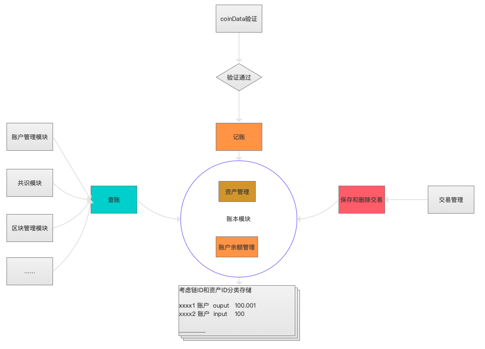
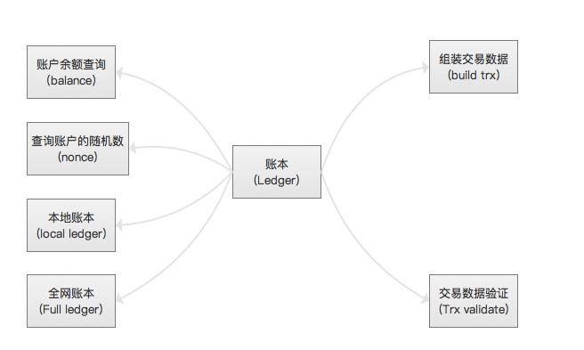
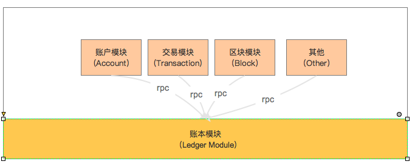
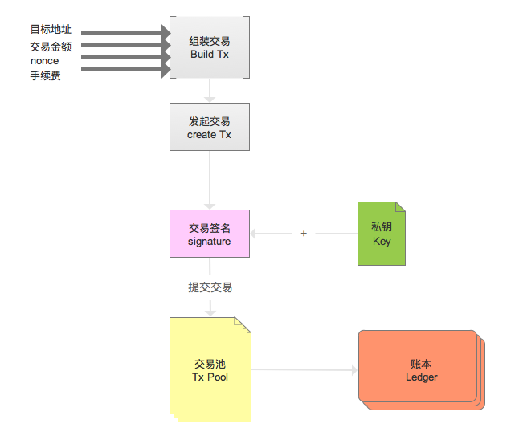

# 账本模块设计文档

[TOC]

## 一、总体描述

### 1.1 模块概述

#### 1.1.1 为什么要有《账本模块》

> 账本模块是区块链的数据中枢，所有账户的余额、交易都保存在账本模块中,
  每一个全网节点上都会保存一个全网账本，保证了数据的完整、公开、透明,同时保证了数据不可篡改、可追溯

#### 1.1.2 《账本模块》要做什么

> 为组装交易提供数据支撑,主要就是记账和查账,验证交易的合法性,如:是否有充足的余额，是否重复支付(双花)

#### 1.1.3 《账本模块》在系统中的定位

> 账本模块是数据中枢,保存系统所有存在交易的结果数据,它不依赖任何业务模块,其他模块按需依赖它。
#### 1.1.4 《账本模块》中名词解释
- 交易的随机数（nonce,一个32位hash值）
  - nonce：与此地址发送的交易数量相等的标量值，用户发起的每一笔交易中都会包含该nonce。
  - 在该账户每笔交易都需要保存前一笔交易的nonce(hash)
  - 严格地说，nonce是始发地址的一个属性（它只在发送地址的上下文中有意义）。但是，该nonce并未作为账户状态的一部分显式存储在区块链中。
  - nonce值也用于防止帐户余额的错误计算。例如，假设一个账户有10个NULS的余额，并且签署了两个交易，都花费6个NULS，分别具有nonce 1和nonce 2。这两笔交易中哪一笔有效？在区块链分布式系统中，节点可能无序地接收交易。nonce强制任何地址的交易按顺序处理，不管间隔时间如何，无论节点接收到的顺序如何。这样，所有节点都会计算相同的余额。支付6以太币的交易将被成功处理，账户余额减少到4 ether。无论什么时候收到，所有节点都认为与带有nonce 2的交易无效。如果一个节点先收到nonce 2的交易，会持有它，但在收到并处理完nonce 1的交易之前不会验证它。
  - 使用nonce确保所有节点计算相同的余额，并正确地对交易进行排序，相当于比特币中用于防止“双重支付”的机制。但是，因为以太坊跟踪账户余额并且不会单独跟踪独立的币（在比特币中称为UTXO），所以只有在账户余额计算错误时才会发生“双重支付”。nonce机制可以防止这种情况发生。
  
### 1.2 架构图
> 账本的核心还是资产管理和记账管理。



## 二、功能设计

### 2.1 功能架构图


### 2.2 模块服务
#### 2.2.1 账本模块的系统服务


> 账本模块提供的RPC的接口调用,详细接口请参照接口设计部分。

#### 2.2.2 修改系统运行参数

> 只依赖核心系统，核心系统可以对事件模块系统的启动，停止，参数修改等，

### 2.3 模块内部功能
#### 2.3.1 热(在线)交易处理

> 模块内部工能主要包含,资产管理,获取账户地址余额和nonce,验证交易coinData。

- 资产管理
  - 账户的总资产
  - 可用资产
  - 冻结资产,对于有锁定的资产,需要单独记录以及锁定的资产信息，包含链ID,资产ID,资产金额，锁定时间，锁定高度等
  - 资产解锁流程,当用户的锁定资产时间或者高度达到解锁条件，账本会把该资产信息解锁，累计到可用余额，并删除本地数据的资产锁定记录。
  - 多资产情况，需要加入chainId.
- 获取账户地址余额和nonce
  - 获取账户地址余额
  - 获取账户地址nonce(该nonce是一个交易hash值的后八位，意味着第一个交易的nonce是0.以后该账户的每一笔支出交易都会包含前一笔交易的nonce值 )
- 验证交易
  - 双花验证(nonce机制阻止双重支付)
  - 交易创建者验证,验证交易发出者是否拥有足够的余额,验证交易创建者的nonce是否合法
  - 连续交易验证
- 功能接口管理(rpc)
  - 提供给其他模块使用的rpc接口
  
#### 2.3.2 冷(离线)交易处理
> 冷钱包就是不连网的钱包，也叫离线钱包。热钱包就是保持联网上线的钱包，也就是在线钱包。冷钱包不联网会比热钱包更安全。

> 由于冷钱包只对交易信息进行签名,在通过热钱包传输签名后的hex字符串到服务端, 然后服务端再进行统一的交易处理, 所以客户端就需要做到离线签名的功能,
> 离线交易系统中维护nonce的存储信息，使用一个nonce之后，在业务系统中对nonce进行保存处理。

> 离线交易大部分都是有交易所自己处理,我们需要存储全网账户的账本数据

### 2.4 账本流程
#### 2.4.1 转账交易流程

  - 用户输入转账的地址和转入的地址和转出的金额
  - 系统通过转出的地址的私钥对转账信息进行签名（用于证明这笔交易确实有本人发起）
  - 系统对交易信息进行验证
    - 余额验证
    - 手续费验证
    - nonce连续性验证
    - 签名与input账户验证
  - 把这笔交易入到本地的TxPool中（就是账本未确认交易池）
  - 把交易信息广播给其它节点
  - 打包区块,验证区块
  - 确认交易
    - 更新相关(转入或者转出)的所有账户的余额
    - 更新账户资产对应的nonce

#### 2.4.2 普通交易流程(参考实例)



#### 2.4.3 交易验证流程


## 三、接口设计

###   3.1 模块核心交互接口

#### 3.1.1  获取账户余额

> cmd: getBalance

##### 参数说明 (request)

| 字段         | 是否必填 | 数据类型 |         描述信息 |
| ------------ | :------: | -------: | ---------------: |
| chainId      |    Y     |      int | 接口调用链的链id |
| address      |    Y     |   String | 要查询余额的地址 |
| assetChainId |    Y     |      int |   资产发起的链ID |
| assetId      |    Y     |      int |           资产ID |

```json
{
   
    "chainId":5,
    "address":"0x407d73d8a49eeb85d32cf465507dd71d507100c1",
    "assetChainId":34,
    "assetId":5,
}
```

##### 返回值说明 (response)

```json
{ 
       "available": "10000000000",
       "freeze": "200000000",
       "total": "12000000000"
}
```

> 说明: 1NULS=10^8Na

| 字段      |  数据类型  |                            描述信息 |
| --------- | :--------: | ----------------------------------: |
| available | BigInteger |                            可用余额 |
| freeze    | BigInteger |                            冻结余额 |
| total     | BigInteger | 总资产余额 total = available+freeze |

#### 3.1.2 获取当前账户nonce值

> cmd: getNonce
>

##### 参数说明 (request)

| 字段         | 是否必填 | 数据类型 |         描述信息 |
| ------------ | :------: | -------: | ---------------: |
| chainId      |    Y     |      int | 接口调用链的链id |
| address      |    Y     |   String | 要查询余额的地址 |
| assetChainId |    Y     |   String |   资产发起的链ID |
| assetId      |    Y     |      int |           资产ID |

```json
{
   
    "chainId":5,
    "address":"0x407d73d8a49eeb85d32cf465507dd71d507100c1",
    "assetChainId":34,
    "assetId":5,
}
```

##### 返回值说明 (response)

```json
{
   "nonce":"xxxxxxxxxxx"，
   "nonceType":1
}
```


| 字段      | 数据类型 |                         描述信息 |
| --------- | :------: | -------------------------------: |
| nonce     |  String  |                 上笔支出交易hash |
| nonceType |   int    | 1上笔交易已确认，0上笔交易未确认 |


#### 3.1.3 获取余额与nonce值

> cmd: getBalanceNonce

##### 参数说明 (request)

| 字段         | 是否必填 | 数据类型 |         描述信息 |
| ------------ | :------: | -------: | ---------------: |
| chainId      |    Y     |      int | 接口调用链的链id |
| address      |    Y     |   String | 要查询余额的地址 |
| assetChainId |    Y     |   String |   资产发起的链ID |
| assetId      |    Y     |   String |           资产ID |

```json
{
   
    "chainId":5,
    "address":"0x407d73d8a49eeb85d32cf465507dd71d507100c1",
    "assetChainId":"34",
    "assetId":"5",
}
```

##### 返回值说明：(response)

```json
{
    "available": "10000000000",
    "nonce": "xxxxx"
}
```

| 字段      |  数据类型  |                                          描述信息 |
| --------- | :--------: | ------------------------------------------------: |
| available | BigInteger |                                      用户可用余额 |
| nonce     |   String   |    账户的随机值,保存用户上一笔交易的hash 前byte。 |
| nonceType |    int     | 1 ：nonce 取自已确认交易，0 ：nonce取自未确认交易 |

#### 3.1.4  验证coinData

> cmd: verifyCoinData

##### 参数说明 (request)

| 字段    | 是否必填 | 数据类型 |         描述信息 |
| ------- | :------: | -------: | ---------------: |
| chainId |    Y     |      int | 接口调用链的链id |
| txHex   |    Y     |   String |     交易16进制流 |

```json
{
    "chainId": 458,
    "txHex": "xxxxxxxx"
}
```

##### 返回值说明：(response)

```json
失败下情况下，统一返回fail错误码。
成功下：
{
    "orphan":true
}
```

| 字段   | 数据类型 |   描述信息    |
| ------ | :------: | :-----------: |
| orphan | boolean  | true 孤儿交易 |


#### 3.1.5   批量校验通知

> cmd: bathValidateBegin

##### 参数说明 (request)

| 字段    | 是否必填 | 数据类型 |         描述信息 |
| ------- | :------: | -------: | ---------------: |
| chainId |    Y     |      int | 接口调用链的链Id |

```json
{
     "chainId": 21
}
```

##### 返回值说明：(response)

```json
{
    "value":1
}
```

| 字段  | 数据类型 |     描述信息 |
| ----- | :------: | -----------: |
| value |   int    | 1成功，0失败 |

#### 3.1.6 提交未确认交易

> cmd: commitUnconfirmedTx

##### 参数说明 (request)

| 字段    | 是否必填 | 数据类型 |         描述信息 |
| ------- | :------: | -------: | ---------------: |
| chainId |    Y     |      int | 接口调用链的链Id |
| txHex   |    Y     |   String |     交易16进制流 |

```json
{
     "chainId": 21,
     "txHex": "xxxxxxxx"
}
```

##### 返回值说明：(response)

```json
失败下情况下，统一返回fail错误码。

成功下：
{
    "orphan":true
}
```

| 字段   | 数据类型 |    描述信息     |
| ------ | :------: | :-------------: |
| orphan | boolean  | true 为孤儿交易 |

#### 3.1.7  批量提交未确认交易

> cmd: commitBatchUnconfirmedTxs

##### 参数说明 (request)

| 字段    | 是否必填 | 数据类型 |         描述信息 |
| ------- | :------: | -------: | ---------------: |
| chainId |    Y     |      int | 接口调用链的链Id |
| txList  |    Y     |   String |    交易Hex值列表 |

```json
{
     "chainId": 21,
     "txList": "[xxxxxxxx，yyyyyyyyy]"
}
```

##### 返回值说明：(response)

```json
{
    "orphan":"[xxxxxxxx，yyyyyyyyy]"，
    "fail":"[aaaaaaaa，bbbbbbbbb]"
}
```

| 字段   |   数据类型   |     描述信息     |
| ------ | :----------: | :--------------: |
| orphan | List<String> | 返回孤儿交易列表 |
| fail   | List<String> | 返回失败交易列表 |


#### 3.1.8 提交区块交易

> cmd: commitBlockTxs

##### 参数说明 (request)

| 字段        | 是否必填 | 数据类型 |              描述信息 |
| ----------- | :------: | -------: | --------------------: |
| chainId     |    Y     |      int |      接口调用链的链Id |
| txHexList   |    Y     |    array | 交易列表 交易16进制流 |
| blockHeight |    Y     |     long |              区块高度 |

```json
{
     "chainId": 21,
     "txHex": "[xxxxxxxx,yyyyyyyy]",
     "blockHeight": 25
}
```

##### 返回值说明：(response)

```json
{
    "value":true
}
```

| 字段  | 数据类型 |            描述信息 |
| ----- | :------: | ------------------: |
| value |   int    | true成功，false失败 |


#### 3.1.9  回滚未确认交易

> cmd: rollBackUnconfirmTx

##### 参数说明 (request)

| 字段    | 是否必填 | 数据类型 |         描述信息 |
| ------- | :------: | -------: | ---------------: |
| chainId |    Y     |      int | 接口调用链的链Id |
| txHex   |    Y     |   String |     交易16进制流 |

```json
{
     "chainId": 21,
     "txHex": "xxxxxxxx"
}
```

##### 返回值说明：(response)

```json
{
    "value":1
}
```

| 字段  | 数据类型 |     描述信息 |
| ----- | :------: | -----------: |
| value |   int    | 1成功，0失败 |

#### 3.1.10  回滚区块交易

> cmd: rollBackBlockTxs

##### 参数说明 (request)

| 字段        | 是否必填 | 数据类型 |         描述信息 |
| ----------- | :------: | -------: | ---------------: |
| chainId     |    Y     |      int | 接口调用链的链Id |
| blockHeight |    Y     |     long |         区块高度 |

```json
{
     "chainId": 21,
     "blockHeight": 25
}
```

##### 返回值说明：(response)

```json
{
    "value":1
}
```

| 字段  | 数据类型 |     描述信息 |
| ----- | :------: | -----------: |
| value |   int    | 1成功，0失败 |

#### 3.1.11  整区块校验

> cmd: blockValidate

##### 参数说明 (request)

| 字段        | 是否必填 | 数据类型 |         描述信息 |
| ----------- | :------: | -------: | ---------------: |
| chainId     |    Y     |      int | 接口调用链的链Id |
| txList      |    Y     |   String |    交易Hex值列表 |
| blockHeight |    Y     |     long |         区块高度 |

```json
{
     "chainId": 21,
     "txList": "[xxxxxxxx，yyyyyyyyy]",
     "blockHeight":20
}
```

##### 返回值说明：(response)

```json
{
    "value":true
}
```

| 字段  | 数据类型 |       描述信息       |
| ----- | :------: | :------------------: |
| value | boolean  | true成功，false 失败 |


### 3.2 其他接口

#### 3.2.1 根据资产id获取资产信息
> cmd: getAsset

##### 参数说明 (request)

| 字段      |      是否可选  | 数据类型 |  描述信息 |
|----------|:-------------:|--------:|--------:|
| chainId | Y | int | 接口调用所在链链Id |
| assetChainId |  Y | int |资产发起链的链ID |
| assetId |  Y | int |资产ID |

```json
{
  "chainId": 5,
  "assetChainId": 12,
  "assetId": 41
}
```
##### 返回值说明 (response)

```json
{
    "chainId": 5,
    "assetChainId": 12,
    "assetId": 41,
    "balance" : {
      "available": "10000000000",
      "freeze": "200000000",
      "total": "12000000000"
    }
}
```

| 字段   |      数据类型      |  描述信息 |
|----------|:-------------:|------:|
| chainId | int | 发起调用的链ID |
| assetChainId | int | 资产发起的链链id |
| assetId | int | 资产ID |
| balance.available |  BigInteger | 可用余额 |
| balance.freeze |  BigInteger | 冻结余额 |
| balance.total |  BigInteger | 总资产余额 total = available+freeze  |


## 四、事件说明

> 不依赖任何事件

## 五、协议

### 5.1 网络通讯协议

无

### 5.2 交易协议

无

## 六、模块配置
### 6.1 配置说明

### 6.2 模块依赖关系

- 内核模块
  - 模块注册

  - 模块注销

  - 模块状态上报（心跳）

  - 服务接口数据获取及定时更新
- 网络模块
  

## 七、Java特有的设计

> 核心对象类定义,存储数据结构，......

## 八、补充内容

### 参考资料文献资料
- [精通以太坊-第七章 交易](https://github.com/inoutcode/ethereum_book/blob/master/%E7%AC%AC%E4%B8%83%E7%AB%A0.asciidoc)

