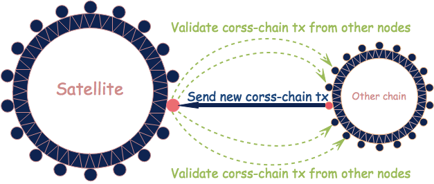
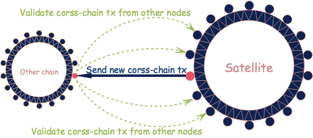
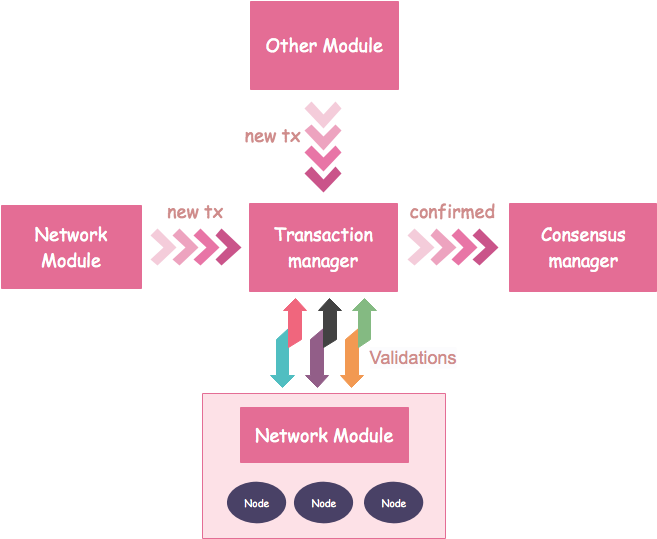
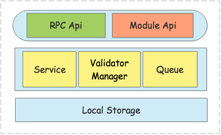
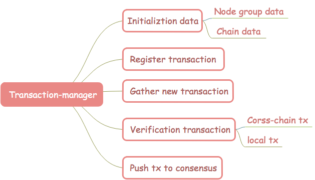

# 	交易管理模块设计文档

[TOC]

##  一、总体概览

### 1.1 模块概述

#### 1.1.1 为什么要有《交易管理》模块

​	在NULS2.0的生态体系中，交易会在链中或者链与链之间流转，各条链的节点不仅要处理链内的交易，可能还会处理跨链的交易，于是每个节点需要处理的交易会越来越多，并且更复杂，因此我们需要一个但单独的模块来统一处理各种交易。而从NULS2.0的架构设计来看，我们需要一个独立的模块来处理交易的收集、验证、存储以及转发等功能，对于所有交易来说，这些功能具有共用性、统一性，因此我们把交易管理作为一个独立的模块来运行。

#### 1.1.2《交易管理》模块要做什么

交易管理最核心的工作主要从两个方面来看：

**一、对本地交易进行处理**

- 收集交易
- 本地验证
- 提取可打包的交易
- 提交、回滚交易
- 保存未确认的、可打包的以及已确认的交易
- 提供交易的数据查询

**二、对跨链交易的处理**

交易管理模块需要对跨链交易进行跨链验证，而跨链验证涉及到不同链不同节点之间的交互，主要有以下三种跨链交易需要处理：

1. 友链向NULS主网发送交易



​	首先友链节点发起一笔新的跨链交易，在友链内部进行确认，当在该友链达到一定确认块数后，友链节点将向NULS主网节点发送这笔跨链交易。 **例如友链节点A向NULS主网节点S发送了这笔跨链交易，NULS主网节点S会向友链中除节点A以外的节点发送该笔交易进行验证。** NULS主网节点S将会收到多个友链节点的验证结果，然后进行计算得出节点S自己的跨链验证结果，然后广播给NULS主网其他节点，因此NULS主网的每个节点都会收到其他所有节点的验证结果，最后计算出NULS主网最终的验证结果。

- 在这个过程中NULS主网的交易管理模块将会**接收来自友链的新的跨链交易**
- 交易管理模块在对新的跨链交易做基础验证后**向友链其他节点进行验证**，计算出结果后广播结果到NULS主网
- NULS主网各个节点会在交易管理模块中**统计各个节点的验证结果**，并计算NULS主网最终结果


2. NULS主网向友链发送交易



​	当NULS主网节点发起一笔新的跨链交易时，首先要在交易管理模块中对跨链交易进行本地验证，然后发送共识模块打包确认，当在NULS主网中达到一定的确认块数时，交易管理模块将取出该跨链交易发送到目标链。 __例如NULS主网节点S向目标链节点A发送了该笔交易，目标链节点A将会向NULS主网除S节点以外的节点发送该交易进行验证。__ A节点得到多个NULS主网节点的结果后进行计算，得到A节点的最终跨链验证结果并广播到目标链。目标链的节点都会收到其他所有节点的结果，然后再计算出目标链最终验证结果。

- 交易管理模块从已确认的块中取出跨链交易，**发送跨链交易给目标链**
- 交易管理模块**接收目标链节点的验证请求**，提取对应的交易发送回去


3. 友链向友链发送交易

由于友链之间的协议可能是不兼容的，所以他们之间的交易需要由NULS主网来中转，友链向友链发送交易的流程，其实就是先后完成了友链向NULS主网发送交易，NULS主网向友链发送交易这两个流程，其中交易管理模块起到的作用是基本相同的。


#### 1.1.3 《交易管理》在系统中的定位

在整个系统中，交易管理控制着所有交易的验证和流转

正常运行时需要依赖

- 核心模块
- 网络模块
- 链管理模块
- 账本模块




### 1.2 架构图



整个模块大致分为3个部分: 接口、实现层、本地存储

实现层中含有4个部分

- 接口的功能实现逻辑
- 验证器管理器，根据需要来调用交易验证器
- 各种队列，用于交易接收、异步验证处理以及推送共识等操作
- 缓存，维护节点组，链数据等基础数据

## 二、功能设计

### 2.1 功能架构图



### 2.2 核心流程

#### 2.2.1 交易管理缓存其他模块的数据

模块启动时需要获得其他模块的基础数据

- 维护链管理模块中所有链的基础数据

  获取数据的方式：

  1. 链管理后启动完成后，调用链管理模块接口
  2. 有新的链完成注册时，定时获取，事件通知

- 维护一个以交易类型为key的交易与其验证器、处理器提交接口、回滚接口的对应关系。

  获取数据的方式：各模块启动后自行调用交易管理模块注册交易接口进行注册


#### 2.2.2 收集新交易

- 由本节点各模块新创建的交易

  各模块新创建的交易（包含跨链交易），通过交易管理模块提供的接口[newTx](#232-接收本地新交易)进行收集，模块收到一个新交易后将会进行基本的验证，然后放到待验证本地交易队列中，等待进行验证流程。

  注意：待验证本地交易队列中也会存在跨链交易，这是所有交易的本地验证流程。

- 由其他节点广播的跨链交易

  其他节点广播的跨链交易（前提是该跨链交易在创建该交易的链中已打包确认一定的高度），将会通过网络消息的方式进行发送，首先发送的是交易的hash，交易管理模块收到后再发送索取完整交易的消息，之后才会接收到完整的跨链交易。收到后同样会进行基础的验证，然后放入待验证跨链交易队列中，等待进行验证流程。

#### 2.2.3 跨链交易详细流程

例如：**_从A链的a地址发起一笔交易atx，转移aCoin到B链b地址中 (A -->NULS主网 --> B)_**

- A链中a地址以A链链id(ChainId)起始的NULS体系格式的地址
- B链中b地址是以B链链id起始的NULS体系格式的地址
- 当资产转移到b地址后，b地址不允许在A链中发起交易

即：其他链地址不能在本链发起交易。

**(1) 跨链交易在A链中的本地流程**

1. 账本模块生成转账交易**atx**，如果生成的是跨链交易，需要同时调用跨链模块生成NULS主网协议的**atx_trans**并签名。

   - 根据NULS主网协议，从**atx**提取type、time、remark、txData放入新生成的**atx_trans**中。

   - 提取CoinData数据，如果是UTXO模型，则需要根据资产、input、output以及手续费，计算出实际的支付金额，生成NULS主网协议(账户余额模型)的from。

     from总额 = input_utxo总额 - output_utxo(非找零部分) - 手续费

     再计算NULS主网协议的to

     to = output_utxo(非找零部分)

     注意：考虑多地址转账，计算from要以input中UTXO的所有者为单位，如果是多个地址的utxo，要以utxo的所有者为单位，计算出多个input，output也是如此。

     例如：input有3个地址的utxo，转出给2个不同的地址(非找零地址)，将计算出3个账户余额模型的from

     from_1 = input_utxo1

     from_2 = input_utxo2

     from_3 = from总额  - input_utxo1 - input_utxo2

     to_1 =output中(非找零部分)_addr_1

     to_2 =output中(非找零部分)_addr_2

     最终结果必须满足：from总额 <= input_utxo总额、to总额 = output_utxo(非找零部分之和)。

   - 如果是账户余额模型，则提取对应的from和to，生成NULS主网协议的CoinData

   -  **atx_trans** 交易的txData中包含**atx**交易的hash

   - 最后对 **atx_trans** 交易进行签名，设置scriptSig

2. **atx_trans**跨链交易通过接口[newCrossTx](#2322-接收本地新的主网协议的跨链交易)发送到交易管理模块等待广播； **atx**转账交易在A链中生成后，发送到交易管理模块中，通过[newTx](#232-接收本地新交易)接口对交易数据的基本格式以及合法性进行基础验证，然后存放到待验证本地交易队列中。

   + 接收交易对交易数据反序列化成Transaction

   + 对Transaction 数据的基本格式，合法性，和完整性进行校验

   + 对coinData中链和资产的基本格式，合法性，和完整性进行校验

3. 验证交易的定时任务Task将会从该队列中取出交易，首先通过账本模块验证coinData，验证通过之后跟交易类型从缓存中找到对应的交易验证器，再调用验证接口进行验证，验证通过的交易通过[newHash](#59-BroadcastTxMessage)广播给链内其他节点，同时通过[newCrossHash](#51-broadcastcrosstxhashmessage)广播主网协议的交易**atx_trans**，并将放入交易管理模块待打包交易内存池，等待共识打包。

   + 定时取出待确认交易

   + 通过调用账本模块接口对CoinData进行验证

   + 通过调用交易的验证器接口对交易进行验证

   + 验证通过的交易放入待打包交易内存池

4. 当共识需要打包的时候会根据链id、规定的结束打包时间、交易数据最大容量值来调用[tx_packableTxs](#233-获取可打包交易集合)接口获取可打包交易集合，这时交易管理模块将从待打包交易内存池中获取交易，再进行验证。

   + 首先从待打包交易内存池中拿出一个交易，再进行单独的验证流程(与步骤2基本一致)，然后按模块放对应的集合。

   + 重复这个过程直到达到规定结束打包时间或交易最大容量值。

5. 根据账本模块的统一验证器一次性验证所有交易的CoinData，得到未通过验证的交易，过滤掉未通过验证的交易；再根据各模块统一交易验证器来验证各自模块的交易集合，得到未通过验证的交易再汇总结果，然后返回可打包的交易集合给共识模块。

6. 当打包的区块在验证通过后，区块管理模块将调用交易对应的[tx_commit](#234-交易确认提交)提交接口，调用账本模块接口更新余额等账本数据，最后再调用保存交易接口[tx_save](#236-保存交易)，完成后则意味着交易被区块链确认。

   PS：如果一个交易为非跨链交易，到这一步时正常交易流程已完成。

**(2) 跨链交易进入跨链流程**

7. A链节点的交易管理模块将会一直扫描区块链中的跨链交易，当发现**atx**交易被区块链确认n个高度后，A链节点交易管理模块发送消息将**atx_trans**交易发送给连接的NULS主网节点(多个)

   ​	*发送跨链交易流程*：

   1. A链节点Anode1先通过消息接口[newCrossHash](#51-broadcastcrosstxhashmessage)广播**atx_trans**交易的hash给连接的NULS主网节点。
   2. 交易管理模块获得的交易hash后，再通过[askCrossTx]( #52-receivecrosstxmessage)发送获取完整跨链交易的消息到A链节点Anode1。
   3. A链节点Anode1收到该请求，再将完整的**atx_trans**跨链交易通过[newMnTx](#56-sendcrosstxmessage)发送给主网节点Mn，主网节点交易管理模块解析处理**atx_trans**交易。

8. NULS主网节点交易管理模块先反序列化**atx_trans**交易，然后进行校验。

   - 对交易数据的基本格式，合法性，和完整性进行校验；
   - 对coinData里链和资产的基本格式，合法性，和完整性进行校验。

9. 进行跨链验证，NULS主网节点Mn将通过消息接口[verifyFc](#54-verifycrosswithfcmessage)发送atx_hash(协议转换前的交易hash)、atx_trans_hash(NULS主网收到的协议转换后的完整交易hash)给与A链连接的节点中**除Anode1之外的节点**验证**atx_trans**交易。

   ​	*A链中执行验证的节点Anode2的验证逻辑*：

   1. 网络模块接收消息后，通过接口[verifyFc](#2315-根据原始交易和跨链交易hash向友链节点验证该交易是否被确认)将消息发送给交易管理，交易管理模块先通过atx_hash从数据库中查询对应的atx交易，并且验证该交易所在的区块已经被确认n个区块高度。
   2. 将atx交易进行协议转换生成新的**Anode2_atx_trans**，再验证接收到的atx_trans_hash与**Anode2_atx_trans_hash**一致。

   通过以上两个验证之后，节点Anode2将通过[verifyResult](#55-verifycrossresultmessage)将atx_trans_hash和确认高度发送给NULS主网节点Mn。

   **_注意_**：NULS主网节点通过网络模块向A链节点组发送跨链验证消息[verifyFc](#54-verifycrosswithfcmessage)时，交易管理将会缓存发送成功和失败的节点信息，如果成功发送的节点数小于S(Mn与A链连接的节点数的51%)，则重新发送给失败的节点，直到S不小于51%。

10. NULS主网节点Mn(共识节点)收到A链节点Anode2对交易**atx_trans**的验证结果的消息，通过交易管理[verifyResult](#2317-接收跨链验证结果)接口发送到交易管理中，交易管理会将验证结果与发送的成功的节点对应着缓存起来。Mn收到所有自己发出的求证的回应结果后，计算出验证通过的百分比，如果超过全部链接节点51%的节点验证通过（发送失败的节点视为不通过），则节点Mn判定交易**atx_trans**的验证通过。

    小结：节点Mn收到的验证结果数量不能小于S，如果小于S则重新发送[verifyFc](#54-verifycrosswithfcmessage)给未回应结果的节点，NULS主网的普通节点询问A链任意个节点，主网共识节点询问A链全部节点，普通节点在任意3个节点确认的情况下就视为该交易验证通过并转发该交易。

11. 共识节点Mn对跨链交易atx_trans_hash签名，并将hash和签名数据通过[crossNodeRs](#58-broadcastcrossnodersmessage)广播到NULS主网网络中。

12. NULS主网共识节点互相收到所有其他共识节点发出的消息，由交易管理模块接口[crossNodeRs](#2318-接收跨链交易的链内节点验证结果)进行收集汇总，当一个交易的签名者超过共识节点总数的80%，判定该跨链交易通过NULS主网的验证，放入待打包交易内存池，等待打包确认。

13. NULS主网节点共识模块打包的时，交易模块先取出交易(与 **_步骤 4_** 类似)，再次验证跨链交易atx_trans的签名数量(PS：由于提取出来的交易集合包含NULS主网创建的交易，这类交易没有验证签名数量步骤)，然后通过账本模块验证CoinData(转出资产总余额等)，符合要求则将交易发送共识模块打包进区块。

    区块确认逻辑：验证区块中包含的跨链交易时，验证签名数量和转出链的资产余额，符合要求就确认该交易。

**(3) 跨链交易进入B链中的流程**

14. NULS主网节点的交易管理模块将会一直扫描区块链中的跨链交易，当发现**atx_trans**交易被区块链确认n个高度后，取出**atx_trans**交易发送给连接的B链节点(多个)

    ​	*发送跨链交易流程*(与 **_步骤 7_** 类似)：

    1. NULS主网节点Mn先通过消息[newCrossHash](#51-broadcastcrosstxhashmessage)广播**atx_trans**交易的hash给连接的B链节点。
    2. 交易管理模块获得的交易hash，再通过[askCrossTx](#52-receivecrosstxmessage)发送获取完整跨链交易的消息到NULS主网节点Mn。
    3. Mn的网络模块收到该消息后，再将完整的**atx_trans**跨链交易通过[newMnTx](#56-sendcrosstxmessage)发送给Bnode1，Bnode1收到该消息后，需要借助 **_跨链模块_** 来处理 **atx_trans** 交易。

15. B链节点Bnode1交易管理模块通过[verifyMn](#57-verifycrosswithmainmessage)发送 **atx_trans**的交易hash( **_步骤14-2_** 已获得)给与NULS主网连接的节点中**除Mn之外的节点**验证**atx_trans**交易。

    ​	*NULS主网中执行验证的节点Mn2的验证逻辑*：

    1. 网络模块接收到消息后，通过接口[verifyMn](#2316-根据跨链交易hash向主网验证该交易是否被确认)将消息发送给交易管理，交易管理模块先通过atx_hash从数据库中查询对应的atx交易，并且验证该交易所在的区块已经被确认n个区块高度。

    通过验证之后，节点Mn2将通过[verifyResult](#55-verifycrossresultmessage)将atx_trans_hash和确认高度发送给B链节点Bnode1。

16. B链节点通过网络模块向NULS主网节点组发送跨链验证消息[verifyMn](#57-verifycrosswithmainmessage)时，交易管理将会缓存发送成功和失败的节点信息，如果成功发送的节点数小于S(节点Bnode1与NULS主网连接的节点数的51%)，则重新发送给失败的节点，直到S不小于51%。
17. （与 **_步骤10_** 类似）B链节点Bnode1收到主网节点Mn对交易**atx_trans**的验证结果的消息，通过交易管理[verifyResult](#2317-接收跨链验证结果)接口发送到交易管理中，交易管理会将验证结果与发送的成功的节点对应着缓存起来。Bnode1收到所有自己发出的求证的回应结果后，计算出验证通过的百分比，如果超过51%的节点验证通过（发送失败的节点视为不通过），则节点Bnode1判定交易**atx_trans**的验证通过。
18. 验证通过后，交易管理模块调用**跨链模块**将**atx_trans**交易通过协议转换生成B链协议的交易**btx**并通过[crossNodeRs](#58-broadcastcrossnodersmessage)广播到B链网络中，如果Bnode1节点是B链最近x块的出块者(POW需要适配)，则需要对该交易进行签名，通过[crossNodeRs](#58-broadcastcrossnodersmessage)广播到B链网络中。
19. B链节点收到其他节点发出的消息，由交易管理模块接口[crossNodeRs](#2318-接收跨链交易的链内节点验证结果)进行收集汇总，统计该交易的签名，当签名者达到了最近20块的出块者的80%时，该交易可以被打包(打包者也要确认该交易且打包的交易中包含所有签名)，放入待打包交易内存池，等待打包确认。
20. (与 **_步骤 13_** 类似)B链节点共识模块打包的时，交易模块先取出交易一致，再次验证交易 **btx** 的签名数量，然后通过账本模块验证CoinData，符合要求则将交易发送共识模块打包进区块。
21. 当新区块验证通过得到最终确认后，整个跨链交易流程结束。

### 2.3 模块服务

#### 2.3.1 注册交易

- 功能说明：

  将各个模块的交易类型、对应的交易验证器和处理器接口缓存起来。

- 流程描述

  NULS主网启动时，各个模块需要向交易管理模块注册自己的交易类型，验证器等信息。交易管理模块将缓存各个交易以及对应的验证器、处理器接口，当有新交易需要用验证器验证时，交易管理模块将取出对应的验证器接口名称，并调用验证器接口进行验证。

- 接口定义

  - method: `tx_register`

    接口说明：注册交易需要传交易类型、验证器名称、处理器名称，返回是否注册成功。

  - 请求示例

    ```
    {
        "cmd": "tx_register",
        "minVersion": "1.0",
        "params":[
            "moduleCode", 
            "moduleValidateCmd",
            [
                [
                    "txType",
                    "validateCmd",
                    "commitCmd",
                    "rollbackCmd",
                    "systemTx",
                    "unlockTx",
                    "verifySignature"
                ],
                 [
                    "txType",
                    "validateDeposit",
                    "depositCommit",
                    "depositRollback"
                    "systemTx",
                    "unlockTx",
                    "verifySignature"
                ]
             ]
        ]
    }
    ```

  - 请求参数说明

    | index | type   | description                             |
    | ----- | ------ | --------------------------------------- |
    | 0     | String | 模块Code                                |
    | 1     | String | Module validate 模块统一验证器 接口名称 |
    | 2     | Array  | 模块交易注册信息集合                    |

  - 模块交易集合元素

    | index | type    | description                                                  |
    | ----- | ------- | ------------------------------------------------------------ |
    | 0     | int     | Type 交易类型                                                |
    | 1     | String  | Transaction validator 单个交易验证器接口名称                 |
    | 2     | String  | Transaction processor commit 交易处理器提交接口名称          |
    | 3     | String  | Transaction processor rollback 交易处理器回滚接口名称        |
    | 4     | boolean | 是否是系统产生的交易（打包节点产生，用于出块奖励结算、红黄牌惩罚） |
    | 5     | boolean | 是否是解锁交易                                               |
    | 6     | boolean | 该交易是否需要在账本中验证签名，所有系统产生的交易和一些特殊交易，不需要按照普通交易的方式验证签名，会提供额外的逻辑进行验证。 |

  - 返回示例

    Success

    ```json
    {
      "code":0,
      "version": 1.0,
      "msg": "Success",
      "result": {
    	"value":true
      }
}
    ```
  - 返回结果说明

    | parameter | type    | description |
    | --------- | ------- | ----------- |
    | value     | boolean | 成功        |


##### 2.3.1.1 交易验证器、处理器接口规范

- **模块统一交易验证器接口规范 Module validate**

  - 请求示例

    ```json
    {
        "cmd": "",
        "minVersion": "1.0",
        "params":["chianId", ["txHex","txHex","txHex"]]
    }
    ```

  - 请求参数说明

    | index | type    | description        |
    | ----- | ------- | ------------------ |
    | 0     | chianId | 链id               |
    | 1     | array   | 交易序列化数据数组 |

  - 返回结果 

    - result说明：返回不合法的交易hash列表

    ```json
    {
    	"version": 1.0,
    	"code":0,
        "result":{
            "list":["txHash", "txHash", "txHash"]
    	}
    }
    ```

    | parameter | type      | description              |
    | --------- | --------- | ------------------------ |
    | list      | jsonArray | 不合法交易序列化数据数组 |

- **交易验证器接口统一规范 Transaction validate **

  - 请求示例

    ```json
    {
        "cmd": "",
        "minVersion": "1.0",
        "params":["chainId","txHex"]
    }
    ```

  - 请求参数说明

    | index | type   | description    |
    | ----- | ------ | -------------- |
    | 0     | int    | chainId        |
    | 1     | String | 交易序列化数据 |

  -  返回结果 

     -  result说明：返回不合法的交易列表

     ```json
     {
     	"version": 1.0,
     	"code":0,
         "result":{
             "value":true
     	}
     }
     ```

     | parameter | type    | description      |
     | --------- | ------- | ---------------- |
     | value     | boolean | 验证成功返回true |

- **交易处理器commit接口参数统一规范 Transaction processor commit **

  - 请求示例

    ```json
    {
        "cmd": "",
        "minVersion": "1.0",
        "params":["chainId","txHex","secondaryDataHex"]
    }
    ```

  - 请求参数说明

    | index | type   | description                          |
    | ----- | ------ | ------------------------------------ |
    | 0     | int    | Chain Id                             |
    | 1     | String | 交易序列化数据                       |
    | 2     | String | 区块头的hash，高度，时间的序列化数据 |

  - 返回结果 

    - result说明：提交成功返回true，失败返回错误信息

    ```
    {
    	"version": 1.0,
    	"code":0,
        "result":{
            "value":true
    	}
    }
    ```

    | parameter | type    | description      |
    | --------- | ------- | ---------------- |
    | value     | boolean | 提交成功返回true |

- **交易处理器rollback接口参数统一规范 Transaction processor rollback**

  - 请求示例

    ```json
    {
        "cmd": "",
        "minVersion": "1.0",
        "params":["chainId","txHex","secondaryDataHex"]
    }
    ```

  - 请求参数说明

    | index | type   | description                                        |
    | ----- | ------ | -------------------------------------------------- |
    | 0     | int    | Chain Id                                           |
    | 1     | String | 交易序列化数据                                     |
    | 2     | String | secondaryData 区块头的hash，高度，时间的序列化数据 |

  - 返回结果 

    - result说明：回滚成功返回true，失败返回错误信息

    ```json
    {
    	"version": 1.0,
    	"code":0,
        "result":{
            "value":true
    	}
    }
    ```

    | parameter | type    | description      |
    | --------- | ------- | ---------------- |
    | value     | boolean | 回滚成功返回true |


#### 2.3.2 接收本地新交易

- 功能说明：

  收集本节点其他模块新产生的交易

- 流程描述

  当一个节点中其他模块有新交易产生时，需要调用交易管理模块的新交易接口进行统一的收集和处理；交易管理模块将会把新的交易放到未确认队列中等待，处理交易的线程来处理。

  1. 对交易进行基本验证、去重等，不合法直接丢弃

  2. 待验证本地交易队列中

- 接口定义

  - method: `newTx`

    接口说明：接收一个新的交易

  - 请求示例

    ```json
    {
        "cmd": "newTx",
        "minVersion": "1.0",
        "params": ["chainId", "txHex"]
    }
    ```

  - 请求参数说明

    | index | type   | description    |
    | ----- | ------ | -------------- |
    | 0     | int    | 链id           |
    | 1     | String | 交易序列化数据 |

  - 返回示例

    Success

    ```json
    {
      "code":0,
      "version": 1.0,
      "msg": "Success",
      "result": {
        	"value":true  
      	}
    }
    ```

  - 返回结果说明

    | parameter | type    | description |
    | --------- | ------- | ----------- |
    | value     | boolean | 成功        |


#### 2.3.3 获取可打包交易集合

- 功能说明：

  根据打包结束时间和交易容量最大值提取可打包的交易集合（给共识打包）

- 流程描述

  当节点需要打包时，要根据链id、规定的结束打包时间和交易数据最大容量值，来获取可打包的交易。交易管理模块将会从待打包交易内存池取出对应的交易集合，然后一次性从账本模块验证集合中所有交易的coinData，过滤掉未通过验证的交易，得到验证通过的集合，然后通过各模块统一交易验证器来验证各自模块的交易集合，再汇总结果返回可打包的交易集合。

- 接口定义

  - method: `tx_packableTxs`

    接口说明：返回可打包的交易集合

  - 请求示例

    ```json
    {
        "cmd": "tx_packableTxs",
        "minVersion": "1.0",
        "params": ["chainId", "endtimestamp", "maxTxDataSize"]
    }
    ```

  - 请求参数说明

    | index | type | description                      |
    | ----- | ---- | -------------------------------- |
    | 0     | int  | 链id                             |
    | 1     | long | endtimestamp 结束打包的时间      |
    | 2     | int  | maxTxDataSize 交易数据最大容量值 |

  - 返回示例

    Success

    ```json
    {
      "code":0,
      "version": 1.0,
      "msg": "Success",
      "result": {
        	"list":[]
      }
    }
    ```
  - 返回结果说明

    | parameter | type        | description  |
    | --------- | ----------- | ------------ |
    | List      | Transaction | 返回交易集合 |


#### 2.3.4 交易确认提交

- 功能说明：

  执行交易处理器commit

- 流程描述

  当交易被打包到区块中，并且区块验证通过后，将调用交易commit接口

- 接口定义

  - method: `tx_commit`

    接口说明：调用交易处理器提交接口

  - 请求示例

    ```json
    {
        "cmd": "tx_commit",
        "minVersion": "1.0",
        "params": ["chainId", "txHex", "secondaryData"]
    }
    ```

  - 请求参数说明

    | index | type   | description                          |
    | ----- | ------ | ------------------------------------ |
    | 0     | int    | 链id                                 |
    | 1     | String | 交易序列化数据                       |
    | 2     | String | 区块头的hash，高度，时间的序列化数据 |

  - 返回示例

    Success

    ```json
    {
      "code":0,
      "version": 1.0,
      "msg": "Success",
      "result": {
        	"value":true
      	}
    }
    ```

  - 返回结果说明

    | parameter | type    | description |
    | --------- | ------- | ----------- |
    | value     | boolean | 成功        |


#### 2.3.5 交易回滚

- 功能说明：

  执行交易处理器rollback

- 流程描述

  当交易被打包到区块中，并且区块验证不通过，或者区块回滚且交易不为跨链交易时，将调用交易rollback接口。

- 接口定义

  - method: `tx_rollback`

    接口说明：调用交易处理器回滚接口

  - 请求示例

    ```json
    {
        "cmd": "tx_rollback",
        "minVersion": "1.0",
        "params": ["chainId", "txHex", "secondaryData"]
    }
    ```

  - 请求参数说明

    | index | type   | description                      |
    | ----- | ------ | -------------------------------- |
    | 0     | int    | 链id                             |
    | 1     | String | 交易序列化数据                   |
    | 2     | String | ！！！(区块头的hash，高度，时间) |

  - 返回示例

    Success

    ```json
    {
      "code":0,
      "version": 1.0,
      "msg": "Success",
      "result": {
        	"value":true
      	}
    }
    ```

  - 返回结果说明

    | parameter | type    | description |
    | --------- | ------- | ----------- |
    | value     | boolean | 成功        |

#### 2.3.6 保存交易

- 功能说明：

  将验证通过的新区块中的交易保存到数据库

- 流程描述

  区块管理保存区块时将交易发送到交易管理模块进行保存

- 接口定义

  - method: `tx_save`

  - 请求示例

    ```json
    {
        "cmd": "tx_save",
        "minVersion": "1.0",
        "params": ["chainId", ["txHex", "txHex"]]
    }
    ```

  - 请求参数说明

    | index | type  | description        |
    | ----- | ----- | ------------------ |
    | 0     | int   | 链id               |
    | 1     | array | 交易序列化数据数组 |

  - 返回示例

    Success

    ```json
    {
      "code":0,
      "version": 1.0,
      "msg": "Success",
      "result": {
        	"value":true
      	}
    }
    ```

  - 返回结果说明

    | parameter | type    | description |
    | --------- | ------- | ----------- |
    | value     | boolean | 成功        |

#### 2.3.7 获取已保存的交易

- 功能说明：

  从数据库中获取已经打包到区块中的交易

- 接口定义

  - method: `tx_getTx`

    接口说明：返回交易序列化数据

  - 请求示例

    ```json
    {
        "cmd": "tx_getTx",
        "minVersion": "1.0",
        "params": ["chainId", "txHash"]
    }
    ```

  - 请求参数说明

    | index | type   | description |
    | ----- | ------ | ----------- |
    | 0     | int    | 链id        |
    | 1     | String | 交易hash    |

  - 返回示例

    Success

    ```json
    {
      "code":0,
      "version": 1.0,
      "msg": "Success",
      "result": {
        	"tx":"txHex"
      	}
    }
    ```

  - 返回结果说明

    | parameter | type   | description    |
    | --------- | ------ | -------------- |
    | tx        | String | 交易序列化数据 |


#### 2.3.8 删除已保存的交易

- 功能说明：

  从数据库中删除已经打包到区块中的交易，区块回滚等

- 接口定义

  - method:` tx_delete`

    接口说明：返回交易序列化数据

  - 请求示例

    ```json
    {
        "cmd": "tx_delete",
        "minVersion": "1.0",
        "params": ["chainId", "txHash"]
    }
    ```

  - 请求参数说明

    | index | type   | description |
    | ----- | ------ | ----------- |
    | 0     | int    | 链id        |
    | 1     | String | 交易hash    |

  - 返回示例

    Success

    ```
    {
      "code":0,
      "version": 1.0,
      "msg": "Success",
      "result": {
        	value:true
      	}
    }
    ```

  - 返回结果说明

    | parameter | type    | description |
    | --------- | ------- | ----------- |
    | value     | boolean | 成功        |


#### 2.3.9 验证交易

- 功能说明：

  对交易(包含跨链交易)进行本地验证，包括调用验证器，验证coinData等，不包括对跨链交易进行跨链验证。

- 接口定义

  - method:` tx_verify`

    接口说明：返回验证结果

  - 请求示例

    ```json
    {
        "cmd": "tx_verify",
        "minVersion": "1.0",
        "params": ["chainId", "txHex"]
    }
    ```

  - 请求参数说明

    | index | type   | description    |
    | ----- | ------ | -------------- |
    | 0     | int    | 链id           |
    | 1     | String | 交易序列化数据 |

  - 返回示例

    Success

    ```json
    {
      "code":0,
      "version": 1.0,
      "msg": "Success",
      "result": {
        	"value":true
      	}
    }
    ```

  - 返回结果说明

    | parameter | type    | description |
    | --------- | ------- | ----------- |
    | value     | boolean | 成功        |


#### 2.3.10 接收新交易hash

- 功能说明：

  接收链内其他节点广播的新交易hash的消息

- 接口定义

  - method:`newHash` Receive new transaction hash message

    接口说明：接收交易hash序列化数据

  - 请求示例

    ```json
    {
        "cmd": "newHash",
        "minVersion": "1.0",
        "params": ["chainId", "txHashHex"]
    }
    ```

  - 请求参数说明

    | index | type   | description        |
    | ----- | ------ | ------------------ |
    | 0     | int    | 链id               |
    | 1     | String | 交易hash序列化数据 |

  - 返回示例

    Success

    ```json
    {
      "code":0,
      "version": 1.0,
      "msg": "Success",
      "result": {
        	"value":true
      	}
    }
    ```

  - 返回结果说明

    | parameter | type    | description |
    | --------- | ------- | ----------- |
    | value     | boolean | 成功        |


####  2.3.11 接收新的跨链交易hash

- 功能说明：

  接收由其他链发送的新跨链交易hash的message

- 流程描述

  当一个跨链交易在该链内部已确认一定高度以后，将由交易模块发送到目标链(NULS主网或者普通链)中，目标链将接收该交易进行验证。在发送该交易前首先发送该交易的hash，本接口将接收该hash。

- 接口定义

  - method: `newCrossHash` Receive new cross transaction hash

    接口说明：接收一个新的交易hash

  - 请求示例

    ```json
    {
        "cmd": "newCrossHash", 
        "minVersion": "1.0",
        "params": ["chainId", "nodeId", "txHash"]
    }
    ```

  - 请求参数说明

    | index | type   | description     |
    | ----- | ------ | --------------- |
    | 0     | int    | chainId 链id    |
    | 1     | int    | nodeId 节点id   |
    | 2     | String | txHash 交易hash |

  - 返回示例

    Success

    ```json
    {
      "code":0,
      "version": 1.0,
      "msg": "Success",
      "result": {
          	"value":true
      	}
    }
    ```

  - 返回结果说明

    | parameter | type    | description |
    | --------- | ------- | ----------- |
    | value     | boolean | 成功        |


#### ~~2.3.12 接收友链新的完整跨链交易~~ （废弃）

- 功能说明：

  处理由其他链发送到NULS主网的新跨链交易的message

- 流程描述

  当其NULS主网节点收到其他链广播的跨链交易hash时，会向发送的hash节点索取完整的交易，这时该节点会发送完整的交易和原始hash到NULS主网节点，NULS主网再进行处理

- 接口定义

  - method: `newFcTx` Receive new cross transaction

    接口说明：接收一个新的完整跨链交易，和该交易原始hash（友链协议转换前该交易的hash值）

  - 请求示例

    ```json
    {
        "cmd": "newFcTx",
        "minVersion": "1.0",
        "params": ["chainId", "nodeId", "txHex"]
    }
    ```

  - 请求参数说明

    | index | type   | description                                                |
    | ----- | ------ | ---------------------------------------------------------- |
    | 0     | Int    | chainId 链id                                               |
    | 1     | int    | nodeId 节点id                                              |
    | 2     | String | txHex 原始交易hash，协议转换后NULS主网协议的交易序列化数据 |

  - 返回示例

    Success

    ```json
    {
      "code":0,
      "version": 1.0,
      "msg": "Success",
      "result": {
          "value":true
      	}
    }
    ```

  - 返回结果说明

    | parameter | type    | description |
    | --------- | ------- | ----------- |
    | value     | boolean | 成功        |


#### 2.3.13 接收主网新的完整跨链交易

- 功能说明：

  处理由NULS主网发送到友链的新跨链交易的message

- 流程描述

  当其友链节点收到NULS主网广播的跨链交易hash时，会向发送的hash节点索取完整的交易，这时该节点会发送完整的交易友链节点。

- 接口定义

  - method: `newMnTx` Receive new mainnet cross transaction

    接口说明：接收一个主网发送的新的完整跨链交易

  - 请求示例

    ```json
    {
        "cmd": "newMnTx",
        "minVersion": "1.0",
        "params": ["chainId", "nodeId", "txHex"]
    }
    ```

  - 请求参数说明

    | index | type   | description                        |
    | ----- | ------ | ---------------------------------- |
    | 0     | Int    | chainId 链id                       |
    | 1     | int    | nodeId 节点id                      |
    | 2     | String | txHex NULS主网协议的交易序列化数据 |

  - 返回示例

    Success

    ```json
    {
      "code":0,
      "version": 1.0,
      "msg": "Success",
      "result": {
          "value":true
      	}
    }
    ```

  - 返回结果说明

    | parameter | type    | description |
    | --------- | ------- | ----------- |
    | value     | boolean | 成功        |


#### 2.3.14 索取完整跨链交易

- 功能说明：

  根据交易hash取出已确认一定高度的完整跨链交易，然后通过消息发送回去

- 流程描述

  NULS主网有新的跨链交易发送给目标链时（或者是普通链有跨链交易发送给NULS主网），先发送hash给目标链，目标链节点会根据hash向NULS主网索取完整交易，本接口处理该消息。

- 接口定义

  - method: `askCrossTx` send cross transaction

    接口说明：接收网络节点发送的交易hash，通过网络消息发送完整交易回去

  - 请求示例

    ```json
    {
        "cmd": "askCrossTx",
        "minVersion": "1.0",
        "params": ["chainId", "nodeId", "txHash"]
    }
    ```

  - 请求参数说明

    | index | type   | description     |
    | ----- | ------ | --------------- |
    | 0     | Int    | chainId 链id    |
    | 1     | int    | nodeId 节点id   |
    | 2     | String | txhash 交易hash |

  - 返回示例

    Success

    ```
    {
      "code":0,
      "version": 1.0,
      "msg": "Success",
      "result": {
          "value":true
      	}
    }
    ```

  - 返回结果说明

    | parameter | type    | description |
    | --------- | ------- | ----------- |
    | value     | boolean | 成功        |


#### 2.3.15 根据原始交易和跨链交易hash向友链节点验证该交易是否被确认

- 功能说明：

  友链节点接收NULS主网节点的跨链验证请求的消息

- 流程描述

  NULS主网节点新收到跨链交易，将会向发送该交易的友链（除发送者以外的节点）求证该交易，求证时将发送的消息由本接口处理。

- 接口定义

  - method: `verifyFc` 

  - 接口说明：接收跨链交易hash和该交易原始hash，通过网络消息返回确认结果

  - 请求示例

    ```json
    {
        "cmd": "verifyFc",
        "minVersion": "1.0",
        "params": ["chainId", "nodeId", "txHash"]
    }
    ```

  - 请求参数说明

    | index | type   | description                                                  |
    | ----- | ------ | ------------------------------------------------------------ |
    | 0     | Int    | chainId 链id                                                 |
    | 1     | int    | nodeId 节点id                                                |
    | 2     | String | txOriginalHash 原始交易的hash（协议转换前）、txCrossHash跨链交易hash（协议转换后） |

  - 返回示例

    Success

    ```json
    {
      "code":0,
      "version": 1.0,
      "msg": "Success",
      "result": {
          "value":true
      	}
    }
    ```

  - 返回结果说明

    | parameter | type    | description |
    | --------- | ------- | ----------- |
    | value     | boolean | 成功        |


#### 2.3.16 根据跨链交易hash向主网验证该交易是否被确认

- 功能说明：

  NULS主网节点接收友链节点的跨链验证请求的消息

- 流程描述

  友链节点新收到跨链交易，将会向发送该交易的NULS主网节点（除发送者以外的节点）求证该交易，求证时将发送的消息由本接口处理。

- 接口定义

  - method: `verifyMn` 

  - 接口说明：接收跨链交易hash，通过网络消息返回确认结果

  - 请求示例

    ```json
    {
        "cmd": "verifyMn",
        "minVersion": "1.0",
        "params": ["chainId", "nodeId", "txHash"]
    }
    ```

  - 请求参数说明

    | index | type   | description         |
    | ----- | ------ | ------------------- |
    | 0     | Int    | chainId 链id        |
    | 1     | int    | nodeId 节点id       |
    | 2     | String | txHash 跨链交易hash |

  - 返回示例

    Success

    ```json
    {
      "code":0,
      "version": 1.0,
      "msg": "Success",
      "result": {
          "value":true
      	}
    }
    ```

  - 返回结果说明

    | parameter | type    | description |
    | --------- | ------- | ----------- |
    | value     | boolean | 成功        |


#### 2.3.17 接收跨链验证结果

- 功能说明：

  处理接收跨链交易验证结果的消息

- 流程描述

  NULS主网向其他链节点验证跨链交易，该节点发送的验证结果

- 接口定义

  - method: `verifyResult` cross result

  - 接口说明：接收跨链交易验证结果

  - 请求示例

    ```json
    {
        "cmd": "verifyResult",
        "minVersion": "1.0",
        "params": ["chainId", "nodeId", "rsHex"]
    }
    ```

  - 请求参数说明

    | index | type   | description                    |
    | ----- | ------ | ------------------------------ |
    | 0     | Int    | chainId 链id                   |
    | 1     | int    | nodeId 节点id                  |
    | 2     | String | 交易hash和确认高度的序列化数据 |

  - 返回示例

    Success

    ```json
    {
      "code":0,
      "version": 1.0,
      "msg": "Success",
      "result": {
          "value":true
      	}
    }
    ```

  - 返回结果说明

    | parameter | type    | description |
    | --------- | ------- | ----------- |
    | value     | boolean | 成功        |

#### 2.3.18 接收跨链交易的链内节点验证结果

- 功能说明：

  接收跨链交易的链内节点验证结果，进行统计。

- 流程描述

  节点对某个跨链交易进行跨链验证，得到这个节点对于该交易的跨链验证结果，该节点将此结果广播给本链的其他节点，其他节点收到该消息后会调用本接口

- 接口定义

  - method: `crossNodeRs` cross tx node result

  - 接口说明：接收发出者的签名、跨链交易的hash、节点验证结果

  - 请求示例

    ```json
    {
        "cmd": "crossNodeRs",
        "minVersion": "1.0",
        "params": ["chainId", "nodeId", "nodeRsHex"]
    }
    ```

  - 请求参数说明

    | index | type   | description                                               |
    | ----- | ------ | --------------------------------------------------------- |
    | 0     | Int    | chainId 链id                                              |
    | 1     | int    | nodeId 节点id                                             |
    | 2     | String | 接收发出者的签名、跨链交易的hash、节点验证结果 序列化数据 |

  - 返回示例

    Success

    ```json
    {
      "code":0,
      "version": 1.0,
      "msg": "Success",
      "result": {
          "value":true
      	}
    }
    ```

  - 返回结果说明

    | parameter | type    | description |
    | --------- | ------- | ----------- |
    | value     | boolean | 成功        |


####  2.3.19 查看交易池信息

- 功能说明：

  查看交易内存池的数据

- 接口定义

  - method: `tx_getTxsInfo` 

  - 接口说明：统计交易内存池的数据

  - 请求示例

    ```json
    {
        "cmd": "tx_getTxsInfo",
        "minVersion": "1.0",
        "params": ["chainId"]
    }
    ```

  - 请求参数说明

    | index | type | description  |
    | ----- | ---- | ------------ |
    | 0     | Int  | chainId 链id |

  - 返回示例

    Success

    ```
    {
      "code":0,
      "version": 1.0,
      "msg": "Success",
      "result": {
          "localTxCount":111,	//本地交易数量
          "crossChainTxCount":111,//跨链交易数量
          "pushingCount":111	//已确认待打包交易数量
      }
    }
    ```

  - 返回结果说明

    | parameter         | type | description          |
    | ----------------- | ---- | -------------------- |
    | localTxCount      | int  | 本地交易数量         |
    | crossChainTxCount | int  | 跨链交易数量         |
    | pushingCount      | int  | 已确认待打包交易数量 |


#### 2.3.20 获取所有交易与其对应的处理器的关系列表

- 功能说明：

  返回所有交易与其对应的commit处理器、rollback处理器的关系列表

- 接口定义

  - method: `tx_getTxProcessors` 

  - 接口说明：返回`Map<List<String>>` 结构jsonObject

  - 请求示例

    ```
    {
        "cmd": "tx_getTxProcessors",
        "minVersion": "1.0",
        "params": ["txType"]
    }
    ```

  - 请求参数说明

    | index | type | description              |
    | ----- | ---- | ------------------------ |
    | 0     | int  | 交易类型（不填返回全部） |

  - 返回示例

    Success

    ```
    {
      "code":0,
      "version": 1.0,
      "msg": "Success",
      "result": {
          "2":["commitCmd","rollbackCmd"],
          "3":["commitCmd","rollbackCmd"],
          "4":["commitCmd","rollbackCmd"]
      }
    }
    ```

  - 返回结果说明

    | parameter | type   | description        |
    | --------- | ------ | ------------------ |
    | 0         | String | commit处理器接口   |
    | 1         | String | rollback处理器接口 |


#### 2.3.21 根据账户地址查询交易记录

- 功能说明：

  根据账户、链、资产、分页信息等条件查询交易列表

- 接口定义

  - method: `tx_getTxs` 

  - 接口说明：返回 `Page<Transaction>` 

  - 请求示例

    ```
    {
        "cmd": "tx_getTxs",
        "minVersion": "1.0",
        "params": [
        	"ChainId",
        	"assetId",
        	"type",
        	"Nse7PfBkqtByKJ6AuxY151n1CM2xxxx",
        	"pageSize",
        	"pageNumber"
        ]
    }
    ```

  - 请求参数说明

    | index | type   | description              |
    | ----- | ------ | ------------------------ |
    | 0     | int    | 链Id                     |
    | 1     | int    | 资产Id标识               |
    | 2     | int    | 交易类型（不填返回全部） |
    | 3     | String | 账户地址                 |
    | 4     | int    | 每一页数据条数           |
    | 5     | int    | 页码                     |

  - 返回示例

    Success

    ```
    {
      "code":0,
      "version": 1.0,
      "msg": "Success",
      "result": {
         "pageNumber": 1,
         "pageSize": 10,
         "total": 31,
         "pages": 4,
         "list": []
      }
    }
    ```

  - 返回结果说明

    | parameter  | type              | description      |
    | ---------- | ----------------- | ---------------- |
    | pageNumber | int               | 页码             |
    | pageSize   | int               | 每页显示条数     |
    | total      | int               | 数据总数         |
    | pages      | int               | 总页数           |
    | list       | Page<Transaction> | 交易记录数据集合 |


#### 2.3.22 接收本地新的主网协议的跨链交易

- 功能说明：

  收集新的NULS主网协议的完整交易用于广播

- 接口定义

  - method: `newCrossTx` 

  - 请求示例

    ```
    {
        "cmd": "newCrossTx",
        "minVersion": "1.0",
        "params": ["chainId", "txHex"]
    }
    ```

  - 请求参数说明

    | index | type   | description    |
    | ----- | ------ | -------------- |
    | 0     | int    | 链Id           |
    | 1     | String | 交易序列化数据 |

  - 返回示例

    Success

    ```
    {
      "code":0,
      "version": 1.0,
      "msg": "Success",
      "result": {
      	"value":true
      }
    }
    ```

  - 返回结果说明

    | parameter | type    | description |
    | --------- | ------- | ----------- |
    | value     | boolean | 成功        |


#### 2.3.23 运行链

- 功能说明：

  运行一条链

- 接口定义

  - method: `tx_runChain` 

  - 接口说明：运行一条注册的链

  - 请求示例

    ```
    {
        "cmd": "tx_runChain",
        "minVersion": "1.0",
        "params": ["chainId"]
    }
    ```

  - 请求参数说明

    | index | type | description |
    | ----- | ---- | ----------- |
    | 0     | int  | chainId     |

  - 返回示例

    Success

    ```
    {
      "code":0,
      "version": 1.0,
      "msg": "Success",
      "result": {
      }
    }
    ```

  - 返回结果说明

    | parameter | type    | description |
    | --------- | ------- | ----------- |
    | value     | boolean | 成功        |

#### 2.3.24 停止链

- 功能说明：

  停止一条运行中的链

- 接口定义

  - method: `tx_stopChain` 

  - 接口说明：停止运行一条链

  - 请求示例

    ```
    {
        "cmd": "tx_stopChain",
        "minVersion": "1.0",
        "params": ["chainId"]
    }
    ```

  - 请求参数说明

    | index | type | description |
    | ----- | ---- | ----------- |
    | 0     | int  | 链Id        |

  - 返回示例

    Success

    ```
    {
      "code":0,
      "version": 1.0,
      "msg": "Success",
      "result": {
          "value":true
      }
    }
    ```

  - 返回结果说明

    | parameter | type    | description |
    | --------- | ------- | ----------- |
    | value     | boolean | 成功        |

## 四、事件说明

### 4.1 发布的事件

无

### 4.2 订阅的事件

* 链注册事件

  用于发送验证tx coinData的链信息接口

* 链注销事件

  用于终止该链交易的确认

## 五、网络消息体协议

### 5.1 BroadcastCrossTxHashMessage

- 广播新的跨链交易hash

- 消息说明：用于跨链交易在本链确认后需要广播给其他节点或其他链的节点时发送的消息
- cmd：newCrossHash

| Length | Fields        | Type   | Remark       |
| ------ | ------------- | ------ | ------------ |
| 2      | chainId       | uint16 | 链Id         |
| 1      | digestAlgType | byte   | 摘要算法标识 |
| ?      | hashLength    | VarInt | 数组长度     |
| ?      | hash          | byte[] | hash         |

- 消息处理

  - 收到该消息后newCrossHash将会发送askCrossTxMessage来获取完整的跨链交易

### 5.2 ReceiveCrossTxMessage

- 消息说明：请求获取完整的跨链交易的消息，例如NULS主网收到友链新的跨链交易hash，主网节点将向友链节点获取完整的交易。
- cmd：askCrossTx

| Length | Fields        | Type   | Remark       |
| ------ | ------------- | ------ | ------------ |
| 2      | chainId       | uint16 | 链Id         |
| 1      | digestAlgType | byte   | 摘要算法标识 |
| ?      | hashLength    | VarInt | 数组长度     |
| ?      | hash          | byte[] | hash         |

- 消息处理
  - 该消息由askCrossTx处理将会发送SendcrossTxMessage/SendHashcrossTxMessage消息来传送完整的交易


### ~~5.3 SendHashCrossTxMessage~~（废弃）

- 消息说明：友链向NULS主网发送经过协议转换的完整跨链交易，和原始交易hash
- cmd：newFcTx

| Length | Fields                    | Type      | Remark                       |
| ------ | ------------------------- | --------- | ---------------------------- |
| 2      | chainId                   | uint16    | 链Id                         |
| 2      | type                      | uint16    | 交易类型                     |
| 4      | time                      | uint32    | 交易时间                     |
| ？     | txData                    | VarByte   | 交易数据                     |
| ？     | coinData                  | VarByte   | 交易输入和输出               |
| ？     | remark                    | VarString | 备注                         |
| ？     | scriptSig                 | VarByte   | 数字脚本与交易签名           |
| 1      | originalHashDigestAlgType | byte      | 摘要算法标识                 |
| ?      | originalHashLength        | VarInt    | 数组长度                     |
| ?      | originalHash              | byte[]    | originalHash友链原始交易hash |

- 消息处理
  - newFcTx接收消息后将会处理该交易，然后通过消息进行跨链验证

### 5.4 VerifyCrossWithFCMessage

- 消息说明：发送协议转换前的交易hash、协议转换后的交易hash，向友链节点验证跨链交易
- cmd：verifyFc

| Length | Fields                    | Type   | Remark                     |
| ------ | ------------------------- | ------ | -------------------------- |
| 2      | chainId                   | uint16 | 链Id                       |
| 1      | digestAlgType             | byte   | 摘要算法标识               |
| ?      | hashLength                | VarInt | 数组长度                   |
| ?      | hash                      | byte[] | 转换NULS主网协议后交易hash |
| 1      | originalHashDigestAlgType | byte   | 摘要算法标识               |
| ?      | originalHashLength        | VarInt | 数组长度                   |
| ?      | originalHash              | byte[] | 友链原始交易hash           |

- 消息处理
  - verifyFc处理该消息，验证后将结果通过VerifyCrossResultMessage发送回去

### 5.5 VerifyCrossResultMessage

- 消息说明：节点收到跨链验证请求后，将验证结果发送回去
- cmd：verifyResult

| Length | Fields        | Type    | Remark       |
| ------ | ------------- | ------- | ------------ |
| 2      | chainId       | uint16  | 链Id         |
| 1      | digestAlgType | byte    | 摘要算法标识 |
| ?      | hashLength    | VarInt  | 数组长度     |
| ?      | hash          | byte[]  | hash         |
| 32     | hight         | uint32  | 确认高度     |
| ?      | signature     | varByte | 签名？       |

- 消息处理
  - verifyResult接收到跨链验证结果后会计算出自己节点的结果


### 5.6 SendCrossTxMessage

- 消息说明：发送完整的跨链交易的消息
- cmd：newMnTx

| Length | Fields    | Data Type | Remark             |
| ------ | --------- | --------- | ------------------ |
| 2      | type      | uint16    | 交易类型           |
| 4      | time      | uint32    | 交易时间           |
| ？     | txData    | VarByte   | 交易数据           |
| ？     | coinData  | VarByte   | 交易输入和输出     |
| ？     | remark    | VarString | 备注               |
| ？     | scriptSig | VarByte   | 数字脚本与交易签名 |

- 消息处理
  - newMnTx接收交易后将会进行一系列的验证，如果不是交易原产地链的节点收到该交易后会进行跨链验证


### 5.7 VerifyCrossWithMainMessage

- 消息说明：友链节点发送协议转换后的跨链交易hash，向主网节点验证跨链交易
- cmd：verifyMn

| Length | Fields        | Type   | Remark               |
| ------ | ------------- | ------ | -------------------- |
| 32     | chainId       | uint16 | 链Id                 |
| 1      | digestAlgType | byte   | 摘要算法标识         |
| ?      | hashLength    | VarInt | 数组长度             |
| ?      | hash          | byte[] | 转换后的跨链交易hash |

- 消息处理
  - verifyMn处理该消息验证NULS主网中该交易是否被确认，将结果通过VerifyCrossResultMessage消息发送回去。


### 5.8 BroadcastCrossNodeRsMessage

- 消息说明：向链内其他节点广播本节点对于某个跨链交易的验证结果
- cmd：crossNodeRs

| Length | Fields        | Type    | Remark                   |
| ------ | ------------- | ------- | ------------------------ |
| 2      | chainId       | uint16  | 链Id                     |
| 1      | digestAlgType | byte    | 摘要算法标识             |
| ?      | hashLength    | VarInt  | 数组长度                 |
| ?      | hash          | byte[]  | hash                     |
| ？     | Signature     | VarByte | 对验证的节点对交易的签名 |
| 2      | result        | boolean | 验证结果                 |

- 消息处理
  - crossNodeRs接收该消息，同时统计其他所有节点的结果，最后计算本链对该交易的验证结果。


### 5.9 BroadcastTxMessage

- 消息说明：本节点创建的交易完成本地验证后广播hash给其他节点
- cmd：newHash

| Length | Fields        | Type   | Remark       |
| ------ | ------------- | ------ | ------------ |
| 2      | chainId       | uint16 | 链Id         |
| 1      | digestAlgType | byte   | 摘要算法标识 |
| ?      | hashLength    | VarInt | 数组长度     |
| ?      | hash          | byte[] | hash         |

- 消息处理
  - newHash接口处理该消息，发送完整交易回去

### 5.10 SendTxMessage

- 消息说明：向链内其他节点发送的完整交易
- cmd：newTx

| Length | Fields    | Data Type | Remark             |
| ------ | --------- | --------- | ------------------ |
| 2      | type      | uint16    | 交易类型           |
| 4      | time      | uint32    | 交易时间           |
| ？     | txData    | VarByte   | 交易数据           |
| ？     | coinData  | VarByte   | 交易输入和输出     |
| ？     | remark    | VarString | 备注               |
| ？     | scriptSig | VarByte   | 数字脚本与交易签名 |

- 消息处理
  - 进入新的交易流程

## 六、模块配置项

```
[tx-manager]
bootstrap=io.module.TxManagerModuleBootstrap
```

