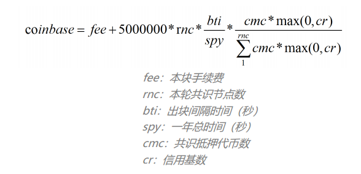
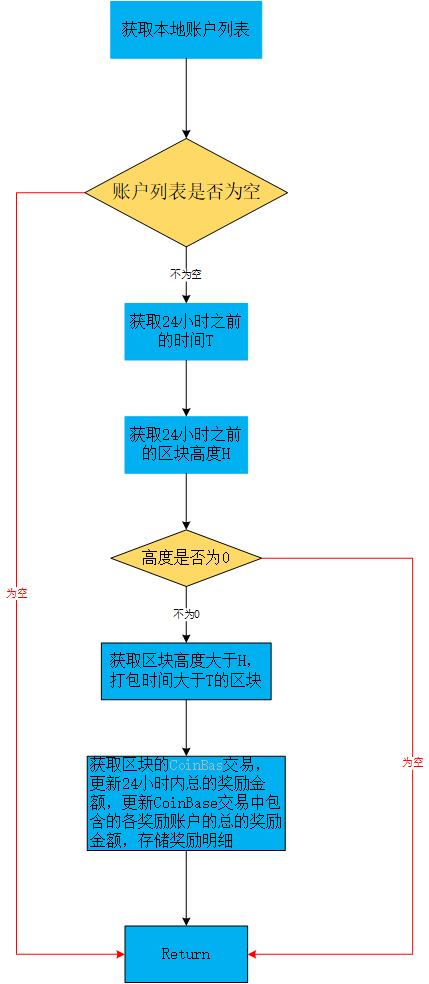

# 共识模块设计文档

[TOC]

## 一、总体描述

### 1.1 模块概述

#### 1.1.1 为什么要有共识模块

​	众所周知，区块链的核心是共识机制。和传统互联网的cliet-server架构不同，区块链的节点是对等的，没有中心，大家权利一样；所以为了使数据达到一致性，让一个没有中心的网络维护一套大家都认同的账本，这就是共识机制的作用。

​	从广义上来说，共识机制就是区块链每个节点共同遵守的规则或算法，是实现互信的基础，如此才能实现去中心化的无监管，维持整个平台的正常运转。

​	从狭义来说，共识机制决定了每个节点对区块链上交易的验证和确认的机制。

#### 1.1.2 共识模块要做什么

​	区块链的每次交易，都必须获得每个节点的认可，只有全网都达成共识后，交易才算完成。就好像民主选举中，投票方式或规则必须被全民认可，基于此才能完成选举。而在区块链中，共识机制的主要表现就是激励制度，也就是给矿工的奖励。在共识机制的保障下，每个矿工都能获得奖励，整个区块链才能有序的运转，提供公平、透明及互信的环境。因此共识模块就需要提供特定的算法来维持，即共识算法。

​	公链共识机制有多种，主流的有POW、POS、DPOS。NULS主网采用自主原创的POC（Proof Of Credit）共识机制，一种继承了Dpos共识机制的安全性和高效率，同时在协作方面进行了非常大的改进，可以看成是一种升级版的Dpos。

​	POC共识模块职责：

- 区块同步后的合法性验证

- 创建共识节点、委托参与共识、取消委托、注销共识节点★

- 共识节点打包出块

- 网络维护激励的发放

- 作恶节点惩罚★

  **PS：不同的共识机制其共识算法不尽相同，以上有标记★的为POC共识特有**

#### 1.1.3 《共识模块》在系统中的定位

​	共识模块在系统中是比较核心的一块，主要负责打包交易出块，验证区块头，管理系统中的共识节点信息，委托信息，处罚信息等。

### 1.2 架构图

（注意：区块下载属于区块管理模块，重新画图）


说明：

- Services 层：
  - tx service : 交易的增删改查
  - consensus service : 共识活动及状态管理二、功能设计
- Validator
  - tx Validator: 共识相关交易的验证器，用于验证共识相关交易
- Processor
  - Tx Processor:共识模块相关交易处理器，用于提交回滚检测交易
- Task/Thread层：定时任务
  - consensus Task: 共识打包
  - Reward Task ： 数据统计
- Storage层:存储共识模块相关交易数据

### 2.0 功能架构图


### 2.1共识模块功能需求分析

#### 2.1.1 支持多链并行

NULS2.0设计理念是提供模块化的服务，并且每个模块都应该支持多条链的数据同时运行，因此共识模块需要实现不同共识机制的算法。当共识模块启动运行后，可同时支持多条链同时运行。


#### 2.1.2 POC的共识机制

NULS的主网采用自主的POC共识机制，要实现POC，首先需要知道POC的设计理念和业务规则，以下内容摘自NULS白皮书POC共识介绍部分，如果熟悉可直接跳过。

```
共识机制——POC
	NULS主链默认采用信用共识机制 POC(Proof-Of-Credit)。节点信用达标的情况下，锁定一定保证金即可加入共识，共识节点重新排序后每轮轮流出块，退出共识时保证金解锁。
1、共识进入与退出机制
	任何人都可以随时加入NULS的共识之中，只要满足条件，遵守规则，即可持续获得NULS代币奖励。POC的加入分为硬性指标和软性指标。硬性指标指的是信用分值必须达到一定标准线，排除掉一部分曾经作恶的节点。软性指标指的是必须冻结一定量的NULS代币作为保证金，为杜绝节点的泛滥，同时让整个系统更加公平，保证金的数量除了有一个最低值的限制外，任何人可自由选择保证金的数量，保证金的数量会和最终的奖励挂钩。
1.1黄牌警告
	由于节点硬件配置或者网络原因，造成的共识期间掉线、死机等无法出块的，不属于违规情况，但对整个系统会造成一定影响，所以对这类情况，系统有一个轻度的警告机制：降低节点信用值，
1.2红牌警告
	对于一些双花、重复出块、尝试分叉系统、不遵守系统规则的恶意人为破坏情况，NULS系统坚决抵制，所有节点都可以检测到这类情况的发生；一旦有恶意节点确实试图挑战系统，那么对应的保证金将会被锁定2个月，且再次信用评级，将永远达不到共识门槛。
2、信用评级
	在 NULS 系统里，信用是账户在系统中的诚信系数，所有账户的信用会在区间[-1,1]内，通过信用评级算法公式自动计算。
	信用评估公式：信用基数=能力系数+责任系数
	能力系数：根据历史出块数量计算
	责任系数：根据违规情况和出块正确性计算
3、共识奖励
	为了整个 NULS 系统的平衡与公平，共识奖励根据所有共识节点所提交保证金与共识节点信用综合计算。共识奖励计算公式：见（图p1）
4、子链共识机制
	接入 NULS 的子链分为两种类型，第一种是通过 NULS 系统的标准接口协议接入，第二种是通过 NULS 的程序部署接入。
	NULS 是一套通用的区块链底层基础设施，在其主链上不运行任何应用业务，所有应用业务由子链运行。通过 NULS 的系统，能快速的部署基于 NULS 的子链，且可灵活定制子链的各种运行参数，包括是否支持基础代币、加密算法、共识机制、存储机制等。
	NULS 定义了标准共识模块，以提供接口兼容不同的共识机制。NULS 社区会陆续开发 POW、DPOS、POS、PBFT、POOL 验证池等共识机制，以供用户自由选择。

```

*图p1：共识奖励计算公式：*



##### 在POC系统中，有代理人、委托人、打包人、奖励人这四个角色。

- 代理人————即共识节点创建人。NULS持有人发起一笔创建共识节点的交易，记录到链中，告诉所有人我要做共识节点。节点创建的基本条件是需要锁定20,000—200,000个NULS，且没有红牌惩罚记录，设立这个基本条件的目的是证明你是真心实意的想维护好NULS的基础网络。
- 打包人————代理人在创建共识节点时，可指定一个打包人，这个打包人可以是自己的其他账户，也可以是懂技术的朋友，最重要的是打包人可以不持有任何NULS，即使参与共识的服务器被黑客攻破，用户也不会有巨大损失，损失的仅仅是被攻击后的收益影响。需要注意的是打包人是真正出块的账户，每次打包区块后都需要对区块签名，因此打包账户一定不要设置密码。
- 奖励人————代理人在创建共识节点时，不仅仅可以指定一个打包人，还可以指定一个受益人，指定谁可以获得共识所产出的奖励
- 委托人————NULS持有人，可根据代理人的信用值情况，以及代理人的影响力等等因素，把自己所持有的NULS委托给该代理人进行共识，同时享受相应的共识收益，若发现代理人节点质量或者诚信有所下降，委托人可随时撤掉其委托改投他人。

##### 在POC系统中，有创建代理（创建共识节点）、停止代理节点（退出共识）、委托共识、取消委托四种业务逻辑。

- 创建代理（创建共识节点）：锁定20,000—200,000个NULS，发起一笔注册代理交易，打包之后全网可见，其它人可锁定NULS委托到该代理人节点之上。
- 停止代理节点（退出共识）：代理人可随时停止其代理资格，发起交易删除代理节点，交易被打包确认之后，很快就会退出共识，不再参与新区块的生产。注册代理时锁定的2万个NULS会72小时之后解锁，其余委托人委托到该节点的NULS立即解锁。
- 委托共识：持有2000及以上NULS的用户，可以选择一个代理节点进行委托，获得相应的出块收益。在退出之前，相应委托的NULS将被锁定不可用。一个代理节点最高可接受500,000NULS的委托。
- 取消委托：用户可对之前进行的委托进行撤销，撤销之后锁定的NULS马上解释，不再享受相应的共识收益。

##### POC系统的两种处罚机制

- 黄牌处罚：当出块节点因断网，卡机等各种不确定原因，导致该出块时没有出块，或者出的块没有被采用，那么将在下一轮获得黄牌处罚。黄牌处罚会影响节点的收益；当连续获得100个黄牌处罚时，会被进行红牌处罚。
- 红牌处罚：当出块节点作出恶意分叉、双花等严重危害网络稳定的行为时，或者连续获得100个黄牌处罚时，系统会给予红牌处罚。获得红牌处罚的节点会被强制停止共识，创建代理时的押金被冻结3个月，且永远不可再次创建节点；获得红牌处罚的节点对应的委托立即解锁。

##### POC内部系统的隐藏功能需求

- 维护一张共识节点信息表，并根据实时接收到的以上四种交易进行更新。
- 维护一个轮次信息表，让每个轮次符合出块条件的代理人随机排队出块。
- 符合出块条件的代理节点，对内存池的交易进行验证打包，组装成新区块并广播到全网。

以上是对共识模块POC共识机制实现的功能分析，在下一章节会介绍每个功能实现的细节。

### 2.2 模块服务

共识模块为区块链的核心模块，由于共识机制的不同，导致对外提供的服务也不尽相同。模块服务会对共识模块共有的服务和POC机制特有的服务做详细描述。


#### 2.2.1 创建节点

* 功能说明：

  ```
  创建一个指定打包区块的地址（当共识节点满足可打包条件后的处快地址），佣金比例（其他账户参与该节点共识的佣金比例），共识奖励结算地址（该共识节点出块的奖励金归属地址）的共识节点，等待其他节点委托共识，当委托共识金额达到标准金额时，该节点可以打包出块赚取奖励金
  ```

* 流程描述

  ```
  - 验证参数正确性
  - 创建交易
  - 判断账户余额是否足够
  - 验证交易
  - 保存交易
  - 广播交易
  ```

* 接口定义

  - 接口说明

    ```
    通过创建节点接口，NULS用户可以发起创建节点交易，交易被确认打包后，即可成功创建共识节点。
    ```

  * 请求示例

    ```
    {
        "method":"cs_createAgent",
        "version:"1.0",
        "params":["agentAddress","packingAddress","rewardAddress",10,20000,"password","chainId"]
    }
    ```

  * 请求参数说明

    | index |   parameter    | required |  type  |            description             |
    | :---: | :------------: | :------: | :----: | :--------------------------------: |
    |   0   |  agentAddress  |   true   | String |       申请创建节点账户的地址       |
    |   1   | packingAddress |   true   | String |            打包区块地址            |
    |   2   | rewardAddress  |  false   | String | 奖励结算地址（默认与节点地址一致） |
    |   3   | commissionRate |   true   | double |              佣金比例              |
    |   4   |    deposit     |   true   |  long  |          创建节点的保证金          |
    |   5   |    password    |  false   | String |                密码                |
    |   6   |    chainId     |   true   | String |                链ID                |

  * 返回示例

    成功

    ```
    {
     	"version": 1.0,
        "code":0,
        "msg" :"成功提示信息",
        "result":{
            "value":"tx.getHash().getDigestHex()"   //生成的交易hash值
        }
    }
    ```

    失败

    ```
    {
    	"version": 1.0,
       	 "code":1,
       	 "msg" :"错误提示信息",
         "result":{
            
      	  }
    }
    ```

  * 返回参数说明

    | parameter |  type  |           description            |
    | :-------: | :----: | :------------------------------: |
    |   value   | String | 生成的交易hash值的十六进制字符串 |

#### 2.2.2 创建节点交易验证

- 功能说明：

  ```
  创建节点交易的验证器
  ```

- 流程描述

  ```
  - 验证交易中是否包含节点信息
  - 验证交易创建者是否正确
  - 节点地址与打包地址不能相同验证
  - 节点奖励地址与打包地址不能相同验证
  - 佣金比例有效性验证
  - 创建节点的保证金有效性验证
  - 签名正确性验证
  - CoinData验证（锁定时间验证）
  ```

- 接口定义

  - 接口说明

    ```
    这个接口主要是验证区块轮次信息，打包人，区块中的交易以及CoinBase是否正确，并验证是否有红黄牌惩罚。
    ```

  - 请求示例

    ```
    {
        "method":"cs_createAgentValid",
        "version:"1.0",
        "params":["tx","chainId"]
    }
    ```

  - 请求参数说明

    | index | parameter | required |  type  |       description        |
    | :---: | :-------: | :------: | :----: | :----------------------: |
    |   0   |    tx     |   true   | String | 创建节点交易的序列化数据 |
    |   1   |  chainId  |   true   | String |           链ID           |

  - 返回示例

    成功

    ```
    {
        "version":"1.0",  
        "code": 0,                                  //错误码
        "msg": "提示信息",                           //提示信息                          
        "result": {                                 //返回的业务数据集  
      		
        }
    }
    ```

    失败

    ```
    {
         "version": 1.0,
       	 "code":1,                         //错误码
       	 "msg" :"错误提示信息",             //提示信息
         "result":{
            
      	  }
    }
    ```

  - 返回参数说明

    ```
    无
    ```

#### 2.2.3 创建节点交易提交

- 功能说明：

  ```
  保存创建的共识节点信息
  ```

- 流程描述

  ```
  - 保存节点信息到数据库
  ```

- 接口定义

  - 接口说明

    ```
    保存共识节点信息到数据库
    ```

  - 请求示例

    ```
    {
        "method":"cs_createAgentCommit",
        "version:"1.0",
        "params":["tx","blockHeader","chainId"]
    }
    ```

  - 请求参数说明

    | index |  parameter  | required |  type  |       description        |
    | :---: | :---------: | :------: | :----: | :----------------------: |
    |   0   |     tx      |   true   | String | 创建节点交易的序列化数据 |
    |   1   | blockHeader |   true   | String |  区块头的十六进制字符串  |
    |   2   |   chainId   |   true   | String |           链ID           |

  - 返回示例

    成功

    ```
    {
        "version":"1.0",  
        "code": 0,                                  //错误码
        "msg": "提示信息",                           //提示信息                          
        "result": {                                 //返回的业务数据集  
      		
        }
    }
    ```

    失败

    ```
    {
         "version": 1.0,
       	 "code":1,                         //错误码
       	 "msg" :"错误提示信息",             //提示信息
         "result":{
            
      	  }
    }
    ```

  - 返回参数说明

    ```
    无
    ```

#### 2.2.4 创建节点交易回滚

- 功能说明：

  ```
  删除共识节点信息
  ```

- 流程描述

  ```
  - 删除共识节点信息
  ```

- 接口定义

  - 接口说明

    ```
    从数据中删除共识节点信息
    ```

  - 请求示例

    ```
    {
        "method":"cs_createAgentRollBack",
        "version:"1.0",
        "params":["tx","blockHeader","chainId"]
    }
    ```

  - 请求参数说明

    | index |  parameter  | required |  type  |       description        |
    | :---: | :---------: | :------: | :----: | :----------------------: |
    |   0   |     tx      |   true   | String | 创建节点交易的序列化数据 |
    |   1   | blockHeader |   true   | String |  区块头的十六进制字符串  |
    |   2   |   chainId   |   true   | String |           链ID           |

  - 返回示例

    成功

    ```
    {
        "version":"1.0",  
        "code": 0,                                  //错误码
        "msg": "提示信息",                           //提示信息                          
        "result": {                                 //返回的业务数据集  
      		
        }
    }
    ```

    失败

    ```
    {
         "version": 1.0,
       	 "code":1,                         //错误码
       	 "msg" :"错误提示信息",             //提示信息
         "result":{
            
      	  }
    }
    ```

  - 返回参数说明

    ```
    无
    ```

#### 2.2.5 注销共识节点

- 功能说明：

  ```
  注销一个自己创建的共识节点，注销节点后参与共识的节点的共识金额及共识奖金会在一定时间后解冻
  ```

- 流程描述

  ```
  - 验证参数正确性
  - 创建交易
  - 判断账户余额是否足够
  - 验证交易
  - 保存交易
  - 广播交易
  ```

- 接口定义

  - 接口说明

    ```
    通过注销节点接口，NULS用户可以发起注销自己创建的节点的交易，交易被确认打包后，即可成功注销共识节点。
    ```

  - 请求示例

    ```
    {
        "method":"cs_stopAgent",
        "version:"1.0",
        "params":["address","password",chainId]
    }
    ```

  - 请求参数说明

    | index | parameter | required |  type  |        description         |
    | :---: | :-------: | :------: | :----: | :------------------------: |
    |   0   |  address  |   true   | String | 创建注销节点交易账户的地址 |
    |   1   | password  |  false   | String |            密码            |
    |   2   |  chainId  |   true   | String |            链ID            |

  - 返回示例

    成功

    ```
    {
        "version":"1.0",  
        "code": 0,                                  //错误码
        "msg": "提示信息",                           //提示信息                          
        "result": {                                 //返回的业务数据集  
      		"value":"tx.getHash().getDigestHex()"   //生成的交易hash值
        }
    }
    ```

    失败

    ```
    {
         "version": 1.0,
       	 "code":1,                         //错误码
       	 "msg" :"错误提示信息",             //提示信息
         "result":{
            
      	  }
    }
    ```

  - 返回参数说明

    | parameter | type   | description                      |
    | --------- | ------ | -------------------------------- |
    | value     | String | 生成的交易hash值的十六进制字符串 |

#### 2.2.6 注销节点交易验证

- 功能说明：

  ```
  验证注销节点交易的正确性
  ```

- 流程描述

  ```
  - 验证删除的共识节点是否存在和该共识节点是否已经被注销
  - 验证交易创建者是否正确
  - CoinData验证（输出地址必须存在）
  - 查询出所有参与该共识节点的共识信息和该节点总的共识金额
  - 检查注销节点交易中花费的UTXO总额与数据库查询出的共识节点委托金额是否相等，如果不等则验证失败
  - 验证注销节点交易中解锁的每笔UTXO是否正确
  ```

- 接口定义

  - 接口说明

    ```
    验证注销节点交易是否正确。
    ```

  - 请求示例

    ```
    {
        "method":"cs_stopAgentValid",
        "version:"1.0",
        "params":["tx",chainId]
    }
    ```

  - 请求参数说明

    | index | parameter | required |  type  |       description        |
    | :---: | :-------: | :------: | :----: | :----------------------: |
    |   0   |    tx     |   true   | String | 注销节点交易的序列化数据 |
    |   1   |  chainId  |   true   | String |           链ID           |

  - 返回示例

    成功

    ```
    {
        "version":"1.0",  
        "code": 0,                                  //错误码
        "msg": "提示信息",                           //提示信息                          
        "result": {                                 //返回的业务数据集  
      		
        }
    }
    ```

    失败

    ```
    {
         "version": 1.0,
       	 "code":1,                         //错误码
       	 "msg" :"错误提示信息",             //提示信息
         "result":{
            
      	  }
    }
    ```

  - 返回参数说明

    ```
    无
    ```

#### 2.2.7 注销节点交易提交

- 功能说明：

  ```
  提交注销节点数据交易
  ```

- 流程描述

  ```
  - 把该共识节点下所有的委托数据设为已删除
  - 把该共识节点数据设为已删除
  ```

- 接口定义

  - 接口说明

    ```
    注销共识节点，把该共识节点下的所有委托数据设和共识节点设为已删除状态
    ```

  - 请求示例

    ```
    {
        "method":"cs_stopAgentCommit",
        "version:"1.0",
        "params":["tx","blockHeader","chainId"]
    }
    ```

  - 请求参数说明

    | index |  parameter  | required |  type  |       description        |
    | :---: | :---------: | :------: | :----: | :----------------------: |
    |   0   |     tx      |   true   | String | 创建节点交易的序列化数据 |
    |   1   | blockHeader |   true   | String |  区块头的十六进制字符串  |
    |   2   |   chainId   |   true   | String |           链ID           |

  - 返回示例

    成功

    ```
    {
        "version":"1.0",  
        "code": 0,                                  //错误码
        "msg": "提示信息",                           //提示信息                          
        "result": {                                 //返回的业务数据集  
      		
        }
    }
    ```

    失败

    ```
    {
         "version": 1.0,
       	 "code":1,                         //错误码
       	 "msg" :"错误提示信息",             //提示信息
         "result":{
            
      	  }
    }
    ```

  - 返回参数说明

    ```
    无
    ```

#### 2.2.8 注销节点交易回滚

- 功能说明：

  ```
  注销节点交易数据回滚
  ```

- 流程描述

  ```
  - 把该共识节点下所有的委托数据设为未删除
  - 把该共识节点数据设为未删除
  ```

- 接口定义

  - 接口说明

    ```
    回滚注销节点交易数据
    ```

  - 请求示例

    ```
    {
        "method":"cs_stopAgentRollback",
        "version:"1.0",
        "params":["tx","blockHeader","chainId"]
    }
    ```

  - 请求参数说明

    | index |  parameter  | required |  type  |       description        |
    | :---: | :---------: | :------: | :----: | :----------------------: |
    |   0   |     tx      |   true   | String | 注销节点交易的序列化数据 |
    |   1   | blockHeader |   true   | String |  区块头的十六进制字符串  |
    |   2   |   chainId   |   true   | String |           链ID           |

  - 返回示例

    成功

    ```
    {
        "version":"1.0",  
        "code": 0,                                  //错误码
        "msg": "提示信息",                           //提示信息                          
        "result": {                                 //返回的业务数据集  
      		
        }
    }
    ```

    失败

    ```
    {
         "version": 1.0,
       	 "code":1,                         //错误码
       	 "msg" :"错误提示信息",             //提示信息
         "result":{
            
      	  }
    }
    ```

  - 返回参数说明

    ```
    无
    ```

#### 2.2.9 申请加入共识

- 功能说明：

  ```
  委托指定金额到共识节点参与共识赚取共识奖励，加入共识期间委托金额和共识奖励会被冻结
  ```

- 流程描述

  ```
  - 验证参数正确性
  - 创建交易
  - 判断账户余额是否足够
  - 验证交易
  - 保存交易
  - 广播交易
  ```

- 接口定义

  - 接口说明

    ```
    通过该接口，用户可以委托指定节点地址加入共识，赚取奖金。
    ```

  - 请求示例

    ```
    {
        "method":"cs_depositToAgent",
        "version:"1.0",
        "params":["address","agentHash",20000,"password","chainId"]
    }
    ```

  - 请求参数说明

    | index | parameter | required |  type  |      description       |
    | :---: | :-------: | :------: | :----: | :--------------------: |
    |   0   |  address  |   true   | String |  申请参与共识账户地址  |
    |   1   | agentHash |   true   | String |       共识节点id       |
    |   2   |  deposit  |   true   |  long  |     参与共识的金额     |
    |   3   | password  |  false   | String | 申请参与共识账户的密码 |
    |   4   |  chainId  |   true   | String |          链ID          |

  - 返回示例

    成功

    ```
    {
        "version":"1.0",  
        "code": 0,                                  //错误码
        "msg": "提示信息",                           //提示信息                          
        "result": {                                 //返回的业务数据集  
      		"value":"tx.getHash().getDigestHex()"   //生成的交易hash值
        }
    }
    ```

    失败

    ```
    {
         "version": 1.0,
       	 "code":1,                         //错误码
       	 "msg" :"错误提示信息",             //提示信息
         "result":{
            
      	  }
    }
    ```

  - 返回参数说明

    | parameter | type   | description                |
    | --------- | ------ | -------------------------- |
    | value     | String | 交易hash值的十六进制字符串 |

#### 2.2.10 委托共识交易验证

- 功能说明：

  ```
  委托共识交易正确性验证
  ```

- 流程描述

  ```
  - 验证申请加入的共识节点是否有效
  - 验证申请加入的共识节点是否已经达到允许加入共识的最大数量
  - 验证委托金额是否有效
  - 验证交易是否为申请委托的账户自己创建
  - 验证委托金额与输出的UTXO金额是否相等，输出的UTXO锁定时间是否正确
  ```

- 接口定义

  - 接口说明

    ```
    验证委托交易中委托节点有效性的验证，委托金额正确性验证，委托交易创建者是否正确，委托交易输出的UTXO是否正确等。验证注销节点交易是否正确。
    ```

  - 请求示例

    ```
    {
        "method":"cs_depositValid",
        "version:"1.0",
        "params":["tx","chainId"]
    }
    ```

  - 请求参数说明

    | index | parameter | required |  type  |       description        |
    | :---: | :-------: | :------: | :----: | :----------------------: |
    |   0   |    tx     |   true   | String | 委托共识交易的序列化数据 |
    |   1   |  chainId  |   true   | String |           链ID           |

  - 返回示例

    成功

    ```
    {
        "version":"1.0",  
        "code": 0,                                  //错误码
        "msg": "提示信息",                           //提示信息                          
        "result": {                                 //返回的业务数据集  
      		
        }
    }
    
    ```

    失败

    ```
    {
         "version": 1.0,
       	 "code":1,                         //错误码
       	 "msg" :"错误提示信息",             //提示信息
         "result":{
            
      	  }
    }
    ```

  - 返回参数说明

    ```
    无
    ```

#### 2.2.11 委托共识交易提交

- 功能说明：

  ```
  委托交易提交
  ```

- 流程描述

  ```
  - 保存委托交易信息
  ```

- 接口定义

  - 接口说明

    ```
    保存委托交易数据
    ```

  - 请求示例

    ```
    {
        "method":"cs_depositCommit",
        "version:"1.0",
        "params":["tx",1000000,"chainId"]
    }
    ```

  - 请求参数说明

    | index | parameter | required |  type  |       description        |
    | :---: | :-------: | :------: | :----: | :----------------------: |
    |   0   |    tx     |   true   | String |     交易的序列化数据     |
    |   1   |  height   |   true   |  long  | 委托交易被打包的区块高度 |
    |   2   |  chainId  |   true   | String |           链ID           |

  - 返回示例

    成功

    ```
    {
        "version":"1.0",  
        "code": 0,                                  //错误码
        "msg": "提示信息",                           //提示信息                          
        "result": {                                 //返回的业务数据集  
      		
        }
    }
    
    ```

    失败

    ```
    {
         "version": 1.0,
       	 "code":1,                         //错误码
       	 "msg" :"错误提示信息",             //提示信息
         "result":{
            
      	  }
    }
    ```

  - 返回参数说明

    ```
    无
    ```

#### 2.2.12 委托共识交易回滚

- 功能说明：

  ```
  委托共识交易回滚，删除委托共识交易数据
  ```

- 流程描述

  ```
  - 删除委托共识交易信息
  ```

- 接口定义

  - 接口说明

    ```
    当委托共识交易提交出错时，需要掉此接口来删除委托共识交易数据
    ```

  - 请求示例

    ```
    {
        "method":"cs_depositRollback",
        "version:"1.0",
        "params":["tx",1000000,"chainId"]
    }
    ```

  - 请求参数说明

    | index | parameter | required |  type  |         description          |
    | :---: | :-------: | :------: | :----: | :--------------------------: |
    |   0   |    tx     |   true   | String |   委托共识交易的序列化数据   |
    |   1   |  height   |   true   |  long  | 委托共识交易被打包区块的高度 |
    |   2   |  chainId  |   true   | String |             链ID             |

  - 返回示例

    成功

    ```
    {
        "version":"1.0",  
        "code": 0,                                  //错误码
        "msg": "提示信息",                           //提示信息                          
        "result": {                                 //返回的业务数据集  
      		
        }
    }
    
    ```

    失败

    ```
    {
         "version": 1.0,
       	 "code":1,                         //错误码
       	 "msg" :"错误提示信息",             //提示信息
         "result":{
            
      	  }
    }
    ```

  - 返回参数说明

    ```
    无
    ```

#### 2.2.13 撤销委托

- 功能说明：

  ```
  申请退出共识，交易验证通过后在指定时间之后加入共识的押金和奖励会解冻
  ```

- 流程描述

  ```
  - 验证参数正确性
  - 创建交易
  - 判断账户余额是否足够
  - 验证交易
  - 保存交易
  - 广播交易
  ```

- 接口定义

  - 接口说明

    ```
    申请退出共识，交易验证通过后在指定时间之后加入共识的押金和奖励会解冻
    ```

  - 请求示例

    ```
    {
        "method":"cs_withdraw",
        "version:"1.0",
        "params":["address","txHash","password","chainId"]
    }
    ```

  - 请求参数说明

    | index | parameter | required |  type  |     description      |
    | :---: | :-------: | :------: | :----: | :------------------: |
    |   0   |  address  |   true   | String | 申请退出共识账户地址 |
    |   1   |  txHash   |   true   | String | 加入共识时的交易hash |
    |   2   | password  |  false   | String |         密码         |
    |   3   |  chainId  |   true   | String |         链ID         |

  - 返回示例

    成功

    ```
    {
        "version":"1.0",  
        "code": 0,                                  //错误码
        "msg": "提示信息",                           //提示信息                          
        "result": {                                 //返回的业务数据集  
      		"value":"tx.getHash().getDigestHex()"   //生成的交易hash值
        }
    }
    ```

    失败

    ```
    {
         "version": 1.0,
       	 "code":1,                         //错误码
       	 "msg" :"错误提示信息",             //提示信息
         "result":{
            
      	  }
    }
    ```

  - 返回参数说明

    | parameter | type   | description                |
    | --------- | ------ | -------------------------- |
    | value     | String | 交易hash值的十六进制字符串 |

#### 2.2.14 退出共识交易验证

- 功能说明：

  ```
  验证退出共识交易是否正确
  ```

- 流程描述

  ```
  - 验证要退出的共识之前是否已经委托且没有退出
  - 验证创建该交易的账户是否正确
  ```

- 接口定义

  - 接口说明

    ```
    在退出之前要验证该账户是否参与过该委托且现在还是在委托中。还要验证交易创建者是否为委托人本人。
    ```

  - 请求示例

    ```
    {
        "method":"cs_withdrawValid",
        "version:"1.0",
        "params":["tx","chainId"]
    }
    ```

  - 请求参数说明

    | index | parameter | required |  type  |       description        |
    | :---: | :-------: | :------: | :----: | :----------------------: |
    |   0   |    tx     |   true   | String | 退出委托交易的序列化数据 |
    |   1   |  chainId  |   true   | String |           链ID           |

  - 返回示例

    成功

    ```
    {
        "version":"1.0",  
        "code": 0,                                  //错误码
        "msg": "提示信息",                           //提示信息                          
        "result": {                                 //返回的业务数据集  
      		
        }
    }
    
    
    ```

    失败

    ```
    {
         "version": 1.0,
       	 "code":1,                         //错误码
       	 "msg" :"错误提示信息",             //提示信息
         "result":{
            
      	  }
    }
    ```

  - 返回参数说明

    ```
    无
    ```

#### 2.2.15 退出共识交易提交

- 功能说明：

  ```
  退出共识交易提交，保存退出共识交易相关数据
  ```

- 流程描述

  ```
  - 保存退出共识交易相关数据
  ```

- 接口定义

  - 接口说明

    ```
    当退出共识交易验证成功之后通过调用该接口来保存交易相关数据
    ```

  - 请求示例

    ```
    {
        "method":"cs_depositCommit",
        "version:"1.0",
        "params":["tx","blockHeader","chainId"]
    }
    ```

  - 请求参数说明

    | index |  parameter  | required |  type  |      description       |
    | :---: | :---------: | :------: | :----: | :--------------------: |
    |   0   |     tx      |   true   | String |    交易的序列化数据    |
    |   1   | blockHeader |   true   | String | 区块头的十六进制字符串 |
    |   2   |   chainId   |   true   | String |          链ID          |

  - 返回示例

    成功

    ```
    {
        "version":"1.0",  
        "code": 0,                                  //错误码
        "msg": "提示信息",                           //提示信息                          
        "result": {                                 //返回的业务数据集  
      		
        }
    }
    
    
    ```

    失败

    ```
    {
         "version": 1.0,
       	 "code":1,                         //错误码
       	 "msg" :"错误提示信息",             //提示信息
         "result":{
            
      	  }
    }
    ```

  - 返回参数说明

    ```
    无
    ```

#### 2.2.16 退出共识交易回滚

- 功能说明：

  ```
  退出共识交易数据回滚
  ```

- 流程描述

  ```
  - 回滚退出共识交易数据
  ```

- 接口定义

  - 接口说明

    ```
    当退出共识交易提交出错时，需要调用此接口来回滚数据，保证数据的正确性。
    ```

  - 请求示例

    ```
    {
        "method":"cs_withdrawRollback",
        "version:"1.0",
        "params":["tx","blockHeader","chainId"]
    }
    ```

  - 请求参数说明

    | index |  parameter  | required |  type  |       description        |
    | :---: | :---------: | :------: | :----: | :----------------------: |
    |   0   |     tx      |   true   | String | 退出委托交易的序列化数据 |
    |   1   | blockHeader |   true   | String |  区块头的十六进制字符串  |
    |   2   |   chainId   |   true   | String |           链ID           |

  - 返回示例

    成功

    ```
    {
        "version":"1.0",  
        "code": 0,                                  //错误码
        "msg": "提示信息",                           //提示信息                          
        "result": {                                 //返回的业务数据集  
      		
        }
    }
    
    
    ```

    失败

    ```
    {
         "version": 1.0,
       	 "code":1,                         //错误码
       	 "msg" :"错误提示信息",             //提示信息
         "result":{
            
      	  }
    }
    ```

  - 返回参数说明

    ```
    无
    ```

#### 2.2.17 查询共识节点列表

- 功能说明：

  ```
  获取自己加入的或全网所有的共识节点列表，支持关键字查询，排序，分页查询
  ```

- 流程描述

  ```
  - 验证参数正确性
  - 获取本地主链上共识节点列表
  - 过滤共识节点列表，得到满足条件的共识节点列表
  - 共识节点列表排序
  - 分页
  - 返回共识节点列表
  ```

- 接口定义

  - 接口说明

    ```
    获取自己加入的或全网所有的共识节点列表，支持关键字查询，排序，分页查询
    ```

  - 请求示例

    ```
    {
        "method":"cs_getAgentList",
        "version:"1.0",
        "params":[1,10,"address","keyword","sortType","chainId"]
    }
    ```

  - 请求参数说明

    | index | parameter  | required |  type  |                         description                          |
    | :---: | :--------: | :------: | :----: | :----------------------------------------------------------: |
    |   0   | pageNumber |   true   |  int   |                             页码                             |
    |   1   |  pageSize  |   true   |  int   |                          每页数据量                          |
    |   2   |  keyword   |  false   | String |        关键字（节点地址，打包地址，节点别名，节点ID）        |
    |   3   |  sortType  |  false   | String | 排序类型（deposit创建共识节点的锁定金额，commissionRate佣金比 例，creditVal奖励金额，totalDeposit参与共识的总金额，comprehensive综合排序） |
    |   4   |  chainId   |   true   | String |                             链ID                             |

  - 返回示例

    成功

    ```
    {
        "code": 0,                                  //错误码
        "msg": "success",                           //错误提示信息
        "version":"1.0",                            
        "result": {                                 //返回的业务数据集  
        	"pageNumber":1,                         //页码         
        	"pageSize":10,                          //每页数据量
        	"total":100,                            //总数据量
        	"pages",10,                             //总页数
        	"data":[
                {
                    "agentHash":"",                  //节点hash
                    "agentAddress";""，              //创建节点的地址
                    "packingAddress";""，            //打包地址
                    "rewardAddress";""，             //奖励地址
                    "deposit";，                     //保证金
                    "commissionRate";，              //佣金比例
                    "agentName";""，                 //节点名称
                    "agentId";""，                   //节点ID
                    "introduction";""，              //简介
                    "time";，                        //创建时间
                    "blockHeight";，                 //所在区块高度
                    "delHeight":，                   //共识节点被删除的区块高度
                    "status":，                      //状态                    
                    "creditVal":，                   //信誉值
                    "totalDeposit":，                //参与共识总金额
                    "txHash":""，                    //交易hash
                    "memberCount":，                 //加入该节点共识的人数
                    "version":                       //版本
                }，{
                    
                }
        	]
        }
    }
    ```

    失败

    ```
    {
         "version": 1.0,
       	 "code":1,                         //错误码
       	 "msg" :"错误提示信息",             //提示信息
         "result":{
            
      	  }
    }
    ```

  - 返回参数说明

    data:

    | parameter  |    type     | description  |
    | :--------: | :---------: | :----------: |
    | pageNumber |     int     |     页码     |
    |  pageSize  |     int     |  每页数据量  |
    |   total    |     int     |   总数据量   |
    |   pages    |     int     |    总页数    |
    |    data    | List<Agent> | 共识节点列表 |

    Agent:

    |   parameter    |  type  |         description          |
    | :------------: | :----: | :--------------------------: |
    |   agentHash    | String |           节点hash           |
    |  agentAddress  | String |        创建节点的地址        |
    | packingAddress | String |           打包地址           |
    | rewardAddress  | String |           奖励地址           |
    |    deposit     |  long  |            保证金            |
    | commissionRate | double |           佣金比例           |
    |   agentName    | String |           节点名称           |
    |    agentId     | String |            节点ID            |
    |  introduction  | String |             简介             |
    |      time      |  long  |           创建时间           |
    |  blockHeight   |  long  | 创建该节点的交易所在区块高度 |
    |   delHeight    |  long  |     注销交易所在区块高度     |
    |     status     |  int   |             状态             |
    |   creditVal    | double |            信誉值            |
    |  totalDeposit  |  long  |          总委托金额          |
    |     txHash     | String |           交易hash           |
    |  memberCount   |  int   |           委托数量           |
    |    version     | String |           协议版本           |

#### 2.2.18 查询节点明细（基本信息、信用值、节点状态）

- 功能说明：

  ```
  查询指定共识节点详细信息，包括共识节点的创建时间，保证金，佣金比例，节点地址，打包地址，共识状态，信用值，委托金额，共识人数等信息
  ```

- 流程描述

  ```
  - 验证参数正确性
  - 获取本地主链上共识节点列表
  - 从列表中找出对应的节点信息
  ```

- 接口定义

  - 接口说明

    ```
    通过节点hash查询该节点的详细信息
    ```

  - 请求示例

    ```
    {
        "method":"cs_getAgent",
        "version:"1.0",
        "params":["agentHash","chainId"]
    }
    ```

  - 请求参数说明

    | index | parameter | required |  type  | description |
    | :---: | :-------: | :------: | :----: | :---------: |
    |   0   | agentHash |   true   | String | 共识节点id  |
    |   1   |  chainId  |   true   | String |    链ID     |

  - 返回示例

    成功

    ```
    {
        "code": 0,                                  //错误码
        "msg": "success",                           //错误提示信息
        "version":"1.0",                            
        "result": {                                 //返回的业务数据集  
        	"data":{
                    "agentHash":"",                  //节点hash
                    "agentAddress";""，              //创建节点的地址
                    "packingAddress";""，            //打包地址
                    "rewardAddress";""，             //奖励地址
                    "deposit";，                     //保证经
                    "commissionRate";，              //佣金比例
                    "agentName";""，                 //节点名称
                    "agentId";""，                   //节点ID
                    "introduction";""，              //简介
                    "time";，                        //创建时间
                    "blockHeight";，                 //所在区块高度
                    "delHeight":，                   //共识节点被删除的区块高度
                    "status":，                      //状态                    
                    "creditVal":，                   //信用值
                    "totalDeposit":，                //参与共识总金额
                    "txHash":""，                    //交易hash
                    "memberCount":，                 //加入该节点共识的人数
                    "version":                       //版本
             }
        }
    }
    ```

    失败

    ```
    {
         "version": 1.0,
       	 "code":1,                         //错误码
       	 "msg" :"错误提示信息",             //提示信息
         "result":{
            
      	  }
    }
    ```

  - 返回参数说明

    |   parameter    |  type  |         description          |
    | :------------: | :----: | :--------------------------: |
    |   agentHash    | String |           节点hash           |
    |  agentAddress  | String |        创建节点的地址        |
    | packingAddress | String |           打包地址           |
    | rewardAddress  | String |           奖励地址           |
    |    deposit     |  long  |            保证金            |
    | commissionRate | double |           佣金比例           |
    |   agentName    | String |           节点名称           |
    |    agentId     | String |            节点ID            |
    |  introduction  | String |             简介             |
    |      time      |  long  |           创建时间           |
    |  blockHeight   |  long  | 创建该节点的交易所在区块高度 |
    |   delHeight    |  long  |     注销交易所在区块高度     |
    |     status     |  int   |             状态             |
    |   creditVal    | double |            信誉值            |
    |  totalDeposit  |  long  |          总委托金额          |
    |     txHash     | String |           交易hash           |
    |  memberCount   |  int   |           委托数量           |
    |    version     | String |           协议版本           |

#### 2.2.19 查询节点惩罚列表（全部、红牌、黄牌）

- 功能说明：

  ```
  获取共识节点以前获得的惩罚记录（红牌和黄牌惩罚），用户可自定义查询全部惩罚记录还是只获取红牌或则黄牌惩罚信息
  ```

- 流程描述

  ```
  - 验证参数正确性
  - 根据查询类型获取相应惩罚
  ```

- 接口定义

  - 接口说明

    ```
    查询指定出块地址的惩罚记录
    ```

  - 请求示例

    ```
    {
        "method":"cs_getPunishList",
        "version:"1.0",
        "params":["address",0,"chainId"]
    }
    ```

  - 请求参数说明

    | index | parameter | required |  type  |          description          |
    | :---: | :-------: | :------: | :----: | :---------------------------: |
    |   0   |  address  |   true   | String |           出块地址            |
    |   1   |   type    |   true   |  int   | 惩罚类型  1黄牌，2红牌，0全部 |
    |   2   |  chainId  |   true   | String |             链ID              |

 - 返回示例

    成功

    ```
    {
        "code": 0,                                  //错误码
        "msg": "success",                           //错误提示信息
        "version":"1.0",                            
        "result": {                                 //返回的业务数据集  
        	"pageNumber":1,                         //页码         
        	"pageSize":10,                          //每页数据量
        	"total":100,                            //总数据量
        	"pages",10,                             //总页数
        	"data":[
                {
                    "type",，                        //惩罚类型
                    "address",""，                   //出块地址
                    "time",""，                      //惩罚时间
                    "height",，                      //区块高度
                    "roundIndex",，                  //轮次               
                    "reasonCode",""                  //惩罚原因
                }，{
                   ......
                }
        	]
        }
    }
    ```

    失败

    ```
    {
         "version": 1.0,
       	 "code":1,                         //错误码
       	 "msg" :"错误提示信息",             //提示信息
         "result":{
            
      	  }
    }
    ```

  - 返回参数说明

    data:

    | parameter  |     type     | description  |
    | :--------: | :----------: | :----------: |
    | pageNumber |     int      |     页码     |
    |  pageSize  |     int      |  每页数据量  |
    |   total    |     int      |   数据总量   |
    |   pages    |     int      |  数据总页数  |
    |    data    | List<Punish> | 惩罚列表数据 |

    Punish:

    | parameter  |  type  |   description    |
    | :--------: | :----: | :--------------: |
    |    type    |  byte  |     惩罚类型     |
    |  address   | String |       地址       |
    |    time    | String |     惩罚时间     |
    |   height   |  long  | 惩罚所在区块高度 |
    | roundIndex |  long  |       轮次       |
    | reasonCode | String |     惩罚原因     |

#### 2.2.20 查询委托列表（根据委托人、根据节点）

- 功能说明：

  ```
  1.查询指定地址参与的所有委托信息列表
  2.查询指定账户参与的指定共识节点的委托信息
  3.查询指定共识节点受托列表信息
  ```

- 流程描述

  ```
  - 验证参数正确性
  - 获取本地主链上参与共识信息列表
  - 过滤共识列表，获取指定账户参与的共识列表或指定节点受委托的共识列表信息
  ```

- 接口定义

  - 接口说明

    ```
    获取指定账户参与的或指定共识节点接受的共识列表信息，当查询指定账户参与的所有共识列表时agentHash字段传"",当需要查询指定节点的所有受委托列表时address字段传""
    ```

  - 请求示例

    ```
    {
        "method":"cs_getDepositList",
        "version:"1.0",
        "params":[1，10，"address","agentHash","chainId"]
    }
    ```

  - 请求参数说明

    | index | parameter  | required |  type  |                      description                       |
    | :---: | :--------: | :------: | :----: | :----------------------------------------------------: |
    |   0   | pageNumber |   true   |  int   |                          页码                          |
    |   1   |  pageSize  |   true   |  int   |                       每页数据量                       |
    |   2   |  address   |  false   | String |  参与委托的账户地址（查询节点受委托信息是该指定传""）  |
    |   3   | agentHash  |  false   | String | 指定代理节点标识（当查询账户所有委托信息时该字段传""） |
    |   4   |  chainId   |   true   | String |                          链ID                          |

  - 返回示例

    成功

    ```
    {
        "code": 0,                                  //错误码
        "msg": "success",                           //错误提示信息
        "version":"1.0",                            
        "result": {                                 //返回的业务数据集  
        	"pageNumber":1,                         //页码         
        	"pageSize":10,                          //每页数据量
        	"total":100,                            //总数据量
        	"pages",10,                             //总页数
        	"data":[
                {
                    "agentHash":"",                  //节点hash
                    "address";""，                   //申请加入共识账户地址
                    "deposit";，                     //委托金额
                    "time";，                        //委托时间
                    "blockHeight";，                 //委托所在区块高度
                    "delHeight":，                   //共识节点被删除的区块高度         
                    "txHash":""，                    //交易hash
                    "status":,                       //共识节点状态（待共识，共识中）
                    "agentName":"",                  //共识节点名称
                    "agentAddress":""                //共识节点地址
                }，{
                    
                }
        	]
        }
    }
    ```

    失败

    ```
    {
         "version": 1.0,
       	 "code":1,                         //错误码
       	 "msg" :"错误提示信息",             //提示信息
         "result":{
            
      	  }
    }
    ```

  - 返回参数说明

    data:

    | parameter  |     type      |       description        |
    | :--------: | :-----------: | :----------------------: |
    | pageNumber |      int      |           页码           |
    |  pageSize  |      int      |        每页数据量        |
    |   total    |      int      |         数据总量         |
    |   pages    |      int      |          总页码          |
    |    data    | List<Deposit> | 共识数据列表的json字符串 |

    Deposit:

    |  parameter   |  type  |          description           |
    | :----------: | :----: | :----------------------------: |
    |  agentHash   | String |          共识节点hash          |
    |   address    | String |      申请加入共识账户地址      |
    |   deposit    |  long  |            委托金额            |
    |     time     |  long  |            委托时间            |
    | blockHeight  |  long  |      委托交易所在区块高度      |
    |  delHeight   |  long  |      退出委托交易所在高度      |
    |    txHash    | String |            交易hash            |
    |    status    |  int   | 共识节点状态（待共识，共识中） |
    |  agentName   | String |          共识节点名称          |
    | agentAddress | String |          共识节点地址          |

#### 2.2.21 查询全网共识状态

- 功能说明：

  ```
  查询全网共识总体信息，包括节点数量，总抵押，参与共识账户总数量等信息
  ```

- 流程描述

  ```
  - 获取全网共识节点列表
  - 过滤共识节点列表，等到合法的共识节点列表
  - 获取当前打包轮次信息
  - 根据当前打包轮次信息获取，当前网络参与共识的账户总量及委托金额总量
  ```

- 接口定义

  - 接口说明

    ```
    查询全网节点数量，总委托金额，参与共识的账户两及满足打包条件的共识节点数量
    ```

  - 请求示例

    ```
    {
        "method":"cs_getWholeInfo",
        "version:"1.0",
        "params":["chainId"]
    }
    ```

  - 请求参数说明

    | index | parameter | required |  type  | description |
    | :---: | :-------: | :------: | :----: | :---------: |
    |   0   |  chainId  |   true   | String |    链ID     |

  - 返回示例

    成功

    ```
    {
        "code": 0,                                  //错误码
        "msg": "success",                           //错误提示信息
        "version":"1.0",                            
        "result": {                                 //返回的业务数据集  
        	"data":{
                "agentCount":,                      //节点数量
                "totalDeposit":,                    //委托金额总量
                "rewardOfDay":,                     //24小时内的奖励金额
                "consensusAccountNumber":,          //参与共识的账户数量
                "packingAgentCount":                //当前轮次打包共识节点数量
        	}
        }
    }
    ```

    失败

    ```
    {
         "version": 1.0,
       	 "code":1,                         //错误码
       	 "msg" :"错误提示信息",             //提示信息
         "result":{
            
      	  }
    }
    ```

  - 返回参数说明

    |       parameter        | type |       description        |
    | :--------------------: | :--: | :----------------------: |
    |       agentCount       | int  |         节点数量         |
    |      totalDeposit      | long |       委托金额总量       |
    |      rewardOfDay       | long |    24小时内的奖励金额    |
    | consensusAccountNumber | int  |    参与共识的账户数量    |
    |   packingAgentCount    | int  | 当前轮次打包共识节点数量 |

#### 2.2.22 查询单个账户共识状态

- 功能说明：

  ```
  查询指定账户共识信息，包括该账户自己创建的共识节点个数及节点hash，参与共识的总金额，该账户参与的共识节点个数，可用余额，共识奖金，24小时内获取的共识奖金
  ```

- 流程描述

  ```
  - 获取全网网络共识节点列表
  - 查看共识节点列表中是否有该账户创建的共识节点
  - 获取当前网络委托列表
  - 从委托列表中获取该账户参与的委托列表
  - 从该账户的委托列表获取该账户的委托信息
  ```

- 接口定义

  - 接口说明

    ```
    查询指定账户共识信息，包括该账户自己创建的共识节点个数及节点hash，参与共识的总金额，该账户参与的共识节点个数，可用余额，共识奖金，24小时内获取的共识奖金
    ```

  - 请求示例

    ```
    {
        "method":"cs_getInfo",
        "version:"1.0",
        "params":["address","chainId"]
    }
    ```

  - 请求参数说明

    | index | parameter | required |  type  | description |
    | :---: | :-------: | :------: | :----: | :---------: |
    |   0   |  address  |   true   | String |  账户地址   |
    |   1   |  chainId  |   true   | String |    链ID     |

  - 返回示例

    成功

    ```
    {
        "code": 0,                                  //错误码
        "msg": "success",                           //错误提示信息
        "version":"1.0",                            
        "result": {                                 //返回的业务数据集  
        	"data":{
                "agentCount":,                      //该账户创建的节点个数
                "totalDeposit":,                    //该账户总的委托金额
                "joinAgentCount":,                  //该账户参与的共识节点个数
                "usableBalance":,                   //账户可用余额
                "reward":,                          //账户参与共识的所有奖励
                "rewardOfDay":,                     //账户24小时内获取的共识奖励
                "agentHash":""                      //账户创建的节点的hash
        	}
        }
    }
    ```

    失败

    ```
    {
         "version": 1.0,
       	 "code":1,                         //错误码
       	 "msg" :"错误提示信息",             //提示信息
         "result":{
            
      	  }
    }
    ```

  - 返回参数说明

    |   parameter    |  type  |        description         |
    | :------------: | :----: | :------------------------: |
    |      data      | Object |          共识信息          |
    |   agentCount   |  int   |    该账户创建的节点个数    |
    |  totalDeposit  |  long  |     该账户总的委托金额     |
    | joinAgentCount |  int   |  该账户参与的共识节点个数  |
    | usableBalance  |  long  |          可用余额          |
    |     reward     |  long  |   账户参与共识的所有奖励   |
    |  rewardOfDay   |  long  | 账户24小时内获取的共识奖励 |
    |   agentHash    | String |    账户创建的节点的hash    |

#### 2.2.23 验证区块正确性

- 功能说明：

  ```
  验证区块轮次信息，打包人，区块中交易信息，CoinBase是否正确，并验证是否有红黄牌交易生成
  ```

- 流程描述

  ```
  - 验证分叉（调用区块管理模块接口），有分叉则生成红牌交易
  - 验证双花（调用交易模块接口），有双花则生成红牌交易并直接返回验证失败
  - 生成红牌交易，将红牌交易放入待打包交易池
  - 验证区块轮次信息及打包人是否正确
  - 验证区块中交易正确性（调用交易模块接口）
  - 验证CoinBase交易
  ```

- 接口定义

  - 接口说明

    ```
    这个接口主要是验证区块轮次信息，打包人，区块中的交易以及CoinBase是否正确，并验证是否有红黄牌惩罚
    ```

  - 请求示例

    ```
    {
        "method":"cs_validSmallBlock",
        "version:"1.0",
        "params":["SmallBlock","chainId"]
    }
    ```

  - 请求参数说明

    | index | parameter  | required |  type  |      description       |
    | :---: | :--------: | :------: | :----: | :--------------------: |
    |   0   | smallBlock |   true   | String | SmallBlock的序列化数据 |
    |   1   |  chainId   |   true   | String |          链ID          |

  - 返回示例

    成功

    ```
    {
        "version":"1.0",  
        "code": 0,                                  //错误码
        "msg": "提示信息",                           //提示信息                          
        "result": {                                 //返回的业务数据集  
      		
        }
    }
    
    ```

    失败

    ```
    {
         "version": 1.0,
       	 "code":1,                         //错误码
       	 "msg" :"错误提示信息",             //提示信息
         "result":{
            
      	  }
    }
    ```

  - 返回参数说明

    ```
    无
    ```

#### 2.2.24 共识模块批量验证

- 功能说明：

  ```
  共识模块交易批量验证，验证每笔交易正确性，验证交易冲突
  ```

- 流程描述

  ```
  - 循环验证每笔交易是否正确
  - 验证交易列表的是否存在冲突交易
  ```

- 接口定义

  - 接口说明

    ```
    循环验证传入的交易列表中的每笔交易是否正确，并验证交易列表中是否存在冲突交易
    ```

  - 请求示例

    ```
    {
        "method":"cs_batchValid",
        "version:"1.0",
        "params":[["tx1","tx2","tx3"],"chainId"]
    }
    ```

  - 请求参数说明

    | index |     parameter     | required |  type  |   description    |
    | :---: | :---------------: | :------: | :----: | :--------------: |
    |   0   | tx1,tx2,tx3...... |   true   | String | 交易的序列化数据 |
    |   1   |      chainId      |   true   | String |       链id       |

  - 返回示例

    ```
    {
        "version":"1.0",  
        "code": 0,                                  //错误码
        "msg": "提示信息",                           //提示信息                          
        "result": {                                 //返回的业务数据集  
      		"data":[							 //验证不通过的交易列表
      				"tx1_hash",
      				"tx2_hash",
      				"tx3_hash"
      			  ]
        }
    }
    ```

  - 返回参数说明

    |            parameter            |  type  |      description       |
    | :-----------------------------: | :----: | :--------------------: |
    |              data               | String |  验证不通过的交易列表  |
    | tx1_hash,tx2_hash,tx3_hash..... | String | 验证没通过的交易的hash |

#### 2.2.25 获取当前轮次信息

- 功能说明：

  ```
  查询当前网络共识节点的打包轮次信息，包括当前网络有多少处于打包状态的共识节点，本轮次打包的开始结束时间，本轮次所有打包节点的基本信息
  ```

- 流程描述

  ```
  无
  ```

- 接口定义

  - 接口说明

    ```
    查询当前网络共识节点打包轮次信息
    ```

  - 请求示例

    ```
    {
        "method":"cs_getRoundInfo",
        "version:"1.0",
        "params":["chainId"]
    }
    
    ```

  - 请求参数说明

    | index | parameter | required |  type  | description |
    | :---: | :-------: | :------: | :----: | :---------: |
    |   0   |  chainId  |   true   | String |    链ID     |

  - 返回示例

    成功

    ```
    {
        "code": 0,                                  //错误码
        "msg": "success",                           //错误提示信息
        "version":"1.0",                            
        "result": {                                 //返回的业务数据集  
        	"data":{
                "totalWeight":,                      
                "index":,                    
                "startTime":,                     
                "endTime":,          
                "memberCount":,
                "memberList":[
                    {
                        "agentAddress":"",
                        "packingAddress":"",
                        "agentHash":"",
                        "packingIndexOfRound":,
                        "creditVal":,
                        "packStartTime":,
                        "packEndTime":,
    					"Weight":
                    },{
                        
                    }
                ],
                "myMember":{
                    	"agentAddress":"",
                        "packingAddress":"",
                        "agentHash":"",
                        "packingIndexOfRound":,
                        "creditVal":,
                        "packStartTime":,
                        "packEndTime":,
    					"weight":
                }
        	}
        }
    }
    
    ```

    失败

    ```
    {
         "version": 1.0,
       	 "code":1,                         //错误码
       	 "msg" :"错误提示信息",             //提示信息
         "result":{
            
      	  }
    }
    
    ```

  - 返回参数说明

    data

    |  parameter  |        type         |        description         |
    | :---------: | :-----------------: | :------------------------: |
    | totalWeight |       double        | 总权重（用于计算共识奖励） |
    |    index    |        long         |        当前轮次下标        |
    |  startTime  |        long         |    当前轮次开始打包时间    |
    |   endTime   |        long         |    当前伦次打包结束时间    |
    | memberCount |         int         |  当前打包轮次打包节点数量  |
    | memberList  | List<MeetingMember> |  当前轮次打包节点打包信息  |
    |  myMember   |    MeetingMember    |      当前节点打包信息      |

    MeetingMember

    |      parameter      |  type  |              description              |
    | :-----------------: | :----: | :-----------------------------------: |
    |    agentAddress     | String |               节点地址                |
    |   packingAddress    | String |               打包地址                |
    |      agentHash      | String |                节点ID                 |
    | packingIndexOfRound |  int   |     共识节点在当前轮次中打包下标      |
    |      creditVal      | double |                信用值                 |
    |    packStartTime    |  long  |         共识节点打包开始时间          |
    |     packEndTime     |  long  |         共识节点打包结束时间          |
    |       weight        | double | 当前共识节点权重（总委托金额*信用值） |

#### 2.2.26 指定共识节点状态查询

- 功能说明：

  ```
  查询指定共识节点当前状态（共识中，打包中）
  ```

- 流程描述

  ```
  - 查询节点是否存在
  - 查询节点状态
  ```

- 接口定义

  - 接口说明

    ```
    查询指定共识节点当前状态
    ```

  - 请求示例

    ```
    {
        "method":"cs_getAgentStatus",
        "version:"1.0",
        "params":["agentHash","chainId"]
    }
    
    ```

  - 请求参数说明

    | index | parameter | required |  type  | description |
    | :---: | :-------: | :------: | :----: | :---------: |
    |   0   | agentHash |   true   | String |   节点ID    |
    |   1   |  chainId  |   true   | String |    链ID     |

  - 返回示例

    成功

    ```
    {
        "code": 0,                                  //错误码
        "msg": "success",                           //错误提示信息
        "version":"1.0",                            
        "result": {                                 //返回的业务数据集  
        	"data":{
                "status":1                          //节点状态       
        	}
        }
    }
    
    ```

    失败

    ```
    {
         "version": 1.0,
       	 "code":1,                         //错误码
       	 "msg" :"错误提示信息",             //提示信息
         "result":{
            
      	  }
    }
    
    ```

  - 返回参数说明

    | parameter | type |         description          |
    | :-------: | :--: | :--------------------------: |
    |  status   | int  | 节点状态（0共识中，1打包中） |

#### 2.2.27 修改节点打包状态

- 功能说明：

  ```
  本地节点启动时当区块管理模块同步完区块之后通知共识模块打包
  ```

- 流程描述

  ```
  - 修改节点打包状态
  ```

- 接口定义

  - 接口说明

    ```
    修改节点打包状态
    ```

  - 请求示例

    ```
    {
        "method":"cs_updatePackStatus",
        "version:"1.0",
        "params":["chainId"]
    }
    
    ```

  - 请求参数说明

    | index | parameter | required |  type  | description |
    | :---: | :-------: | :------: | :----: | :---------: |
    |   0   |  chainId  |   true   | String |    链ID     |

  - 返回示例

    成功

    ```
    {
        "code": 0,                                  //错误码
        "msg": "success",                           //错误提示信息
        "version":"1.0",                            
        "result": {                                 //返回的业务数据集  
        	
        }
    }
    
    ```

    失败

    ```
    {
         "version": 1.0,
       	 "code":1,                         //错误码
       	 "msg" :"错误提示信息",             //提示信息
         "result":{
            
      	  }
    }
    
    ```

  - 返回参数说明

    ```
    无
    ```

#### 2.2.28 停止链

- 功能说明：

  ```
  暂停某条正在运行的链
  ```

- 流程描述

  ```
  无
  ```

- 接口定义

  - 接口说明

    ```
    暂停某条正在运行的链
    ```

  - 请求示例

    ```
    {
        "method":"cs_stopChain",
        "version:"1.0",
        "params":["chainId"]
    }
    
    ```

  - 请求参数说明

    | index | parameter | required | type   | description |
    | ----- | --------- | -------- | ------ | ----------- |
    | 0     | chainId   | true     | String | 链ID        |

  - 返回示例

    成功

    ```
    {
        "code": 0,                                  //错误码
        "msg": "success",                           //错误提示信息
        "version":"1.0",                            
        "result": {                                 //返回的业务数据集  
        	
        }
    }
    
    ```

    失败

    ```
    {
         "version": 1.0,
       	 "code":1,                         //错误码
       	 "msg" :"错误提示信息",             //提示信息
         "result":{
            
      	  }
    }
    
    ```

  - 返回参数说明

    ```
    无
    ```

#### 2.2.29 运行链

- 功能说明：

  ```
  在本地运行一条新的子链
  ```

- 流程描述

  ```
  无
  ```

- 接口定义

  - 接口说明

    ```
    在本地运行一条新的子链
    ```

  - 请求示例

    ```
    {
        "method":"cs_runChain",
        "version:"1.0",
        "params":["chainId",1999,8000,12131,24274727,54646,12.5,80.5,200000,700000,2000,500000]
    }
    ```

  - 请求参数说明（待完善）

    | index | parameter           | required | type   | description                       |
    | ----- | ------------------- | -------- | ------ | --------------------------------- |
    | 0     | chainId             | true     | String | 链ID                              |
    | 1     | packing_interval    | true     | long   | 打包间隔时间（单位：s）           |
    | 2     | packing_amount      | true     | long   | 出块最小金额                      |
    | 3     | coinbase_lockHeight | true     | long   | 奖励金锁定块数                    |
    | 4     | redPublish_lockTime | true     | long   | 获得红牌保证金锁定时间（单位：s） |
    | 5     | stopAgent_lockTime  | true     | long   | 注销节点保证金锁定时间（单位：s） |
    | 6     | commissionRate_min  | true     | double | 佣金比列最小值                    |
    | 7     | commissionRate_max  | true     | double | 佣金比列最大值                    |
    | 8     | deposit_min         | true     | int    | 创建节点保证金最小金额            |
    | 9     | deposit_max         | true     | int    | 创建节点保证金最大金额            |
    | 10    | commission_min      | true     | int    | 委托共识最小金额                  |
    | 11    | Commission_max      | true     | int    | 委托共识最大金额                  |

  - 返回示例

    成功

    ```
    {
        "code": 0,                                  //错误码
        "msg": "success",                           //错误提示信息
        "version":"1.0",                            
        "result": {                                 //返回的业务数据集  
        	
        }
    }
    
    
    ```

    失败

    ```
    {
         "version": 1.0,
       	 "code":1,                         //错误码
       	 "msg" :"错误提示信息",             //提示信息
         "result":{
            
      	  }
    }
    
    
    ```

  - 返回参数说明

### 2.3 模块内部功能

​	POC共识机制是由参与共识出块的节点轮流出块，达成共识，共同维护一套账本。但由于网络原因或者是有的共识节点作恶（向不同的节点发送不同的打包块），会出现分叉的情况，对于这种恶意节点系统会根据恶劣程度给与不同的处罚，当轮到某节点出块时未按规定时间出块时系统会给与节点黄牌处罚，该处罚会降低节点的信用值，当节点信用值降到-1时，该节点会被处以红牌惩罚；对于作恶程度恶劣的节点会直接处以红牌惩罚，获得红牌惩罚的节点将会停止打包且该节点永久不能再创建共识节点，且保证金会被冻结一定时间，其他委托该节点的委托金额会返还给委托人；当节点正常出块时，节点会获得出块奖励，委托该节点的账户也会根据委托金额的多少获取相应比例的奖励金。

​	共识模块除了提供打包出块外，还会做奖励金的统计工作，统计24小时内发放的总的奖励金额，24小时内本地账户累计的奖励金额，24小时内的奖励明细等

- 共识模块启动流程

  初始化：

  - 1.加载共识模块配置信息（出块间隔时间，奖励金锁定块数）
  - 2.注册共识模块交易、交易验证器、交易处理器（向交易模块注册）
  - 3.注册共识模块服务接口（向核心模块注册）
  - 4.注册共识模块事件（向事件总线模块注册）

  启动：

  - 获取数据库最新一轮区块信息，计算轮次信息
  - 获取当前协议版本信息并缓存
  - 启动各个相关线程

- 打包出块流程
  - 判断节点是否满足成为打包节点要求
  - 计算打包轮次信息
  - 等待打包出块
  - 接收最新区块，如果等待5秒还没有收到最新的区块，则默认上一个出块节点没有出块，当前节点继续执行打包操作
  - 校验需打包的交易，剔除重复打包交易后打包新区块
  - 校验打包的新区块，并保存相关数据到数据库
  - 广播区块


- 共识奖励统计

  

  - 获取本地账户列表
  - 获取24小时内的区块列表
  - 遍历区块列表获取CoinBase交易
  - 根据CoinBase交易，更新24小时内总的奖励金额，24小时内本地账户累计的奖励金额，24小时内的奖励明细

## 四、事件说明

### 4.1 发布的事件

#### 4.1.1 区块打包成功事件

```
说明：当一个新区快打包成功之后发布该事件
```

```
 event_topic : "evt_cs_packing"
```

```
data:{
    "chainId":88,
    "smallBlock":"smallBlock对象序列化成十六进制字符串"
}
```


#### 4.1.2 创建节点

```
说明：当创建节点交易被确认并打包进块之后发布该事件
```

```
 event_topic : "evt_cs_createAgent"
```

```
data:{
    "chainId":88,
    "agentList":{    //打包区块中创建的共识节点列表
        "agent1",    //Agent对象的序列化为十六进制字符串
        "agent2",
        "agent3"
    }
}
```


#### 4.1.3 注销节点

```
说明：当注销节点交易被确认并打包进块之后发布该事件
```

```
 event_topic : "evt_cs_stopAgent"
```

```
data:{
    "chainId":88,
    "agentList":{    //打包区块中注销的共识节点列表
        "agent1",    //Agent对象的序列化为十六进制字符串
        "agent2",
        "agent3"
    }
}
```


#### 4.1.4 共识节点状态改变（共识中，出块中）

```
说明：当共识节点状态改变时发布该事件
```

```
 event_topic : "evt_cs_agentStatusChage"
```

```
data:{
    "chainId":88,
    "agentList":{    //打包区块中状态该表的共识节点列表
        "agent1",    //Agent对象的序列化为十六进制字符串
        "agent2",
        "agent3"
    }
}
```


#### 4.1.5 委托共识

```
说明：当委托共识交易被确认并打包进块之后发布该事件
```

```
 event_topic : "evt_cs_deposit"
```

```
data:{
    "chainId":88,
    "depositList":{     //打包区块中委托列表
        "deposit1",     //Deposit对象序列化为十六进制字符串
        "deposit2"
    }
}
```


#### 4.1.6 退出共识

```
说明：当退出共识交易被确认并打包进块之后发布该事件
```

```
 event_topic : "evt_cs_withdraw"
```

```
data:{
    "chainId":88,
    "depositList":{     //打包区块中退出委托列表
        "deposit1",     //Deposit对象序列化为十六进制字符串
        "deposit2"
    }
}
```


#### 4.1.7 黄牌惩罚

```
说明：当有共识节点获得黄牌惩罚是发布该事件
```

```
 event_topic : "evt_cs_yellowPublish"
```

```
data:{
    "chainId":88,
    "yellowPublishList":{    //打包区块中黄牌列表
        "yellowPublish1",    //YellowPublish对象序列化为十六进制字符串
        "yellowPublish2"
    }
}
```


#### 4.1.8 红牌惩罚

```
说明：当有共识节点获得红牌交易时获得该事件
```

```
 event_topic : "evt_cs_redPublish"
```

```
data:{
    "chainId":88,
    "redPublishList":{    //打包区块中红牌列表
        "redPublish1",    //RedPublish对象序列化为十六进制字符串
        "redPublish2"
    }
}
```


### 4.2 订阅的事件

```
无
```


## 五、协议

### 5.1 网络通讯协议

#### broadBlock

- 发送新区块（SmallBlock）
- 根据hash获取区块
- 发送完整区块
- 根据高度获取多个区块
- 根据交易hash列表获取交易列表
- 发送交易列表
- 根据hash获取SmallBlock
- 根据高度区间获取区块hash列表
- 根据高度区间获取SmallBlock列表

用于广播打包的新区快

| Length | Fields     | Type   | Remark                               |
| ------ | ---------- | ------ | ------------------------------------ |
| 4      | chainId    | int    | 链ID                                 |
| ??     | smallBlock | String | SmallBlock对象序列化的十六进制字符串 |


## 六、模块配置

```
{
    {
        "name": "packing_interval",
        "remark": "打包间隔时间",
        "changable": "true",
        "default": "10秒"
    },
    {
    	"name": "packing_amount",
        "remark": "出块最小金额",
        "changable": "true",
        "default": "200000"
    },
    {
    	"name": "coinbase_unlock_height",
        "remark": "奖励金锁定块数",
        "changable": "true",
        "default": "100"
    },
    {
    	"name": "redPublish_lockTime",
        "remark": "获得红牌保证金锁定时间",
        "changable": "true",
        "default": "3个月"
    },
    {
    	"name": "stopAgent_lockTime",
        "remark": "注销节点保证金锁定时间",
        "changable": "true",
        "default": "3天"
    },
    {
    	"name": "commissionRate_min",
        "remark": "佣金比例的最小值",
        "changable": "true",
        "default": "10"
    },
    {
    	"name": "commissionRate_max",
        "remark": "佣金比例的最大值",
        "changable": "true",
        "default": "80"
    },
    {
    	"name": "deposit_min",
        "remark": "创建节点的保证金最小值",
        "changable": "true",
        "default": "20000"
    },
    {
    	"name": "deposit_max",
        "remark": "创建节点的保证金最大值",
        "changable": "true",
        "default": "700000"
    },
    {
    	"name": "commission_min",
        "remark": "委托最小值",
        "changable": "true",
        "default": "2000"
    },
    {
    	"name": "commission_max",
        "remark": "委托最大值",
        "changable": "true",
        "default": "680000"
    }
}
```

## 七、Java特有的设计

## 八、补充内容

