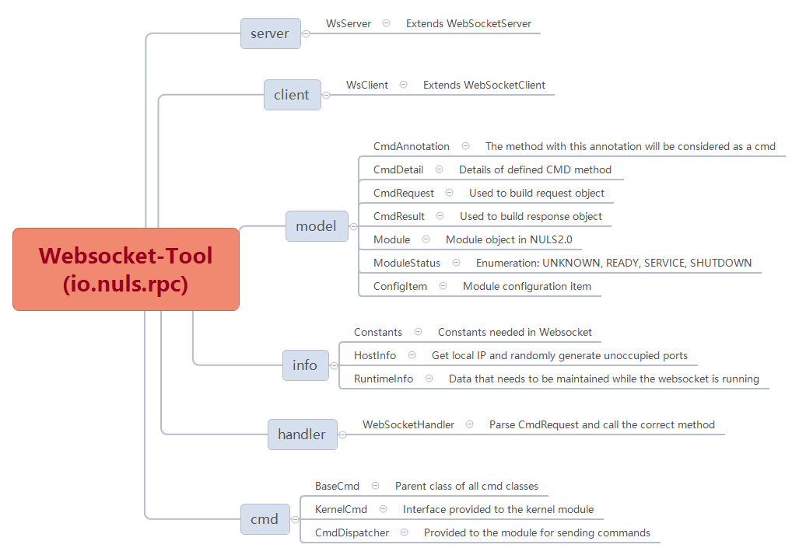

# Websocket-Tool设计文档

[TOC]


## 写在最前的话
```
如果想知道websocket的具体设计，请逐步阅读本文档

如果只想知道如何使用，请跳转到章节《7.1 如何使用》
```


## 一、总体描述 

### 1.1 概述

#### 1.1.1 为什么要有《Websocket-Tool》

[^说明]: 介绍的存在的原因

* NULS 2.0根据功能划分模块，所有模块隔离，可以独立运行。
* 模块间通过《Websocket-Tool》调用接口
* 模块只要实现了规定接口，可以用任何语言实现
* 模块可以分布式部署
* 《Websocket-Tool》会打包成jar包，供各模块引用


#### 1.1.2 《Websocket-Tool》要做什么

[^说明]: 要做些什么事情，达到什么目的，目标是让非技术人员了解要做什么事情

所有模块间的接口调用都通过《Websocket-Tool》进行

- 启动Websocket Server
- 注册当前模块的所有cmd命令
- 把当前模块信息汇报给kernel
- 接收从kernel推送的所有模块信息
- 启动Websocket Client
- 维护调用过程产生的数据
- 封装所有数据中间处理过程，各模块只需要关心
  - 输入
  - 输出
- 各模块通过尽可能简单的方式调用cmd命令


#### 1.1.3 《Websocket-Tool》在系统中的定位

[^说明]: 在系统中的定位，是什么角色，依赖哪些做哪些事情，可以被依赖用于做哪些事情

《Websocket-Tool》是底层框架，任何模块都会依赖

《Websocket-Tool》维护各模块基础信息，但是不涉及具体业务


## 二、功能设计

### 2.1 架构图

[^说明]: 说明的功能设计，可以有层级关系，可以通过图形的形式展示，并用文字进行说明。




## 三、接口设计

### 3.1 外部接口

#### 3.1.1 shutdown

- 接口说明  
  kernel调用该接口关闭模块（等待当前业务全部处理完成）

- 请求示例  
  ```json
  {
      "id":1,
      "cmd":"shutdown",
      "minVersion":1,
      "params":[]
  }
  ```

- 请求参数说明  
  N/A

- 返回示例  
  ```json
  {
      "id":"1",
      "version": 1.2,
      "code":1,
      "msg" :"xxxxxxxxxxxxxxxxxx",
      "result":{}
  }
  ```

- 返回字段说明  
  无


#### 3.1.2 terminate

- 接口说明  
  kernel调用该接口关闭模块（立即终止） 

- 请求示例  

  ```json
  {
      "id":1,
      "cmd":"terminate",
      "minVersion":1,
      "params":[]
  }
  ```

- 请求参数说明  
  无

- 返回示例  

  ```json
  {
      "id":1,
      "version": 1.2,
      "code":1,
      "msg" :"xxxxxxxxxxxxxxxxxx",
      "result":{}
  }
  ```

- 返回字段说明  
  无


#### 3.1.3 confGet

- 接口说明  
  kernel获取模块配置项

- 请求示例

  ```json
  {
      "id":1,
      "cmd":"confGet",
      "minVersion":1,
      "params":[]
  }
  ```

- 请求参数说明  
  无

- 返回示例  

  ```json
  {
      "id":1,
      "version": 1.2,
      "code":1,
      "msg" :"xxxxxxxxxxxxxxxxxx",
      "result":{}
  }
  ```

- 返回字段说明  
  无


#### 3.1.4 confSet

- 接口说明  
  kernel设置模块配置项

- 请求示例

  ```json
  {
      "id":1,
      "cmd":"confSet",
      "minVersion":1,
      "params":[
          {
          "key1":"value1",
          "key2":"value2"
          }
      ]
  }
  ```

- 请求参数说明  
  无

- 返回示例  

  ```json
  {
      "id":1,
      "version": 1.2,
      "code":1,
      "msg" :"xxxxxxxxxxxxxxxxxx",
      "result":{}
  }
  ```

- 返回字段说明  
  无


#### 3.1.5 confReset

- 接口说明  
  kernel恢复模块配置为初始值

- 请求示例

  ```json
  {
      "id":1,
      "cmd":"confReset",
      "minVersion":1,
      "params":[]
  }
  ```

- 请求参数说明  
  无

- 返回示例  

  ```json
  {
      "id":1,
      "version": 1.2,
      "code":1,
      "msg" :"xxxxxxxxxxxxxxxxxx",
      "result":{}
  }
  ```

- 返回字段说明  
  无


### 3.2 内部接口

#### 3.2.1 push

- 接口说明  
  模块初始化之后推送本地接口给kernel


- 请求示例

  ```json
  {
      "id":1,
      "cmd":"version",
      "minVersion":1,
      "params":[
          {
              "name":"m1",
              "status":"READY",
              "available":false,
              "addr":"192.168.1.65",
              "port":18800,
              "cmdDetailList":[      
                  {
                      "cmd":"conf_get",
                      "version":1
                  },                
                  {
                      "cmd":"conf_set",
                      "version":1
                  },
                  {
                      "cmd":"conf_reset",
                      "version":1
                  },
                  {
                      "cmd":"terminate",
                      "version":1
                  },                
                  {
                      "cmd":"shutdown",
                      "version":1
                  },                            
                  ......
              ],
              "dependsModule":[
                  "m2",
                  "m3"
              ]
          }
      ]
  }
  ```


- 请求参数说明

  | index | parameter           | required | type | description  |
  | ----- | :------------------ | :------- | :--- | ------------ |
  | 0     | modules_information | true     | map  | 所有模块信息 |


  modules_information

| parameter | required | type              | description          |
| --------- | -------- | ----------------- | -------------------- |
| service   | true     | string[]          | 本模块需要依赖的模块 |
| available | true     | boolean           | 本模块是否可提供服务 |
| modules   | true     | map<name, module> | 所有模块的信息       |


  module

| parameter     | required | type     | description        |
| ------------- | -------- | -------- | ------------------ |
| name          | true     | string   | 模块名称           |
| status        | true     | string   | 模块状态           |
| available     | true     | boolean  | 模块是否可提供服务 |
| addr          | true     | string   | 连接的ip地址/域名  |
| port          | true     | int      | 连接的端口         |
| cmdDetailList | true     | list     | 对外提供的命令列表 |
| dependsModule | true     | string[] | 所依赖的模块       |


- 返回示例  

  ```json
  {
      "id":1,
      "version": 1.2,
      "code":1,
      "msg" :"xxxxxxxxxxxxxxxxxx",
      "result":{}
  }
  ```

- 返回字段说明  
  无


## 四、事件说明

[^说明]: 业务流程中尽量避免使用事件的方式通信


## 五、协议


## 六、配置


## 七、Java特有的设计

[^说明]: 核心对象类定义,存储数据结构，......

### 7.1 如何使用  
Websocket-Tool会做成JAR包供各模块引用  


#### 7.1.1 测试专用：模拟kernel

非常重要！

各模块接口是在kernel中进行维护，但是kernel由社区成员开发，因此这一部分是内部测试的模拟代码，可以直接复制使用，无需额外操作。

测试之前，先启动此模拟kernel。

```java
@Test
public void kernel() throws Exception {
    int port = 8887;
    WsServer s = new WsServer(port);
    // 注意，下面这句话不要改，模拟实现在"io.nuls.rpc.cmd.kernel"中
    s.init("kernel", null, "io.nuls.rpc.cmd.kernel");
    
    s.startAndSyncKernel("ws://127.0.0.1:8887");

    Thread.sleep(Integer.MAX_VALUE);
}
```


#### 7.1.2 自定义cmd

```java
/*
 * 该类所在的包需要通过7.1.3中的方法进行扫描
 */
public class MyCmd extends BaseCmd {

    /*
     * CmdAnnotation注解包含
     * 1. 调用的命令
     * 2. 调用的命令的版本
     * 3. 调用的命令是否兼容前一个版本
     *
     * 参数：List，即使该接口不需要参数，也要这样定义
     *
     * 返回的结果包含：
     * 1. 内置编码
     * 2. 真正调用的版本号
     * 3. 返回的文本
     * 4. 返回的对象，由接口自己约定
     */
    @CmdAnnotation(cmd = "cm_exColdField", version = 1.0, preCompatible = true)
    public CmdResponse methodName(List params) {       
        // 成功
        return success(version_code, "hello nuls", "Object if necessary");
        
        // 失败
        return failed(ErrorCode.init("-100"), version_code, "Object if necessary");
    }
}
```


#### 7.1.3 启动Server

```java
/*
* 初始化websocket服务器，供其他模块调用本模块接口
* 端口随机，会自动分配未占用端口
*/
WsServer s = new WsServer(HostInfo.randomPort());

/*
* 初始化，参数说明：
* 1. 本模块的code
* 2. 依赖的模块的code，类型为String[]
* 3. 本模块提供的对外接口所在的包路径
*/
s.init("m1", new String[]{"m2", "m3"}, "io.nuls.rpc.cmd");

/*
* 如果你的接口不在一个包里面，可以通过下面这句话单独注册
*/
// RuntimeInfo.scanPackage("full_package_path");

/*
* 启动服务
*/
s.startAndSyncKernel("kernel url[ws://127.0.0.1:8887]");
```


#### 7.1.4 为kernel提供的接口

可忽略！

这是供kernel调用的接口，可以最后kernel完全确认之后再实现。非必需。

```java
/*
 * 1. 该类所在的包需要通过7.1.3中的方法进行扫描
 * 2. 一个模块只需要有一个类实现该接口
 * 3. 注解中的cmd用预定义的常量，不要擅自改动
 */
public class CmKernelCmd implements KernelCmd {
	@Override
    @CmdAnnotation(cmd = Constants.SHUTDOWN, version = 1.0, preCompatible = true)
    public CmdResponse shutdown(List params) {
        return success(1.0);
    }
    
    ......
}
```


#### 7.1.5 调用cmd

```java
/*
* 1. 汇报本地接口给kernel
* 2. 从kernel获取所有接口列表
* 注意：实际使用中不需要这句话，因为在模块启动的时候RPC已经封装了
* 但是在单元测试的时候只有一个方法，没有模块，因此需要显示调用
*/
CmdDispatcher.syncKernel("ws://127.0.0.1:8887");

/*
* 参数说明：
* 1. 调用的命令
* 2. 调用的命令的最低版本号
* 3. 调用的命令所需要的参数
* 返回值为json格式
*/
String response = CmdDispatcher.call("cm_exColdField", new Object[]{"params"}, 1.0);
```


## 八、补充内容

[^说明]: 上面未涉及的必须的内容

