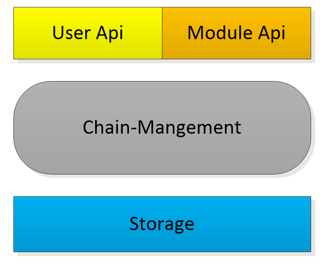
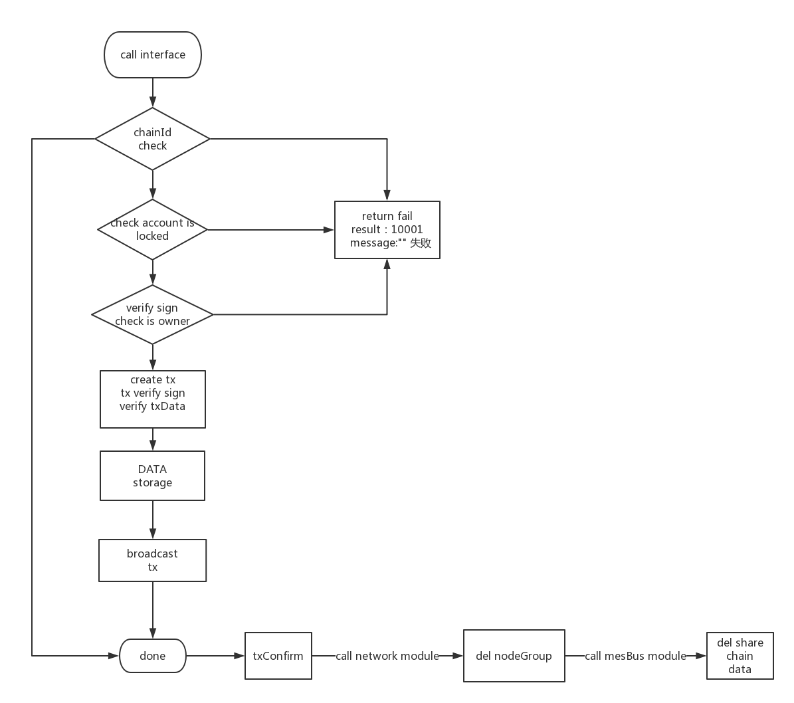

​	

## 链管理接口文档

### 一、模块架构

1.1 模块概述:

 该模块用于管理所有登记在卫星链中的区块链信息，包含区块链的魔法参数，基本信息，资产信息，运行状态。



1.2模块上下文:


1、提供用户api，进行链注册、链注销，链上资产登记，链上资产注销的操作

2、链注册或注销会影响网络模块的监听参数、处理NodeGroup相关操作

3、链信息变化后会将数据同步到内核模块的数据共享池中


### 二、功能设计:


1、区块链信息登记及存储

2、区块链注销、断开与卫星链的连接

3、平行链信息查询：链信息、资产信息

#### 2.2 核心流程

- 链登记


 chainId check：校验是否重复  校验是否合法（怎么校验）？

- 链注销

  


### 三、接口设计:

#### 3.1 模块接口:

##### 获取一条链详细信息:

Request Body

```
{
  "jsonrpc": "1.0"，
  "method": "getChain",
  "params":["chainId": 1234 ]
  
}
```

- 请求参数

| 参数    | 必选 | 类型   | 说明               |
| :------ | :--- | :----- | ------------------ |
| chainId | ture | int    | 链唯一id           |
| jsonrpc | true | string | 定义 JSON-RPC 版本 |
| method  | true | stirng | 调用的方法         |

Response Body

- success

```
{   
   "jsonrpc": "1.0"
    result：10000  //操作码
    message:""   //成功时的信息
	data:{
        "chainHash":"0xe670ec64341771606e55d6b4ca35a1a6b75ee3d5145a99d05921026d1527331",
        "chainId":1234,
        "chainName": "name",
        "assetType": 1,
        "Assets":  [{"assetId":1,symbol":"xxx","name":"xxx","initTotal":1000000,"minUnit":xx,"flag":1}],
        "magicNumber": 1025753999,
        "seeds":  {"ip":"xxx.xxx.xxx.xxx","port":8001},{"ip":"xxx.xxx.xxx.xxx","port":8001},
        "inflowAssets": 1
    }
}
```


- fail

```
{
 "jsonrpc": "1.0"，
  result：10001 ,//操作码
  message:""   //失败时的信息   
}
```


- 响应参数	

| 参数          | 必选 | 类型        | 说明                               |
| :------------ | :--- | :---------- | ---------------------------------- |
| jsonrpc       | true | string      | 定义 JSON-RPC 版本                 |
| chainHash     | true | string      | 链hash                             |
| chainId       | ture | uint16      | 链id                               |
| chainName     | true | string      | 链名称                             |
| Assets        | true | List<Asset> | 资产列表及序号(Asset资产包含字段） |
| assetId       | true | uint32      | 资产id                             |
| symbol        | true | string      | 标识                               |
| name          | true | string      | 名称                               |
| initTotal     | true | BigInteger  | 发行总量                           |
| minUnit       | true | byte        | 最小单位://byte,代表小数点后多少位 |
| flag          | true | byte        | 资产是否可用  //0.不可用  1.可用   |
| magicNumber   | true | uint32      | 分配的网络魔法参数                 |
| seeds         | true | List<seed>  | 分配的种子节点列表                 |
| ip            | true | string      | ip                                 |
| port          | true | uint16      | port                               |
| isInflowAsset | true | byte        | 是否支持资产流入1支持，0不支持     |

#### 3.2 功能接口：

##### 链注册：


Request Body

```
{  
   "jsonrpc": "1.0",
   "method": "chainRegister",
   "params":[ 
       "chainId":1234,    //  注册时系统自动传  不需要调用者传此参数 CHAIN_ID= 8964;
       "chainName": "name",
       "Assets":  	[{"assetId":1,symbol":"xxx","name":"xxx","initTotal":1000000,"minUnit":xx,"flag":1}],
       "assetType": 1,// nuls or Other
       "minAvailableNodeNum":1,
       "singleNodeConMinNodeNum":1,
       "txConfirmBlockNum":xxx , //交易区块确认数
       "isInflowAsset": 1
   ]
     
}	
```

 

- ##### 请求参数

  

| 参数                    | 必选 | 类型        | 说明                               |
| :---------------------- | :--- | :---------- | ---------------------------------- |
| jsonrpc                 | true | string      | 定义 JSON-RPC 版本                 |
| method                  | true | string      | 调用方法                           |
| chainId                 | ture | uint16      | 链唯一id                           |
| chainName               | true | varString   | 链名称                             |
| Assets                  | true | List<Asset> | 资产列表                           |
| assetId                 | true | uint32      | 资产id   是否需要加？              |
| symbol                  | true | varString   | 资产标识                           |
| name                    | true | varString   | 资产名字                           |
| initTotal               | true | BigInteger  | 发行总量                           |
| minUnit                 | true | byte        | 最小单位://byte,代表小数点后多少位 |
| flag                    | true | byte        | 资产是否可用  //0.不可用  1.可用   |
| assetType               | true | byte        | 资产类型  1、NULS地址结构，2、其他 |
| minAvailableNodeNum     | true | uint16      | 最小可用节点数量                   |
| singleNodeConMinNodeNum | true | uint16      | 单节点连接最小数量                 |
| txConfirmBlockNum       | true | Long        | 交易确认块数                       |
| isInflowAsset           | true | byte        | 是否支持资产流入   1支持，0不支持  |

Response Body

- success

```
{
    result：10000  //操作码
    message:""   //成功时的信息
}
```

-   fail

```
{
   result：10001 ,//操作码
   message:""   //失败时的信息   
}
```


 deposit//抵押金（系统自动），可以考虑是否和资产数量挂钩
 fee//手续费（系统自动）
 signature//签名（ 记录链的创建者地 系统自动    "registerAddress": "xxx" 通过解析公钥来获取地址）

存储：用链存储目录（db）这个交易hash为key value 为存储友链的对象    如果要查询就传（publickey 或者 address查找）

验证： 启动的时候检查chainId 是否重复   chainId 是否合法？

##### 查询链列表：

Request Body

```
{
    "jsonrpc": "1.0",
    "method": "getChains",
    "params":[ 
   		 "page":{"pageNumber":1,"pageSize":20}
    ]
}
```

请求参数:

| 参数       | 必选 | 类型   | 说明               |
| :--------- | :--- | :----- | ------------------ |
| jsonrpc    | true | string | 定义 JSON-RPC 版本 |
| pageNumber | true | int    | 当前页数           |
| pageSize   | ture | int    | 1页显示多少条      |

page对象：

pageNumber int  //当前页数

pageSize int //1页显示多少条

total long    //总共多少条

pages int  // 总共多少页


Response Body

- success

```
{
   "jsonrpc": "1.0",
   "result"：10000  //操作码
   "message":""   //成功时的信息
   "data":{
		"list":[
              {
                "chainHash":"0xe670ec64341771606e55d6b4ca35a1a6b75ee3d5145a99d05921026d1527331",
       			 "chainId":1234,
       			 "chainName": "name",
       			 "assetType": 1,
       			 "assets": [{"assetId":1,symbol":"xxx","name":"xxx","initTotal":1000000,"minUnit":xx,"flag":1}],
       			 "magicNumber": 1025753999,
      			 "seeds":  [{"ip":"xxx.xxx.xxx.xxx","port":8001},						   								{"ip":"xxx.xxx.xxx.xxx","port":8001}],
      			  "inflowAssets": true
             },
             {
                "chainHash":"0xe670ec64341771606e55d6b4ca35a1a6b75ee3d5145a99d05921026d1527331",
       			 "chainId":5678,
       			 "chainName": "name",
       			 "assetType": 1,
       			 [{"assetId":2,symbol":"xxx","name":"xxx","initTotal":1000000,"minUnit":xx,"flag":1}],
       			 "magicNumber": 1025753999,
      			 "seeds":  [{"ip":"xxx.xxx.xxx.xxx","port":8001},						   								{"ip":"xxx.xxx.xxx.xxx","port":8001}],
      			  "inflowAssets": true
             }
		]
        
    }
}
```


- 响应参数	

| 参数          | 必选 | 类型        | 说明                               |
| :------------ | :--- | :---------- | ---------------------------------- |
| jsonrpc       | true | string      | 定义 JSON-RPC 版本                 |
| chainHash     | true | string      | 链hash                             |
| chainId       | ture | uint16      | 链id                               |
| chainName     | true | string      | 链名称                             |
| Assets        | true | List<Asset> | 资产列表及序号(Asset资产包含字段） |
| assetId       | true | uint32      | 资产id                             |
| symbol        | true | string      | 标识                               |
| name          | true | string      | 名称                               |
| initTotal     | true | BigInteger  | 发行总量                           |
| minUnit       | true | byte        | 最小单位://byte,代表小数点后多少位 |
| flag          | true | byte        | 资产是否可用  //0.不可用  1.可用   |
| magicNumber   | true | uint32      | 分配的网络魔法参数                 |
| seeds         | true | List<seed>  | 分配的种子节点列表                 |
| ip            | true | string      | ip                                 |
| port          | true | uint16      | port                               |
| isInflowAsset | true | byte        | 是否支持资产流入1支持，0不支持     |


-   fail

```
{
  result：10001 ,//操作码
  message:""   //失败时的信息   
}
```


##### 链注销：

Request Body

```
{  
   "jsonrpc": "1.0",
    "params":[ 
   		"chainId":1234
   ]
   "method":"chainOff"
}	
```

 fee//手续费（系统自动）
signature//签名（需要验证链的创建者的签名  "registerAddress": "xxx" 通过解析公钥来获取地址）   

请求参数:

| 参数    | 必选 | 类型   | 说明               |
| :------ | :--- | :----- | ------------------ |
| jsonrpc | true | string | 定义 JSON-RPC 版本 |
| chainId | true | int    | 链id               |
| method  | true | string | 执行的方法         |

**注意：要本人才可以注销**


Response Body

- success

```
{
    result：10000  //操作码
    message:""   //成功时的信息
}
```

- fail


```
{
  result：10001 ,//操作码
  message:""   //失败时的信息   
}
```


##### 追加资产登记：

##### Request Body

```
{  
   "jsonrpc": "1.0",
   "method":"addAssets"    
    "params":[ 
       "chainId":1234,
       "assets": [{"assetId":1,symbol":"xxx","name":"xxx","initTotal":1000000,"minUnit":xx,"flag":1}],
       "assetType": 1,// nuls or Other
   ]
  
}	

```


- 请求参数


| 参数      | 必选 | 类型        | 说明                               |
| :-------- | :--- | :---------- | ---------------------------------- |
| jsonrpc   | true | string      | 定义 JSON-RPC 版本                 |
| chainId   | ture | uint16      | 链id                               |
| Assets    | true | List<Asset> | 资产列表及序号(Asset资产包含字段） |
| assetId   | true | uint32      | 资产id                             |
| symbol    | true | string      | 标识                               |
| name      | true | string      | 名称                               |
| initTotal | true | BigInteger  | 发行总量                           |
| minUnit   | true | byte        | 最小单位://byte,代表小数点后多少位 |
| flag      | true | byte        | 资产是否可用  //0.不可用  1.可用   |
| assetType | true | byte        | 资产类型                           |
| method    | true | string      | 调用方法                           |

deposit//抵押金（系统自动），可以考虑是否和资产数量挂钩

fee//手续费（系统自动）

signature//签名（ 记录链的创建者地址？ 系统自动）

**注意：创建本人才能 追加资产  ，并判断是否支持资产流入 isInflowAsset**

Response Body

- success

```
{
    result：10000  //操作码
    message:""   //成功时的信息
    data:{
  	  result:true
	}	
}
```

- fail


```
{
   result：10001 ,//操作码
   message:""   //失败时的信息   
}
```


##### 注销一条链中的一种资产：

Request Body

```
{  
   "jsonrpc": "1.0", 
   "method":"removeAssets"
   "params":[ 
       "chainId":1234,
       "symbol": "xx"
   ]
  
 
}	
```

- 请求参数

  

| 参数    | 必选 | 类型      | 说明               |
| :------ | :--- | :-------- | ------------------ |
| jsonrpc | true | string    | 定义 JSON-RPC 版本 |
| chainId | ture | uint16    | 链唯一id           |
| symbol  | true | varString | 资产标识 唯一      |
| method  | true | string    | 调用方法           |

deposit//抵押金（系统自动），可以考虑是否和资产数量挂钩

fee//手续费（系统自动）

signature//签名（ 记录链的创建者地址？ 系统自动）

**注意：创建本人才能注销资产  ，并判断是否是最后一种资产 如果是则不能注销  只能链注销**

Response Body

- success

- ```
  {
      result：10000  //操作码
      message:""   //成功时的信息
      data:{
    	  result:true
  	}	
  }
  ```

  fail

  ```
  {
     result：10001 ,//操作码
     message:""   //失败时的信息   
  }
  ```

##### 

### 四、事件说明

##### 4.1 发布的事件


链登记成功


```
event_topic:"chain_registered"
链hash
链id
链名称
资产列表及序号
分配的网络魔法参数   //自己维护 还是找网络模块？
种子节点列表        //网络模块拿
共识种子列表        //
```

链注销成功


```
event_topic:"chain_off"
链hash
链id
链名称
资产列表及序号
分配的网络魔法参数
种子节点列表
共识种子列表
```

链新增资产

```
event_topic:"add_assets"
链id
资产标识
资产名称
初始总额
最小单位
```

链移除资产

```
 event_topic:"remove_assets"
  链id
  资产标识
```

##### 4.2 订阅的事件

​ 无

### 五、协议

##### chain register

##### 协议


与通用交易相比，只有类型和txData有区别，具体区别如下

```
  type: n // 交易的类型   Uint16

  txData:{

      chainId:  //uint16 ,链id   uint16

      链名称     //varString     不超过30个字节


      资产信息列表：资产id 标识、名称、初始总额、最小单位 资产是否可用
	  
	  资产id： uint32
	  
      标识：//varString，用于查询资产总额，区分不同资产     不超过30个字节

      名称：//varString，用于显示      不超过30个字节

      总额：//varint         4个字节

      最小单位://byte,代表小数点后多少位，     1个字节
      
      是否可用： 判断资产是否可以流通     1个字节
	

      地址类型：1，//byte : 1、NULS地址结构，2、其他    1个字节

      最小可用节点数量 //uint16,    2个字节

      单节点连接最小数量 //uint16,   2个字节

      交易确认块数 //uint16,     2个字节

      是否支持资产流入 //byte, 1支持，0不支持    1个字节

  }

```

说明：

type序列化2个字节

 txData:{

​	chhainId  2个字节

​	chainName   =》 前面 1个字节记录长度，比如length=9 表示读后面的 9个字节组成 chainName

​	Assets 资产列表需要序列化资产 对象 Asset   循环调用parse（byte[] b） 方法直到完成 

​			[

​				assetId   uint32

​				symbol     前面 1个字节记录长度，比如length=9 表示读后面的 9个字节组成 symbol

​				name         前面 1个字节记录长度，比如length=9 表示读后面的 9个字节组成 name         

​				initTotal      占用 32个字节

​				minUnit       占用1个字节

​				flag              占用1个字节

​			] 

​	assetType   占用1个字节

​	minAvailableNodeNum   占用2个字节

​	singleNodeConMinNodeNum   占用2个字节

​	txConfirmBlockNum    占用8个字节

​	isInflowAsset 占用1个字节

}


| 参数                    | 必选  | 类型        | 说明                                                      |
| :---------------------- | :---- | :---------- | --------------------------------------------------------- |
| type                    | true  | uint16      | tx类型                                                    |
| chainId                 | ture  | uint16      | 链唯一id                                                  |
| chainName               | true  | varString   | 链名称           不超过30个字节                           |
| Assets                  | true  | List<Asset> | 资产列表                                                  |
| assetId                 | true  | uint32      | 资产id             4个字节                                |
| symbol                  | true  | varString   | 资产标识         不超过30个字节                           |
| name                    | true  | varString   | 资产名字        不超过30个字节                            |
| initTotal               | true  | BigInteger  | 发行总量          32个字节                                |
| minUnit                 | true  | byte        | 最小单位://byte,代表小数点后多少位，比如1nuls=100000000na |
| flag                    | false | byte        | 资产是否可用  //0.不可用  1.可用                          |
| assetType               | true  | byte        | 资产类型  1、NULS地址结构，2、其他                        |
| minAvailableNodeNum     | true  | uint16      | 最小可用节点数量                                          |
| singleNodeConMinNodeNum | true  | uint16      | 单节点连接最小数量                                        |
| txConfirmBlockNum       | true  | Long        | 交易确认块数                                              |
| isInflowAsset           | true  | byte        | 是否支持资产流入   1支持，0不支持                         |
| deposit                 | false | Long        | 抵押金 （系统做）  比如nuls 抵押20000                     |
| fee                     | false | Na          | 手续费（系统做）                                          |
| signature               | false | byte[]      | 签名（系统做）                                            |

##### 验证器


```
  chainId合法性 是否重复  chainId是由调用者生成表示有“意义”的一串数字

  各字段不为空、值在正确范围内

  抵押金验证器

  其他基本验证器
```


##### 处理器


```
存储链信息

存储资产信息

在n（运行参数）块确认之后开始监听该链的魔法参数
```


##### chain off


协议


与通用交易相比，只有类型和txData有区别，具体区别如下

  

```
  type: n // 交易的类型 序列化2个字节
  txData:{
      chainId:  //uint16 ,链id  序列化2个字节
  }
```


##### 验证器


```
  chainId合法性
  该链是否可以被该地址操作，权限验证
```


##### 处理器


```
在n（运行参数）块之后停止该链所有跨链交易、解锁抵押金、从区块链中逻辑删除该链数据
```


#### assets add

##### 协议


与通用交易相比，只有类型和txData有区别，具体区别如下

  

```
 type: n // 交易的类型    序列化2个字节

  txData:{

    chainId:  //uint16 ,链id    序列化2个字节

    标识：//varString，用于查询资产总额，区分不同资产    最多30个字节

    名称：//varString，用于显示   最大30个字节  

    总额：//     占用 32个字节

    最小单位://byte,代表小数点后多少位

  }
```

说明：

​	 type: n // 交易的类型    序列化2个字节

​	 txData:{

​	  	chainId:  //uint16 ,链id    序列化2个字节

​		symbol：varString 	 前面 1个字节记录长度，比如length=9 表示读后面的 9个字节组成 symbol

​		name         前面 1个字节记录长度，比如length=9 表示读后面的 9个字节组成 name         

​		initTotal      占用 32个字节

​		minUnit       占用1个字节

​	}

##### 验证器


```
  chainId合法性

  各字段不为空、值在正确范围内

  抵押金验证器

  其他基本验证器

```


##### 处理器


```
存储资产信息
```


#### assets remove

##### 协议


与通用交易相比，只有类型和txData有区别，具体区别如下

 

```
  type: n //交易的类型
  txData:{
      chainId:  //uint16 ,链id
      assetsId：   // ,资产Id
  }

```

说明

type: n // 交易的类型    序列化2个字节

txData:{

​	  	chainId:  //uint16 ,链id    序列化2个字节	

​		assetsId：//	uint32       序列化4个字节	

}

##### 验证器


```
  资产合法性  
  资产是否可以被该地址操作，权限验证
  是否是该链最后一种资产
```


##### 处理器


```
若该资产没有转移到发行链之外，则立刻停止该资产交易、解锁抵押金、从区块链中逻辑删除该资产数据
否则，在n（运行参数）块之后停止该资产交易、解锁抵押金、从区块链中逻辑删除该资产数据
```


### 六 模块依赖关系

- 
  网络模块：启动网络监听

- 事件总线：发送事件
- 内核模块：上报模块信息，共享链信息


### 七、模块配置项

- server.ip:0.0.0.0   //本机ip，若不配置则默认使用0.0.0.0

- server.port:8080    //若未配置，则随机选择端口


### 八、Java特有的设计

略


### 九、补充内容

1.chainId  校验重复  和    合法性？=>只验证重复  

2.抵押金  可以考虑是否和资产数量挂钩  ？
3.启动的时候检查chainId 是否重复
4.注销链信息 用伪删除
5.(若该资产没有转移到发行链之外，则立刻停止该资产交易、解锁抵押金、从区块链中逻辑删除该资产数据否则，在n（运行参数）块之后停止该资产交易、解锁抵押金、从区块链中逻辑删除该资产数据)?

6.交易确认块数 //uint16,  ==》是交易的确认数吗？还是交易确认时块的高度

7.网络模块：启动网络监听（获取种子节点）

8.事件总线：发送事件

9.内核模块：上报模块信息 ？，共享链信息  

10.资产id 和 symbol 标识是否重复？