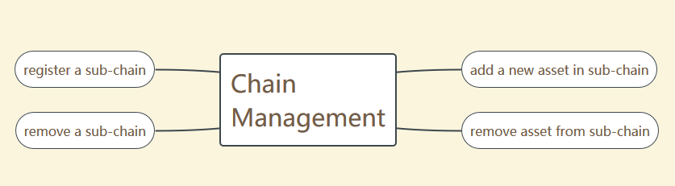
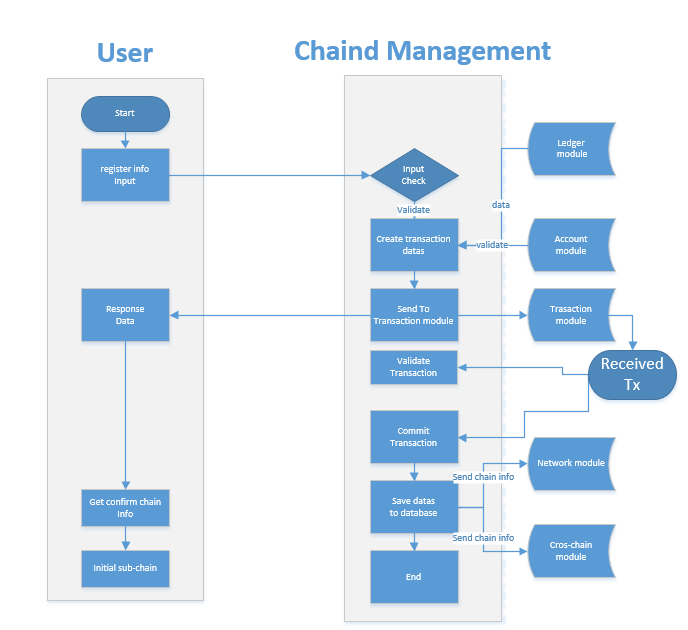
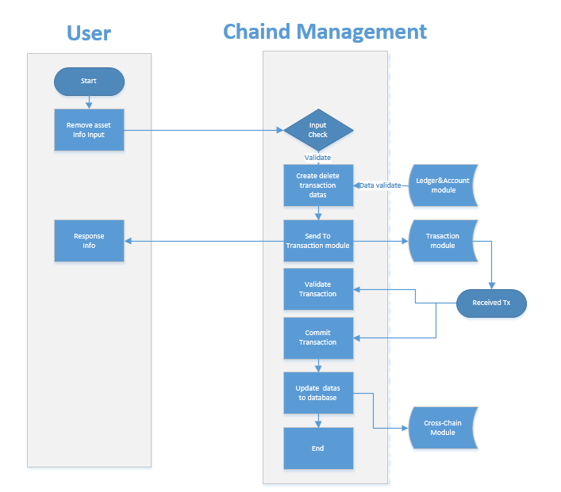

# 链管理模块设计文档

[TOC]

## 一、总体描述

### 1.1 模块概述

#### 1.1.1 为什么要有《链管理》模块

[^说明]: 介绍模块的存在的原因

在NULS 1.0中，只有一条链（NULS主网），因此不需要链管理模块。

在NULS 2.0中，NULS主网上可以注册其他平行链信息，包括:        

- NULS生态圈中的链：与NULS主网使用同一套代码衍生出来。
- 其他链：比特币、以太坊等

《链管理》模块用来管理所有加入NULS主网的平行链的信息


名词解释：

- NULS主网：架构不同于NULS 1.0，是独立运行的另一条链，也称之为NULS 2.0。
  《链管理》是NULS主网的其中一个模块
- 平行链：在NULS主网上注册的其他链


假设1：平行链A，其拥有资产A

假设2：平行链B，其拥有资产B

- 跨链交易：
  - 平行链A把资产A转到平行链B
  - 平行链B内部转移资产A
  - 平行链B把资产A转回到平行链A
  - 平行链B把资产A转到其他平行链（C,D等）
- 非跨链交易：
  - 平行链A内部转移资产A
  - 平行链B内部转移资产B

备注：不论链内资产，还是链外资产，只要资产跨链进行交易，就需要主网进行确认。


#### 1.1.2 《链管理》要做什么

[^说明]: 模块要做些什么事情，达到什么目的，目标是让非技术人员了解要做什么事情

《链管理》模块用来管理加入NULS主网的链的基本信息，包括：

* 注册一条新的平行链
* 销毁已经存在的平行链
* 查询平行链信息
* 平行链增加资产类型
* 平行链销毁资产类型
* 跨链资产校验


#### 1.1.3 《链管理》在系统中的定位

[^说明]: 模块在系统中的定位，是什么角色，依赖哪些模块做哪些事情，可以被依赖用于做哪些事情

《链管理》强依赖的模块：

- 核心模块
- 网络模块
- 交易管理模块
- 账本模块

《链管理》弱依赖的模块：

- 事件总线模块


### 1.2 模块内部架构图

[^说明]: 图形说明模块的层次结构、组件关系，并通过文字进行说明


## 二、功能设计

### 2.1 功能架构图

[^说明]: 说明模块的功能设计，可以有层级关系，可以通过图形的形式展示，并用文字进行说明。



### 2.2 模块服务

[^说明]: 这里说明该模块对外提供哪些服务，每个服务的功能说明、流程描述、接口定义实现中依赖的外部服务

#### 2.2.1 注册一条新的链

* 功能说明：

  NULS主网会提供一个入口（网页），可以通过这个入口注册新的平行链到NULS主网。

  注册一条平行链必须含一个注册资产。

* 流程描述


  

步骤描述：

   1.用户通过终端注册登记链信息以及随链初始化的资产信息。

   2.链管理模块进行链交易的封装发送给交易模块。期间需要通过账本模块获取账户余额及交易nonce值.

​      并通过账户模块校验账户正确性。

​      发送交易后返回成功或失败信息给用户，成功时包含主网跨链种子节点与主网种子验证人列表信息。

   3.交易模块会在交易处理过程中进行数据校验的回调。

   4.链管理模块通过 交易模块回调 “提交链注册交易”的接口 来进行注册数据提交。

   5.链管理模块存储数据并将注册信息下发给网络模块与跨链协议模块。

   6.注册链需要1000NULS，其中20%直接销毁，80%用于抵押，删除资产时退回。

- 接口定义

  - 接口说明

  ​        向链管理模块注册友链信息。

  ​        method : cm_chainReg

  - 请求示例

  ```
  {
          "chainId": 152,
          "assetId": 2,
          "chainName": "nuls chain",
          "addressType": "1",
          "magicNumber":454546,
          "supportInflowAsset":"1",
          "minAvailableNodeNum":5,
          "singleNodeMinConnectionNum":5,
          "txConfirmedBlockNum":30,
          "address":"NsdxSexqXF4eVXkcGLPpZCPKo92A8xpp",
          "assetId":85,
          "symbol":"NULS",
          "assetName":"纳斯",
          "initNumber":"1000000000",
          "decimalPlaces":8,
          "password":"xxxxxxxxxxxxx"
          
  }
  ```
  - 请求参数说明

  | parameter           | required | type   | description            |
  | :------------------ | :------- | :----- | ---------------------- |
  | chainId             | true     | int    | 链标识                 |
  | assetId             | true     | int    | 资产id                 |
  | chainName           | true     | string | 链名称                 |
  | magicNumber         | true     | string | 网络魔法参数           |
  | minAvailableNodeNum | false    | int    | 最小可用节点数量       |
  | addressPrefix       | true     | String | 地址前缀               |
  | txConfirmBlockNum   | false    | int    | 交易确认块数           |
  | maxSignatureCount   | true     | int    | 最大签名数             |
  | signatureBFTRatio   | true     | int    | 拜占庭比例 [67-100]    |
  | verifierList        | true     | String | 注册链的初始验证人列表 |
  | symbol              | true     | string | 资产符号               |
  | assetName           | true     | string | 资产名称               |
  | initNumber          | true     | string | 资产初始值             |
  | decimalPlaces       | true     | int    | 最小资产可分割位数     |
  | address             | true     | string | 创建链的主网地址       |
  | password            | true     | string | 私钥对应的密码         |

  - 返回示例

     Failed

     ```
     统一RPC标准格式
     
     ```

     Success

     ```
     统一RPC标准格式
     {
       "mainNetVerifierSeeds" : "tNULSeBaMkrt4z9FYEkkR9D6choPVvQr94oYZp",
       "txHash" : "25b3a57507086d5d895895b41ef744a160f3251f4e5db118b7ca833eb6c9fff3",
       "mainNetCrossConnectSeeds" : "192.168.1.192:8088"
     }
     ```

  - 返回字段说明

  | parameter                | type   | description           |
  | ------------------------ | ------ | --------------------- |
  | mainNetVerifierSeeds     | String | #主网验证人列表       |
  | txHash                   | String | #交 易hash            |
  | mainNetCrossConnectSeeds | String | #主网跨链种子连接节点 |


* 依赖服务

  [^说明]: 文字描述依赖了哪些服务，做什么事情

  - 网络管理模块
  - 交易管理模块，发送交易
  - 账本模块，获取账本信息
  - 账户模块


#### 2.2.2 注销已经存在的平行链

- 功能说明：

  NULS主网会提供一个入口（网页），可以通过这个入口注销已经存在的友链。

- 流程描述

  


1. 链是随资产而创建，所以注销链必须进行资产校验，只有删除最后一条资产，链才会随着一起注销。

 2.判断是否允许注销的条件：

​     资产与链存在。

​    随链只有最后一个资产。

​    链资产有n%资产在自有主链上。 

 3.链管理模块进行链交易的封装发送给交易模块。

​     期间需要通过账本模块获取账户余额及交易nonce值。

 4.交易模块会在交易处理过程中进行数据校验的回调。

 5.链管理模块通过 交易模块回调 “提交链注销交易”的接口 来进行注销数据提交。

 6.链管理模块存储数据并将注册信息下发给网络模块。

 7.删除链随注销的资产，将退回抵押押金的80%。

- 接口定义

  - 接口说明

  ​        向链管理模块注销友链信息（调用的是资产注销接口，因为链随最后资产一起注销）。

  ​        method : cm_assetDisable

  - 请求示例

  ```
  {
          "chainId": 152,
          "assetId": 45,
          "address":"NsdxSexqXF4eVXkcGLPpZCPKo92A8xpp",
          "password":"xxxxxxxxxxxxx"
          
  }
  ```

  - 请求参数说明

  | parameter | required | type   | description          |
  | :-------- | :------- | :----- | -------------------- |
  | chainId   | true     | int    | 链标识               |
  | assetId   | true     | int    | 资产id               |
  | address   | true     | string | 创建链的主网账户地址 |
  | password  | true     | string | 私钥对应的密码       |

  - 返回示例

    Failed

    ```
    统一RPC标准格式
    
    ```

    Success

    ```
    统一RPC标准格式
    {
        "txHash" : "25b3a57507086d5d895895b41ef744a160f3251f4e5db118b7ca833eb6c9fff3"
    }
    ```

  - 返回字段说明

  | parameter | type   | description |
  | --------- | ------ | ----------- |
  | txHash    | String | 交易hash    |

- 依赖服务

  [^说明]: 文字描述依赖了哪些服务，做什么事情

  - 网络管理模块
  - 交易管理模块，发送交易
  - 账本模块，校验账本信息

#### 2.2.3  增加资产信息

- 功能说明：

  NULS主网会提供一个入口（网页），可以通过这个入口选择链及登记注册资产。

- 流程描述


步骤描述：

   1.用户通过终端选择链 及随链录入资产信息：判断资产是否重叠。

   2.链管理模块进行链交易的封装发送给交易模块。

期间需要通过账本模块获取账户余额及交易nonce值。

   3.交易模块会在交易处理过程中进行数据校验的回调。      

   4.链管理模块通过 交易模块回调 “提交资产注册交易”的接口 来进行注册数据提交。

   5.注册资产收1000NULS，其中20%直接销毁，80%用于抵押，删除资产时退回。

- 接口定义

  - 接口说明

  ​        向链管理模块注册资产信息。

  ​        method : cm_assetReg

  - 请求示例

  ```
  {
          "chainId": 152,
          "assetId":85,
          "symbol":"NULS",
          "assetName":"纳斯",
          "initNumber":"1000000000",
          "decimalPlaces":8,
           "address":"NsdxSexqXF4eVXkcGLPpZCPKo92A8xpp",
          "password":"xxxxxxxxxxxxx"
          
  }
  ```

  - 请求参数说明

  | parameter     | required | type   | description        |
  | :------------ | :------- | :----- | ------------------ |
  | chainId       | true     | int    | 链标识             |
  | symbol        | true     | string | 资产符号           |
  | assetName     | true     | string | 资产名称           |
  | initNumber    | true     | string | 资产初始值         |
  | decimalPlaces | true     | int    | 最小资产可分割位数 |
  | address       | true     | string | 创建链的主网地址   |
  | password      | true     | string | 私钥对应的密码     |

  - 返回示例

    Failed

    ```
    统一RPC标准格式
    ```

    Success

    ```
    统一RPC标准格式
    {
        "txHash" : "25b3a57507086d5d895895b41ef744a160f3251f4e5db118b7ca833eb6c9fff3"
    }
    ```

  - 返回字段说明

  | parameter | type   | description |
  | --------- | ------ | ----------- |
  | txHash    | String | 交易hash    |


- 依赖服务

  [^说明]: 文字描述依赖了哪些服务，做什么事情

  - 交易管理模块，发送交易
  - 账本模块，获取账本信息
  - 账户模块校验


#### 2.2.4 平行链资产注销

- 功能说明：

  NULS主网会提供一个入口（网页），可以通过这个入口对指定友链销毁资产。

- 流程描述

  

  1. 连下注册有多个资产时，单资产允许注销，如果只有一个资产，则资产随链一起注销。

     2.判断是否允许注销的条件：

  ​    连下存在多个资产。

  ​    链资产有n%资产在自有主链上。 

   3.链管理模块进行链交易的封装发送给交易模块。

  ​     期间需要通过账本模块获取账户余额及交易nonce值。

   4.交易模块会在交易处理过程中进行数据校验的回调。

   5.链管理模块通过 交易模块回调 “提交链注销交易”的接口 来进行注销数据提交。

   6.注销资产将退回抵押押金的80%。

- 接口定义

  - 接口说明

  ​        向链管理模块注销资产信息。

  ​        method : cm_assetDisable

  - 请求示例

  ```
  {
          "chainId": 152,
          "assetId": 45,
          "address":"NsdxSexqXF4eVXkcGLPpZCPKo92A8xpp",
          "password":"xxxxxxxxxxxxx"
          
  }
  ```

  - 请求参数说明

  | parameter | required | type   | description          |
  | :-------- | :------- | :----- | -------------------- |
  | chainId   | true     | int    | 链标识               |
  | assetId   | true     | int    | 资产id               |
  | address   | true     | string | 创建链的主网账户地址 |
  | password  | true     | string | 私钥对应的密码       |

  - 返回示例

    Failed

    ```
    统一RPC标准格式
    
    ```

    Success

    ```
    统一RPC标准格式
    {
        "txHash" : "25b3a57507086d5d895895b41ef744a160f3251f4e5db118b7ca833eb6c9fff3"
    }
    ```

  - 返回字段说明

  | parameter | type | description |
  | --------- | ---- | ----------- |
  | txHash    |      |             |


  - 依赖服务

    [^说明]: 文字描述依赖了哪些服务，做什么事情

    - 交易管理模块，发送交易
    - 账本模块，校验账本信息

#### 2.2.5 跨链交易的链资产校验

- 功能说明：

  交易模块在产生一笔跨链交易时，调用该接口进行跨链资产的校验。

- 流程描述

  1. 校验链及资产是否在跨链模块正常注册
  2. 校验链上资产金额是否透支。
  3. 校验资产状态是否正常。

- 接口定义

  - 接口说明

  ​       跨链资产流通时，向链管理提交校验

  ​        method : cm_assetCirculateValidator

  - 请求示例

  ```
  {
          "chainId": 12345,   
          "txHex": "FFAABB214324"       
  }
  ```

  - 请求参数说明

  | parameter | required | type   | description |
  | :-------- | :------- | :----- | ----------- |
  | chainId   | true     | int    | 链id        |
  | txHex     | true     | String | 交易HEX值   |

  - 返回示例

    Failed

    ```
    统一RPC标准格式
    
    ```

    Success

    ```
    统一RPC标准格式
    {
        "value":true
    }
    
    ```

  - 返回字段说明

  | parameter | type | description |
  | --------- | ---- | ----------- |
  |           |      |             |


- 依赖服务

  [^说明]: 文字描述依赖了哪些服务，做什么事情

  - 交易管理模块，跨链交易校验调用

#### 2.2.6  跨链交易的链资产提交

- 功能说明：

  通过验证的交易进行区块提交时，交易模块将跨跨链交易进行组装提交给跨链管理模块。

  用于变更链资产，并用于链资产的管理。

- 流程描述

  1.  直接调用cm_assetCirculateCommit 接口

- 接口定义

  - 接口说明

  ​       跨链资产流通时，校验通过并且确认可提交时，可向链管理提交该笔交易

  ​        method : cm_assetCirculateCommit

  - 请求示例

  ```
  {
          "chainId":12345,
          "txHexList": "[FFAABB214324,FFAABB214324]" ，
           "blockHeaderDigest": "FFAABB214324"
  }
  ```

  - 请求参数说明

  | parameter         | required | type  | description |
  | :---------------- | :------- | :---- | ----------- |
  | chainId           | true     | int   | 链id        |
  | txHexList         | true     | array | 交易的HEX值 |
  | blockHeaderDigest | true     | array | 区块头信息  |

  - 返回示例

    Failed

    ```
    统一RPC标准格式
    
    ```

    Success

    ```
    统一RPC标准格式
    {
        "value":true
    }
    ```

  - 返回字段说明

  | parameter | type | description |
  | --------- | ---- | ----------- |
  |           |      |             |


- 依赖服务

  [^说明]: 文字描述依赖了哪些服务，做什么事情

  - 交易管理模块，跨链交易调用

  #### 2.2.7  跨链交易的链资产回滚

  - 功能说明：

    用于区块交易回滚

  - 流程描述

    1. 直接调用cm_assetCirculateRollBack接口

  - 接口定义

    - 接口说明

    ​            method : cm_assetCirculateRollBack

    - 请求示例

    ```
    {
            "chainId":12345,
            "txHexList": "[FFAABB214324,FFAABB214324]" ，
             "blockHeaderDigest": "FFAABB214324" 
    }
    ```

    - 请求参数说明

    | parameter         | required | type  | description   |
    | :---------------- | :------- | :---- | ------------- |
    | chainId           | true     | int   | 链id          |
    | txHexList         | true     | array | 交易的HEX列表 |
    | blockHeaderDigest | true     | array | 区块头信息    |

    - 返回示例

    - Failed

      ```
      统一RPC标准格式
      
      ```

      Success

      ```
      统一RPC标准格式
      {
          "value":true
      }
      ```

    - 返回字段说明

    | parameter | type | description |
    | --------- | ---- | ----------- |
    |           |      |             |

  

  - 依赖服务

    [^说明]: 文字描述依赖了哪些服务，做什么事情

    - 交易管理模块，跨链交易调用

#### 2.2.8 链管理交易处理函数的注册

- 功能说明：

  在模块启动时，需要进行交易回调函数的注册，以便交易模块在进行相关类型交易处理时，进行回调处理。

  注册函数分为4类：1>交易校验  2>交易提交 3>交易回滚 4>一个区块内的模块批量交易校验

- 流程描述

  1. 链管理模块启动
  2. 判断交易模块RPC调用状态是否可访问
  3. 提交回调接口

- 接口定义

  参看 交易模块 设计文档中的 “注册交易” 部分

- 依赖服务

  [^说明]: 文字描述依赖了哪些服务，做什么事情

  - 交易管理模块

#### 2.2.9  查询链信息

- 功能说明：

  查询注册链信息

- 流程描述

​        无

- 接口定义

  - 接口说明

  ​        查询注册友链信息。

  ​        method : cm_chain

  - 请求示例

  ```
  {
     "chainId":4545 
  }
  ```

  - 请求参数说明

  | parameter | required | type | description |
  | :-------- | :------- | :--- | ----------- |
  | chainId   | true     | int  | 链标识      |

  - 返回示例

    Failed

    ```
    统一RPC标准格式
    
    ```

    Success

    ```
     {
      "chainId" : 3,
      "chainName" : "testchain",
      "addressType" : "1",
      "addressPrefix" : "TBTC",
      "magicNumber" : 123456,
      "minAvailableNodeNum" : 5,
      "txConfirmedBlockNum" : 0,
      "regAddress" : "tNULSeBaMnrs6JKrCy6TQdzYJZkMZJDng7QAsD",
      "regTxHash" : "6c29d99c2b02cfc766ef25bee2ea619610a5fce1d778c3038885111f590ae312",
      "createTime" : 1557739548367,
      "verifierList" : [ "TBTCdusmPf5EfdEwbA8nRZEYqMbRXKp6y3oCb" ],
      "signatureByzantineRatio" : 67,
      "maxSignatureCount" : 12,
      "selfAssetKeyList" : [ "3-10" ],
      "totalAssetKeyList" : [ "3-10" ]，
      "mainNetVerifierSeeds" : "tNULSeBaMkrt4z9FYEkkR9D6choPVvQr94oYZp",
      "mainNetCrossConnectSeeds" : "192.168.1.192:8088",
      "enable" : true
    }
    ```

  - 返回参数说明

    | parameter                | required | type   | description                                |
    | ------------------------ | -------- | ------ | ------------------------------------------ |
    | chainId                  | true     | int    | 链标识                                     |
    | assetId                  | true     | int    | 资产id                                     |
    | chainName                | true     | string | 链名称                                     |
    | addressType              | true     | int    | 链上创建的账户的地址类型：1生态内2非生态内 |
    | addressPrefix            | true     | string | 地址前缀 1-5个 大写字母或数字              |
    | magicNumber              | true     | string | 网络魔法参数                               |
    | minAvailableNodeNum      | true     | int    | 最小可用节点数量                           |
    | txConfirmBlockNum        | true     | int    | 交易确认块数                               |
    | regAddress               | true     | string | 注册支付地址                               |
    | regTxHash                | true     | string | 交易hash                                   |
    | createTime               | true     | long   | 交易提交时间 ，1970相差的秒数              |
    | verifierList             | true     | string | 验证人列表                                 |
    | signatureByzantineRatio  | true     | int    | 拜占庭比例 [67-100]                        |
    | maxSignatureCount        | true     | int    | 最大签名数                                 |
    | symbol                   | true     | string | 资产符号                                   |
    | assetName                | true     | string | 资产名称                                   |
    | initNumber               | true     | string | 资产初始值                                 |
    | decimalPlaces            | true     | int    | 最小资产可分割位数                         |
    | mainNetVerifierSeeds     | true     | string | 主网种子验证人地址                         |
    | mainNetCrossConnectSeeds | true     | string | 主网种子连接节点地址                       |
    | enable                   | true     | string | 是否使用中                                 |

    


- 依赖服务

   无

#### 2.2.10  查询链下资产信息

- 功能说明：

  查询某链资产信息。

- 流程描述

​        无

- 接口定义

  - 接口说明

  ​        向链管理模块查询某资产信息。

  ​        method : cm_asset

  - 请求示例

  ```
  {
     "chainId":4545， 
     "assetId":45
  }
  ```

  - 请求参数说明

  | parameter | required | type | description |
  | :-------- | :------- | :--- | ----------- |
  | chainId   | true     | int  | 链标识      |
  | assetId   | true     | int  | 资产id      |

  - 返回示例

    Failed

    ```
    统一RPC标准格式
    
    ```

    Success

    ```
     {
      "chainId" : 10,
      "assetId" : 2,
      "symbol" : "CCY",
      "assetName" : "yuer",
      "depositNuls" : "100000000000",
      "destroyNuls" : "20000000000",
      "initNumber" : "30000000000",
      "decimalPlaces" : 2,
      "enable" : false,
      "createTime" : 1565229429,
      "address" : "tNULSeBaMqywZjfSrKNQKBfuQtVxAHBQ8rB2Zn",
      "txHash" : "612eda872c6ca16c5a5f63cce70a64ac15852e2b3a403309b0d963d22d6391bc"
    }
    ```

  - 返回字段说明

    | parameter     | required | type    | description                  |
    | ------------- | -------- | ------- | ---------------------------- |
    | chainId       | true     | int     | 链标识                       |
    | assetId       | true     | int     | 资产id                       |
    | &lt;symbol>   | true     | string  | 资产简称 e.g. BTC            |
    | assetName     | true     | string  | 资产名称                     |
    | depositNuls   | true     | long    | 抵押的主网资产数量           |
    | destroyNuls   | true     | long    | 销毁的主网资产数量           |
    | initNumber    | true     | string  | 资产初始值                   |
    | decimalPlaces | true     | int     | 资产可切割位数               |
    | enable        | true     | boolean | 是否可用 true可用,false 停用 |
    | createTime    | true     | long    | 交易产生时间                 |
    | address       | true     | String  | 交易支付地址                 |
    | txHash        | true     | String  | 交易hash                     |

- 依赖服务

   无

## 3、事件说明

[^说明]: 业务流程中尽量避免使用事件的方式通信

* 链注册事件
* 链注销事件
* 新增资产事件
* 注销资产事件


## 4、协议

### 4.1 网络通讯协议

 无


### 4.2 交易协议

##### 4.2.1 注册一条新的友链

与通用交易相比，只有类型和txData有区别，具体区别如下

交易类型定义：10101

txData定义

| Length | Fields                  | Type       | Remark           |
| ------ | ----------------------- | ---------- | ---------------- |
| 2      | chainId                 | uint16     | 链Id             |
| ？     | name                    | byte[]     | 链名称           |
| 1      | addressType             | uint8      | 地址类型         |
| 5      | addressPrefix           | byte[]     | 地址前缀         |
| 4      | magicNumber             | uint32     | 魔法参数         |
| 1      | supportInflowAsset      | uint8      | 是否支出资产流入 |
| 2      | minAvailableNodeNum     | uint16     | 最小可用节点数   |
| ?      | verifierList            | byte[]     | 验证人列表       |
| 2      | signatureByzantineRatio | uint16     | 拜占庭比例       |
| 2      | maxSignatureCount       | uint16     | 最大签名数       |
| ？     | address                 | byte[]     | 账户地址         |
| 2      | assetId                 | uint16     | 资产id           |
| ？     | symbol                  | byte[]     | 单位             |
| ？     | assetName               | byte[]     | 资产名称         |
| 2      | depositNuls             | uint16     | 抵押NULS数量     |
| 48     | initNumber              | Biginteger | 资产初始数量     |
| 1      | decimalPlaces           | uint8      | 资产最小分割位数 |


##### 4.2.2 注销已经存在的友链  

  与通用交易相比，只有类型和txData有区别，具体区别如下

  交易类型定义：10102

  txData定义：同4.2.1 链注册交易


##### 4.2.3 新增友链资产

与通用交易相比，只有类型和txData有区别，具体区别如下

交易类型定义：10103

txData定义：

| Length | Fields        | Type       | Remark           |
| ------ | ------------- | ---------- | ---------------- |
| 2      | chainId       | uint16     | 链Id             |
| 2      | assetId       | uint16     | 资产id           |
| ？     | symbol        | byte[]     | 单位             |
| ？     | assetName     | byte[]     | 资产名称         |
| 2      | depositNuls   | uint16     | 抵押NULS数量     |
| 48     | initNumber    | Biginteger | 资产初始数量     |
| 1      | decimalPlaces | uint8      | 资产最小分割位数 |
| ？     | address       | byte[]     | 账户地址         |

##### 4.2.2 注销已经存在的资产  

  与通用交易相比，只有类型和txData有区别，具体区别如下

  交易类型定义：10104

  txData定义：同4.2.3 资产新增交易


## 六、模块配置

[^说明]: 本模块必须要有的配置项

```
[system]
language = en
encoding = UTF-8

[db]
rocksdb.datapath = ../data

[param]
asset_symbol_max = 5
asset_name_max = 20
asset_depositNuls = 200000
asset_depositNuls_destroy_rate = 0.2
asset_depositNuls_lock_rate = 0.8
asset_initNumber_min = 10000
asset_initNumber_max = 100000000
asset_decimalPlaces_min = 4
asset_decimalPlaces_max = 8
asset_recovery_rate = 0.9

[defaultAsset]
nuls_chain_id = 8964
nuls_chain_name = nuls chain
nuls_asset_id = 1
nuls_asset_initNumber_max = 100000000
nuls_asset_symbol = NULS
```


## 七、Java特有的设计

[^说明]: 核心对象类定义,存储数据结构，......

## 八、补充内容

[^说明]: 上面未涉及的必须的内容

