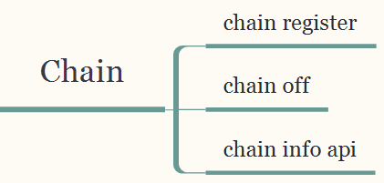

# 链管理模块设计文档

[TOC]

## 一、总体描述

### 1.1 模块概述

#### 1.1.1 为什么要有《链管理》模块

[^说明]: 介绍模块的存在的原因

* NULS2.0支持多链并行，跨链（友链）交易，因此需要有一个模块来管理链信息

* 名词解释：

  * 卫星链：NULS2.0的核心链
  * 友链：只与卫星链连接的其他链，任何跨链交易都通过卫星链中转
  * 跨链：友链A与友链B之间的交易，称之为跨链


#### 1.1.2 《链管理》要做什么

[^说明]: 模块要做些什么事情，达到什么目的，目标是让非技术人员了解要做什么事情

所有对于链（友链）的维护操作都应该在《链管理》模块中

* 注册友链
* 注销友链
* 查询链信息
* 增加币种
* 删除币种


#### 1.1.3 《链管理》在系统中的定位

[^说明]: 模块在系统中的定位，是什么角色，依赖哪些模块做哪些事情，可以被依赖用于做哪些事情

在NULS2.0的生态链体系中，《链管理》属于卫星链和友链有区别的一个模块，卫星链上提供所有接口，在友链中则只有查询链一个接口。

《链管理》在系统中属于一般模块，既要调用其他模块的接口，其他模块也会调用到《链管理》中的接口。


### 1.2 架构图

[^说明]: 图形说明模块的层次结构、组件关系，并通过文字进行说明

## 二、功能设计

### 2.1 功能架构图

[^说明]: 说明模块的功能设计，可以有层级关系，可以通过图形的形式展示，并用文字进行说明。



### 2.2 模块服务

[^说明]: 这里说明该模块对外提供哪些服务，每个服务的功能说明、流程描述、接口定义、实现中依赖的外部服务

#### 2.2.1 友链信息登记及存储

* 功能说明：

  提供一个入口注册友链

* 流程描述

  

* 依赖服务

  [^说明]: 文字描述依赖了哪些服务，做什么事情


### 2.3 模块内部功能

[^说明]: 这里说明该模块内部有哪些功能，每个功能的说明、流程描述、实现中依赖的外部服务，参考上面外部服务格式


## 三、接口设计

### 3.1 模块接口

#### 获取链信息

- 接口说明
  获取一条链详细信息

- 请求示例
  ```json
  {
      "cmd":"chainInfo",
      "minVersion":"1.1",
      "params":[1234]
  }
  ```
- 请求参数说明

  | index | parameter | required | type    | description |
  | ----- | :-------- | :------- | :------ | ----------- |
  | 0     | chainId   | true     | integer | 链标识      |

- 返回示例
  Failed

  ```json
  {
      "version": 1.2,
      "code":1,
      "msg" :"xxxxxxxxxxxxxxxxxx",
      "result":{}
  }
  ```

  Success
    ```json
    {
      "code":10000,
      "msg":"",
      "version":"",
      "result":{        "hash":"0xe670ec64341771606e55d6b4ca35a1a6b75ee3d5145a99d05921026d1527331",
          "chainId":1234,
          "name":"name",
          "addressType":1,
          "assets":[
              {
                  "assetId":1,
                  "symbol":"xxx",
                  "name":"xxx",
                  "depositNuls":20000,
                  "initTotal":1000000,
                  "minUnit":8,
                  "flag":true
              }
          ],
          "magicNumber":1025753999,
          "seeds":[
              {
                  "ip":"xxx.xxx.xxx.xxx",
                  "port":8001
              },
              {
                  "ip":"xxx.xxx.xxx.xxx",
                  "port":8001
              }
          ],
          "supportInflowAsset":true
      }
  }
    ```

- 返回字段说明
  | parameter          | type                  | description                                |
  | ------------------ | --------------------- | ------------------------------------------ |
  | hash               | integer               | 链的哈希值                                 |
  | chainId            | integer               | 链标识                                     |
  | name               | string                | 链名称                                     |
  | addressType        | integer               | 链上创建的账户的地址类型                   |
  | assets             | jsonArray【资产对象】 | 数组成员：资产对象                         |
  | magicNumber        | integer               | 魔法参数                                   |
  | seeds              | jsonArray             | ip：种子节点ip地址<br />port：种子节点端口 |
  | supportInflowAsset | boolean               | 是否支持资产流入                           |

  资产对象
  | parameter   | type        | description                    |
  | ----------- | ----------- | ------------------------------ |
  | assetId     | integer     | 资产标识                       |
  | symbol      | string      | 资产单位                       |
  | name        | string      | 资产名称                       |
  | depositNuls | integer     | 抵押的nuls总量                 |
  | initTotal   | big integer | 资产发行总量                   |
  | minUnit     | byte        | 最小单位（代表小数点后多少位） |
  | flag        | boolean     | 资产是否可用                   |


### 3.2 功能接口

#### 链注册

- 接口说明
  注册一条新链

- 请求示例

  ```json
  {
      "cmd":"chainRegister",
      "minVersion":1,
      "params":[
          1234,
          "name",
          1,
          [
              {
                  "assetId":1,
                  "symbol":"xxx",
                  "name":"xxx",
                  "depositNuls":20000,
                  "initTotal":1000000,
                  "minUnit":8,
                  "flag":true
              }
          ],        
          1,
          1,
          "xxx",
          1
      ]
  }
  ```

- 请求参数说明

  | index | parameter               | required | type                  | description              |
  | ----- | :---------------------- | :------- | :-------------------- | ------------------------ |
  | 0     | chainId                 | true     | integer               | 链标识                   |
  | 1     | chainName               | true     | string                | 链名称                   |
  | 2     | addressType             | true     | string                | 链上创建的账户的地址类型 |
  | 3     | assets                  | true     | jsonArray【资产对象】 | 数组成员：资产对象       |
  | 4     | minAvailableNodeNum     | true     | integer               | 最小可用节点数量         |
  | 5     | singleNodeConMinNodeNum | true     | integer               | 单节点连接最小数量       |
  | 6     | txConfirmBlockNum       | true     | integer               | 交易确认块数             |
  | 7     | supportInflowAsset      | true     | boolean               | 是否支持资产流入         |

- 返回示例
  Failed

  ```json
  {
      "version": 1.2,
      "code":1,
      "msg" :"xxxxxxxxxxxxxxxxxx",
      "result":{}
  }
  ```

  Success

  ```json
  {
   	"version": 1.2,
      "code":0,
      "result":{}
  }
  ```

- 返回字段说明
  无


#### 链查询

- 接口说明
  查询链列表

- 请求示例

  ```json
  {   
      "cmd": "chainList",
      "minVersion": 1.0,
      "params":[ 
     		 1,20
      ]
  }
  ```

- 请求参数说明

  | index | parameter  | required | type    | description |
  | ----- | :--------- | :------- | :------ | ----------- |
  | 0     | pageNumber | true     | integer | 页数        |
  | 1     | pageSize   | true     | integer | 每页数量    |

- 返回示例
  Failed

  ```json
  {
      "version": 1.2,
      "code":1,
      "msg" :"xxxxxxxxxxxxxxxxxx",
      "result":{}
  }
  ```

  Success

  ```json
  {
      "version":1.2,
      "code":0,
      "result":{
          "chainList":[
              {                "hash":"0xe670ec64341771606e55d6b4ca35a1a6b75ee3d5145a99d05921026d1527331",
                  "chainId":1234,
                  "name":"name",
                  "addressType":1,
                  "assets":[
                      {
                          "assetId":1,
                          "symbol":"xxx",
                          "name":"xxx",
                          "depositNuls":20000,
                          "initTotal":1000000,
                          "minUnit":8,
                          "flag":true
                      }
                  ],
                  "magicNumber":1025753999,
                  "seeds":[
                      {
                          "ip":"xxx.xxx.xxx.xxx",
                          "port":8001
                      },
                      {
                          "ip":"xxx.xxx.xxx.xxx",
                          "port":8001
                      }
                  ],
                  "supportInflowAsset":true
              },
              {
                  "hash":"0xe670ec64341771606e55d6b4ca35a1a6b75ee3d5145a99d05921026d1527331",
                  "chainId":1234,
                  "name":"name",
                  "addressType":1,
                  "assets":[
                      {
                          "assetId":1,
                          "symbol":"xxx",
                          "name":"xxx",
                          "depositNuls":20000,
                          "initTotal":1000000,
                          "minUnit":8,
                          "flag":true
                      }
                  ],
                  "magicNumber":1025753999,
                  "seeds":[
                      {
                          "ip":"xxx.xxx.xxx.xxx",
                          "port":8001
                      },
                      {
                          "ip":"xxx.xxx.xxx.xxx",
                          "port":8001
                      }
                  ],
                  "supportInflowAsset":true
              }
          ]
      }
  }
  ```

- 返回字段说明
  同【获取链信息】，不同的是这里返回的是链列表，【获取链信息】返回指定链


#### 链注销

- 接口说明
  创建者可以注销自己创建的链

- 请求示例

  ```json
  {   
      "cmd": "chainDestroy",
      "minVersion": 1.0,
      "params":[1234]
  }
  ```

- 请求参数说明

  | index | parameter | required | type    | description |
  | ----- | :-------- | :------- | :------ | ----------- |
  | 0     | chainId   | true     | integer | 链标识      |

- 返回示例
  Failed

  ```json
  {
      "version": 1.2,
      "code":1,
      "msg" :"xxxxxxxxxxxxxxxxxx",
      "result":{}
  }
  ```

  Success

  ```json
  {
   	"version": 1.2,
      "code":0,
      "result":{}
  }
  ```

- 返回字段说明
  无


#### 新增资产

- 接口说明
  创建者可以在自己创建的链种新增资产类型

- 请求示例

  ```json
  {   
      "cmd":"assetRegister",
      "minVersion":1.0,
      "params":[
          1234,
          1,
          [
              {
                  "assetId":1,
                  "symbol":"xxx",
                  "name":"xxx",
                  "depositNuls":20000,
                  "initTotal":1000000,
                  "minUnit":8,
                  "flag":true
              }
          ]
      ]
  }
  ```

- 请求参数说明

  | index | parameter   | required | type               | description      |
  | ----- | :---------- | :------- | :----------------- | ---------------- |
  | 0     | chainId     | true     | integer            | 链标识           |
  | 1     | addressType | true     | integer            | 资产中的地址类型 |
  | 2     | asset       | true     | object【资产对象】 | 新增的资产       |

- 返回示例
  Failed

  ```json
  {
      "version": 1.2,
      "code":1,
      "msg" :"xxxxxxxxxxxxxxxxxx",
      "result":{}
  }
  ```

  Success

  ```json
  {
   	"version": 1.2,
      "code":0,
      "result":{}
  }
  ```

- 返回字段说明
  无


#### 注销资产

- 接口说明
  创建者可以注销自己创建的链中的资产

- 请求示例

  ```json
  {
      "cmd":"assetDestroy",
      "minVersion":1,
      "params":[
          1234,
          88
      ]
  }
  ```

- 请求参数说明

  | index | parameter | required | type    | description |
  | ----- | :-------- | :------- | :------ | ----------- |
  | 0     | chainId   | true     | integer | 链标识      |
  | 1     | assetId   | true     | integer | 资产标识    |

- 返回示例
  Failed

  ```json
  {
      "version": 1.2,
      "code":1,
      "msg" :"xxxxxxxxxxxxxxxxxx",
      "result":{}
  }
  ```

  Success

  ```json
  {
   	"version": 1.2,
      "code":0,
      "result":{}
  }
  ```

- 返回字段说明
  无


## 四、事件说明

[^说明]: 业务流程中尽量避免使用事件的方式通信

### 4.1 发布的事件

[^说明]: 这里说明事件的topic，事件的格式协议（精确到字节），事件的发生情景。

[参考<事件总线>]: ./


#### 4.1.1 运行参数修改成功事件

说明：当链注册成功时，发布该事件   

 event_topic : "chain_register",

```
{
    "hash":"0xe670ec64341771606e55d6b4ca35a1a6b75ee3d5145a99d05921026d1527331",
        "chainId":1234,
        "name":"name",
        "addressType":1,
        "assets":[
            {
                "assetId":1,
                "symbol":"xxx",
                "name":"xxx",
                "depositNuls":20000,
                "initTotal":1000000,
                "minUnit":8,
                "flag":true
            }
        ],
        "magicNumber":1025753999,
        "seeds":[
            {
                "ip":"xxx.xxx.xxx.xxx",
                "port":8001
            },
            {
                "ip":"xxx.xxx.xxx.xxx",
                "port":8001
            }
        ],
        "supportInflowAsset":true
}
```


说明：当一条链注销成功时，发布该事件   

 event_topic : "chain_destroy",

```
{
    "hash":"0xe670ec64341771606e55d6b4ca35a1a6b75ee3d5145a99d05921026d1527331",
        "chainId":1234,
        "name":"name",
        "addressType":1,
        "assets":[
            {
                "assetId":1,
                "symbol":"xxx",
                "name":"xxx",
                "depositNuls":20000,
                "initTotal":1000000,
                "minUnit":8,
                "flag":true
            }
        ],
        "magicNumber":1025753999,
        "seeds":[
            {
                "ip":"xxx.xxx.xxx.xxx",
                "port":8001
            },
            {
                "ip":"xxx.xxx.xxx.xxx",
                "port":8001
            }
        ],
        "supportInflowAsset":true
}
```


说明：当资产注册成功时，发布该事件   

 event_topic : "asset_register",

```
{
	"chainId":1234,
    "assetId":1,
    "symbol":"xxx",
    "name":"xxx",
    "depositNuls":20000,
    "initTotal":1000000,
    "minUnit":8,
    "flag":true
}
```


说明：当资产注销成功时，发布该事件   

 event_topic : "asset_destroy",

```
{
	"chainId":1234,
    "assetId":1,
    "symbol":"xxx",
    "name":"xxx",
    "depositNuls":20000,
    "initTotal":1000000,
    "minUnit":8,
    "flag":true
}
```


## 五、协议

### 5.1 网络通讯协议

[^说明]: 节点间通讯的具体协议，参考《网络模块》

#### 无


### 5.2 交易协议

##### 链注册

与通用交易相比，只有类型和txData有区别，具体区别如下

```
  type: n // 交易的类型   Uint16
  txData:{

      chainId:  //uint16 ,链id   uint16

      链名称     //varString     不超过30个字节


      资产信息列表：资产id 标识、名称、初始总额、最小单位 资产是否可用
	  
	  资产id： uint32
	  
      标识：//varString，用于查询资产总额，区分不同资产     不超过30个字节

      名称：//varString，用于显示      不超过30个字节

      总额：//varint         4个字节

      最小单位://byte,代表小数点后多少位，     1个字节
      
      是否可用： 判断资产是否可以流通     1个字节
	

      地址类型：1，//byte : 1、NULS地址结构，2、其他    1个字节

      最小可用节点数量 //uint16,    2个字节

      单节点连接最小数量 //uint16,   2个字节

      交易确认块数 //uint16,     2个字节

      是否支持资产流入 //byte, 1支持，0不支持    1个字节

  }

```

说明：

type序列化2个字节

 txData:{

​	chhainId  2个字节

​	chainName   =》 前面 1个字节记录长度，比如length=9 表示读后面的 9个字节组成 chainName

​	Assets 资产列表需要序列化资产 对象 Asset   循环调用parse（byte[] b） 方法直到完成 

​			[

​				assetId   uint32

​				symbol     前面 1个字节记录长度，比如length=9 表示读后面的 9个字节组成 symbol

​				name         前面 1个字节记录长度，比如length=9 表示读后面的 9个字节组成 name         

​				initTotal      占用 32个字节

​				minUnit       占用1个字节

​				flag              占用1个字节

​			] 

​	assetType   占用1个字节

​	minAvailableNodeNum   占用2个字节

​	singleNodeConMinNodeNum   占用2个字节

​	txConfirmBlockNum    占用8个字节

​	isInflowAsset 占用1个字节

}


| 参数                    | 必选  | 类型        | 说明                                                      |
| :---------------------- | :---- | :---------- | --------------------------------------------------------- |
| type                    | true  | uint16      | tx类型                                                    |
| chainId                 | ture  | uint16      | 链唯一id                                                  |
| chainName               | true  | varString   | 链名称           不超过30个字节                           |
| assets                  | true  | List<Asset> | 资产列表                                                  |
| assetId                 | true  | uint32      | 资产id             4个字节                                |
| symbol                  | true  | varString   | 资产标识         不超过30个字节                           |
| name                    | true  | varString   | 资产名字        不超过30个字节                            |
| initTotal               | true  | BigInteger  | 发行总量          32个字节                                |
| minUnit                 | true  | byte        | 最小单位://byte,代表小数点后多少位，比如1nuls=100000000na |
| flag                    | false | byte        | 资产是否可用  //0.不可用  1.可用                          |
| addressType             | true  | byte        | 资产类型  1、NULS地址结构，2、其他                        |
| minAvailableNodeNum     | true  | uint16      | 最小可用节点数量                                          |
| singleNodeConMinNodeNum | true  | uint16      | 单节点连接最小数量                                        |
| txConfirmBlockNum       | true  | Long        | 交易确认块数                                              |
| supportInflowAsset      | true  | byte        | 是否支持资产流入   1支持，0不支持                         |
| depositNuls             | false | Long        | 抵押金 （系统做）  比如nuls 抵押20000                     |
| fee                     | false | Na          | 手续费（系统做）                                          |
| signature               | false | byte[]      | 签名（系统做）                                            |

##### - 验证器

```
  chainId合法性 是否重复  chainId是由调用者生成表示有“意义”的一串数字

  各字段不为空、值在正确范围内

  抵押金验证器

  其他基本验证器
```

##### - 处理器

```
存储链信息

存储资产信息

在n（运行参数）块确认之后开始监听该链的魔法参数
```


##### 链注销

协议

与通用交易相比，只有类型和txData有区别，具体区别如下

```
  type: n // 交易的类型 序列化2个字节
  txData:{
      chainId:  //uint16 ,链id  序列化2个字节
  }
```


##### - 验证器

```
  chainId合法性
  该链是否可以被该地址操作，权限验证
```


##### - 处理器

```
在n（运行参数）块之后停止该链所有跨链交易、解锁抵押金、从区块链中逻辑删除该链数据
```


##### 资产注册

与通用交易相比，只有类型和txData有区别，具体区别如下 

```
 type: n // 交易的类型    序列化2个字节

  txData:{

    chainId:  //uint16 ,链id    序列化2个字节

    标识：//varString，用于查询资产总额，区分不同资产    最多30个字节

    名称：//varString，用于显示   最大30个字节  

    总额：//     占用 32个字节

    最小单位://byte,代表小数点后多少位

  }
```

说明：

​	 type: n // 交易的类型    序列化2个字节

​	 txData:{

​	  	chainId:  //uint16 ,链id    序列化2个字节

​		symbol：varString 	 前面 1个字节记录长度，比如length=9 表示读后面的 9个字节组成 symbol

​		name         前面 1个字节记录长度，比如length=9 表示读后面的 9个字节组成 name         

​		initTotal      占用 32个字节

​		minUnit       占用1个字节

​	}


##### - 验证器

```
  chainId合法性

  各字段不为空、值在正确范围内

  抵押金验证器

  其他基本验证器

```


##### - 处理器

```
存储资产信息

```


##### 资产注销

与通用交易相比，只有类型和txData有区别，具体区别如下

```
  type: n //交易的类型
  txData:{
      chainId:  //uint16 ,链id
      assetsId：   // ,资产Id
  }
```

说明

type: n // 交易的类型    序列化2个字节

txData:{

​	  	chainId:  //uint16 ,链id    序列化2个字节	

​		assetsId：//	uint32       序列化4个字节	

}

##### - 验证器

```
  资产合法性  
  资产是否可以被该地址操作，权限验证
  是否是该链最后一种资产

```


##### - 处理器

```
若该资产没有转移到发行链之外，则立刻停止该资产交易、解锁抵押金、从区块链中逻辑删除该资产数据
否则，在n（运行参数）块之后停止该资产交易、解锁抵押金、从区块链中逻辑删除该资产数据

```


## 六、模块配置

[^说明]: 本模块必须要有的配置项

## 七、Java特有的设计

[^说明]: 核心对象类定义,存储数据结构，......

## 八、补充内容

[^说明]: 上面未涉及的必须的内容

